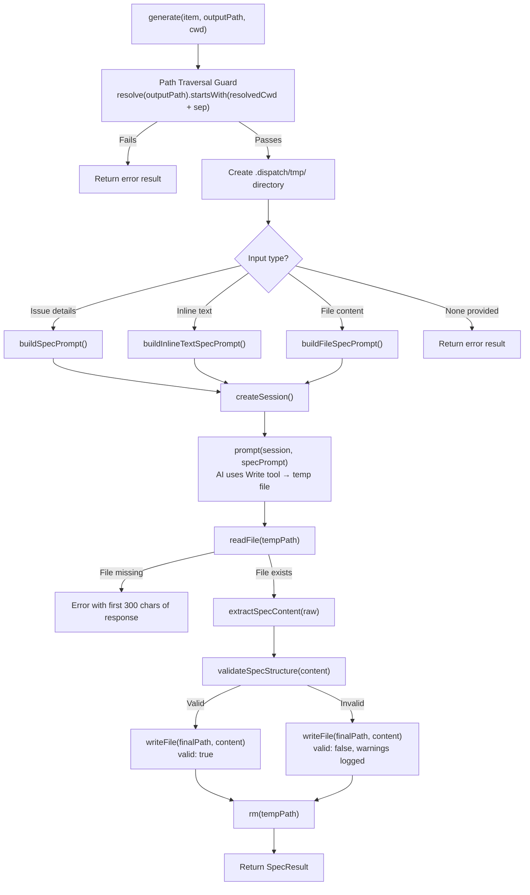

# Spec Agent

The spec agent (`src/agents/spec.ts`) is the AI interaction layer of the
spec generation pipeline. It wraps a `ProviderInstance` with spec-specific
prompt construction, temp-file orchestration, and post-processing logic.

## What it does

The spec agent is responsible for the core AI interaction in the spec
pipeline:

1. Constructing context-appropriate prompts for three input modes (tracker
   issues, inline text, files).
2. Managing the temp-file strategy where the AI writes via its Write tool and
   the agent reads, post-processes, and writes the final output.
3. Applying content extraction and structural validation to AI output.
4. Providing a clean lifecycle (boot/generate/cleanup).

## Why it exists

The spec agent encapsulates the AI interaction complexity that would otherwise
bloat the pipeline orchestrator. By separating the agent from the orchestrator:

- **The orchestrator** (`spec-pipeline.ts`) handles input classification,
  batching, retry, datasource sync, and file rename — concerns that are
  independent of AI interaction.
- **The agent** (`agents/spec.ts`) handles prompt construction, session
  management, temp-file orchestration, and post-processing — concerns that
  are specific to interacting with the AI provider.
- **Shared utilities** (`spec-generator.ts`) provide reusable functions
  (input classifiers, content extraction, validation) used by both.

## Boot and lifecycle

### `boot(instance: ProviderInstance): SpecAgent`

The `boot()` function accepts a `ProviderInstance` (already started) and
returns a `SpecAgent` object:

```typescript
interface SpecAgent {
    generate(item: IssueDetails, outputPath: string, cwd: string): Promise<SpecResult>
    cleanup(): Promise<void>
}
```

The agent does not start or stop the provider — that is the orchestrator's
responsibility. The agent only uses the provider to create sessions and send
prompts.

### `generate(item, outputPath, cwd): Promise<SpecResult>`

Generates a single spec file. See [Generation flow](#generation-flow) for
the complete sequence.

### `cleanup(): Promise<void>`

Removes the `.dispatch/tmp/` directory. Called by the orchestrator at the end
of processing.

## Generation flow

Each call to `generate()` follows this sequence:



### Step 1: Path traversal guard

At `src/agents/spec.ts:90-102`, the agent validates that the output path is
contained within the working directory:

```
resolve(outputPath).startsWith(resolvedCwd + sep)
```

This prevents writing spec files outside the project directory. The check
uses `resolve()` (not `realpath()`), so it does **not** follow symlinks.

### Step 2: Create temp directory

Ensures `.dispatch/tmp/` exists within the project directory via
`mkdir(tmpDir, { recursive: true })`.

### Step 3: Build prompt

The agent selects one of three prompt builders based on the input:

- **`buildSpecPrompt()`** — for tracker issues with full issue details.
- **`buildInlineTextSpecPrompt()`** — for free-form text descriptions.
- **`buildFileSpecPrompt()`** — for file path + file content.

If none of the three input modes provides content, the agent returns an error
result immediately without creating an AI session.

### Step 4: AI session and prompt

A fresh session is created per spec. The prompt instructs the AI to use its
Write tool to save the spec to a specific temp file path within
`.dispatch/tmp/`. This temp-file strategy allows post-processing before the
final write.

### Step 5: Read temp file

The agent reads the AI-written temp file. If the file does not exist (the AI
failed to write it), the error includes the first 300 characters of the AI's
response text for diagnostics.

### Step 6: Extract spec content

`extractSpecContent()` performs 3-stage cleanup:

1. **Strip code fences** — removes `` ```markdown ... ``` `` wrappers.
2. **Remove preamble** — strips text before the first H1 (`# ...`).
3. **Remove postamble** — strips text after the last recognized H2 section.

The recognized H2 headings (`RECOGNIZED_H2` in `src/spec-generator.ts`):
Context, Why, Approach, Integration Points, Tasks, References, Key Guidelines.

### Step 7: Validate spec structure

`validateSpecStructure()` performs 3 checks:

1. Starts with `# ` (H1 heading).
2. Contains `## Tasks` (exact match).
3. Has `- [ ]` (checkbox) after the Tasks heading.

**Validation is non-blocking.** Failures produce `valid: false` in the result
but `success: true`. The spec file is still written to disk. This avoids
discarding useful AI output due to minor formatting deviations.

### Step 8: Write final output and cleanup

The post-processed content is written to the final output path. The temp file
is then deleted.

## Prompt builders

### `buildSpecPrompt()` — tracker issues

Used for issues fetched from GitHub or Azure DevOps. The prompt includes:

- **Role definition:** "You are a spec agent."
- **Pipeline context:** Explains the downstream planner + coder agents.
- **Issue details:** Number, title, state, URL, labels, description.
  Conditionally includes acceptance criteria (if present) and discussion
  comments (if present).
- **Working directory:** The `cwd` path for codebase exploration.
- **Write instruction:** Save to the specific temp file path.
- **Five-step instruction process:**
    1. Explore the codebase (read files, search symbols)
    2. Understand the issue (description, criteria, comments)
    3. Research the approach (docs, libraries, patterns)
    4. Identify integration points (modules, interfaces, conventions)
    5. DO NOT make any changes
- **Output format template:** H1 title, Context, Why, Approach, Integration
  Points, Tasks, References.
- **Task execution tags:** `(P)` parallel, `(S)` sequential, `(I)` independent
  — defined at lines 318-348 of `src/agents/spec.ts`.
- **Key guidelines:** Stay high-level, respect the project stack, keep tasks
  atomic, output only markdown.

### `buildInlineTextSpecPrompt()` — inline text

Structurally similar to the tracker prompt but substitutes the issue details
section with the raw text input. No issue number, URL, labels, or comments
are available.

### `buildFileSpecPrompt()` — file content

Includes the file path and its complete content in the prompt. The AI is
instructed to transform the file content into a structured spec.

### Why the prompts stay high-level

All prompts explicitly instruct the AI to avoid code snippets, exact line
numbers, and step-by-step coding instructions because:

- The planner agent will re-explore the codebase for each individual task.
- The spec agent sees the entire issue; the planner sees only one task.
- Detailed instructions in the spec would duplicate work and potentially
  conflict with the planner's findings.
- High-level specs are more resilient to codebase changes between generation
  and execution.

## Task execution tags

The prompt defines three task execution tags that the AI can use in the
`## Tasks` section:

| Tag | Meaning | Example |
|-----|---------|---------|
| `(P)` | Parallel — can run concurrently with other `(P)` tasks | `- [ ] (P) Add input validation` |
| `(S)` | Sequential — must run after previous tasks | `- [ ] (S) Update database schema` |
| `(I)` | Independent — can run in any order | `- [ ] (I) Update documentation` |

These tags are consumed by the [task parsing system](../task-parsing/overview.md)
during `dispatch` execution to determine task ordering and concurrency.

## Temp file strategy

### Why use a temp file?

The AI writes its output to a temp file (via its Write tool) rather than
returning it in the response text. This design enables:

1. **Post-processing** — `extractSpecContent()` and `validateSpecStructure()`
   can clean and validate the output before it reaches the final path.
2. **Separation of concerns** — the AI focuses on content generation; the
   agent handles file management.
3. **Error recovery** — if post-processing fails, the final output path is
   never written to, leaving no partial files.

### Temp file location

Temp files are written to `.dispatch/tmp/` within the project directory. This
directory is:

- Created at the start of each `generate()` call.
- Cleaned up by `cleanup()` at the end of the pipeline.
- Within the project directory (not system `/tmp`), avoiding cross-user
  security issues.

## Error handling

### Input validation errors

If none of the three input modes provides content (no issue details, no inline
text, no file content), the agent returns an error result immediately:

```typescript
{ success: false, error: "No input provided", ... }
```

No AI session is created.

### Path traversal errors

If the output path resolves outside the working directory, the agent returns
an error result without creating an AI session or writing any files.

### Temp file not found

If the AI fails to write the expected temp file, the error message includes
the first 300 characters of the AI's response. This helps diagnose:

- Whether the AI misunderstood the write instruction.
- Whether the AI encountered an error during generation.
- Whether the AI produced content but wrote to the wrong path.

### Validation warnings

Validation failures (`validateSpecStructure()` returns issues) produce
warnings in the result:

```typescript
{ success: true, valid: false, warnings: ["Missing ## Tasks heading", ...] }
```

The spec file is still written. The orchestrator logs the warnings but does
not count them as failures.

## Related documentation

- [Spec Generation Overview](./overview.md) — Pipeline architecture, input
  modes, concurrency, and output format
- [Integrations & Troubleshooting](./integrations.md) — External dependencies,
  auth, and troubleshooting
- [Provider Abstraction](../provider-system/provider-overview.md) — Provider
  lifecycle and `ProviderInstance` interface
- [Datasource System](../datasource-system/overview.md) — How issues are
  fetched for tracker mode
- [Task Parsing](../task-parsing/overview.md) — How `(P)`/`(S)`/`(I)` tags
  and `- [ ]` items are parsed downstream
- [Cleanup Registry](../shared-types/cleanup.md) — Process-level cleanup
  safety net
- [Spec Generator Tests](../testing/spec-generator-tests.md) — Tests covering
  content extraction, validation, and input classification
- [Planner Agent](../planning-and-dispatch/planner.md) — The downstream
  planner agent that consumes spec output; shares the two-phase (read-only
  exploration then write) architecture pattern
- [Executor Agent](../planning-and-dispatch/executor.md) — The downstream
  executor agent that follows planner-generated plans
- [Testing Overview](../testing/overview.md) — Project-wide test suite
  (note: the spec agent has no dedicated unit tests; spec-generator.test.ts
  covers shared utilities)
