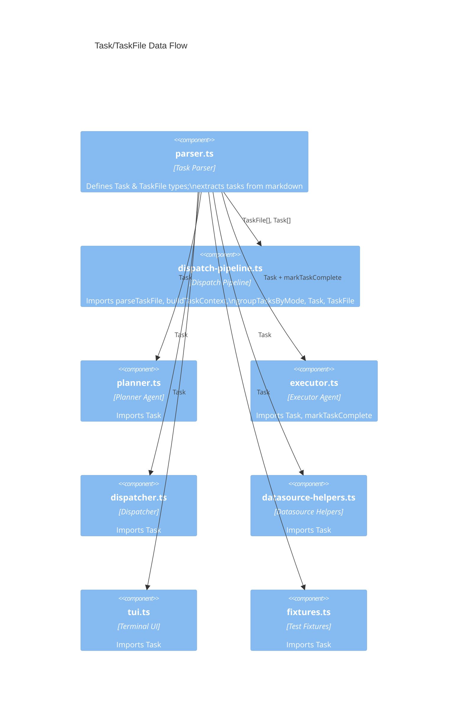

# Task Parsing & Markdown

The task parser is the foundational data layer of the Dispatch system. It reads
markdown files containing GitHub-style checkbox syntax, extracts structured
`Task` and `TaskFile` objects, and provides utilities to mark tasks as complete
by mutating the source file. Every other module in the pipeline depends on these
types and functions.

## What it does

The parser module (`src/parser.ts`) provides five core capabilities
(see [API Reference](./api-reference.md) for detailed function signatures):

1. **Parse markdown content** into structured `Task` and `TaskFile` objects
2. **Extract execution mode** from optional `(P)`/`(S)`/`(I)` prefixes on task
   text, enabling parallel, serial, and isolated execution control
3. **Group tasks by mode** into ordered execution batches via `groupTasksByMode`
4. **Build filtered context** for the planner agent, stripping sibling tasks
5. **Mark tasks complete** by performing targeted line-level mutation of the
   source file

## Why it exists

Dispatch uses plain markdown files as the source of truth for work items. This
design choice means task files are human-readable, version-controllable, and
editable with any text editor. The parser bridges the gap between this
human-friendly format and the structured data that the [orchestrator](../cli-orchestration/orchestrator.md), [planner](../agent-system/planner-agent.md),
[dispatcher](../planning-and-dispatch/dispatcher.md), [TUI](../cli-orchestration/tui.md), and [git](../planning-and-dispatch/git.md) modules require.

### Task nesting is not semantic

The parser accepts indented (nested) unchecked tasks but **flattens all tasks
into a single ordered list** regardless of indentation depth. Indentation is
preserved in the `raw` field of each `Task` object but does not affect grouping,
ordering, or execution. A nested task at 4-space indent is extracted identically
to a top-level task. This is confirmed by tests at
`src/tests/parser.test.ts:47-61`.

## Data flow through the pipeline

The parser produces data that flows through the entire Dispatch pipeline. The
`Task` and `TaskFile` types defined in `src/parser.ts` are imported by at least
12 other source files spanning the dispatch pipeline, planner/executor agents,
dispatcher, datasource helpers, TUI, run-state tracker, and test fixtures. This
makes the parser the single source of truth for task identity across the entire
system.



### How each consumer uses the parser

| Consumer | Imports | Usage |
|---|---|---|
| Dispatch Pipeline (`src/orchestrator/dispatch-pipeline.ts`) | `parseTaskFile`, `markTaskComplete`, `buildTaskContext`, `groupTasksByMode`, `Task`, `TaskFile` | Parses all task files, groups tasks by mode, builds planner context, marks tasks done after execution |
| Planner (`src/agents/planner.ts`) | `Task` | Receives a `Task` object and optional filtered file context to build an execution plan |
| Executor (`src/agents/executor.ts`) | `Task`, `markTaskComplete` | Receives a `Task` to execute; calls `markTaskComplete` on success |
| Dispatcher (`src/dispatcher.ts`) | `Task` | Receives a `Task` to build execution prompts for the agent backend |
| TUI (`src/tui.ts`) | `Task` | Displays task text and status in the real-time terminal dashboard |
| Datasource Helpers (`src/orchestrator/datasource-helpers.ts`) | `Task` | Uses task data for PR body assembly and sync operations |

### Pipeline data flow

```mermaid
flowchart LR
    MD["Markdown Files<br/>*.md"] -->|readFile| PF["parseTaskFile"]
    PF -->|TaskFile| ORCH["Dispatch Pipeline"]
    ORCH -->|Task[]| GTM["groupTasksByMode"]
    GTM -->|Task[][]| BATCH["Batch Dispatch"]
    ORCH -->|Task + content| BTC["buildTaskContext"]
    BTC -->|filtered markdown| PLAN["Planner"]
    PLAN -->|execution plan| DISP["Dispatcher"]
    ORCH -->|Task| MTC["markTaskComplete"]
    MTC -->|write [x]| MD
    ORCH -->|Task| GIT["Git Commit"]
    ORCH -->|Task + status| TUI["TUI Dashboard"]
```

## Task lifecycle

Each task line progresses through an implicit state machine:

```mermaid
stateDiagram-v2
    [*] --> Unchecked: Task file created
    Unchecked --> Parsed: parseTaskFile()
    Parsed --> Planning: planTask()
    Planning --> Executing: dispatchTask()
    Executing --> Completed: markTaskComplete()
    Executing --> Failed: agent error
    Completed --> [*]: git commit
    Failed --> [*]: logged in TUI

    state Unchecked {
        [*] --> "- [ ] task text"
    }
    state Completed {
        [*] --> "- [x] task text"
    }
```

The transitions from `Parsed` through `Completed` involve file I/O and
potential race conditions when multiple agents operate on the same file
concurrently. See [Architecture & Concurrency](./architecture-and-concurrency.md)
for a detailed analysis.

## Source files

| File | Purpose |
|---|---|
| `src/parser.ts` | All parsing logic, types, and file mutation |
| `src/tests/parser.test.ts` | Comprehensive test suite (1185 lines, 79 tests across 6 describe blocks) |

## Related documentation

- [Markdown Syntax Reference](./markdown-syntax.md) -- supported and rejected
  checkbox formats
- [Architecture & Concurrency](./architecture-and-concurrency.md) -- file I/O
  patterns, race conditions, and staleness analysis
- [API Reference](./api-reference.md) -- types, functions, and their contracts
- [Testing Guide](./testing-guide.md) -- how to run and extend the test suite
- [Task Context & Lifecycle](../planning-and-dispatch/task-context-and-lifecycle.md) --
  how the parser functions fit in the dispatch pipeline
- [Shared Interfaces & Utilities](../shared-types/overview.md) -- The shared
  layer that provides Task, TaskFile, and provider types
- [Shared Parser Types](../shared-types/parser.md) -- summary of `Task`,
  `TaskFile`, and exported functions
- [Cleanup Registry](../shared-types/cleanup.md) -- Process-level cleanup
  that ensures resources are released even when tasks fail
- [Orchestrator](../cli-orchestration/orchestrator.md) -- the primary consumer
  of all parser functions
- [Spec Generation](../spec-generation/overview.md) -- the `--spec` pipeline
  that produces the markdown task files consumed by the parser
- [Testing Overview](../testing/overview.md) -- project-wide test suite
  including [parser tests](../testing/parser-tests.md) (79 test cases)
- [Datasource System](../datasource-system/overview.md) -- the markdown
  datasource also reads/writes `.md` files (in `.dispatch/specs/`)
- [Git Worktree Helpers](../git-and-worktree/overview.md) -- worktree
  isolation model; task files are parsed and mutated within isolated worktrees
  during parallel dispatch
- [Executor Agent](../agent-system/executor-agent.md) -- the agent that
  calls `markTaskComplete()` after successful task dispatch
- [Planner Agent](../agent-system/planner-agent.md) -- the agent that
  receives filtered task context from `buildTaskContext()`
