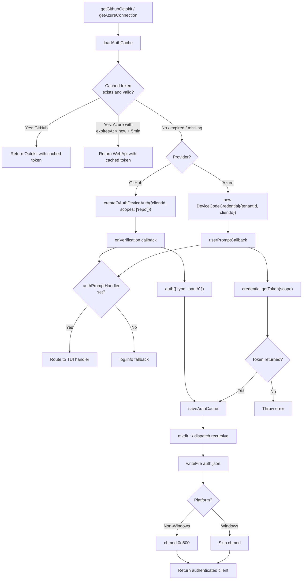

# Authentication Tests

This document provides a detailed breakdown of
[`src/tests/auth.test.ts`](../../src/tests/auth.test.ts), which tests the
OAuth device-flow authentication helpers defined in
[`src/helpers/auth.ts`](../../src/helpers/auth.ts).

## What is tested

The `auth.ts` module provides device-code OAuth authentication for two
platforms — GitHub and Azure DevOps — with a shared JSON token cache at
`~/.dispatch/auth.json`. The test file verifies four public functions:

| Function | Purpose |
|----------|---------|
| `getGithubOctokit()` | Returns an authenticated Octokit instance, initiating a GitHub device-code flow if no cached token exists |
| `getAzureConnection(orgUrl)` | Returns an authenticated Azure DevOps `WebApi` connection, initiating an Azure device-code flow if no valid cached token exists |
| `setAuthPromptHandler(handler)` | Registers or clears a callback for routing device-code prompts to the TUI |
| `ensureAuthReady(source, cwd, org?)` | Pre-authenticates for a given datasource before pipeline work begins |

## Test organization

The test file contains **5 describe blocks** with **18 tests** total (509
lines).

| Describe block | Tests | Focus |
|----------------|-------|-------|
| `getGithubOctokit` | 3 | Cached token reuse, device flow initiation, partial cache merge |
| `getAzureConnection` | 5 | Cached token reuse, device flow, expiry refresh, buffer window, null token error |
| `auth cache file operations` | 4 | Directory creation, chmod 0o600, Windows skip, chmod failure tolerance |
| `auth prompt handler` | 3 | GitHub prompt routing, Azure prompt routing, log.info fallback |
| `ensureAuthReady` | 8 | GitHub remote detection, Azure org resolution, skip conditions, no-op for md/undefined |

## Authentication flow

The following diagram shows the multi-provider authentication flow with
token caching and device-code fallback:



## External integrations

The test file mocks six external dependencies to isolate the authentication
logic from real network calls and filesystem operations.

### GitHub OAuth device flow

- **Package:** `@octokit/auth-oauth-device`
- **Function:** `createOAuthDeviceAuth`
- **How tested:** The mock factory returns a controllable auth function. Tests
  verify it receives the correct `clientId` (`Ov23liUMP1Oyg811IF58`) and that
  the `onVerification` callback formats the user code and verification URI
  correctly.
- **Production behavior:** Implements the
  [OAuth 2.0 Device Authorization Grant (RFC 8628)](https://tools.ietf.org/html/rfc8628)
  where the CLI displays a user code and polls GitHub until the user authorizes
  the app at `https://github.com/login/device`.
- **Scopes requested:** `["repo"]`
- **Operational note:** The GitHub OAuth App client ID
  (`Ov23liUMP1Oyg811IF58`) is a public identifier bundled in
  [`src/constants.ts`](../../src/constants.ts) — not a secret. Users do not
  need to register their own OAuth application.

### Azure Identity SDK

- **Package:** `@azure/identity`
- **Class:** `DeviceCodeCredential`
- **How tested:** The mock constructor captures the `userPromptCallback` and
  returns a controllable `getToken` method. Tests verify the tenant ID
  (`"organizations"`), the scope
  (`"499b84ac-1321-427f-aa17-267ca6975798/.default"`), and the prepended
  account-type warning message.
- **Production behavior:** Uses the
  [Azure device code credential](https://learn.microsoft.com/en-us/javascript/api/@azure/identity/devicecodecredential)
  to authenticate against Microsoft Entra ID. The `"organizations"` tenant
  restricts sign-in to work/school accounts because Azure DevOps does not
  support personal Microsoft accounts for API access.
- **Operational note:** The Azure AD client ID
  (`150a3098-01dd-4126-8b10-5e7f77492e5c`) is defined in
  [`src/constants.ts`](../../src/constants.ts).

### Azure DevOps Node API

- **Package:** `azure-devops-node-api`
- **Functions:** `WebApi` constructor, `getBearerHandler`
- **How tested:** Both are mock constructors. Tests verify that
  `getBearerHandler` receives the correct token and that `WebApi` receives
  the org URL and bearer handler.
- **Production behavior:** Creates an authenticated connection to the Azure
  DevOps REST API at the specified organization URL (e.g.,
  `https://dev.azure.com/myorg`).

### Browser opener

- **Package:** `open`
- **How tested:** Mocked as a no-op returning `Promise<undefined>`. The
  test verifies the mock is available but does not assert specific calls
  because browser opening is fire-and-forget in production (`.catch(() => {})`).
- **Production behavior:** Opens the device-code verification URI in the
  user's default browser.

### Octokit REST client

- **Package:** `@octokit/rest`
- **Class:** `Octokit`
- **How tested:** Constructor spy that returns a mock instance. Tests verify
  it is called with `{ auth: "<token>" }` for both cached and fresh tokens.

### Datasource URL parsers

- **Module:** `../datasources/index.js`
- **Functions:** `getGitRemoteUrl`, `parseGitHubRemoteUrl`, `parseAzDevOpsRemoteUrl`
- **How tested:** Each function is mocked independently per test in the
  `ensureAuthReady` block. Tests verify remote URL detection, GitHub URL
  parsing, Azure DevOps URL parsing, and graceful handling of non-matching
  or missing remotes.

## Key test scenarios

### Token cache behavior

The cache file (`~/.dispatch/auth.json`) stores tokens for both providers in
a single JSON object:

```json
{
  "github": { "token": "gh-cached-token" },
  "azure": { "token": "az-cached-token", "expiresAt": "2099-01-01T00:00:00.000Z" }
}
```

| Scenario | Test | Expected behavior |
|----------|------|-------------------|
| Valid GitHub token in cache | `returns cached Octokit when valid GitHub token exists` | Returns Octokit without device flow |
| No cache file | `initiates device flow when no cached token exists` | Runs GitHub device flow, writes cache |
| Cache exists but no `github` key | `initiates device flow when auth.json exists but has no github key` | Runs device flow, preserves existing `azure` key |
| Valid Azure token in cache | `returns cached connection when valid Azure token exists` | Returns WebApi without device flow |
| Expired Azure token | `refreshes token when cached Azure token is expired` | Runs Azure device flow, writes new token |
| Azure token within 5-minute buffer | `refreshes token when cached Azure token is within expiry buffer` | Treats near-expiry as expired |

### Azure token expiry buffer

The `EXPIRY_BUFFER_MS` constant (5 minutes / 300,000 ms) in `auth.ts:40`
causes tokens to be refreshed before they actually expire. The test
`refreshes token when cached Azure token is within expiry buffer` sets the
expiry to 2 minutes from now and verifies that the device-code flow is
triggered, confirming the buffer is at least 2 minutes wide.

### File permission handling

| Platform | Behavior | Test |
|----------|----------|------|
| Non-Windows | `chmod(AUTH_PATH, 0o600)` after writing | `sets file permissions to 0o600 after writing on non-Windows` |
| Windows | Skips `chmod` entirely | `skips chmod on Windows platform` |
| Non-Windows with permission error | Swallows `EPERM` from `chmod` | `does not throw when chmod fails` |

The Windows test uses `Object.defineProperty(process, "platform", { value: "win32" })`
to override the platform detection and restores it in a `finally` block.

### Auth prompt routing

The `setAuthPromptHandler` function allows the TUI to intercept device-code
prompts instead of logging them to stdout:

| Provider | Prompt format | Test |
|----------|---------------|------|
| GitHub | `"Enter code ABCD-1234 at https://github.com/login/device"` | `routes GitHub device-code prompt to handler when set` |
| Azure | Prepends account-type warning + original message | `routes Azure device-code prompt to handler when set` |
| Both (no handler) | Falls back to `log.info(...)` | `falls back to log.info when no handler is set` |

The Azure prompt prepends: `"Azure DevOps requires a work or school account
(personal Microsoft accounts are not supported)."` before the SDK-provided
device code message.

### Pre-authentication routing (ensureAuthReady)

`ensureAuthReady` is a shared entry point used by both the dispatch and spec
pipelines to authenticate before the TUI takes over stdout:

| Source | Condition | Behavior |
|--------|-----------|----------|
| `"github"` | Valid GitHub remote | Calls `getGithubOctokit()` |
| `"github"` | No git remote | Warns, skips auth |
| `"github"` | Non-GitHub remote | Warns, skips auth |
| `"azdevops"` | Explicit org URL | Calls `getAzureConnection(orgUrl)` |
| `"azdevops"` | No org, valid ADO remote | Resolves org from remote URL |
| `"azdevops"` | No org, no remote | Warns, skips auth |
| `"azdevops"` | No org, non-ADO remote | Warns, skips auth |
| `"md"` | Any | No-op |
| `undefined` | Any | No-op |

## Mocking strategy

All external dependencies are mocked using `vi.hoisted()` and `vi.mock()`:

```
vi.hoisted → define mock functions
vi.mock    → replace module exports with mocks
import     → import the module under test (receives mocked dependencies)
beforeEach → resetAllMocks + set defaults
```

The `vi.hoisted()` pattern ensures mock implementations exist before Vitest
evaluates the module-level `import` statements, which is critical because
`auth.ts` has top-level side effects (importing `@octokit/rest`, `@azure/identity`,
etc.).

### Mocked modules

| Module | Mock targets | Strategy |
|--------|-------------|----------|
| `node:fs/promises` | `readFile`, `writeFile`, `mkdir`, `chmod` | Return values configured per test |
| `node:os` | `homedir` | Returns `"/fakehome"` |
| `@octokit/rest` | `Octokit` | Constructor spy returning mock instance |
| `@octokit/auth-oauth-device` | `createOAuthDeviceAuth` | Returns controllable auth function |
| `@azure/identity` | `DeviceCodeCredential` | Constructor spy with mock `getToken` |
| `azure-devops-node-api` | `WebApi`, `getBearerHandler` | Constructor spy + bearer handler factory |
| `open` | default export | No-op resolving to undefined |
| `../datasources/index.js` | 3 URL functions | Return values configured per test |
| `../helpers/logger.js` | `log.*` methods | No-op spies |

## Related documentation

- [Test suite overview](overview.md) -- framework, patterns, and coverage map
- [Git & Worktree Testing](../git-and-worktree/testing.md) -- auth tests in
  the git-and-worktree group context
- [Concurrency Tests](concurrency-tests.md) -- sliding-window concurrency
  tests from the same test group
- [Worktree Tests](worktree-tests.md) -- worktree lifecycle tests from the
  same test group
- [Environment, Errors, and Prerequisites Tests](environment-errors-prereqs-tests.md)
  -- lightweight helper tests from the same test group
- [Shared Utilities Testing](../shared-utilities/testing.md) -- prerequisite
  checker and pure-function testing patterns
- [Architecture Overview](../architecture.md) -- system-wide design context
- [Datasource System](../datasource-system/overview.md) -- datasources that
  consume the authenticated clients
- [GitHub Datasource](../datasource-system/github-datasource.md) -- primary
  consumer of `getGithubOctokit()`
- [Azure DevOps Datasource](../datasource-system/azdevops-datasource.md) --
  primary consumer of `getAzureConnection()`
- [Configuration](../cli-orchestration/configuration.md) -- config resolution
  that determines datasource and authentication requirements
- [Troubleshooting](../dispatch-pipeline/troubleshooting.md) -- common
  authentication-related failure scenarios
