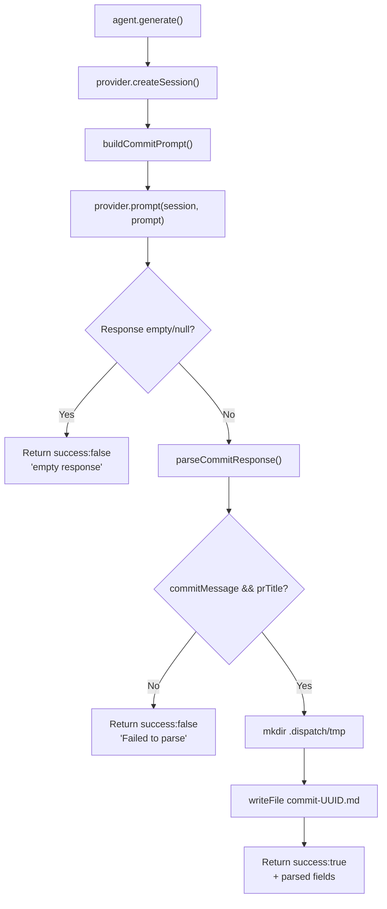

# Commit Agent Tests

This document provides a detailed breakdown of
`src/tests/commit-agent.test.ts`, which tests the commit agent defined in
[`src/agents/commit.ts`](../../src/agents/commit.ts). The commit agent
analyzes branch diffs and generates conventional-commit-compliant commit
messages, PR titles, and PR descriptions using an AI provider.

## What is tested

The test file covers three exported functions from the commit agent module:

| Function | Role | Tests |
|----------|------|-------|
| `boot()` | Agent lifecycle — validates provider, returns agent instance | 3 |
| `generate()` (via booted agent) | End-to-end generation — provider interaction, response parsing, file output, error handling | 7 |
| `parseCommitResponse()` | Pure parsing — extracts structured sections from AI response | 6 |
| `buildCommitPrompt()` | Pure prompt construction — assembles issue, diff, and task context | 10 |

**Total: 4 describe blocks, 26 tests, 363 lines of test code.**

## Mocking strategy

The commit agent tests use `vi.hoisted()` for ESM-compatible mock variable
declaration before module loading. This pattern is necessary because Vitest
hoists `vi.mock()` calls to the top of the file, but mock variables must
also be accessible at that point.

### Hoisted mocks

| Mock variable | Target module | Purpose |
|---------------|---------------|---------|
| `mockMkdir` | `node:fs/promises` | Controls directory creation success/failure |
| `mockWriteFile` | `node:fs/promises` | Controls file write success/failure |
| `mockRandomUUID` | `node:crypto` | Returns deterministic UUID for temp file naming |

### Module-level mocks

| Mocked module | Mock shape | Purpose |
|---------------|------------|---------|
| `node:fs/promises` | `{ mkdir, writeFile }` | Isolate from filesystem I/O |
| `node:crypto` | `{ randomUUID }` | Deterministic temp file paths |
| `../helpers/logger.js` | `{ log: { debug, warn, error, extractMessage } }` | Suppress log output |
| `../helpers/file-logger.js` | `{ fileLoggerStorage: { getStore: () => null } }` | Disable file logging |

### Local helper factories

The test file defines two local helpers rather than importing from
`src/tests/fixtures.ts`:

- **`createMockProvider(overrides?)`** — Creates a `ProviderInstance` with
  mock `createSession`, `prompt`, and `cleanup` methods. Accepts partial
  overrides for per-test behavior.
- **`makeIssue(overrides?)`** — Creates an `IssueDetails` fixture with
  defaults (`number: "42"`, `title: "Test issue"`, `labels: ["bug"]`).

## Describe blocks

### boot (3 tests)

| Test | Assertion |
|------|-----------|
| throws when provider is not supplied | `boot({ cwd })` rejects with `"Commit agent requires a provider instance"` |
| returns an agent with name 'commit' | `agent.name === "commit"` |
| returns an agent with generate and cleanup methods | Both are functions |

### cleanup (1 test)

| Test | Assertion |
|------|-----------|
| resolves without error | `agent.cleanup()` resolves to `undefined` |

The commit agent has no owned resources — provider lifecycle is managed
externally. Cleanup is a no-op.

### generate — success (7 tests)



| Test | What it verifies |
|------|------------------|
| calls provider.createSession and provider.prompt | Both called exactly once |
| returns success:true with parsed fields on valid response | `commitMessage`, `prTitle`, `prDescription` all populated |
| writes output file to `.dispatch/tmp/<name>.md` | `mkdir` called with `.dispatch/tmp`, `writeFile` called once, `outputPath` contains UUID |
| returns success:false with error when provider returns empty response | Empty string triggers `"empty response"` error |
| returns success:false when provider returns null | Null treated same as empty |
| returns success:false when response has no commit message or PR title | Missing sections trigger `"Failed to parse"` |
| returns success:false on provider error | Network error caught and surfaced |
| returns success:false when mkdir fails | Filesystem permission error caught |

### parseCommitResponse (6 tests)

Tests the pure `parseCommitResponse()` function that extracts three sections
from the AI's structured response using regex matching:

| Test | Input pattern | Expected output |
|------|--------------|-----------------|
| parses all three sections | `### COMMIT_MESSAGE\n...\n### PR_TITLE\n...\n### PR_DESCRIPTION\n...` | All three fields populated |
| returns empty strings when no sections match | `"nothing here"` | All fields empty |
| trims whitespace from each section | Sections with leading/trailing spaces | Trimmed values |
| is case-insensitive for section headers | Lowercase headers (`### commit_message`) | Fields still parsed |
| handles multi-line PR description | Description spanning 3 lines | All lines included |
| returns only commitMessage and prTitle when PR_DESCRIPTION is absent | Two-section response | `prDescription` is empty |

**Regex patterns used by the parser:**

| Section | Pattern | Lookahead |
|---------|---------|-----------|
| COMMIT_MESSAGE | `/###\s*COMMIT_MESSAGE\s*\n([\s\S]*?)(?=###\s*PR_TITLE\|$)/i` | Stops at PR_TITLE or end |
| PR_TITLE | `/###\s*PR_TITLE\s*\n([\s\S]*?)(?=###\s*PR_DESCRIPTION\|$)/i` | Stops at PR_DESCRIPTION or end |
| PR_DESCRIPTION | `/###\s*PR_DESCRIPTION\s*\n([\s\S]*?)$/i` | Captures to end |

### buildCommitPrompt (10 tests)

Tests the prompt construction function that assembles context for the AI:

| Test | What it verifies |
|------|------------------|
| includes the environment section | `"## Environment"`, `"Operating System"`, `"Do NOT write intermediate scripts"` |
| includes the issue number and title | `"#99"`, `"My important issue"` |
| includes issue body when present | Body text appears in prompt |
| omits description section when body is empty | No `"**Description:**"` when body is `""` |
| includes labels when present | Both labels appear |
| omits labels section when labels array is empty | No `"**Labels:**"` |
| includes completed and failed tasks | Task text and error messages included |
| truncates very long diffs | 60,000-char diff → `"diff truncated due to size"` |
| does not truncate diffs within the limit | Short diff appears verbatim |
| includes the required output format section | All three section headers present |

**Diff truncation threshold:** 50,000 characters (defined at
`src/agents/commit.ts:205`). The test uses a 60,000-char diff to trigger
truncation.

## Integration: Node.js fs/promises

**What:** The commit agent uses `mkdir` and `writeFile` from `node:fs/promises`
to create the `.dispatch/tmp/` directory and write the output markdown file.

**How mocked:** Both functions are replaced via `vi.mock("node:fs/promises")`
with `vi.hoisted()` mock variables. The mocks default to resolving
successfully; individual tests override `mockMkdir.mockRejectedValueOnce()`
to simulate filesystem errors.

**Operational notes:**
- The temp directory path is `<cwd>/.dispatch/tmp/`, created with
  `{ recursive: true }` to handle missing parent directories.
- Temp files are named `commit-<uuid>.md` using `randomUUID()`.
- If `mkdir` fails, the agent catches the error and returns `success: false`
  without attempting the write.
- If `writeFile` fails, the error is similarly caught and surfaced.

## Integration: Node.js crypto

**What:** The `randomUUID()` function generates unique temp file names to
prevent collisions when multiple commit agents run concurrently.

**How mocked:** Replaced via `vi.mock("node:crypto")` with a deterministic
return value (`"aabbccdd-1234-5678-0000-000000000000"`). This makes file
paths predictable in assertions.

**Operational notes:**
- The UUID is embedded in the temp filename: `commit-aabbccdd-1234-5678-0000-000000000000.md`
- Tests verify the UUID appears in `result.outputPath`

## Integration: Provider System

**What:** The commit agent depends on the `ProviderInstance` interface
(from `src/providers/interface.ts`) for AI interaction. It calls
`createSession()` to obtain a session ID, then `prompt(sessionId, promptText)`
to get the AI response.

**How mocked:** The `createMockProvider()` factory creates a conformant mock
with default implementations. Tests override specific methods to control
responses, simulate empty/null responses, or throw errors.

**Operational notes:**
- `createSession` is called exactly once per `generate()` invocation
- `prompt` is called exactly once per `generate()` invocation
- The provider does not need `send()` — the commit agent has no timebox mechanism
- `cleanup()` on the provider is never called by the commit agent — provider
  lifecycle is managed externally by the pipeline

## How to run

```sh
# Run commit agent tests
npx vitest run src/tests/commit-agent.test.ts

# Run in watch mode
npx vitest src/tests/commit-agent.test.ts

# Run with verbose output
npx vitest run --reporter=verbose src/tests/commit-agent.test.ts
```

All tests run without network access, filesystem I/O, or API credentials.

## Troubleshooting

### Test fails with "property not found on mock"

The `vi.hoisted()` pattern requires mock variables to be declared before
`vi.mock()` calls. If you add new mock variables, they must be inside a
`vi.hoisted(() => ({ ... }))` block at the top of the file, before any
`vi.mock()` calls.

### Mock not resetting between tests

The `beforeEach` hook calls `vi.clearAllMocks()` and re-sets all mock
default behaviors. If a test modifies mock behavior (e.g.,
`mockMkdir.mockRejectedValueOnce()`), the mock resets automatically for
the next test. If you add new mocks, ensure they are also reset in
`beforeEach`.

## Related documentation

- [Testing Overview](overview.md) — Project-wide test strategy and coverage
- [Planner & Executor Tests](planner-executor-tests.md) — Similar agent
  test patterns (boot, provider mock, error handling)
- [Spec Agent Tests](spec-agent-tests.md) — Spec agent tests with similar
  structure but more complex timebox mechanism
- [Provider Tests](provider-tests.md) — Provider backend tests that
  exercise the same `ProviderInstance` interface
- [Test Fixtures](test-fixtures.md) — Shared mock factories (note: commit
  agent tests use local factories instead)
- [Dispatch Pipeline Tests](dispatch-pipeline-tests.md) — Pipeline that
  consumes commit agent output
- [Commit Agent](../agent-system/commit-agent.md) — Production documentation
  for the module under test
- [Agent Framework](../agent-system/overview.md) — Agent registry, result
  types, and boot lifecycle
- [Provider System Overview](../provider-system/overview.md) — The
  `ProviderInstance` interface consumed by the commit agent
- [Datasource Helpers Tests](datasource-helpers-tests.md) — Tests for PR
  title/body generation that the commit agent also produces
- [Architecture Overview](../architecture.md) — Where the commit agent fits
  in the pipeline
