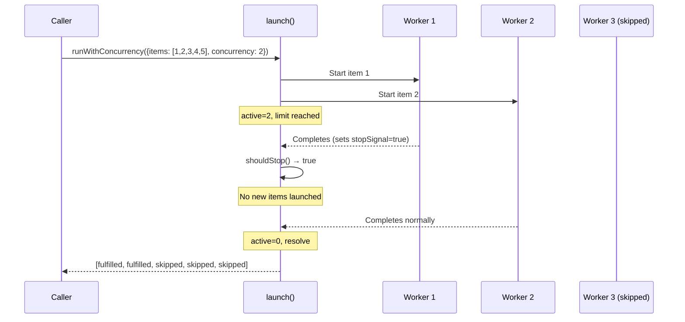

# Concurrency Tests

This document provides a detailed breakdown of
[`src/tests/concurrency.test.ts`](../../src/tests/concurrency.test.ts), which
tests the sliding-window concurrency limiter defined in
[`src/helpers/concurrency.ts`](../../src/helpers/concurrency.ts).

## What is tested

The `concurrency.ts` module exports a single function, `runWithConcurrency`,
which processes an array of work items through an async worker function with
a sliding-window concurrency limit. Unlike batch-then-await approaches
(`Promise.all` on N-item chunks), it starts a new task the moment any running
task completes, keeping the number of active tasks pinned to
`min(limit, remaining)` at all times.

The function also supports an optional `shouldStop` callback for early
termination — when it returns `true`, no new items are launched, but
already-running workers are allowed to finish.

## Test organization

The test file contains **1 describe block** with **16 tests** organized
into five logical sections (321 lines).

| Section | Tests | Focus |
|---------|-------|-------|
| Basic behaviour | 3 | Empty input, result ordering, sequential processing |
| Concurrency limit | 2 | Max active workers, over-provisioned concurrency |
| Sliding window behaviour | 1 | New task starts when any task completes |
| Error handling | 2 | Individual failures, all items failing |
| Early termination (shouldStop) | 3 | Stop signal, in-flight completion, pre-set stop |
| Edge cases | 5 | Zero/negative concurrency, index passing, non-Error throws, mid-batch stop, single item |

## Concurrency control with early termination

The following diagram illustrates how the sliding-window executor manages
concurrent workers and responds to the `shouldStop` signal:



## Key test scenarios

### Result ordering

Results are returned in the same order as the input `items` array, regardless
of completion order. The test `processes all items and returns results in
input order` verifies this with five items at concurrency 2.

Each result is a discriminated union:

| Status | Shape | Meaning |
|--------|-------|---------|
| `"fulfilled"` | `{ status: "fulfilled", value: R }` | Worker returned successfully |
| `"rejected"` | `{ status: "rejected", reason: unknown }` | Worker threw an error |
| `"skipped"` | `{ status: "skipped" }` | Item was never launched (due to `shouldStop`) |

### Sliding window verification

The test `starts a new task as soon as one completes (sliding window)` uses
timed delays to prove that item 3 starts after item 1 completes but before
item 2 completes:

```
Timeline:
  Item 1: start ──[5ms]── end
  Item 2: start ─────────────[20ms]── end
  Item 3:               start ──[20ms]── end
                    ↑
           Item 3 starts here (after item 1 ends, before item 2 ends)
```

This confirms the implementation uses a true sliding window rather than
batch-then-await.

### Concurrency limit enforcement

The test `never exceeds the concurrency limit` uses atomic `active`/`maxActive`
counters across 10 items with a limit of 3, asserting that `maxActive` never
exceeds the configured limit. Each worker includes a 10ms delay to ensure
temporal overlap between concurrent tasks.

### Error isolation

Worker errors are captured as `{ status: "rejected", reason: Error }` results
without stopping other items. The test `captures worker errors as rejected
results without stopping other items` has item 2 throw while items 1 and 3
succeed, verifying all three results are present in the output.

Non-Error thrown values (strings, numbers) are also captured correctly, as
verified by `captures non-Error thrown values as rejection reasons`.

### Early termination semantics

The `shouldStop` callback controls three behaviors:

| Behavior | Test | Detail |
|----------|------|--------|
| Prevents new launches | `stops launching new items when shouldStop returns true` | Items 3-5 are marked `"skipped"` |
| In-flight workers finish | `allows already-running workers to finish when shouldStop fires` | Item 2 completes even though stop fired during item 1 |
| Pre-set stop | `launches no items when shouldStop is true from the start` | All items are `"skipped"`, worker never called |
| Mid-batch stop | `marks unprocessed items as skipped when shouldStop fires mid-batch` | Stop fires synchronously in item 1 before any async yield |

### Edge cases

| Edge case | Test | Behavior |
|-----------|------|----------|
| `concurrency: 0` | `clamps concurrency to at least 1 when given 0` | Clamped to 1 via `Math.max(1, concurrency)` |
| `concurrency: -5` | `clamps concurrency to at least 1 when given a negative value` | Clamped to 1 |
| `concurrency > items.length` | `handles concurrency greater than the number of items` | `maxActive` equals item count |
| Empty items | `returns an empty array when given no items` | Returns `[]` immediately |
| Single item | `handles a single item` | Returns single-element array |
| Worker receives index | `passes the item index to the worker` | Second argument is 0-based index |

## Testing approach

This is a **pure async logic** test suite with no mocking of external
dependencies. The only mock used is a single `vi.fn()` in the pre-set stop
test to verify the worker was never called.

The tests use real `setTimeout` delays (5-20ms) to create deterministic
timing scenarios for the sliding window and concurrency limit tests. This
approach is simpler than fake timers because the concurrency implementation
uses `Promise.then()` chains rather than `setTimeout` internally.

## How `runWithConcurrency` is used in production

The dispatcher uses `runWithConcurrency` to process batches of tasks with
configurable parallelism. The `shouldStop` callback is connected to the
signal-aware cleanup system, allowing graceful shutdown when the user presses
Ctrl+C — in-flight agent sessions complete their current work while
remaining tasks are skipped.

The concurrency limit is set by the `--concurrency` CLI flag (default varies
by provider) and controls how many AI agent sessions run simultaneously.

## Related documentation

- [Test suite overview](overview.md) -- framework, patterns, and coverage map
- [Concurrency utility](../shared-utilities/concurrency.md) -- full API
  documentation for `runWithConcurrency` including design rationale
- [Auth Tests](auth-tests.md) -- authentication tests from the same test group
- [Worktree Tests](worktree-tests.md) -- worktree lifecycle tests from the
  same test group
- [Environment, Errors, and Prerequisites Tests](environment-errors-prereqs-tests.md)
  -- lightweight helper tests from the same test group
- [Dispatch Pipeline](../cli-orchestration/dispatch-pipeline.md) -- primary
  consumer of the concurrency limiter
- [Dispatch Pipeline Tests](dispatch-pipeline-tests.md) -- tests that exercise
  `runWithConcurrency` indirectly through the dispatch pipeline
- [Cleanup Registry](../shared-types/cleanup.md) -- signal-aware teardown
  system that integrates with `shouldStop`
- [Architecture Overview](../architecture.md) -- system-wide design context
