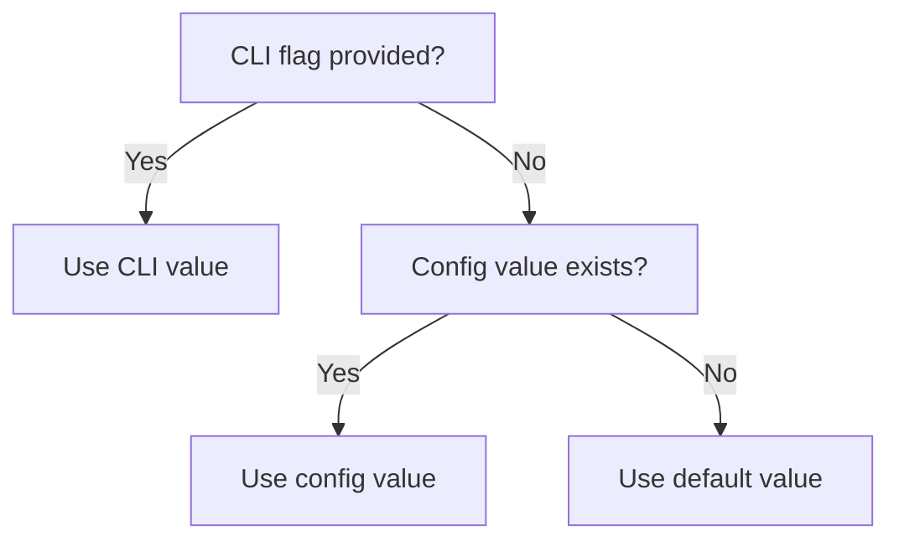

# Configuration Tests

This document provides a detailed breakdown of `src/tests/config.test.ts`, which
tests the configuration data layer defined in
[`src/config.ts`](../../src/config.ts).

## What is tested

The configuration module manages persistent user settings stored at
`~/.dispatch/config.json`. The test file covers:

- File I/O operations (load, save, path resolution)
- Key and value validation logic
- Value parsing (type coercion)
- Merge precedence between CLI flags, config file, and defaults
- The `handleConfigCommand` CLI subcommand

## Describe blocks

The test file contains **8 describe blocks** with **27 tests** total.

### loadConfig (5 tests)

Tests the `loadConfig()` function, which reads `config.json` from a given
directory and returns a `DispatchConfig` object.

| Test | What it verifies |
|------|------------------|
| returns empty object when config file does not exist | Graceful handling of missing file |
| returns empty object for empty config file | Empty file treated as no-config |
| loads a valid config file | Standard JSON round-trip |
| returns empty object for corrupt JSON | Malformed JSON does not throw |
| loads config with all fields populated | All 6 `DispatchConfig` fields load correctly |

All tests use real filesystem I/O with temporary directories.

**Key behavior:** `loadConfig` never throws. Invalid or missing files silently
return `{}`. This means corrupt config files are treated identically to absent
ones -- there is no error message or recovery prompt.

### saveConfig (4 tests)

Tests the `saveConfig()` function, which writes a `DispatchConfig` object to
disk as pretty-printed JSON.

| Test | What it verifies |
|------|------------------|
| saves config and round-trips correctly | Write then read returns identical object |
| creates parent directory if it doesn't exist | `mkdir -p` semantics for nested paths |
| writes pretty-printed JSON with trailing newline | Format: `JSON.stringify(config, null, 2) + "\n"` |
| overwrites existing config | Second save replaces first completely |

**Key behavior:** `saveConfig` performs a full replacement, not a merge. Saving
`{ provider: "copilot" }` after `{ provider: "opencode", concurrency: 2 }` drops
the `concurrency` field entirely.

### getConfigPath (2 tests)

Tests the `getConfigPath()` function, which resolves the config file location.

| Test | What it verifies |
|------|------------------|
| returns path under the given directory | Custom directory override works |
| defaults to `~/.dispatch/config.json` when no override | Default path uses `homedir()` |

### isValidConfigKey (2 tests)

Tests the `isValidConfigKey()` type guard function.

| Test | What it verifies |
|------|------------------|
| returns true for each valid config key | All 6 keys from `CONFIG_KEYS` are valid |
| returns false for unknown keys | `"unknown"`, `"dryRun"`, `"noPlan"`, `"verbose"`, `""` all rejected |

The valid config keys are: `provider`, `concurrency`, `source`, `org`,
`project`, `serverUrl`.

### validateConfigValue (7 tests)

Tests the `validateConfigValue()` function, which returns `null` for valid
values or an error message string for invalid ones.

| Test | What it verifies |
|------|------------------|
| accepts valid provider names | `"opencode"` and `"copilot"` return `null` |
| rejects invalid provider name | `"invalid"` returns error containing `"Invalid provider"` |
| accepts valid source names | `"github"` and `"azdevops"` return `null` |
| rejects invalid source name | `"jira"` returns error containing `"Invalid source"` |
| accepts valid concurrency (positive integer) | `"1"`, `"5"`, `"100"` all valid |
| rejects non-positive concurrency | `"0"` and `"-1"` return error containing `"positive integer"` |
| rejects non-integer concurrency | `"1.5"` and `"abc"` both rejected |

**Validation rules by key:**

| Config key | Valid values | Validation rule |
|------------|-------------|-----------------|
| `provider` | `"opencode"`, `"copilot"` | Must be in `PROVIDER_NAMES` |
| `source` | `"github"`, `"azdevops"` | Must be in `ISSUE_SOURCE_NAMES` |
| `concurrency` | `"1"`, `"2"`, ... | Must parse to positive integer |
| `org` | Any non-empty string | Must not be empty or whitespace-only |
| `project` | Any non-empty string | Must not be empty or whitespace-only |
| `serverUrl` | Any non-empty string | Must not be empty or whitespace-only |

### parseConfigValue (2 tests)

Tests the `parseConfigValue()` function, which converts string values to the
appropriate type for storage.

| Test | What it verifies |
|------|------------------|
| converts concurrency to a number | `parseConfigValue("concurrency", "5")` returns `5` (number) |
| returns string for non-concurrency keys | `parseConfigValue("provider", "copilot")` returns `"copilot"` (string) |

**Key behavior:** Only `concurrency` is coerced to a number. All other keys
remain strings.

### merge precedence (5 tests)

Tests the three-way merge logic: **CLI flags > config file > defaults**.

This describe block replicates the merge logic from `src/cli.ts` as a local
`applyMerge()` helper. It uses a `CONFIG_TO_CLI` mapping that mirrors the
production code's field name translation:

| Config key | CLI args field |
|------------|---------------|
| `provider` | `provider` |
| `concurrency` | `concurrency` |
| `source` | `issueSource` |
| `org` | `org` |
| `project` | `project` |
| `serverUrl` | `serverUrl` |

Note that `source` maps to `issueSource` in CLI args -- this is the only
field where the config key differs from the CLI field name.



| Test | What it verifies |
|------|------------------|
| config value fills in when CLI flag is not explicit | Config overrides defaults |
| CLI flag takes precedence over config | Explicit flags win over config |
| default is used when neither CLI nor config provides a value | Fallback to defaults |
| merge applies to each configurable field | All 5 non-provider fields merge correctly |
| partially explicit flags still allow config for other fields | Per-field independence |

### handleConfigCommand (9 tests)

Tests the `dispatch config` CLI subcommand handler.

| Test | What it verifies |
|------|------------------|
| `set` with missing key and value exits with error | Missing args → exit(1) |
| `set` with invalid key exits with error | Unknown key → exit(1) |
| `set` with invalid provider value exits with error | Bad provider → exit(1) |
| `set` with invalid source value exits with error | `"jira"` → exit(1) |
| `set` with invalid concurrency exits with error | `"abc"` → exit(1) |
| `get` with missing key exits with error | Missing key → exit(1) |
| `get` with invalid key exits with error | Unknown key → exit(1) |
| unknown operation exits with error | `"badop"` → exit(1) |
| missing operation exits with error | Empty args → exit(1) |

The `path` subcommand is also tested: it prints the config file path to stdout
and does not exit with an error.

**Process exit mocking pattern:** Since calling `process.exit()` would
terminate the test runner, the tests spy on `process.exit` with an
implementation that throws an error:

```
vi.spyOn(process, "exit").mockImplementation(() => { throw new Error("process.exit called"); })
```

Tests then assert with `expect(...).rejects.toThrow("process.exit called")`
and verify the exit code via `expect(mockExit).toHaveBeenCalledWith(1)`.

## Temporary file cleanup

The `loadConfig` and `saveConfig` describe blocks use the standard temporary
directory pattern described in the [overview](overview.md). Each test creates a
unique `/tmp/dispatch-test-*` directory and removes it in `afterEach`.

## Related documentation

- [Test suite overview](overview.md) — framework, patterns, and coverage map
- [Architecture overview](../architecture.md) — system-wide context
- [CLI documentation](../cli-orchestration/cli.md) — CLI argument parsing and config integration
- [Provider overview](../provider-system/provider-overview.md) — provider names validated by config
- [Issue fetching overview](../issue-fetching/overview.md) — issue source names validated by config
