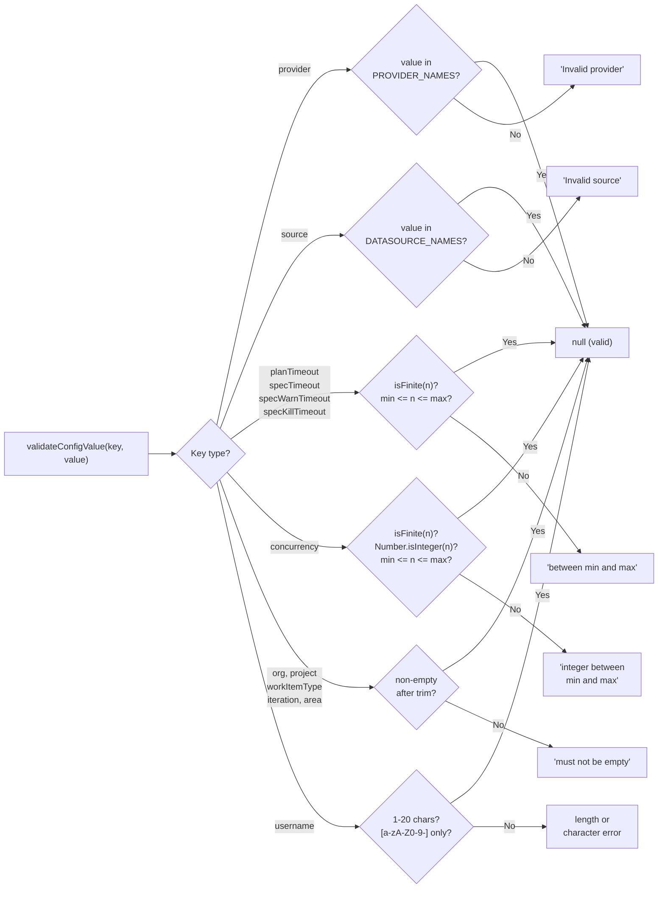
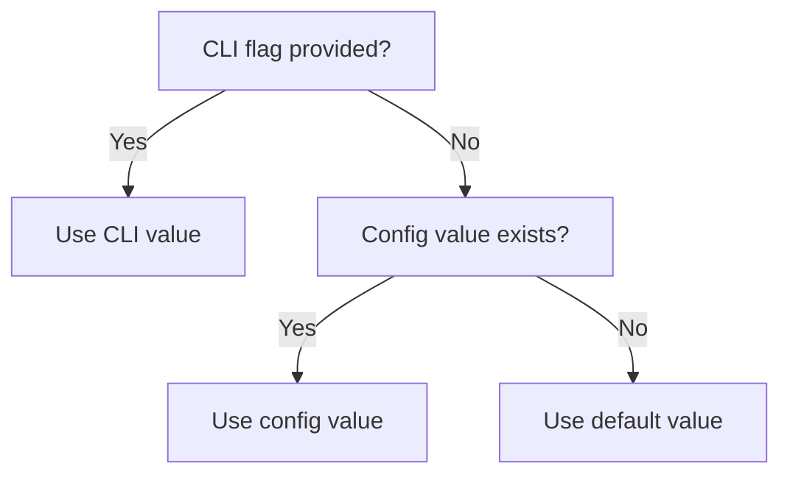
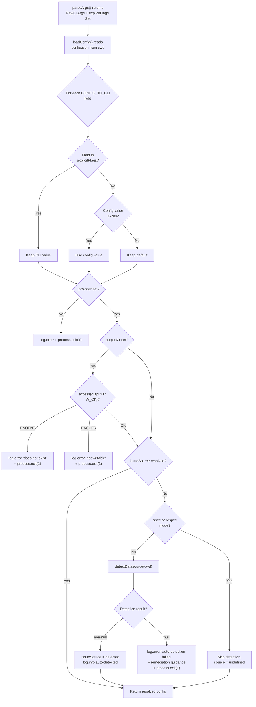
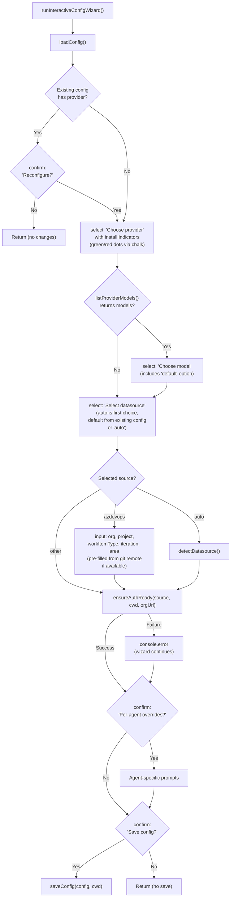

# Configuration Tests

This document covers the three test files for the configuration system:
`src/tests/config.test.ts`, `src/tests/cli-config.test.ts`, and
`src/tests/config-prompts.test.ts`. For CLI argument parsing tests
(`cli.test.ts`), see the
[CLI documentation](../cli-orchestration/cli.md#test-coverage).

## Test file inventory

| Test file | Production module | Lines (test) | Test count | Category |
|-----------|-------------------|-------------|------------|----------|
| `config.test.ts` | `src/config.ts` | 495 | 42 | File I/O, validation, merge |
| `cli-config.test.ts` | `src/orchestrator/cli-config.ts` | 732 | 35 | Config resolution, auto-detection |
| `config-prompts.test.ts` | `src/config-prompts.ts` | 471 | 22 | Interactive wizard flow |

**Total: 1,698 lines of test code** covering 99 tests across 3 files.

## config.test.ts

Tests the configuration data layer defined in
[`src/config.ts`](../cli-orchestration/configuration.md): file I/O operations,
key/value validation, numeric bounds enforcement, and merge precedence logic.

### Describe blocks

The test file contains **5 describe blocks** with **42 tests** total.

### loadConfig (5 tests)

Tests the `loadConfig()` function, which reads `config.json` from a given
directory and returns a `DispatchConfig` object.

| Test | What it verifies |
|------|------------------|
| returns empty object when config file does not exist | Graceful handling of missing file |
| returns empty object for empty config file | Empty file treated as no-config |
| loads a valid config file | Standard JSON round-trip |
| returns empty object for corrupt JSON | Malformed JSON does not throw |
| loads config with all fields populated | All `DispatchConfig` fields load correctly |

All tests use real filesystem I/O with temporary directories.

**Key behavior:** `loadConfig` never throws. Invalid or missing files silently
return `{}`. This means corrupt config files are treated identically to absent
ones — there is no error message or recovery prompt.

### saveConfig (5 tests)

Tests the `saveConfig()` function, which writes a `DispatchConfig` object to
disk as pretty-printed JSON.

| Test | What it verifies |
|------|------------------|
| saves config and round-trips correctly | Write then read returns identical object |
| creates parent directory if it doesn't exist | `mkdir -p` semantics for nested paths |
| writes pretty-printed JSON with trailing newline | Format: `JSON.stringify(config, null, 2) + "\n"` |
| overwrites existing config | Second save replaces first completely |
| round-trips config with all Azure DevOps fields | org, project, workItemType, iteration, area survive round-trip |

**Key behavior:** `saveConfig` performs a full replacement, not a merge. Saving
`{ provider: "copilot" }` after `{ provider: "opencode", concurrency: 2 }` drops
the `concurrency` field entirely.

### getConfigPath (2 tests)

Tests the `getConfigPath()` function, which resolves the config file location.

| Test | What it verifies |
|------|------------------|
| returns path under the given directory | Custom directory override works |
| defaults to `{CWD}/.dispatch/config.json` when no override | Default path uses `process.cwd()` |

### validateConfigValue (28 tests)

Tests the `validateConfigValue()` function, which returns `null` for valid
values or an error message string for invalid ones. Tests exercise all
[`CONFIG_BOUNDS`](../cli-orchestration/configuration.md#numeric-bounds-config_bounds)
boundary values.

| Test | What it verifies |
|------|------------------|
| accepts valid provider names | `"opencode"` and `"copilot"` return `null` |
| rejects invalid provider name | `"invalid"` returns error containing `"Invalid provider"` |
| accepts valid source names | `"github"` and `"azdevops"` return `null` |
| rejects invalid source name | `"jira"` returns error containing `"Invalid source"` |
| accepts valid planTimeout (within bounds) | Min (1), 10, 1.5, max (120) all valid |
| rejects planTimeout below minimum | `"0"` and `"-1"` rejected with `"between"` |
| rejects planTimeout above maximum | 121 rejected with `"between"` |
| rejects non-numeric planTimeout | `"abc"` and `""` both rejected |
| rejects Infinity and NaN for planTimeout | Special values rejected |
| accepts valid specTimeout (within bounds) | Min (1), 10, 1.5, max (120) all valid |
| rejects specTimeout below/above bounds | `"0"`, `"-1"`, 121 all rejected |
| rejects non-numeric specTimeout | `"abc"` and `""` rejected |
| rejects Infinity and NaN for specTimeout | Special values rejected |
| accepts valid specWarnTimeout (within bounds) | Min (1), 10, 1.5, max (120) all valid |
| rejects specWarnTimeout below/above bounds | `"0"`, `"-1"`, 121 all rejected |
| rejects non-numeric specWarnTimeout | `"abc"` and `""` rejected |
| rejects Infinity and NaN for specWarnTimeout | Special values rejected |
| accepts valid specKillTimeout (within bounds) | Min (1), 10, 1.5, max (120) all valid |
| rejects specKillTimeout below/above bounds | `"0"`, `"-1"`, 121 all rejected |
| rejects non-numeric specKillTimeout | `"abc"` and `""` rejected |
| rejects Infinity and NaN for specKillTimeout | Special values rejected |
| accepts valid concurrency (within bounds) | Min (1), 4, max (64) all valid |
| rejects concurrency below/above bounds | `"0"`, `"-1"`, 65 all rejected |
| rejects non-integer concurrency | `"1.5"`, `"abc"`, `""` rejected |
| rejects Infinity and NaN for concurrency | Special values rejected |
| accepts valid org, project, workItemType, iteration, area | Non-empty strings accepted |
| rejects empty org, project, workItemType, iteration, area | `""` and whitespace-only rejected |
| accepts valid username values | 1-20 chars, alphanumeric + hyphens |
| rejects empty username | `""` and whitespace-only rejected |
| rejects username exceeding 20 characters | 21 chars returns error with `"at most 20 characters"` |
| rejects username with invalid characters | spaces, dots, underscores, slashes rejected |

**Validation rules by key:**

| Config key | Valid values | Validation rule |
|------------|-------------|-----------------|
| `provider` | `"opencode"`, `"copilot"`, `"claude"`, `"codex"` | Must be in `PROVIDER_NAMES` |
| `model` | Any non-empty string | Must not be empty or whitespace-only |
| `source` | `"github"`, `"azdevops"`, `"md"` | Must be in `DATASOURCE_NAMES` |
| `planTimeout` | 1–120 | Finite number within `CONFIG_BOUNDS` |
| `specTimeout` | 1–120 | Finite number within `CONFIG_BOUNDS` |
| `specWarnTimeout` | 1–120 | Finite number within `CONFIG_BOUNDS` |
| `specKillTimeout` | 1–120 | Finite number within `CONFIG_BOUNDS` |
| `concurrency` | 1–64 | Integer within `CONFIG_BOUNDS` |
| `org` | Any non-empty string | Must not be empty or whitespace-only |
| `project` | Any non-empty string | Must not be empty or whitespace-only |
| `workItemType` | Any non-empty string | Must not be empty or whitespace-only |
| `iteration` | Any non-empty string | Must not be empty or whitespace-only |
| `area` | Any non-empty string | Must not be empty or whitespace-only |
| `username` | 1-20 chars, `[a-zA-Z0-9-]` | Alphanumeric + hyphens, at most 20 chars |

### Config validation boundary matrix

The following diagram shows how `validateConfigValue()` routes validation
based on key type:



### merge precedence (5 tests)

Tests the three-way merge logic: **[CLI flags](../cli-orchestration/cli.md) > config file > defaults**.

This describe block replicates the merge logic from `src/orchestrator/cli-config.ts`
as a local `applyMerge()` helper. It uses a `CONFIG_TO_CLI` mapping that
mirrors the production code's field name translation:

| Config key | CLI args field |
|------------|---------------|
| `provider` | `provider` |
| `model` | `model` |
| `source` | `issueSource` |

Note that `source` maps to `issueSource` in CLI args — this is the only
field where the config key differs from the CLI field name. The test's local
`CONFIG_TO_CLI` mapping covers the core 3 keys; the production code's
mapping in [`src/orchestrator/cli-config.ts:25-37`](../cli-orchestration/configuration.md)
additionally includes `planTimeout`, `concurrency`, `org`,
`project`, `workItemType`, `iteration`, and `area`.



| Test | What it verifies |
|------|------------------|
| config value fills in when CLI flag is not explicit | Config overrides defaults |
| CLI flag takes precedence over config | Explicit flags win over config |
| default is used when neither CLI nor config provides a value | Fallback to defaults |
| merge applies to each configurable field | Model and source merge correctly |
| partially explicit flags still allow config for other fields | Per-field independence |

## cli-config.test.ts

Tests the config resolution layer defined in
[`src/orchestrator/cli-config.ts`](../cli-orchestration/configuration.md#config-resolution-pipeline):
three-tier merge, mandatory validation, output-dir validation, datasource
auto-detection, and mode-dependent behavior.

### CLI flag parsing, config merging, and auto-detection pipeline

The `resolveCliConfig()` function executes a multi-stage pipeline that the
test suite exercises end-to-end:



### Test structure

The test file contains **7 describe blocks** with **35 tests** total. All
tests mock `process.exit` to prevent test runner termination:

```
vi.spyOn(process, "exit").mockImplementation(
  (() => { throw new Error("process.exit called"); }) as never,
);
```

Tests then assert with `expect(...).rejects.toThrow("process.exit called")`
and verify error messages via `expect(log.error).toHaveBeenCalledWith(...)`.

### config merging (15 tests)

| Test | What it verifies |
|------|------------------|
| returns args unchanged when config file is empty | Empty config is a no-op |
| merges config defaults for fields not in explicitFlags | Config fills gaps |
| CLI flags take precedence over config values when in explicitFlags | Explicit flags win |
| merges source config key to issueSource CLI field | `source` → `issueSource` mapping |
| does not overwrite explicit issueSource with config source | Explicit source preserved |
| merges all CONFIG_TO_CLI fields from config | Full mapping works |
| merges specTimeout from config when not explicit | Timeout merging |
| keeps explicit CLI specTimeout over config value | Explicit timeout wins |
| merges specWarnTimeout from config when not explicit | Warn timeout merging |
| keeps explicit CLI specWarnTimeout over config value | Explicit warn timeout wins |
| merges specKillTimeout from config when not explicit | Kill timeout merging |
| keeps explicit CLI specKillTimeout over config value | Explicit kill timeout wins |
| merges azdevops config values (org, project, workItemType, iteration, area) | All AzDevOps fields merge |
| CLI flags take precedence over config for org, project, workItemType, iteration, area | AzDevOps CLI wins |
| merges only the azdevops config fields that are set, leaving others undefined | Partial AzDevOps config |
| uses config for azdevops fields not in explicitFlags and CLI for those in explicitFlags | Mixed AzDevOps precedence |

### validation errors (3 tests)

| Test | What it verifies |
|------|------------------|
| exits when provider is not configured | Missing provider → `process.exit(1)` |
| auto-detects datasource when source is not configured | `detectDatasource()` called |
| exits when only provider is missing | Missing provider with no config |

### output-dir validation (4 tests)

| Test | What it verifies |
|------|------------------|
| exits with error when output directory does not exist | ENOENT → exit(1) |
| exits with error when output directory is not writable | EACCES → exit(1) |
| passes validation when output directory exists and is writable | `access()` success |
| skips validation when outputDir is not set | `access()` not called |

### datasource auto-detection (14 tests, 2 describe blocks)

The tests are split across two describe blocks that both test datasource
auto-detection. They verify the conditional detection logic documented in
[datasource auto-detection](../cli-orchestration/configuration.md#datasource-auto-detection-conditional):

| Test | What it verifies |
|------|------------------|
| uses detected datasource when source is not explicitly set | `detectDatasource()` result applied |
| exits with error when detection returns null | Fatal error on detection failure |
| does not auto-detect when issueSource is in explicitFlags | Explicit source skips detection |
| does not auto-detect when config source is set | Config source skips detection |
| skips auto-detection in spec mode | `spec` → no detection |
| skips auto-detection in respec mode | `respec` → no detection |
| still auto-detects for dispatch mode | Default mode runs detection |
| explicit --source flag still works in spec mode | Source passthrough in spec |
| config-file source still applies in spec mode | Config source in spec |
| detects azdevops from git remote | Azure DevOps detection |
| uses detected source when no explicit source is set and detection succeeds | Second block — success path |
| exits with error when no explicit source is set and detection fails | Second block — failure path |
| includes remediation guidance when detection fails | Error message lists sources, `dispatch config`, `--source` |
| explicit --source flag overrides auto-detection | CLI wins over detection |
| config source value overrides auto-detection | Config wins over detection |

### verbose logging (2 tests)

| Test | What it verifies |
|------|------------------|
| enables verbose logging when verbose is true | `log.verbose = true` |
| does not enable verbose logging when verbose is false | `log.verbose = false` |

### default handling (1 test)

| Test | What it verifies |
|------|------------------|
| passes through all non-config CLI fields unchanged | `issueIds`, `dryRun`, `noPlan`, `noBranch`, `cwd`, `spec` all preserved |

## config-prompts.test.ts

Tests the interactive configuration wizard defined in
[`src/config-prompts.ts`](../cli-orchestration/configuration.md#config-wizard-flow).
All external dependencies (`@inquirer/prompts`, `config.ts`, `datasources/index.ts`,
`providers/index.ts`, `helpers/auth.ts`) are mocked to simulate user interactions.

### Interactive config wizard state machine

The wizard progresses through a sequence of interactive prompts. Tests verify
each transition and edge case:



### Test structure

The test file contains **1 describe block** (`runInteractiveConfigWizard`)
with **22 tests** total. Mock setup follows this pattern:

1. `vi.mock("@inquirer/prompts")` — mocks `select`, `confirm`, `input`
2. `vi.mock("../config.js")` — mocks `loadConfig`, `saveConfig`
3. `vi.mock("../datasources/index.js")` — mocks `detectDatasource`,
   `getGitRemoteUrl`, `parseAzDevOpsRemoteUrl`
4. `vi.mock("../providers/index.js")` — mocks `listProviderModels`,
   `checkProviderInstalled`
5. `vi.mock("../helpers/auth.js")` — mocks `ensureAuthReady`

Each test orchestrates the wizard flow by providing mock return values for
the prompt functions in sequence, then asserts on `saveConfig` calls.

### runInteractiveConfigWizard (22 tests)

| Test | What it verifies |
|------|------------------|
| basic flow — selects provider and datasource, saves config | Core happy path |
| model selection — saves selected model when provider returns models | Model from `listProviderModels` |
| model selection — default option omits model from config | Empty model → `undefined` |
| existing config — user declines reconfiguration | Early exit, no save |
| user cancels at save confirmation | Decline save → no `saveConfig` |
| existing config — user accepts reconfiguration | Full reconfigure flow |
| default is auto when no existing source | Datasource default = "auto" |
| existing config source takes precedence over auto-detected | Existing source as default |
| default is auto when no existing source and no detection | No detection → "auto" default |
| selecting auto saves config without source field | "auto" → `source: undefined` |
| datasource choices include auto as first option | "auto" is first choice |
| provider select choices include install indicator annotations | Green dot for installed |
| azdevops source — prompts for org, project, workItemType, iteration, area | All 5 AzDevOps fields |
| azdevops source — empty inputs omit fields from config | Empty → `undefined` |
| azdevops source — pre-fills org and project from git remote | Git remote pre-fill |
| non-azdevops source — does not prompt for azdevops fields | `input` not called |
| provider select choices show red indicator for uninstalled providers | Red dot for uninstalled |
| triggers auth when github datasource is selected | `ensureAuthReady("github", ...)` called |
| triggers auth when azdevops datasource is selected with org | `ensureAuthReady("azdevops", ..., orgUrl)` called |
| does not trigger auth for md datasource | `ensureAuthReady("md", ...)` called (no-op) |
| continues wizard when auth fails | Auth failure does not abort wizard |
| triggers auth for auto-detected github source when auto is selected | Auto + detected → auth for detected source |

## Testing patterns

### Real filesystem I/O

The `config.test.ts` file uses real filesystem operations with temporary
directories created via `mkdtemp(join(tmpdir(), "dispatch-test-"))`. Each
test creates its own temp directory and removes it in `afterEach`. This
avoids mocking `fs/promises` and catches real I/O edge cases (permissions,
encoding, directory creation).

### Process exit mocking

The `cli-config.test.ts` file mocks `process.exit` to prevent test runner
termination:

```
vi.spyOn(process, "exit").mockImplementation(
  (() => { throw new Error("process.exit called"); }) as never,
);
```

Tests assert with `expect(...).rejects.toThrow("process.exit called")` and
verify the error messages via `expect(log.error).toHaveBeenCalledWith(...)`.
This pattern is necessary because `resolveCliConfig()` calls `process.exit(1)`
directly on validation failure rather than throwing an error.

### Sequential mock return values

The `config-prompts.test.ts` file chains mock return values to simulate
multi-step wizard flows:

```
vi.mocked(select)
  .mockResolvedValueOnce("copilot")    // provider
  .mockResolvedValueOnce("model-a")    // model
  .mockResolvedValueOnce("github");    // datasource
vi.mocked(confirm).mockResolvedValueOnce(true); // save
```

Each `mockResolvedValueOnce` call provides the return value for the next
invocation in sequence, matching the wizard's prompt order.

## How to run

```sh
# Run all configuration tests
npx vitest run src/tests/config.test.ts src/tests/cli-config.test.ts src/tests/config-prompts.test.ts

# Run a single test file
npx vitest run src/tests/config.test.ts

# Run in watch mode
npx vitest src/tests/config.test.ts

# Run with verbose output
npx vitest run --reporter=verbose src/tests/cli-config.test.ts
```

## Temporary file cleanup

The `config.test.ts` describe blocks use the standard temporary directory
pattern described in the [overview](overview.md). Each test creates a unique
`/tmp/dispatch-test-*` directory and removes it in `afterEach`.

## Related documentation

- [Test suite overview](overview.md) -- framework, patterns, and coverage map
- [Architecture overview](../architecture.md) -- system-wide context
- [CLI documentation](../cli-orchestration/cli.md) -- CLI argument parsing and config integration
- [Configuration](../cli-orchestration/configuration.md) -- `DispatchConfig` type, merge logic,
  wizard flow, and validation rules
- [Provider overview](../provider-system/overview.md) -- provider names validated by config
- [Provider interface](../shared-types/provider.md) -- `ProviderName` type used in config validation
- [Datasource overview](../datasource-system/overview.md) -- datasource names and auto-detection
- [Timeout utility](../shared-utilities/timeout.md) -- `planTimeout` consumed by timeout wrapping
- [Spec generator tests](spec-generator-tests.md) -- adjacent test documentation
- [Parser tests](parser-tests.md) -- another test file using real filesystem I/O pattern
- [Format utility tests](format-tests.md) -- adjacent test documentation
- [Provider tests](provider-tests.md) -- SDK mocking patterns comparable to config prompt mocks
- [Batch Confirmation](../prereqs-and-safety/confirm-large-batch.md) --
  large batch threshold logic related to configuration validation
- [Shared Utilities](../shared-utilities/overview.md) -- timeout and
  slugify utilities whose configuration (`planTimeout`, `concurrency`)
  is validated by these tests
- [Binary Detection](../provider-system/binary-detection.md) -- provider
  binary detection logic tested alongside config wizard prompts
