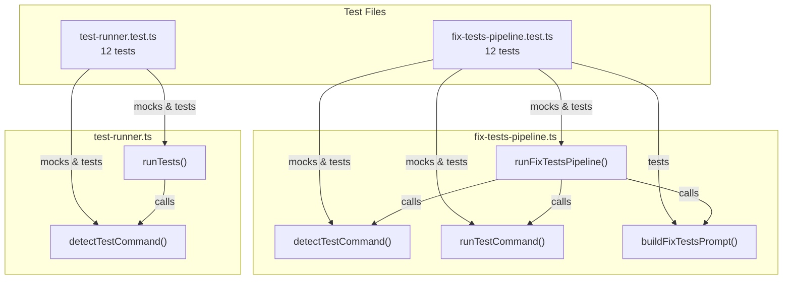

# Fix-Tests Pipeline Tests

This document covers the two test files that verify the fix-tests pipeline
and the standalone test runner: `tests/fix-tests-pipeline.test.ts` and
`tests/test-runner.test.ts`.

## Test file inventory

| Test file | Production module | Lines (test) | Test count | Category |
|-----------|-------------------|-------------|------------|----------|
| `fix-tests-pipeline.test.ts` | `src/orchestrator/fix-tests-pipeline.ts` | 313 | 12 | Pipeline flow, AI dispatch, edge cases |
| `test-runner.test.ts` | `src/test-runner.ts` | 334 | 12 | Detection, execution, timeout, errors |

**Total: 647 lines of test code** covering 24 tests across 2 files.

## What these tests verify

### fix-tests-pipeline.test.ts

Tests the complete pipeline flow from detection through AI dispatch to
verification:

| Describe block | Tests | What is verified |
|----------------|-------|------------------|
| `detectTestCommand` | 5 | Valid test script returns `"npm test"`, missing `package.json` returns null, missing script returns null, npm default placeholder returns null, malformed JSON returns null with debug log |
| `runTestCommand` | 3 | Exit code 0 for passing tests, non-zero for failures, defaults to 1 when error has no `code` property |
| `buildFixTestsPrompt` | 2 | Prompt includes test command/exit code/output/cwd, prompt includes fix instructions |
| `runFixTestsPipeline` | 7 | No test command → failure, dry-run returns early, tests pass → no provider boot, AI dispatch → re-run → success, null AI response → failure, still-failing after fix → failure, cleanup registered |

### test-runner.test.ts

Tests the standalone test runner utility with emphasis on timeout behavior:

| Describe block | Tests | What is verified |
|----------------|-------|------------------|
| `detectTestCommand` | 5 | Returns `"npm test"` for valid scripts, throws for missing `package.json`, throws for missing `scripts.test`, throws for missing `scripts` key, throws for empty test script |
| `runTests` | 7 | Exit code 0 for passing tests, non-zero for failures, null exit code defaults to 1, spawn error rejection with cause chain, multiple stdout chunks concatenated, spawn arguments verification |
| `runTests timeout` | 4 | `TimeoutError` on long-running process, `child.kill()` on timeout, normal resolution before timeout, default 300s timeout |

## Architecture under test



## Testing patterns

### Pipeline mock strategy

The `fix-tests-pipeline.test.ts` file mocks four external modules:

| Module | Mock approach | Why |
|--------|--------------|-----|
| `node:fs/promises` | `readFile` returns `package.json` content | Controls test command detection |
| `node:child_process` | `execFile` callback with configurable exit codes | Controls test pass/fail results |
| `../providers/index.js` | `bootProvider` returns mock `ProviderInstance` | Avoids real AI provider boot |
| `../helpers/cleanup.js` | `registerCleanup` is a no-op mock | Verifies registration without side effects |

The test uses a `callCount` variable to simulate the "fail first, pass
second" pattern: the first `execFile` call returns exit code 1 (tests fail),
and the second returns exit code 0 (tests pass after AI fix).

### Test runner mock strategy

The `test-runner.test.ts` file mocks:

| Module | Mock approach | Why |
|--------|--------------|-----|
| `node:fs/promises` | `readFile` returns `package.json` content | Controls detection |
| `node:child_process` | `spawn` returns `createMockChildProcess()` | Full control over child process events |

The mock child process (from [`tests/fixtures.ts`](./test-fixtures.md)) is an `EventEmitter` with
`PassThrough` streams for stdin/stdout/stderr and a mock `kill` method. Tests
simulate process behavior by emitting `data`, `close`, and `error` events
via `process.nextTick()`.

### Fake timers for timeout tests

The timeout tests in `test-runner.test.ts` use Vitest's fake timer API:

```typescript
beforeEach(() => vi.useFakeTimers());
afterEach(() => vi.useRealTimers());
```

Tests advance time with `vi.advanceTimersByTimeAsync()` to trigger
`TimeoutError` without waiting for real time to pass. The pattern:

1. Start `runTests()` with a short timeout (e.g., 5000ms).
2. Advance fake timers past the timeout.
3. Assert the promise rejects with `TimeoutError`.
4. Assert `child.kill()` was called.

### The `vi.hoisted()` pattern

The pipeline test uses `vi.hoisted()` to declare mock references
(`mockCreateSession`, `mockPrompt`, `mockCleanup`) that are available to
the `vi.mock()` factory for `../providers/index.js`. This ensures the mock
return values are initialized before the hoisted `vi.mock()` factories
execute. The `beforeEach` block re-initializes these mocks after
`vi.clearAllMocks()` resets them.

## Key test scenarios

### Full AI dispatch cycle

The test "dispatches to AI and re-runs tests on failure" validates the
complete happy path:

1. `readFile` returns valid `package.json`.
2. First `execFile` call returns exit code 1 (tests fail).
3. `bootProvider` is called.
4. `createSession` returns session ID `"sess-1"`.
5. `prompt` is called with the session ID and a prompt containing the
   failure output.
6. Second `execFile` call returns exit code 0 (tests pass).
7. `cleanup` is called on the provider.
8. Result is `{ mode: "fix-tests", success: true }`.

### Timeout kills child process

The test "kills the child process on timeout" validates the timeout
safety mechanism in `test-runner.ts`:

1. `spawn` returns a mock child process that never emits `close`.
2. `runTests("/project", 5000)` is called.
3. Fake timers advance past 5000ms.
4. The promise rejects with `TimeoutError`.
5. `child.kill()` was called (sending SIGTERM).

### Error cause chain preservation

The test "preserves spawn error properties via cause" validates that
spawn errors maintain their diagnostic properties:

1. `spawn` emits an error with `code: "ENOENT"` and `syscall: "spawn npm"`.
2. The rejection contains a wrapper error with `.cause` set to the
   original spawn error.
3. The cause's `.code` and `.syscall` properties are preserved.

## Integration: Vitest

**Key Vitest features used in fix-tests tests**:

| Feature | Usage | File |
|---------|-------|------|
| `vi.hoisted()` | Declare mock references for `vi.mock()` factories | `fix-tests-pipeline.test.ts` |
| `vi.mock()` | Replace `fs/promises`, `child_process`, providers, cleanup | Both files |
| `vi.fn()` | Create mock functions with call tracking | Both files |
| `vi.clearAllMocks()` | Reset mock state between tests | `fix-tests-pipeline.test.ts` |
| `vi.resetAllMocks()` | Reset mock state between tests | `test-runner.test.ts` |
| `vi.useFakeTimers()` | Control time for timeout tests | `test-runner.test.ts` |
| `vi.advanceTimersByTimeAsync()` | Trigger timeouts without real delays | `test-runner.test.ts` |
| `createMockChildProcess()` | Shared fixture for child process mocking | `test-runner.test.ts` |

## How to run

```sh
# Run all fix-tests pipeline tests
npx vitest run src/tests/fix-tests-pipeline.test.ts src/tests/test-runner.test.ts

# Run a single file
npx vitest run src/tests/fix-tests-pipeline.test.ts

# Run in watch mode
npx vitest src/tests/test-runner.test.ts

# Run with verbose output
npx vitest run --reporter=verbose src/tests/fix-tests-pipeline.test.ts
```

All tests run without network access, installed CLI tools, or AI provider
credentials because all external dependencies are mocked.

## Related documentation

- [Fix-Tests Pipeline](../cli-orchestration/fix-tests-pipeline.md) —
  Production implementation and pipeline flow
- [Testing Overview](./overview.md) — Project-wide test strategy and
  framework
- [Provider Tests](./provider-tests.md) — Similar mock patterns for
  provider unit tests
- [Shared Utilities Testing](../shared-utilities/testing.md) — Fake timer
  patterns used in timeout tests
- [Timeout Utility](../shared-utilities/timeout.md) — `withTimeout()` and
  `TimeoutError` used by the test runner
- [Test Fixtures](./test-fixtures.md) — Shared mock factories including
  `createMockProvider()` and `createMockChildProcess()` consumed by these tests
- [Planner & Executor Tests](./planner-executor-tests.md) — Similar
  module-mock patterns used for agent testing
- [Configuration Tests](./config-tests.md) — Similar mock patterns for
  testing CLI configuration I/O
