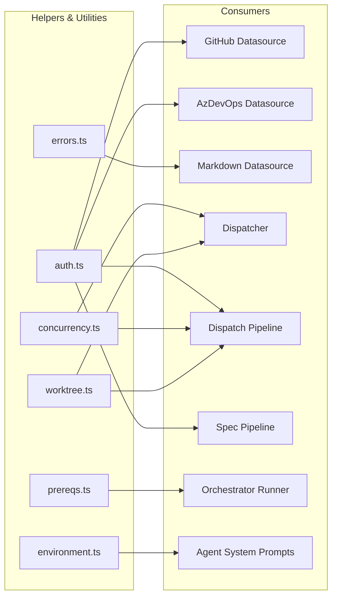

# Helpers and Utilities Tests

This document provides a group-level overview of the test files covering
Dispatch's helper and utility modules: authentication, concurrency control,
environment detection, custom errors, prerequisites validation, and git
worktree lifecycle management.

## Test files

| Test file | Production module | Tests | Lines (test) | Lines (source) | Category |
|-----------|-------------------|-------|-------------|----------------|----------|
| [`auth.test.ts`](auth-tests.md) | [`helpers/auth.ts`](../../src/helpers/auth.ts) | 18 | 509 | 205 | OAuth device-flow, token caching |
| [`concurrency.test.ts`](concurrency-tests.md) | [`helpers/concurrency.ts`](../../src/helpers/concurrency.ts) | 16 | 321 | 97 | Sliding-window async executor |
| [`environment.test.ts`](environment-errors-prereqs-tests.md#environment-tests) | [`helpers/environment.ts`](../../src/helpers/environment.ts) | 6 | 101 | 50 | Platform detection |
| [`errors.test.ts`](environment-errors-prereqs-tests.md#errors-tests) | [`helpers/errors.ts`](../../src/helpers/errors.ts) | 5 | 35 | 19 | Custom error type |
| [`prereqs.test.ts`](environment-errors-prereqs-tests.md#prerequisites-tests) | [`helpers/prereqs.ts`](../../src/helpers/prereqs.ts) | 10 | 160 | 66 | Git + Node.js version checks |
| [`worktree.test.ts`](worktree-tests.md) | [`helpers/worktree.ts`](../../src/helpers/worktree.ts) | 30 | 528 | 222 | Git worktree lifecycle |

**Total: 85 tests across 1,654 lines of test code** covering 659 lines of
production source code.

## Running the tests

### All helper/utility tests

```bash
npx vitest run src/tests/auth.test.ts src/tests/concurrency.test.ts src/tests/environment.test.ts src/tests/errors.test.ts src/tests/prereqs.test.ts src/tests/worktree.test.ts
```

### Single file

```bash
npx vitest run src/tests/auth.test.ts
```

### Watch mode

```bash
npx vitest src/tests/worktree.test.ts
```

## Testing patterns

These test files employ four distinct testing patterns depending on the
module's complexity and external dependencies:

### Pattern 1: Full module mocking (auth, worktree, prereqs)

The most complex pattern, used when the module under test interacts with
multiple external services (OAuth providers, git CLI, filesystem).

```
vi.hoisted  → Define mock functions before imports
vi.mock     → Replace module exports with mocks
import      → Import module under test (receives mocked deps)
beforeEach  → Reset all mocks, set sensible defaults
afterEach   → Restore all mocks
```

Key technique: `vi.hoisted()` ensures mock implementations exist before
Vitest evaluates module-level `import` statements. This is critical for
modules like `auth.ts` that have top-level import side effects.

### Pattern 2: Platform override (environment, prereqs)

Tests use `Object.defineProperty(process, "platform", ...)` to override
the runtime platform detection. The real value is captured before all tests
and restored in `afterEach`:

```typescript
const realPlatform = process.platform;
afterEach(() => {
    Object.defineProperty(process, "platform", {
        value: realPlatform,
        configurable: true,
    });
});
```

### Pattern 3: Pure async testing (concurrency)

No mocking of external dependencies. Tests use real `setTimeout` delays
(5-20ms) and atomic counters to verify concurrent behavior. A single
`vi.fn()` is used only to verify the worker is never called in the pre-set
stop test.

### Pattern 4: Pure constructor testing (errors)

No mocking, no I/O, no async. Tests create instances and assert properties
directly.

## External integrations

These test files collectively mock six categories of external dependencies:

| Integration | Packages | Used by |
|-------------|----------|---------|
| GitHub OAuth device flow | `@octokit/rest`, `@octokit/auth-oauth-device` | `auth.test.ts` |
| Azure Identity SDK | `@azure/identity` | `auth.test.ts` |
| Azure DevOps Node API | `azure-devops-node-api` | `auth.test.ts` |
| Browser opener | `open` | `auth.test.ts` |
| Git CLI | `node:child_process` → `execFile` | `worktree.test.ts`, `prereqs.test.ts` |
| Filesystem | `node:fs/promises`, `node:fs` | `auth.test.ts`, `worktree.test.ts` |

See the [Auth Tests](auth-tests.md#external-integrations) documentation
for details on each OAuth integration, including the specific client IDs,
scopes, and tenant configuration.

## Complexity signals

Three areas of the codebase have non-trivial control flow that warrants
architectural diagrams:

1. **Authentication flow with multi-provider caching** — The `getGithubOctokit`
   and `getAzureConnection` functions share a token cache file with provider-
   specific expiry logic and device-code fallback. See the
   [authentication flow diagram](auth-tests.md#authentication-flow).

2. **Git worktree lifecycle with retry strategies** — The `createWorktree`
   function has five distinct recovery paths for branch conflicts, lock
   contention, stale directories, checkout failures, and worktree ref
   conflicts. See the
   [worktree lifecycle diagram](worktree-tests.md#git-worktree-lifecycle-with-retry-strategies).

3. **Concurrency control with early termination** — The `runWithConcurrency`
   function manages a sliding window of async workers with a `shouldStop`
   signal that prevents new launches while allowing in-flight work to
   complete. See the
   [concurrency control diagram](concurrency-tests.md#concurrency-control-with-early-termination).

## Cross-group dependencies

The modules tested in this group are consumed by multiple other subsystems:



## What is NOT tested

The following behaviors are covered by integration tests or other test files
rather than these unit tests:

- **End-to-end auth flow with real OAuth providers** — Would require
  network access and interactive browser sessions
- **Real git worktree creation** — The
  [dispatch pipeline integration tests](dispatch-pipeline-tests.md) exercise
  real git operations including worktree creation
- **`open` package actually opening a browser** — Fire-and-forget with
  `.catch(() => {})` in production; mocked as no-op
- **Concurrent worktree creation across processes** — The retry/backoff
  logic handles this, but the unit tests simulate lock contention via mock
  errors rather than actual concurrent git processes

## Related documentation

### Detailed test breakdowns

- [Auth Tests](auth-tests.md) -- OAuth device-flow, token caching, prompt
  routing
- [Concurrency Tests](concurrency-tests.md) -- sliding-window executor,
  error isolation, early termination
- [Environment, Errors, and Prerequisites Tests](environment-errors-prereqs-tests.md)
  -- OS detection, custom errors, startup validation
- [Worktree Tests](worktree-tests.md) -- git worktree lifecycle, retry
  strategies, stale worktree handling

### Production module documentation

- [Concurrency utility](../shared-utilities/concurrency.md) -- full API docs
- [Environment utility](../shared-utilities/environment.md) -- platform
  detection API
- [Errors](../shared-utilities/errors.md) -- `UnsupportedOperationError` docs
- [Prerequisite Checker](../prereqs-and-safety/prereqs.md) -- startup
  validation details
- [Worktree Management](../git-and-worktree/worktree-management.md) --
  worktree lifecycle API

### Related test documentation

- [Test suite overview](overview.md) -- project-wide framework and patterns
- [Git & Worktree Testing](../git-and-worktree/testing.md) -- auth and
  worktree tests in their module-group context
- [Shared Utilities Testing](../shared-utilities/testing.md) -- prereqs
  tests in the shared utilities context
- [Test Fixtures](test-fixtures.md) -- shared mock factories
- [Dispatch Pipeline Tests](dispatch-pipeline-tests.md) -- integration tests
  that exercise worktree and concurrency logic
