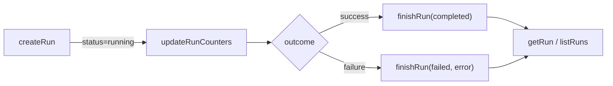

# Manager Tests

Test file: [`src/tests/manager.test.ts`](../../src/tests/manager.test.ts)
(395 lines)

Production module: [`src/mcp/state/manager.ts`](../../src/mcp/state/manager.ts)
(403 lines)

## What this file tests

The manager test file validates the CRUD layer built on top of the [SQLite
database](../mcp-server/state-management.md): run lifecycle management, task tracking, spec-run tracking, and
the in-memory live-run registry used for log notifications. It answers the
question: **do the manager functions correctly translate between the
application's domain objects and SQLite rows, and does the live-run registry
reliably deliver log messages to registered callbacks?**

## Why it matters

The manager is the single point of truth for run and task state. [MCP tool
handlers](../mcp-tools/overview.md) never touch the database directly -- they call manager functions
like `createRun`, `updateTaskStatus`, and `finishRun`. If these functions
silently drop data (e.g., failing to store an error message on a failed run),
the MCP client would show incorrect status. If the live-run registry leaks
callbacks after `unregisterLiveRun`, memory grows unbounded during long
server sessions.

## Test structure

The file contains 4 `describe` blocks with 23 tests total:

### Live-run registry (5 tests)

The live-run registry is an in-memory `Map<string, LiveRun>` that tracks
in-flight runs. It serves two purposes:

1. **Log delivery**: MCP tool handlers register callbacks via `addLogCallback`
   to receive real-time progress messages from the pipeline. These callbacks
   are invoked by `emitLog` and forwarded as MCP logging notifications.

2. **Lifecycle tracking**: `registerLiveRun` marks a run as active;
   `unregisterLiveRun` marks it as complete and clears callbacks.

Tests verify:

- **Message delivery**: `registerLiveRun` + `addLogCallback` + `emitLog`
  delivers messages to the callback in order.

- **Unregister clears callbacks**: After `unregisterLiveRun`, subsequent
  `emitLog` calls do not deliver messages. This prevents memory leaks and
  ensures callbacks are not invoked for completed runs.

- **Graceful no-ops**: `emitLog` and `addLogCallback` do nothing when the
  run is not registered (no throw, no side effects).

- **Log level propagation**: `emitLog` accepts an optional `level` parameter
  (`"info"`, `"warn"`, `"error"`). When omitted, it defaults to `"info"`.
  The test at [`manager.test.ts:161-174`](../../src/tests/manager.test.ts)
  verifies that the level is correctly passed to callbacks.

- **Callback error swallowing**: If a log callback throws, `emitLog` catches
  the error and continues. This prevents a buggy notification handler from
  crashing the pipeline. The error is logged at debug level (only when
  `DEBUG` env var is set) per
  [`manager.ts:71`](../../src/mcp/state/manager.ts).

### Run CRUD (9 tests)

Tests the full lifecycle of a dispatch run:



- **createRun**: Generates a UUID v4 run ID, inserts a row with
  `status = 'running'` and `started_at = Date.now()`, and registers the
  run as live. The test asserts the returned ID matches UUID format
  (`/^[0-9a-f-]{36}$/`).

- **getRun**: Returns `null` for unknown run IDs. For known IDs, returns a
  `RunRecord` with camelCase property names mapped from snake_case columns.
  The `issueIds` field is a JSON string (e.g., `'["42"]'`), not a parsed
  array.

- **updateRunCounters**: Updates `total`, `completed`, and `failed` columns.
  Read-back confirms the values match.

- **finishRun**: Sets `status`, `finished_at`, and optionally `error`. Also
  calls `unregisterLiveRun` to clear the live-run registry entry.

- **listRuns**: Returns runs ordered by `started_at DESC`. Respects the
  `limit` parameter.

- **listRunsByStatus**: Filters runs by status. The test creates two runs,
  finishes one as `"completed"`, and verifies that `listRunsByStatus("running")`
  returns only the still-running run.

### Task CRUD (6 tests)

Tests per-run task tracking:

- **createTask + getTasksForRun**: Round-trip test. A task is created with
  `taskId: "feat.md:5"`, `taskText: "Add feature"`, `file: "feat.md"`,
  `line: 5`. Read-back confirms all fields and default `status: "pending"`.

- **updateTaskStatus to running**: Sets `started_at` timestamp. The status
  update logic at [`manager.ts:333-337`](../../src/mcp/state/manager.ts)
  treats `"running"` as a start event, setting `started_at` and clearing
  any previous error.

- **updateTaskStatus to success**: Sets `finished_at` and optionally `branch`.
  Terminal statuses (`success`, `failed`, `skipped`) trigger `finished_at`.

- **updateTaskStatus to failed**: Sets `finished_at` and stores the error
  message.

- **Empty result for unknown run**: `getTasksForRun("no-such-run")` returns
  `[]`, not `null` or an error.

- **Invalid status throws**: The `assertTaskStatus` runtime validator at
  [`manager.ts:154-157`](../../src/mcp/state/manager.ts) throws
  `"Invalid TaskStatus"` if a row's status column contains a value not in
  `TASK_STATUSES`. The test inserts a row with `status = 'INVALID_STATUS'`
  directly via SQL and confirms `getTasksForRun` throws. This guards
  against database corruption or manual edits.

### Spec-run CRUD (7 tests)

Tests spec generation run tracking. The spec-run lifecycle mirrors the
dispatch run lifecycle but with different counters (`total`, `generated`,
`failed` instead of `total`, `completed`, `failed`):

- **createSpecRun**: Accepts `issues` as either a string or string array.
  Returns a UUID v4 run ID.

- **getSpecRun**: Returns `null` for unknown IDs. Returns a `SpecRunRecord`
  for known IDs.

- **finishSpecRun**: Updates status, counters, and optionally error message.
  The test at [`manager.test.ts:360-370`](../../src/tests/manager.test.ts)
  finishes a spec run as `"completed"` with `{ total: 1, generated: 1, failed: 0 }`
  and reads back all fields.

- **listSpecRuns**: Returns spec runs ordered by `started_at DESC`. Respects
  the `limit` parameter.

## Setup and teardown

The test file initially creates an in-memory SQLite database with the full
schema DDL, but then closes it (line 104) because the manager functions call
`getDb()` which reads the module-level singleton. Since there is no
`_setDbForTesting` export, the tests fall back to real on-disk databases via
the `openTestDb()` helper:

```
function openTestDb(): string {
  const dir = join(tmpdir(), `dispatch-mgr-test-${randomUUID()}`);
  mkdirSync(dir, { recursive: true });
  openDatabase(dir);
  return dir;
}
```

Each test calls `openTestDb()` at the start. `afterEach` calls
`closeDatabase()` + `resetDatabase()` to tear down the singleton.

The comment block at lines 77-104 documents the design tension between
wanting fast in-memory tests and needing to work with the module's singleton
pattern. The conclusion is that real on-disk databases are the simplest
reliable approach given the module's current API.

## Row-to-record mapping

The manager converts snake_case SQL column names to camelCase TypeScript
properties. This mapping is handled by `rowToRun`, `rowToTask`, and
`rowToSpecRun` functions, each of which also applies a runtime status
validator (`assertRunStatus`, `assertTaskStatus`, `assertSpecStatus`). The
validators check that the string value is a member of the corresponding
`*_STATUSES` tuple and throw if not. This pattern catches data corruption
that would otherwise propagate silently as an invalid status string.

## Related documentation

- [Tests: MCP Server & State](mcp-state-tests.md) -- overview of all four
  test files in this group
- [Database Tests](database-tests.md) -- the SQLite layer these CRUD
  operations are built on
- [MCP Tools Tests](mcp-tools-tests.md) -- tool handlers that call these
  manager functions
- [State Management](../mcp-server/state-management.md) -- production
  documentation for the state layer
- [Fork-Run IPC](../mcp-tools/fork-run-ipc.md) -- how IPC messages
  from forked workers trigger manager updates
