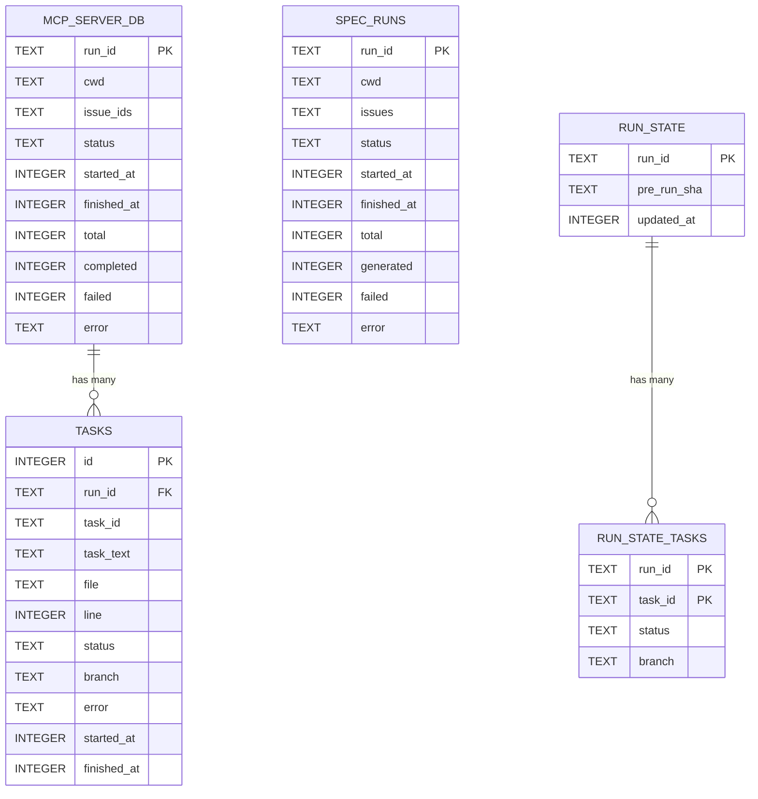
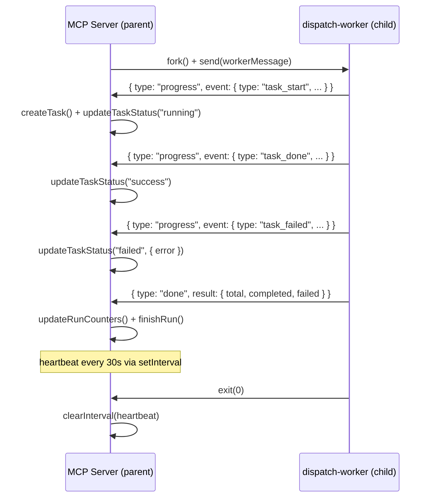

# Tests: MCP Server & State

This document is the overview for the four test files that validate the MCP
server's persistence layer, state management, tool handlers, and run-state
resume functionality. These tests form a vertical slice through the entire
MCP subsystem -- from raw SQLite schema creation up to the tool handlers
that MCP clients invoke.

## Why these tests exist

The MCP server is the primary interface through which external clients
(Copilot, Claude, etc.) drive dispatch operations. Every dispatch run, spec
generation, and recovery retry flows through the MCP tool layer into the
SQLite persistence layer. If the database schema is wrong, if CRUD operations
silently corrupt data, or if the IPC protocol between the parent MCP process
and forked worker drops messages, the entire system fails without visible
errors. These tests exist to catch those failures before they reach production.

## Architecture

The tests cover two distinct persistence domains and two execution layers:

**Domain 1 -- MCP server state** (`runs`, `tasks`, `spec_runs` tables):
Tracks the lifecycle of dispatch and spec runs initiated via MCP tools.
Managed by `src/mcp/state/database.ts` and `src/mcp/state/manager.ts`.

**Domain 2 -- Run-state persistence** (`run_state`, `run_state_tasks` tables):
Tracks per-task completion status so that interrupted runs can resume without
re-executing successful tasks. Managed by `src/helpers/run-state.ts`.

Both domains share the same SQLite database file (`{cwd}/.dispatch/dispatch.db`)
but use separate tables and are accessed through different APIs.

## Test files

| Test file | Production module | Tests | Focus |
|-----------|-------------------|-------|-------|
| [`database.test.ts`](database-tests.md) | [`src/mcp/state/database.ts`](../../src/mcp/state/database.ts) | 12 | Schema creation, singleton lifecycle, WAL mode, status constants |
| [`manager.test.ts`](manager-tests.md) | [`src/mcp/state/manager.ts`](../../src/mcp/state/manager.ts) | 23 | Run/task/spec CRUD, live-run registry, log callbacks |
| [`mcp-tools.test.ts`](mcp-tools-tests.md) | [`src/mcp/tools/*.ts`](../../src/mcp/tools/) | 42 | Tool registration, handler logic, fork IPC, path traversal |
| [`run-state.test.ts`](run-state-tests.md) | [`src/helpers/run-state.ts`](../../src/helpers/run-state.ts) | 12 | Load/save round-trip, JSON-to-SQLite migration, task skip logic |

**Total: ~89 tests, ~1,515 lines of test code.**

## Integrations tested

### better-sqlite3

The database layer uses [better-sqlite3](https://github.com/WiseLibs/better-sqlite3)
for synchronous SQLite access. Key characteristics tested:

- **WAL journal mode**: Set via `db.pragma("journal_mode = WAL")` in
  `openDatabase()` at [`src/mcp/state/database.ts:144`](../../src/mcp/state/database.ts).
  WAL (Write-Ahead Logging) allows concurrent readers and a single writer
  without blocking. The database tests verify that the WAL pragma is applied
  by confirming the database opens and operates correctly.

- **Synchronous writes**: All manager operations (`createRun`, `updateTaskStatus`,
  `finishRun`, etc.) use synchronous `db.prepare().run()` calls. This is
  intentional -- the module comment in `manager.ts` states this is "for
  simplicity and data integrity." The tests verify the synchronous contract
  by calling operations and immediately reading back results without awaiting.

- **Foreign keys**: Enabled via `db.pragma("foreign_keys = ON")`. The `tasks`
  table references `runs(run_id)` and `run_state_tasks` references
  `run_state(run_id)`. Tests verify foreign key constraints indirectly by
  confirming that task queries scoped to a run ID return only that run's tasks.

### @modelcontextprotocol/sdk

The MCP tools tests validate tool registration against a mock `McpServer`.
The mock captures `server.tool()` calls and stores the handler function,
allowing tests to invoke handlers directly without a real MCP transport.
This pattern avoids the need for JSON-RPC framing or SSE connections in
unit tests. See [`mcp-tools.test.ts:143-156`](../../src/tests/mcp-tools.test.ts)
for the mock implementation.

### Zod

Zod schemas serve two roles in the tested code:

1. **MCP tool parameter validation**: Each tool's input schema is defined
   with Zod (e.g., `z.string()`, `z.number().int().min(1).max(32)`) and
   passed to `server.tool()`. The MCP SDK uses these schemas to validate
   incoming tool calls before the handler executes.

2. **Run-state data validation**: `src/helpers/run-state.ts` defines
   `RunStateSchema` and `RunStateTaskStatusSchema` using Zod. The
   `loadRunState` function uses `safeParse` to validate both JSON file
   content during migration and SQLite row values at runtime. If a task
   status value doesn't match the enum, it falls back to `"pending"` --
   this defensive behavior is explicitly tested in
   [`run-state.test.ts:128-142`](../../src/tests/run-state.test.ts).

### Node.js child_process (fork)

The `forkDispatchRun` function in `src/mcp/tools/_fork-run.ts` uses
`child_process.fork()` to spawn a worker process that runs the dispatch or
spec pipeline. The IPC protocol between parent and child is message-based:

The `mcp-tools.test.ts` file mocks `forkDispatchRun` entirely, verifying
that tool handlers call it with the correct arguments. The actual IPC
message handling logic in `_fork-run.ts` is tested indirectly through the
mock's captured arguments and callback invocations.

### Vitest

All four test files use Vitest's `describe`/`it`/`expect` API. The
`mcp-tools.test.ts` and `run-state.test.ts` files make heavy use of
`vi.hoisted()` for mock declarations and `vi.mock()` for module-level mocking.
The `database.test.ts` and `manager.test.ts` files use real SQLite databases
(on-disk temp directories) rather than mocks.

## Testing patterns

### Real database vs. mock database

The four test files use two distinct approaches to database testing:

| Approach | Files | Trade-off |
|----------|-------|-----------|
| Real on-disk SQLite | `database.test.ts`, `manager.test.ts` | Validates actual SQL, schema, and pragmas; slower; requires temp directory cleanup |
| Mocked database object | `run-state.test.ts` | Fast; isolates run-state logic from SQLite; doesn't catch SQL syntax errors |
| Fully mocked (no DB) | `mcp-tools.test.ts` | Tests tool handler logic only; all state operations are mocked |

### Singleton management

The database module uses a module-level singleton (`_db`). Tests manage this
by calling `resetDatabase()` in `beforeEach` and `closeDatabase()` in
`afterEach`. This ensures test isolation -- each test starts with a null
singleton and creates a fresh database. The `manager.test.ts` file contains
an extensive comment block (lines 77-104) documenting the challenge of
injecting an in-memory database into the singleton and why the test
ultimately falls back to real on-disk databases.

### Mock McpServer pattern

The `mcp-tools.test.ts` file defines a `createMockServer()` factory that
captures tool registrations in a `Map<string, ToolHandler>`. Tests then:

1. Call `registerDispatchTools(server, cwd)` to register tools
2. Retrieve handlers via `server.getHandler("dispatch_run")`
3. Invoke handlers directly with argument objects
4. Assert on the returned `{ content, isError }` response

This avoids the overhead of setting up MCP transports, JSON-RPC framing,
or SSE connections.

## Cross-references

- [MCP Server Overview](../mcp-server/overview.md) -- architecture of the
  MCP server and its transport layer
- [State Management](../mcp-server/state-management.md) -- production
  documentation for the SQLite persistence layer
- [Dispatch Worker](../mcp-server/dispatch-worker.md) -- the child process
  entry point forked by `_fork-run.ts`
- [Fork-Run IPC](../mcp-tools/fork-run-ipc.md) -- detailed IPC protocol
  documentation
- [MCP Tools Overview](../mcp-tools/overview.md) -- all registered MCP tools
- [Dispatch Tools](../mcp-tools/dispatch-tools.md) -- `dispatch_run` and
  `dispatch_dry_run`
- [Spec Tools](../mcp-tools/spec-tools.md) -- `spec_generate`, `spec_list`,
  `spec_read`
- [Monitor Tools](../mcp-tools/monitor-tools.md) -- `status_get`, `runs_list`
- [Recovery Tools](../mcp-tools/recovery-tools.md) -- `run_retry`, `task_retry`
- [Config Tools](../mcp-tools/config-tools.md) -- `config_get`, `config_set`
- [Test Suite Overview](overview.md) -- project-wide testing patterns and
  coverage map
