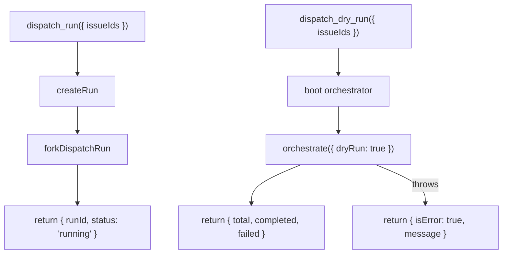
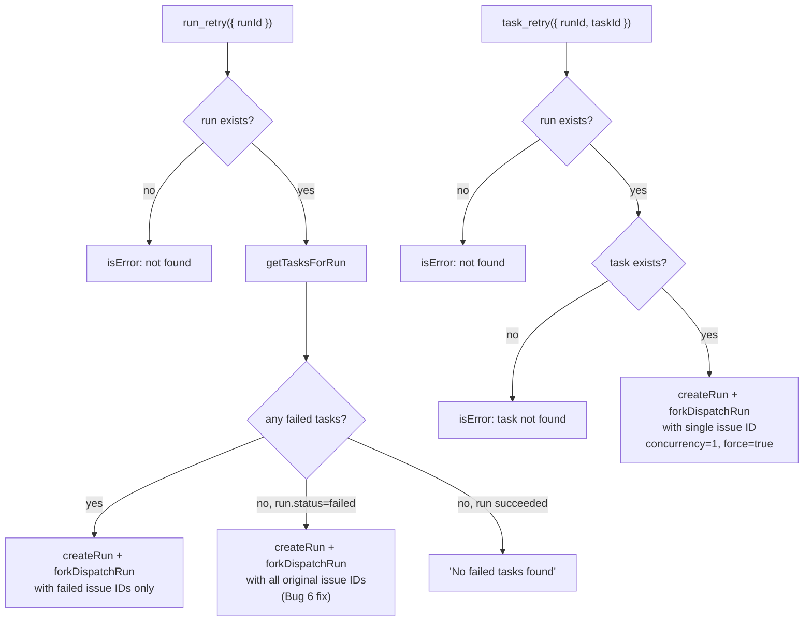

# MCP Tools Tests

Test file: [`src/tests/mcp-tools.test.ts`](../../src/tests/mcp-tools.test.ts)
(718 lines)

Production modules:
- [`src/mcp/tools/dispatch.ts`](../../src/mcp/tools/dispatch.ts)
- [`src/mcp/tools/spec.ts`](../../src/mcp/tools/spec.ts)
- [`src/mcp/tools/monitor.ts`](../../src/mcp/tools/monitor.ts)
- [`src/mcp/tools/recovery.ts`](../../src/mcp/tools/recovery.ts)
- [`src/mcp/tools/config.ts`](../../src/mcp/tools/config.ts)
- [`src/mcp/tools/_fork-run.ts`](../../src/mcp/tools/_fork-run.ts)

## What this file tests

The MCP tools test file validates the tool handler logic for all five tool
registration modules. It verifies that each tool is registered with the
correct name, description, and Zod schema, and that the handler function
returns the expected JSON response. All external dependencies (manager,
orchestrator, filesystem, fork) are mocked via `vi.mock()`.

## Why it matters

MCP tools are the external API of the dispatch system. An MCP client
(Copilot, Claude, etc.) invokes tools by name and receives structured JSON
responses. If a tool handler returns an incorrect shape, omits `isError` on
failure, or passes wrong arguments to `forkDispatchRun`, the client cannot
interpret the result or the underlying pipeline fails silently. These tests
ensure that the contract between the MCP client and the dispatch system is
correct.

## Test structure

The file contains 6 `describe` blocks with 42 tests total:

### registerDispatchTools (4 tests)

Tests the `dispatch_run` and `dispatch_dry_run` tools:



- **dispatch_run**: Creates a run via `createRun`, calls `forkDispatchRun`
  with the run ID and configuration, and returns `{ runId, status: "running" }`
  immediately. The test verifies the return value and the arguments passed
  to both `createRun` and `forkDispatchRun`.

- **dispatch_dry_run**: Boots the orchestrator and calls `orchestrate` with
  `dryRun: true`. Returns the orchestration result directly (no fork, no
  database write). On exception, returns `{ isError: true }` with the error
  message.

### registerSpecTools (14 tests)

Tests `spec_generate`, `spec_list`, `spec_read`, `spec_runs_list`, and
`spec_run_status`:

- **spec_generate**: Creates a spec run and forks a worker. Returns
  `{ runId, status: "running" }` immediately. The test verifies that
  `forkDispatchRun` receives an `onDone` callback. When invoked, the
  callback calls `finishSpecRun` with the result counters.

- **spec_list**: Reads `.dispatch/specs/` directory and returns `.md` files.
  Filters out non-markdown files. Returns `{ files: [], recentRuns: [] }`
  when the directory doesn't exist (ENOENT is silently handled). Reports
  non-ENOENT errors (e.g., `EACCES`) in the response `error` field.

- **spec_read**: Reads spec file content. Includes path traversal
  protection:

    ```
    const candidatePath = resolve(specsDir, args.file);
    if (!candidatePath.startsWith(specsDir + sep) && candidatePath !== specsDir) {
      return { content: [{ type: "text", text: "Access denied: ..." }], isError: true };
    }
    ```

    The test at [`mcp-tools.test.ts:332-338`](../../src/tests/mcp-tools.test.ts)
    confirms that `../../etc/passwd` is rejected with `"Access denied"`.
    ENOENT returns `"not found"`. Other errors return `"Error reading"`.

- **spec_runs_list / spec_run_status**: Thin wrappers around
  `listSpecRuns` and `getSpecRun`. Both return `isError: true` when the
  underlying manager function throws (e.g., `"DB not open"`).

### registerMonitorTools (9 tests)

Tests `status_get`, `runs_list`, `issues_list`, and `issues_fetch`:

- **status_get**: Returns `{ run, tasks }` for a known run ID. Returns
  `isError: true` for unknown IDs or database errors.

- **runs_list**: Calls `listRuns` without a status filter, or
  `listRunsByStatus` when a `status` argument is provided. The test
  verifies that the `status` and `limit` arguments are forwarded correctly.

- **issues_list**: Loads the datasource configuration and calls
  `datasource.list()`. Returns `isError: true` when no datasource is
  configured or when the datasource throws.

- **issues_fetch**: Calls `datasource.fetch()` for each issue ID. Returns
  `isError: true` when no datasource is configured.

### registerRecoveryTools (10 tests)

Tests `run_retry` and `task_retry`:



Key behaviors tested:

- **run_retry with failed tasks**: Extracts issue IDs from failed tasks'
  file paths using `parseIssueFilename`, creates a new run with only those
  IDs, and forks a worker with `force: true` to skip the skip-if-complete
  check.

- **run_retry with pre-task failure (Bug 6 fix)**: When a run failed before
  any tasks were created (e.g., config error, boot failure), `failedTasks`
  is empty but `originalRun.status === "failed"`. The handler re-dispatches
  using the original issue IDs instead of returning "No failed tasks found".
  This was a regression (Bug 6) where runs that failed during boot appeared
  un-retryable.

- **task_retry**: Extracts the single issue ID from the task's file field,
  creates a new run with `concurrency: 1` and `force: true`, and forks a
  worker. Returns the new run ID and the retried task ID.

### registerConfigTools (2 tests)

Tests `config_get`:

- **Registers tool**: Verifies `config_get` is registered with an empty
  schema (`{}`).

- **Strips internal fields**: `config_get` loads the config and strips
  `nextIssueId` from the response. This prevents exposing internal
  auto-increment state to MCP clients.

### forkDispatchRun IPC handler (1 test)

A single test verifies the integration point between `dispatch_run` and
`forkDispatchRun`: after calling the handler, both `mockForkDispatchRun`
and `mockCreateRun` should have been called exactly once.

## Mocking strategy

The test file uses 8 `vi.mock()` calls to replace all external dependencies:

| Mock target | Key mock functions |
|-------------|-------------------|
| `../mcp/state/manager.js` | All 15 manager exports (create, update, finish, list, get, emit, register) |
| `../orchestrator/runner.js` | `boot` returns mock orchestrator with `orchestrate` |
| `../orchestrator/spec-pipeline.js` | `runSpecPipeline` returns `{ total, generated, failed }` |
| `../config.js` | `loadConfig`, `saveConfig`, `validateConfigValue`, `CONFIG_KEYS` |
| `../datasources/index.js` | `getDatasource` returns mock with `list` and `fetch` |
| `node:fs/promises` | `readdir`, `readFile` |
| `../mcp/tools/_fork-run.js` | `forkDispatchRun` returns mock child process |
| `../orchestrator/datasource-helpers.js` | `parseIssueFilename` extracts issue ID from filename |

All mocks are declared with `vi.hoisted()` to ensure they are available
before module-level `vi.mock()` factory functions execute. The `beforeEach`
hook resets all mocks and re-configures default return values.

## Mock McpServer

The test uses a custom mock server rather than the real `McpServer` from
`@modelcontextprotocol/sdk`. The mock:

1. Provides a `tool` method that stores `(name, description, schema, handler)`
   in a `Map`
2. Provides a `getHandler(name)` method to retrieve the handler by name
3. Provides a `sendLoggingMessage` mock for notification testing

Tool handlers are invoked directly as async functions:

```typescript
const result = await server.getHandler("dispatch_run")({ issueIds: ["42"] });
const data = JSON.parse(result.content[0].text);
```

This pattern avoids the overhead of MCP protocol framing while still testing
the handler's input/output contract.

## Related documentation

- [Tests: MCP Server & State](mcp-state-tests.md) -- overview of all four
  test files in this group
- [Manager Tests](manager-tests.md) -- the CRUD functions these handlers
  call
- [Run-State Tests](run-state-tests.md) -- persistence layer for resume
- [MCP Tools Overview](../mcp-tools/overview.md) -- all registered tools
- [Dispatch Tools](../mcp-tools/dispatch-tools.md) -- `dispatch_run`,
  `dispatch_dry_run`
- [Spec Tools](../mcp-tools/spec-tools.md) -- `spec_generate`, `spec_list`,
  `spec_read`
- [Monitor Tools](../mcp-tools/monitor-tools.md) -- `status_get`, `runs_list`
- [Recovery Tools](../mcp-tools/recovery-tools.md) -- `run_retry`, `task_retry`
- [Config Tools](../mcp-tools/config-tools.md) -- `config_get`
- [Fork-Run IPC](../mcp-tools/fork-run-ipc.md) -- the IPC protocol mocked
  in these tests
- [Server Transports](../mcp-server/server-transports.md) -- MCP server
  transport layer that hosts the tools under test
- [Configuration](../cli-orchestration/configuration.md) -- config resolution
  used by `config_get` tool handler
