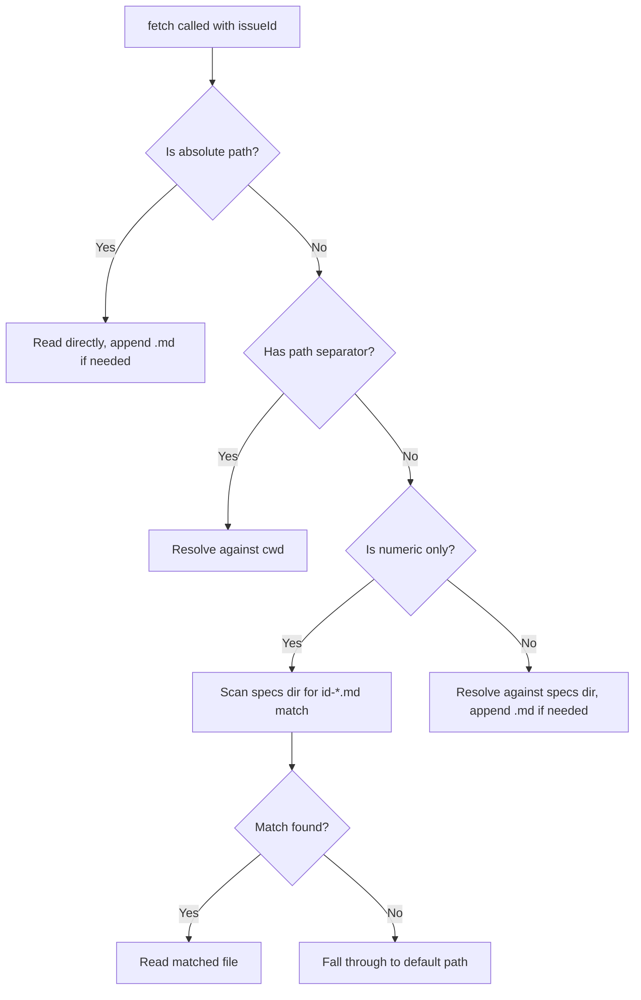

# Markdown Datasource Tests

Tests for the Markdown file datasource implementation (`src/datasources/md.ts`), covering local filesystem operations, glob pattern expansion, numeric ID resolution, path handling, title extraction, and the local-only git lifecycle.

**Test files:**
- `src/tests/md-datasource.test.ts` (634 lines, 9 describe blocks) -- unit tests with mocked filesystem
- `src/tests/datasource.test.ts` (680 lines, relevant sections) -- integration tests with real filesystem and `extractTitle` unit tests

## What is tested

The Markdown datasource reads and writes spec files from the local filesystem, using the `.dispatch/specs/` directory as the default location. Unlike the GitHub and Azure DevOps datasources, it does not communicate with any remote API for issue tracking. However, it still supports git operations for branching and committing (but not pushing or creating PRs).

## Filesystem operations

### list

Two modes of operation:

1. **Default directory mode:** Reads `.dispatch/specs/` via `readdir`, filters to `.md` files, sorts alphabetically, and returns `IssueDetails` for each file
2. **Glob pattern mode:** When `opts.pattern` is set, uses the `glob` package to expand the pattern relative to `opts.cwd`, filters results to `.md` files only

#### Glob integration

The `glob` package is invoked with `{ cwd: opts.cwd, absolute: true }` options. Tests verify:

- Relative patterns: `docs/**/*.md`
- Absolute patterns: `/home/user/docs/*.md`
- Parent-relative patterns: `../shared-specs/*.md`
- Array patterns: `["docs/*.md", "specs/*.md"]`
- Non-`.md` files in glob results are filtered out
- Empty glob results return empty array

See: `src/tests/md-datasource.test.ts:36-153`

#### Numeric ID extraction in list

When a file follows the `{id}-{slug}.md` naming convention (e.g., `1-feature-a.md`), the `number` field is set to the numeric ID (`"1"`) rather than the full filename. Files without a numeric prefix use the full filename as the `number`.

See: `src/tests/md-datasource.test.ts:91-106`

### fetch

Resolves the issue ID to a file path using a multi-strategy approach:

Key behaviors:
- Appends `.md` extension when missing (does not double-append)
- Absolute paths are read directly without prepending the specs directory
- Relative paths with `./` or `../` are resolved against `cwd`
- Subfolder relative paths (e.g., `subfolder/task.md`) are resolved against `cwd`
- Numeric-only IDs scan the specs directory for `{id}-*.md` pattern matches
- The `{id}-{slug}.md` pattern in the filename sets `number` to the numeric ID

See: `src/tests/md-datasource.test.ts:375-465`, `src/tests/datasource.test.ts:77-186`

### Title extraction

The `extractTitle` function (exported from `src/datasources/md.ts`) extracts a human-readable title from markdown content with the following priority:

1. **H1 heading** (`# Title`) -- preferred, even if not on the first line
2. **First meaningful content line** -- strips markdown prefixes (`##`, `###`, `>`, `-`, `*`)
3. **Filename fallback** -- strips `.md` extension when content is empty/whitespace-only

Truncation: titles exceeding 80 characters are truncated at the nearest word boundary. A single long word with no spaces is hard-truncated at 80 characters.

See: `src/tests/datasource.test.ts:297-425`

### update

Writes new body content to the resolved file path. Ignores the title parameter (the markdown file's title comes from its content). Supports the same path resolution strategies as fetch.

See: `src/tests/md-datasource.test.ts:467-522`, `src/tests/datasource.test.ts:190-219`

### close

Moves the spec file to an `archive/` subdirectory within the same parent directory. Creates the archive directory if it does not exist. Supports the same path resolution strategies as fetch/update.

See: `src/tests/md-datasource.test.ts:524-581`, `src/tests/datasource.test.ts:223-253`

### create

Creates a new spec file with an auto-incremented numeric ID:

1. Loads config from `.dispatch/` directory via `loadConfig`
2. Uses `nextIssueId` (defaults to 1 if not set)
3. Creates file as `{id}-{slugified-title}.md`
4. Saves config with incremented `nextIssueId`

See: `src/tests/md-datasource.test.ts:584-634`, `src/tests/datasource.test.ts:257-293`

## Username derivation

Similar to the remote datasources but with a different fallback:

1. Use `opts.username` if provided
2. Multi-word `git user.name`: first 2 chars + last name (e.g., "John Doe" -> "jodoe")
3. Single-word name: fall back to email local part (e.g., "john.doe@example.com" -> "johndoe")
4. All failures: return **"local"** (not "unknown" like the remote datasources)

The "local" fallback reflects that the MD datasource is designed for local-only workflows.

See: `src/tests/md-datasource.test.ts:155-201`

## Branch naming for file paths

The `buildBranchName` method handles both traditional numeric IDs and file paths as issue identifiers:

| Input `issueNumber` | Branch name |
|---------------------|-------------|
| `"42"` | `{user}/dispatch/issue-42` |
| `/home/user/.dispatch/specs/42-batch-updates.md` | `{user}/dispatch/issue-42` |
| `specs/7-add-logging.md` | `{user}/dispatch/issue-7` |
| `C:\\Users\\dev\\specs\\10-fix-bug.md` | `{user}/dispatch/issue-10` |
| `/home/user/.dispatch/specs/my-design-doc.md` | `{user}/dispatch/file-my-design-doc` |
| `my-issue.md` (plain, non-numeric) | `{user}/dispatch/issue-my-issue.md` |

For paths with the `{id}-{slug}.md` pattern, the numeric ID is extracted. For paths without a numeric prefix, the basename (without extension) is slugified and prefixed with `file-`.

See: `src/tests/md-datasource.test.ts:203-268`

## Git lifecycle

The MD datasource supports git operations but with key differences from the remote datasources:

| Operation | Behavior |
|-----------|----------|
| `supportsGit()` | Returns `true` |
| `createAndSwitchBranch` | `git checkout -b {branch}` |
| `switchBranch` | `git checkout {branch}` |
| `pushBranch` | **No-op** (local only) |
| `commitAllChanges` | `git add -A`, check diff, commit |
| `createPullRequest` | Returns empty string (no remote PR) |
| `getDefaultBranch` | Same symbolic-ref -> main -> master fallback |

See: `src/tests/md-datasource.test.ts:270-373`

## Config validation

The `datasource.test.ts` file also tests config validation for datasource names:

- Accepted values: `"md"`, `"github"`, `"azdevops"`
- Rejected values: `"jira"`, `"linear"`, `"bitbucket"`, `""`

And the datasource registry:

- `DATASOURCE_NAMES` contains exactly three entries
- `getDatasource` returns objects with the correct `name` and all required interface methods
- `getDatasource` throws for unknown names

See: `src/tests/datasource.test.ts:427-498`

## Related documentation

- [Datasource test suite overview](./datasource-tests.md)
- [Azure DevOps datasource tests](./azdevops-datasource-tests.md)
- [GitHub datasource tests](./github-datasource-tests.md)
- [Datasource helpers tests](./datasource-helpers-tests.md)
- [Datasource system architecture](../datasource-system/) — production modules
  these tests verify
- [Markdown Datasource](../datasource-system/markdown-datasource.md) —
  production implementation of the Markdown datasource
- [Datasource Testing](../datasource-system/testing.md) — test patterns
  and mock strategies for all datasource modules
