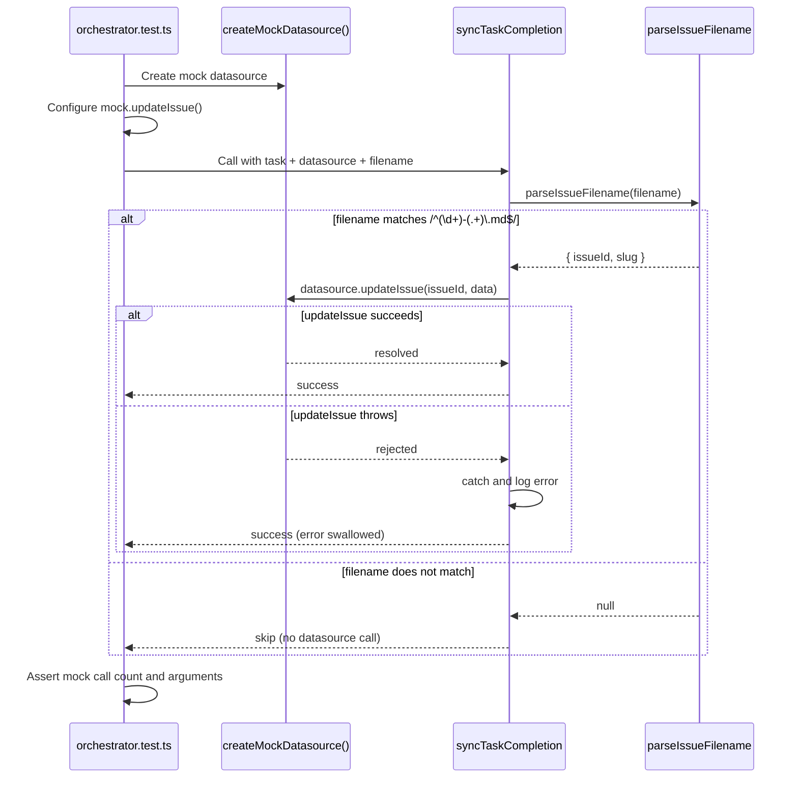

# Orchestrator Tests

This document describes the test suite in `src/tests/orchestrator.test.ts`,
which covers the orchestrator's `parseIssueFilename` helper and the
datasource synchronization logic triggered on task completion.

## What it tests

The test file contains two `describe` blocks:

| Block | Function under test | Test count | Category |
|-------|-------------------|------------|----------|
| `parseIssueFilename` | Re-exported from `datasource-helpers.js` | 3 | Pure logic |
| Datasource sync on task completion | `syncTaskCompletion` (orchestrator internals) | 5 | Mock-based |

### parseIssueFilename tests

The `parseIssueFilename` function is re-exported by the orchestrator runner
from `src/orchestrator/datasource-helpers.js`. It applies the regex pattern
`/^(\d+)-(.+)\.md$/` to extract issue metadata from markdown filenames.

| Test case | Input | Expected output |
|-----------|-------|-----------------|
| Valid filename | `"42-add-authentication.md"` | `{ issueId: "42", slug: "add-authentication" }` |
| Invalid filename (no number prefix) | `"notes.md"` | `null` |
| Invalid filename (no `.md` extension) | `"42-add-auth.txt"` | `null` |

### Datasource sync tests

These tests verify that when a task completes, the orchestrator correctly
synchronizes task status back to the datasource (e.g., updating the issue
in GitHub or Azure DevOps).

| Test case | What it verifies |
|-----------|-----------------|
| Correct update arguments | `datasource.updateIssue()` is called with the right issue ID, status, and completion data |
| Slug fallback for title | When the issue title is unavailable, the filename slug is used as a fallback title |
| Skip sync for non-matching filenames | Files that do not match the issue filename pattern are silently skipped (no datasource call) |
| Graceful error handling for update failures | When `datasource.updateIssue()` throws an `Error`, the failure is caught and logged without crashing the pipeline |
| Non-Error rejection handling | When `datasource.updateIssue()` rejects with a non-Error value (e.g., a string), the rejection is still handled gracefully |

An additional test verifies **full content passthrough**: the complete task
content (including markdown) is forwarded to the datasource update call
without truncation or transformation.

## Test pipeline

The following diagram shows the sequence of operations in a typical
datasource sync test:

## Local mock duplication

The test file defines its own `createMockDatasource()` function locally
rather than importing from `src/tests/fixtures.ts`. Both functions stub the
same `Datasource` interface with the same no-op defaults.

### Why this is a concern

- **Drift risk**: If the `Datasource` interface gains new methods, the local
  copy in `orchestrator.test.ts` may fall out of sync with the canonical
  factory in `fixtures.ts`.
- **Maintenance burden**: Bug fixes or default value changes must be applied
  in two places.

### Likely reason for duplication

The orchestrator test file may have been written before `fixtures.ts` was
created, or the author may not have been aware of the shared factory. The
duplication is a candidate for consolidation -- the local
`createMockDatasource()` could be replaced with an import from `fixtures.ts`.

## Relationship to the orchestrator module

The functions tested here live in the orchestrator subsystem:

| Function | Source location | Role |
|----------|----------------|------|
| `parseIssueFilename` | `src/orchestrator/datasource-helpers.ts` | Extracts issue ID and slug from filenames |
| `syncTaskCompletion` | `src/orchestrator/runner.ts` (or related) | Synchronizes completed tasks back to the datasource |

The orchestrator runner at `src/orchestrator/runner.ts` re-exports
`parseIssueFilename` from `datasource-helpers.js`. The filename pattern
(`/^(\d+)-(.+)\.md$/`) is shared between spec generation (which creates
files with this naming convention) and the dispatch pipeline (which reads
them).

## Coverage and gaps

### What is covered

- Filename parsing: valid, invalid (no number), invalid (wrong extension).
- Datasource update: correct arguments, slug fallback, skip logic, error
  handling (Error and non-Error rejections), content passthrough.

### What is not covered

- **Branch lifecycle**: The `--no-branch` flag and per-issue branch creation,
  push, and PR workflows are not tested. These involve git operations that
  would require more extensive mocking or integration test infrastructure.
- **Planner integration**: The planner agent's interaction with the
  orchestrator is not covered by this test file.
- **Concurrent dispatch**: The concurrency model (batching, `MAX_CONCURRENCY`
  cap) is not exercised.
- **Config resolution**: The `resolveCliConfig()` merge logic is tested
  indirectly by `config.test.ts`, not here.

## Related documentation

- [Testing Overview](overview.md) -- project-wide test suite and coverage map
- [Test Fixtures](test-fixtures.md) -- shared factory functions including the
  canonical `createMockDatasource()`
- [Type Declarations and Mocks](type-declarations-and-mocks.md) -- ambient
  declarations and the codex module mock
- [Orchestrator Pipeline](../cli-orchestration/orchestrator.md) -- the
  production orchestrator that these tests verify
- [Datasource Overview](../datasource-system/overview.md) -- the `Datasource`
  interface consumed by the sync logic
- [CLI Argument Parser](../cli-orchestration/cli.md) -- CLI flags that
  influence orchestrator behavior
