# Test Suite Overview

This document describes the testing infrastructure, strategy, and organization
for the dispatch project. It covers how tests are run, what framework is
used, and how the ten test files map to the production modules they verify.

## Test framework

The project uses [Vitest](https://vitest.dev/) **v4.0.18** as its test
framework. There is no `vitest.config.ts` or `vite.config.ts` file in the
project root -- Vitest uses its default configuration, which:

- Automatically discovers all `*.test.ts` files under the project root
- Uses the project's `tsconfig.json` for TypeScript compilation
- Runs tests in Node.js (not browser) mode
- Enables file-level parallelism by default

### Running tests

| Command | Script | Behavior |
|---------|--------|----------|
| `npm test` | `vitest run` | Single run, exits with status code |
| `npm run test:watch` | `vitest` | Watch mode, re-runs on file change |
| `npx vitest run src/tests/config.test.ts` | -- | Run a single test file |

### Debugging tests

To debug tests with breakpoints:

1. **VS Code JavaScript Debug Terminal:** Open a JavaScript Debug Terminal in
   VS Code and run `npm test` or `npx vitest run <file>`.
2. **Node.js inspector:** Run `npx vitest --inspect-brk --no-file-parallelism`
   and attach a debugger to the Node.js inspector port.
3. **VS Code launch configuration:** Add a launch config that runs Vitest with
   `--no-file-parallelism` and `--inspect-brk` flags.

### CI integration

Use `vitest run` (the `npm test` script) for CI pipelines. This runs tests
once without watch mode and exits with a non-zero code on failure. For CI
reporting, Vitest supports `--reporter` flags (e.g., `junit`, `json`) for
machine-readable output.

## Test files and coverage map

All test files live in `src/tests/` and follow the naming convention
`<module>.test.ts`. Each test file targets a single production module:

| Test file | Production module | Lines (test) | Lines (source) | Category |
|-----------|-------------------|-------------|----------------|----------|
| [`config.test.ts`](config-tests.md) | [`src/config.ts`](../../src/config.ts) | 405 | 231 | File I/O, validation, CLI |
| [`format.test.ts`](format-tests.md) | [`src/format.ts`](../../src/format.ts) | 34 | 19 | Pure logic |
| [`parser.test.ts`](parser-tests.md) | [`src/parser.ts`](../../src/parser.ts) | 995 | 171 | Pure logic + file I/O |
| [`spec-generator.test.ts`](spec-generator-tests.md) | [`src/spec-generator.ts`](../../src/spec-generator.ts) | 641 | 837 | Pure logic, validation |
| [`slugify.test.ts`](../shared-utilities/testing.md) | [`src/slugify.ts`](../../src/slugify.ts) | 113 | 31 | Pure logic |
| [`timeout.test.ts`](../shared-utilities/testing.md) | [`src/timeout.ts`](../../src/timeout.ts) | 190 | 79 | Async + fake timers |
| [`claude.test.ts`](provider-tests.md) | [`src/providers/claude.ts`](../../src/providers/claude.ts) | 186 | -- | SDK mock, async generator |
| [`copilot.test.ts`](provider-tests.md) | [`src/providers/copilot.ts`](../../src/providers/copilot.ts) | 264 | -- | SDK mock, event callbacks |
| [`opencode.test.ts`](provider-tests.md) | [`src/providers/opencode.ts`](../../src/providers/opencode.ts) | 480 | -- | SDK mock, SSE streaming |
| [`provider-index.test.ts`](provider-tests.md) | [`src/providers/index.ts`](../../src/providers/index.ts) | 197 | -- | Registry routing |

**Total: 3,505 lines of test code** covering production modules across config,
parsing, formatting, spec generation, utilities, and provider backends.

## Testing patterns

### Real filesystem I/O (no mocks)

Tests that involve file operations use real temporary directories created with
`mkdtemp()` from `node:fs/promises`. The project does **not** use filesystem
mocks or virtual filesystem libraries. Each test creates a unique directory
under the OS temp directory (e.g., `/tmp/dispatch-test-abc123`) and cleans it
up in an `afterEach` hook:

```
mkdtemp() → write test fixture → run function under test → assert → rm()
```

This pattern appears in:
- `config.test.ts` — `loadConfig`, `saveConfig` tests
- `parser.test.ts` — `parseTaskFile`, `markTaskComplete` tests

Cleanup runs even when assertions fail, since `afterEach` hooks execute
regardless of test outcome. The only scenario where cleanup is skipped is
process termination via `SIGKILL`, which leaves orphaned `/tmp/dispatch-test-*`
directories for the OS to purge.

### Process exit mocking

The `handleConfigCommand` tests in `config.test.ts` need to verify that
invalid operations cause `process.exit(1)`. Since actually exiting would
terminate the test runner, the tests use a Vitest spy that throws:

```
vi.spyOn(process, "exit").mockImplementation(() => { throw new Error("process.exit called"); })
```

Tests then use `expect(...).rejects.toThrow("process.exit called")` to
assert that the exit was triggered with the correct code.

### Pure function testing

Functions that perform no I/O (`parseTaskContent`, `buildTaskContext`,
`elapsed`, `isIssueNumbers`, `validateSpecStructure`, `extractSpecContent`)
are tested with in-memory inputs only. These tests are fast, deterministic,
and have no filesystem side effects.

## Test organization

```mermaid
graph TD
    subgraph "Test Suite"
        CT["config.test.ts<br/>8 describe blocks, 48 tests"]
        FT["format.test.ts<br/>1 describe block, 6 tests"]
        PT["parser.test.ts<br/>5 describe blocks, 62 tests"]
        ST["spec-generator.test.ts<br/>4 describe blocks, 48 tests"]
        SLT["slugify.test.ts<br/>24 tests"]
        TOT["timeout.test.ts<br/>~12 tests, fake timers"]
        CLT["claude.test.ts<br/>4 describe blocks, 12 tests"]
        CPT["copilot.test.ts<br/>4 describe blocks, 14 tests"]
        OCT["opencode.test.ts<br/>4 describe blocks, 19 tests"]
        PIT["provider-index.test.ts<br/>3 describe blocks, 14 tests"]
    end

    subgraph "Production Modules"
        C["config.ts<br/>Config I/O &amp; validation"]
        F["format.ts<br/>Duration formatting"]
        P["parser.ts<br/>Task parsing &amp; mutation"]
        S["spec-generator.ts<br/>Spec pipeline &amp; validation"]
        SL["slugify.ts<br/>String-to-identifier"]
        TO["timeout.ts<br/>Promise deadline"]
        CLP["providers/claude.ts<br/>Claude Agent SDK"]
        CPP["providers/copilot.ts<br/>Copilot SDK"]
        OCP["providers/opencode.ts<br/>OpenCode SDK"]
        PI["providers/index.ts<br/>Provider registry"]
    end

    CT --> C
    FT --> F
    PT --> P
    ST --> S
    SLT --> SL
    TOT --> TO
    CLT --> CLP
    CPT --> CPP
    OCT --> OCP
    PIT --> PI
```



## What is NOT tested

The following production modules do not have corresponding test files:

- `src/agents/orchestrator.ts` — pipeline controller (see [Orchestrator](../cli-orchestration/orchestrator.md))
- `src/planner.ts` — planner agent prompt construction (see [Planner](../planning-and-dispatch/planner.md))
- `src/dispatcher.ts` — executor agent dispatch (see [Dispatcher](../planning-and-dispatch/dispatcher.md))
- `src/git.ts` — conventional commit operations (see [Git Operations](../planning-and-dispatch/git.md))
- `src/tui.ts` — terminal dashboard (see [TUI](../cli-orchestration/tui.md))
- `src/logger.ts` — structured logging (see [Logger](../shared-types/logger.md))
- `src/issue-fetchers/github.ts` — GitHub issue fetcher (delegates to [GitHub datasource](../datasource-system/github-datasource.md)); see also [GitHub Fetcher](../issue-fetching/github-fetcher.md) and [Datasource Testing](../datasource-system/testing.md)
- `src/issue-fetchers/azdevops.ts` — Azure DevOps issue fetcher (delegates to [Azure DevOps datasource](../datasource-system/azdevops-datasource.md)); see also [Azure DevOps Fetcher](../issue-fetching/azdevops-fetcher.md) and [Datasource Testing](../datasource-system/testing.md)
- `src/cli.ts` — CLI argument parser (integration-level only)

These modules interact with external services (AI SDKs, git CLI, issue
tracker CLIs) and would require more extensive mocking or integration test
infrastructure.

### Fake timer testing

The `timeout.test.ts` file uses Vitest fake timers to control time
deterministically. This pattern is unique among the project's test files --
no other test file currently uses `vi.useFakeTimers()`. See the
[Shared Utilities testing guide](../shared-utilities/testing.md) for details
on the fake timer setup, the async advancement requirement, and the no-op
`.catch()` pattern.

## Related documentation

- [Configuration tests](config-tests.md) -- `config.test.ts` detailed breakdown
- [Format utility tests](format-tests.md) -- `format.test.ts` detailed breakdown
- [Parser tests](parser-tests.md) -- `parser.test.ts` detailed breakdown
- [Spec generator tests](spec-generator-tests.md) -- `spec-generator.test.ts` detailed breakdown
- [Provider tests](provider-tests.md) -- `claude.test.ts`, `copilot.test.ts`,
  `opencode.test.ts`, and `provider-index.test.ts` detailed breakdown
- [Shared Utilities testing](../shared-utilities/testing.md) -- `slugify.test.ts` and `timeout.test.ts`
  detailed breakdown, fake timer patterns
- [Parser testing guide](../task-parsing/testing-guide.md) -- parser-specific testing patterns
- [Datasource testing](../datasource-system/testing.md) -- datasource-specific
  test suite (markdown datasource, registry, and config validation)
- [Shared Interfaces & Utilities](../shared-types/overview.md) -- the shared
  types tested by config, format, and parser test files
- [Shared Utilities](../shared-utilities/overview.md) -- the slugify and
  timeout utilities tested by slugify.test.ts and timeout.test.ts
- [Spec Generation](../spec-generation/overview.md) -- the spec pipeline
  tested by `spec-generator.test.ts`
- [Provider System Overview](../provider-system/provider-overview.md) -- provider
  interface and registry
- [Adding a Provider](../provider-system/adding-a-provider.md) -- Guide for
  testing new provider implementations
- [Cleanup Registry](../shared-types/cleanup.md) -- Process-level cleanup
  (note: not unit tested)
- [CLI Argument Parser](../cli-orchestration/cli.md) -- CLI integration (note:
  covered indirectly by config tests)
- [Architecture overview](../architecture.md) -- system-wide context
- [Prerequisites & Safety Checks](../prereqs-and-safety/overview.md) --
  pre-flight validation (note: no dedicated unit tests)
- [Prerequisite Checker Details](../prereqs-and-safety/prereqs.md) --
  environment validation, semver comparison, and failure message format
- [Git Worktree Helpers](../git-and-worktree/overview.md) -- worktree
  isolation model (note: no dedicated unit tests)
