# Test Suite Overview

This document describes the testing infrastructure, strategy, and organization
for the dispatch project. It covers how tests are run, what framework is
used, and how the nineteen test files map to the production modules they verify.

## Test framework

The project uses [Vitest](https://vitest.dev/) **v4.0.18** as its test
framework. A `vitest.config.ts` file in the project root configures:

- A **resolve alias** that redirects `@openai/codex` imports to
  `src/__mocks__/@openai/codex.ts` during test runs (see
  [Type Declarations and Mocks](type-declarations-and-mocks.md))
- **Coverage** via the `v8` provider with an 80% line threshold, excluding
  `src/tests/**`, `**/interface.ts`, and `**/index.ts`
- Automatic discovery of all `*.test.ts` files under the project root
- Node.js (not browser) test environment
- File-level parallelism by default

### Running tests

| Command | Script | Behavior |
|---------|--------|----------|
| `npm test` | `vitest run` | Single run, exits with status code |
| `npm run test:watch` | `vitest` | Watch mode, re-runs on file change |
| `npm run test:coverage` | `vitest run --coverage` | Single run with v8 coverage report |
| `npx vitest run src/tests/config.test.ts` | -- | Run a single test file |

### Debugging tests

To debug tests with breakpoints:

1. **VS Code JavaScript Debug Terminal:** Open a JavaScript Debug Terminal in
   VS Code and run `npm test` or `npx vitest run <file>`.
2. **Node.js inspector:** Run `npx vitest --inspect-brk --no-file-parallelism`
   and attach a debugger to the Node.js inspector port.
3. **VS Code launch configuration:** Add a launch config that runs Vitest with
   `--no-file-parallelism` and `--inspect-brk` flags.

### CI integration

Use `vitest run` (the `npm test` script) for CI pipelines. This runs tests
once without watch mode and exits with a non-zero code on failure. For CI
reporting, Vitest supports `--reporter` flags (e.g., `junit`, `json`) for
machine-readable output.

## Test files and coverage map

All test files live in `src/tests/` and follow the naming convention
`<module>.test.ts`. Each test file targets a single production module:

| Test file | Production module | Lines (test) | Lines (source) | Category |
|-----------|-------------------|-------------|----------------|----------|
| [`config.test.ts`](config-tests.md) | [`src/config.ts`](../../src/config.ts) | 405 | 231 | File I/O, validation, CLI |
| [`commit-agent.test.ts`](../planning-and-dispatch/commit-agent.md#testing) | [`src/agents/commit.ts`](../../src/agents/commit.ts) | 42 | 296 | Mock-based, boot lifecycle |
| [`dispatcher.test.ts`](executor-and-dispatcher-tests.md) | [`src/dispatcher.ts`](../../src/dispatcher.ts) | 140 | 123 | Mock-based, prompt construction |
| [`executor.test.ts`](executor-and-dispatcher-tests.md) | [`src/agents/executor.ts`](../../src/agents/executor.ts) | 225 | 110 | Mock-based, lifecycle |
| [`format.test.ts`](format-tests.md) | [`src/helpers/format.ts`](../../src/helpers/format.ts) | 82 | 50 | Pure logic |
| [`parser.test.ts`](parser-tests.md) | [`src/parser.ts`](../../src/parser.ts) | 995 | 171 | Pure logic + file I/O |
| [`spec-generator.test.ts`](spec-generator-tests.md) | [`src/spec-generator.ts`](../../src/spec-generator.ts) | 641 | 837 | Pure logic, validation |
| [`slugify.test.ts`](../shared-utilities/testing.md) | [`src/slugify.ts`](../../src/slugify.ts) | 113 | 31 | Pure logic |
| [`timeout.test.ts`](../shared-utilities/testing.md) | [`src/timeout.ts`](../../src/timeout.ts) | 190 | 79 | Async + fake timers |
| [`tui.test.ts`](tui-tests.md) | [`src/tui.ts`](../../src/tui.ts) | 418 | 347 | Stdout spy + fake timers |
| [`orchestrator.test.ts`](orchestrator-tests.md) | [`src/orchestrator/runner.ts`](../../src/orchestrator/runner.ts) | ~80 | ~200 | Mock-based, integration |
| `datasource-helpers.test.ts` | [`src/orchestrator/datasource-helpers.ts`](../../src/orchestrator/datasource-helpers.ts) | 870 | 331 | Mock-based, pure logic |
| `dispatch-pipeline.test.ts` | [`src/orchestrator/dispatch-pipeline.ts`](../../src/orchestrator/dispatch-pipeline.ts) | 1483 | 662 | Mock-based, pipeline orchestration |
| `integration/dispatch-flow.test.ts` | Multiple pipeline modules | 289 | -- | Integration, end-to-end flow |
| [`confirm-large-batch.test.ts`](shared-helpers-tests.md) | [`src/helpers/confirm-large-batch.ts`](../../src/helpers/confirm-large-batch.ts) | 124 | 42 | Mock-based, async |
| [`logger.test.ts`](shared-helpers-tests.md) | [`src/helpers/logger.ts`](../../src/helpers/logger.ts) | 253 | 85 | Spy-based |
| [`prereqs.test.ts`](shared-helpers-tests.md) | [`src/helpers/prereqs.ts`](../../src/helpers/prereqs.ts) | 170 | 98 | Mock-based, async |
| [`run-state.test.ts`](shared-helpers-tests.md) | [`src/helpers/run-state.ts`](../../src/helpers/run-state.ts) | 185 | 46 | Mock-based |

**Total: ~6,625 lines of test code** covering ~3,888 lines of production code.

### Shared test fixtures

The `src/tests/fixtures.ts` module provides four factory functions
(`createMockProvider`, `createMockDatasource`, `createMockTask`,
`createMockIssueDetails`) that create pre-configured test doubles for core
domain interfaces. All factories accept an `overrides` parameter for
per-test customization. See [Test Fixtures](test-fixtures.md) for details.

## Testing patterns

### Real filesystem I/O (no mocks)

Tests that involve file operations use real temporary directories created with
`mkdtemp()` from `node:fs/promises`. The project does **not** use filesystem
mocks or virtual filesystem libraries. Each test creates a unique directory
under the OS temp directory (e.g., `/tmp/dispatch-test-abc123`) and cleans it
up in an `afterEach` hook:

```
mkdtemp() → write test fixture → run function under test → assert → rm()
```

This pattern appears in:
- `config.test.ts` — `loadConfig`, `saveConfig` tests
- `parser.test.ts` — `parseTaskFile`, `markTaskComplete` tests

Cleanup runs even when assertions fail, since `afterEach` hooks execute
regardless of test outcome. The only scenario where cleanup is skipped is
process termination via `SIGKILL`, which leaves orphaned `/tmp/dispatch-test-*`
directories for the OS to purge.

### Process exit mocking

The `handleConfigCommand` tests in `config.test.ts` need to verify that
invalid operations cause `process.exit(1)`. Since actually exiting would
terminate the test runner, the tests use a Vitest spy that throws:

```
vi.spyOn(process, "exit").mockImplementation(() => { throw new Error("process.exit called"); })
```

Tests then use `expect(...).rejects.toThrow("process.exit called")` to
assert that the exit was triggered with the correct code.

### Pure function testing

Functions that perform no I/O (`parseTaskContent`, `buildTaskContext`,
`elapsed`, `isIssueNumbers`, `validateSpecStructure`, `extractSpecContent`)
are tested with in-memory inputs only. These tests are fast, deterministic,
and have no filesystem side effects.

## Test organization

```mermaid
graph TD
    subgraph "Test Suite"
        CT["config.test.ts<br/>8 describe blocks, 48 tests"]
        CAT["commit-agent.test.ts<br/>2 describe blocks, 4 tests"]
        DT["dispatcher.test.ts<br/>1 describe block, 7 tests"]
        ET["executor.test.ts<br/>2 describe blocks, 9 tests"]
        FT["format.test.ts<br/>2 describe blocks, 12 tests"]
        PT["parser.test.ts<br/>5 describe blocks, 62 tests"]
        ST["spec-generator.test.ts<br/>4 describe blocks, 48 tests"]
        SLT["slugify.test.ts<br/>24 tests"]
        TOT["timeout.test.ts<br/>~12 tests, fake timers"]
        TT["tui.test.ts<br/>7 describe blocks, 27 tests"]
        OT["orchestrator.test.ts<br/>2 describe blocks, 8 tests"]
        DHT["datasource-helpers.test.ts<br/>9 describe blocks, 64 tests"]
        DPT["dispatch-pipeline.test.ts<br/>12 describe blocks, 55 tests"]
        DFT["integration/dispatch-flow.test.ts<br/>1 describe block, 3 tests"]
        CLBT["confirm-large-batch.test.ts<br/>3 describe blocks, 10 tests"]
        LGT["logger.test.ts<br/>8 describe blocks, 24 tests"]
        PRT["prereqs.test.ts<br/>1 describe block, 11 tests"]
        RST["run-state.test.ts<br/>4 describe blocks, 12 tests"]
    end

    subgraph "Production Modules"
        C["config.ts<br/>Config I/O &amp; validation"]
        CA["agents/commit.ts<br/>Commit agent"]
        D["dispatcher.ts<br/>Task dispatch &amp; prompts"]
        EX["agents/executor.ts<br/>Executor agent lifecycle"]
        F["helpers/format.ts<br/>Duration &amp; header formatting"]
        P["parser.ts<br/>Task parsing &amp; mutation"]
        S["spec-generator.ts<br/>Spec pipeline &amp; validation"]
        SL["helpers/slugify.ts<br/>String-to-identifier"]
        TO["helpers/timeout.ts<br/>Promise deadline"]
        TU["tui.ts<br/>Terminal dashboard"]
        OR["orchestrator/runner.ts<br/>Orchestrator pipeline"]
        DSH["orchestrator/datasource-helpers.ts<br/>Datasource helper functions"]
        DP["orchestrator/dispatch-pipeline.ts<br/>Dispatch pipeline"]
        MULTI["Multiple pipeline modules<br/>(integration)"]
        CLB["helpers/confirm-large-batch.ts<br/>Batch confirmation"]
        LG["helpers/logger.ts<br/>Structured logging"]
        PRQ["helpers/prereqs.ts<br/>Prerequisite checker"]
        RS["helpers/run-state.ts<br/>Run state persistence"]
    end

    CT --> C
    CAT --> CA
    DT --> D
    ET --> EX
    FT --> F
    PT --> P
    ST --> S
    SLT --> SL
    TOT --> TO
    TT --> TU
    OT --> OR
    DHT --> DSH
    DPT --> DP
    DFT --> MULTI
    CLBT --> CLB
    LGT --> LG
    PRT --> PRQ
    RST --> RS
```



## What is NOT tested

The following production modules do not have corresponding test files:

- `src/agents/orchestrator.ts` — pipeline controller; note that
  `orchestrator.test.ts` covers `parseIssueFilename` and datasource sync,
  `dispatch-pipeline.test.ts` covers the full dispatch pipeline with mocked
  providers and datasources, and `datasource-helpers.test.ts` covers all
  helper functions. However, the orchestrator's `runFromCli` entry point
  is not directly tested (see [Orchestrator](../cli-orchestration/orchestrator.md) and [Orchestrator Tests](orchestrator-tests.md)).
- `src/agents/commit.ts` — commit agent `generate()`, `buildCommitPrompt()`, and `parseCommitResponse()` are untested at unit level; only `boot()` and `cleanup()` are covered (see [Commit Agent](../planning-and-dispatch/commit-agent.md#testing))
- `src/planner.ts` — planner agent prompt construction (see [Planner](../planning-and-dispatch/planner.md))
- `src/git.ts` — conventional commit operations (see [Git Operations](../planning-and-dispatch/git.md))
- `src/providers/opencode.ts` — OpenCode backend (see [OpenCode Backend](../provider-system/opencode-backend.md))
- `src/providers/copilot.ts` — Copilot backend (see [Copilot Backend](../provider-system/copilot-backend.md))
- `src/issue-fetchers/github.ts` — GitHub issue fetcher (delegates to [GitHub datasource](../datasource-system/github-datasource.md)); see also [GitHub Fetcher](../issue-fetching/github-fetcher.md)
- `src/issue-fetchers/azdevops.ts` — Azure DevOps issue fetcher (delegates to [Azure DevOps datasource](../datasource-system/azdevops-datasource.md)); see also [Azure DevOps Fetcher](../issue-fetching/azdevops-fetcher.md)
- `src/cli.ts` — CLI argument parser (integration-level only)

These modules interact with external services (AI SDKs, git CLI, issue
tracker CLIs) and would require more extensive mocking or integration test
infrastructure.

### Fake timer testing

The `timeout.test.ts` and `tui.test.ts` files use Vitest fake timers to
control time deterministically. The `timeout.test.ts` uses fake timers to
test async deadline behavior, while `tui.test.ts` uses them to control the
80ms animation interval and make `Date.now()` deterministic. See the
[Shared Utilities testing guide](../shared-utilities/testing.md) for details
on the fake timer setup in `timeout.test.ts`, and
[TUI Tests](tui-tests.md) for the TUI-specific fake timer and stdout spy
patterns.

### Module-level mocking

The executor and dispatcher test files use `vi.mock()` with factory functions
to replace production dependencies with controllable fakes. This pattern is
used when the module under test depends on external services (AI providers,
filesystem I/O) that cannot be invoked in tests:

```
vi.mock("../dispatcher.js", () => ({ dispatchTask: vi.fn() }));
vi.mock("../parser.js", () => ({ markTaskComplete: vi.fn() }));
```

Vitest hoists `vi.mock()` calls to the top of the file, so they execute
before any imports. Tests configure mock return values per-test using
`vi.mocked(fn).mockResolvedValue()` and reset state with
`vi.resetAllMocks()` in `beforeEach`. See
[Executor & Dispatcher Tests](executor-and-dispatcher-tests.md) for details.

### The vi.hoisted() pattern

When a `vi.mock()` factory function needs to reference a mock variable, a
naive `const mockFn = vi.fn()` at the top of the file fails because
`vi.mock()` is hoisted above all declarations at compile time. The
`vi.hoisted()` API solves this by returning values that are available in
the hoisted scope:

```
const { mockFn } = vi.hoisted(() => ({ mockFn: vi.fn() }));
vi.mock("some-module", () => ({ exportedFn: mockFn }));
```

This pattern is used in three shared-helper test files
(`confirm-large-batch.test.ts`, `prereqs.test.ts`, `run-state.test.ts`)
to create mock references for `@inquirer/prompts`, `node:child_process`,
and `node:fs/promises`. See
[Shared Helpers Tests](shared-helpers-tests.md#the-vihoisted--vimock-pattern)
for a detailed explanation and usage table.

### Dispatch pipeline testing patterns

The `dispatch-pipeline.test.ts` and `datasource-helpers.test.ts` files
introduce additional patterns specific to testing the pipeline orchestration:

- **Full pipeline mocking**: `dispatch-pipeline.test.ts` mocks all provider
  agents (planner, executor, commit), the datasource layer, worktree helpers,
  TUI, and git operations. This creates a fully isolated test environment
  where each test controls exactly what succeeds or fails.
- **Shared test fixtures**: Both files use the factory functions from
  `src/tests/fixtures.ts` (`createMockProvider`, `createMockDatasource`,
  `createMockTask`, `createMockIssueDetails`) to build consistent test
  doubles. See [Test Fixtures](test-fixtures.md).
- **Multi-issue options helpers**: `dispatch-pipeline.test.ts` defines
  `multiIssueOpts()` and similar helpers that produce `OrchestrateRunOptions`
  objects pre-configured for worktree tests, serial tests, dry-run tests, etc.
- **Worktree behavior assertions**: Tests verify the worktree decision logic
  (`noWorktree`, `noBranch`, `tasksByFile.size`) by checking whether
  `createWorktree` was called, and validate per-worktree provider boot and
  cleanup sequences.
- **Integration flow tests**: `integration/dispatch-flow.test.ts` (3 tests)
  exercises the full pipeline with lightweight mocks, verifying end-to-end
  behavior including datasource discovery, task parsing, execution, and
  issue closing.

## Related documentation

- [Configuration tests](config-tests.md) -- `config.test.ts` detailed breakdown
- [Commit agent](../planning-and-dispatch/commit-agent.md#testing) --
  `commit-agent.test.ts` coverage details and test gaps
- [Executor & dispatcher tests](executor-and-dispatcher-tests.md) --
  `executor.test.ts` and `dispatcher.test.ts` detailed breakdown
- [Format utility tests](format-tests.md) -- `format.test.ts` detailed breakdown
- [TUI tests](tui-tests.md) -- `tui.test.ts` detailed breakdown
- [Parser tests](parser-tests.md) -- `parser.test.ts` detailed breakdown
- [Spec generator tests](spec-generator-tests.md) -- `spec-generator.test.ts` detailed breakdown
- [Orchestrator tests](orchestrator-tests.md) -- `orchestrator.test.ts`
  detailed breakdown (parseIssueFilename and datasource sync)
- [Test fixtures](test-fixtures.md) -- shared factory functions for test
  doubles (`createMockProvider`, `createMockDatasource`, etc.)
- [Type declarations and mocks](type-declarations-and-mocks.md) -- ambient
  type declarations (`globals.d.ts`, `codex.d.ts`) and the `@openai/codex`
  module mock
- [Shared Utilities testing](../shared-utilities/testing.md) -- `slugify.test.ts` and `timeout.test.ts`
  detailed breakdown, fake timer patterns
- [Shared Helpers Tests](shared-helpers-tests.md) -- `confirm-large-batch.test.ts`,
  `logger.test.ts`, `prereqs.test.ts`, `run-state.test.ts`, and `slugify.test.ts`
  testing patterns including `vi.hoisted()` usage
- [Parser testing guide](../task-parsing/testing-guide.md) -- parser-specific testing patterns
- [Datasource testing](../datasource-system/testing.md) -- datasource-specific
  test suite (markdown datasource, registry, and config validation)
- [Shared Interfaces & Utilities](../shared-types/overview.md) -- the shared
  types tested by config, format, and parser test files
- [Shared Utilities](../shared-utilities/overview.md) -- the slugify and
  timeout utilities tested by slugify.test.ts and timeout.test.ts
- [Spec Generation](../spec-generation/overview.md) -- the spec pipeline
  tested by `spec-generator.test.ts`
- [Provider System Overview](../provider-system/provider-overview.md) -- provider
  interface and registry (untested modules listed above)
- [Adding a Provider](../provider-system/adding-a-provider.md) -- Guide for
  testing new provider implementations
- [Cleanup Registry](../shared-types/cleanup.md) -- Process-level cleanup
  (note: not unit tested)
- [CLI Argument Parser](../cli-orchestration/cli.md) -- CLI integration (note:
  covered indirectly by config tests)
- [Architecture overview](../architecture.md) -- system-wide context
