# Test Suite Overview

This document describes the testing infrastructure, strategy, and organization
for the dispatch project. It covers how tests are run, what framework is
used, and how the ten test files map to the production modules they verify.

## Test framework

The project uses [Vitest](https://vitest.dev/) as its test framework,
configured via [`vitest.config.ts`](../../vitest.config.ts) in the project root. The configuration:

- Automatically discovers all `*.test.ts` files under the project root
- Uses the project's `tsconfig.json` for TypeScript compilation
- Runs tests in Node.js (not browser) mode
- Enables file-level parallelism by default
- Excludes `.worktrees/**` and `.dispatch/worktrees/**` from test discovery
- Sets up [resolve aliases](test-fixtures.md#resolve-alias-mechanism) for
  SDK packages with CJS/ESM incompatibilities
- Configures [coverage thresholds](test-fixtures.md#integration-vitest-coverage-configuration)
  (85% lines, 80% branches, 85% functions)

### Running tests

| Command | Script | Behavior |
|---------|--------|----------|
| `npm test` | `vitest run` | Single run, exits with status code |
| `npm run test:watch` | `vitest` | Watch mode, re-runs on file change |
| `npx vitest run src/tests/config.test.ts` | -- | Run a single test file |

### Debugging tests

To debug tests with breakpoints:

1. **VS Code JavaScript Debug Terminal:** Open a JavaScript Debug Terminal in
   VS Code and run `npm test` or `npx vitest run <file>`.
2. **Node.js inspector:** Run `npx vitest --inspect-brk --no-file-parallelism`
   and attach a debugger to the Node.js inspector port.
3. **VS Code launch configuration:** Add a launch config that runs Vitest with
   `--no-file-parallelism` and `--inspect-brk` flags.

### CI integration

Use `vitest run` (the `npm test` script) for CI pipelines. This runs tests
once without watch mode and exits with a non-zero code on failure. For CI
reporting, Vitest supports `--reporter` flags (e.g., `junit`, `json`) for
machine-readable output.

## Test files and coverage map

All test files live in `src/tests/` and follow the naming convention
`<module>.test.ts`. Each test file targets a single production module:

| Test file | Production module | Lines (test) | Lines (source) | Category |
|-----------|-------------------|-------------|----------------|----------|
| [`cli.test.ts`](../cli-orchestration/cli.md#test-coverage) | [`src/cli.ts`](../../src/cli.ts) | 723 | -- | CLI parsing, flag combinations |
| [`cli-config.test.ts`](config-tests.md#cli-configtestts) | [`src/orchestrator/cli-config.ts`](../../src/orchestrator/cli-config.ts) | 732 | -- | Config resolution, auto-detection |
| [`config.test.ts`](config-tests.md) | [`src/config.ts`](../../src/config.ts) | 495 | 231 | File I/O, validation, merge |
| [`config-prompts.test.ts`](config-tests.md#config-promptstestts) | [`src/config-prompts.ts`](../../src/config-prompts.ts) | 471 | -- | Interactive wizard flow |
| [`format.test.ts`](format-tests.md) | [`src/helpers/format.ts`](../../src/helpers/format.ts) | 34 | 19 | Pure logic |
| [`parser.test.ts`](parser-tests.md) | [`src/parser.ts`](../../src/parser.ts) | 995 | 171 | Pure logic + file I/O |
| [`spec-generator.test.ts`](spec-generator-tests.md) | [`src/spec-generator.ts`](../../src/spec-generator.ts) | 1,956 | 837 | Pure logic, validation, agent + pipeline integration |
| [`commit-agent.test.ts`](commit-agent-tests.md) | [`src/agents/commit.ts`](../../src/agents/commit.ts) | 363 | 307 | Agent mock, prompt construction |
| [`spec-agent.test.ts`](spec-agent-tests.md) | [`src/agents/spec.ts`](../../src/agents/spec.ts) | 926 | 571 | Agent mock, timebox, three-mode routing |
| [`slugify.test.ts`](../shared-utilities/testing.md) | [`src/helpers/slugify.ts`](../../src/helpers/slugify.ts) | 113 | 31 | Pure logic |
| [`timeout.test.ts`](../shared-utilities/testing.md) | [`src/helpers/timeout.ts`](../../src/helpers/timeout.ts) | 190 | 79 | Async + fake timers |
| [`claude.test.ts`](provider-tests.md) | [`src/providers/claude.ts`](../../src/providers/claude.ts) | 186 | -- | SDK mock, async generator |
| [`copilot.test.ts`](provider-tests.md) | [`src/providers/copilot.ts`](../../src/providers/copilot.ts) | 264 | -- | SDK mock, event callbacks |
| [`opencode.test.ts`](provider-tests.md) | [`src/providers/opencode.ts`](../../src/providers/opencode.ts) | 480 | -- | SDK mock, SSE streaming |
| [`provider-index.test.ts`](provider-tests.md) | [`src/providers/index.ts`](../../src/providers/index.ts) | 197 | -- | Registry routing |
| [`executor.test.ts`](planner-executor-tests.md) | [`src/agents/executor.ts`](../../src/agents/executor.ts) | 257 | 93 | Module mock, dispatch + mark-complete |
| [`planner.test.ts`](planner-executor-tests.md) | [`src/agents/planner.ts`](../../src/agents/planner.ts) | 326 | 174 | Provider mock, prompt construction |
| [`runner.test.ts`](runner-tests.md) | [`src/orchestrator/runner.ts`](../../src/orchestrator/runner.ts) | 354 | 250 | Boot, routing, mutual exclusion, specTimeout |
| [`respec-routing.test.ts`](runner-tests.md) | [`src/orchestrator/runner.ts`](../../src/orchestrator/runner.ts) | 377 | 250 | Respec discovery, identifier formatting |
| [`orchestrator.test.ts`](runner-tests.md) | [`src/orchestrator/runner.ts`](../../src/orchestrator/runner.ts) | 305 | 250 | Re-export, datasource sync |
| [`spec-pipeline.test.ts`](spec-pipeline-tests.md) | [`src/orchestrator/spec-pipeline.ts`](../../src/orchestrator/spec-pipeline.ts) | 1,356 | -- | Pipeline lifecycle, concurrency, retry, cleanup |
| [`dispatch-pipeline.test.ts`](dispatch-pipeline-tests.md) | [`src/orchestrator/dispatch-pipeline.ts`](../../src/orchestrator/dispatch-pipeline.ts) | 2,713 | 850 | Pipeline lifecycle, retry, worktree, feature branch, glob |
| [`integration/dispatch-flow.test.ts`](dispatch-pipeline-tests.md) | [`src/orchestrator/dispatch-pipeline.ts`](../../src/orchestrator/dispatch-pipeline.ts) | 290 | 850 | Integration: real md datasource + git |
| [`auth.test.ts`](auth-tests.md) | [`src/helpers/auth.ts`](../../src/helpers/auth.ts) | 509 | 205 | OAuth device flow, token caching, multi-provider |
| [`concurrency.test.ts`](concurrency-tests.md) | [`src/helpers/concurrency.ts`](../../src/helpers/concurrency.ts) | 321 | 97 | Sliding window, early termination |
| [`environment.test.ts`](environment-errors-prereqs-tests.md#environmenttestts) | [`src/helpers/environment.ts`](../../src/helpers/environment.ts) | 101 | 50 | CI detection, isCI/isTTY guards |
| [`errors.test.ts`](environment-errors-prereqs-tests.md#errorstestts) | [`src/helpers/errors.ts`](../../src/helpers/errors.ts) | 35 | 19 | Custom error class, instanceof chain |
| [`prereqs.test.ts`](environment-errors-prereqs-tests.md#prereqstestts) | [`src/helpers/prereqs.ts`](../../src/helpers/prereqs.ts) | 160 | 66 | Semver comparison, tool detection |
| [`worktree.test.ts`](worktree-tests.md) | [`src/helpers/worktree.ts`](../../src/helpers/worktree.ts) | 528 | 222 | Worktree lifecycle, retry, cleanup |
| [`cleanup.test.ts`](test-fixtures.md#cleanup-registry-tests) | [`src/helpers/cleanup.ts`](../../src/helpers/cleanup.ts) | 170 | 35 | Module mock, lifecycle, signal integration |
| [`database.test.ts`](database-tests.md) | [`src/mcp/state/database.ts`](../../src/mcp/state/database.ts) | 163 | 174 | Schema creation, singleton, WAL mode |
| [`manager.test.ts`](manager-tests.md) | [`src/mcp/state/manager.ts`](../../src/mcp/state/manager.ts) | 395 | 403 | Run/task/spec CRUD, live-run registry |
| [`mcp-tools.test.ts`](mcp-tools-tests.md) | [`src/mcp/tools/*.ts`](../../src/mcp/tools/) | 718 | -- | Tool handlers, fork IPC, path traversal |
| [`run-state.test.ts`](run-state-tests.md) | [`src/helpers/run-state.ts`](../../src/helpers/run-state.ts) | 239 | 173 | Load/save, JSON migration, skip logic |
| [`tui.test.ts`](tui-tests.md) | [`src/tui.ts`](../../src/tui.ts) | 875 | -- | Rendering, state machine, input, visual rows |

**Shared test infrastructure**: `src/tests/fixtures.ts` (134 lines) exports
reusable mock factories (`createMockProvider`, `createMockDatasource`,
`createMockTask`, `createMockIssueDetails`, `createMockChildProcess`,
`mockExecFile`) consumed by 7+ test files. Manual mock stubs under
`src/__mocks__/` replace SDK packages with CJS/ESM incompatibilities. See
[Test Fixtures & Mocks](test-fixtures.md).

**Total: ~13,500 lines of test code** covering production modules across CLI
parsing, config resolution, interactive wizard, config I/O, parsing,
formatting, spec generation, spec pipeline orchestration, agent testing,
utilities, provider backends, planning/execution agents, orchestrator routing,
dispatch pipeline, and the cleanup registry.

## Testing patterns

### Real filesystem I/O (no mocks)

Tests that involve file operations use real temporary directories created with
`mkdtemp()` from `node:fs/promises`. The project does **not** use filesystem
mocks or virtual filesystem libraries. Each test creates a unique directory
under the OS temp directory (e.g., `/tmp/dispatch-test-abc123`) and cleans it
up in an `afterEach` hook:

```
mkdtemp() → write test fixture → run function under test → assert → rm()
```

This pattern appears in:
- `config.test.ts` — `loadConfig`, `saveConfig` tests
- `parser.test.ts` — `parseTaskFile`, `markTaskComplete` tests

Cleanup runs even when assertions fail, since `afterEach` hooks execute
regardless of test outcome. The only scenario where cleanup is skipped is
process termination via `SIGKILL`, which leaves orphaned `/tmp/dispatch-test-*`
directories for the OS to purge.

### Process exit mocking

The `handleConfigCommand` tests in `config.test.ts` need to verify that
invalid operations cause `process.exit(1)`. Since actually exiting would
terminate the test runner, the tests use a Vitest spy that throws:

```
vi.spyOn(process, "exit").mockImplementation(() => { throw new Error("process.exit called"); })
```

Tests then use `expect(...).rejects.toThrow("process.exit called")` to
assert that the exit was triggered with the correct code.

### Pure function testing

Functions that perform no I/O (`parseTaskContent`, `buildTaskContext`,
`elapsed`, `isIssueNumbers`, `validateSpecStructure`, `extractSpecContent`)
are tested with in-memory inputs only. These tests are fast, deterministic,
and have no filesystem side effects.

## Test organization

```mermaid
graph TD
    subgraph "Test Suite"
        CLIT["cli.test.ts<br/>10 describe blocks, 68 tests"]
        CLICT["cli-config.test.ts<br/>7 describe blocks, 35 tests"]
        CT["config.test.ts<br/>5 describe blocks, 42 tests"]
        CPT["config-prompts.test.ts<br/>1 describe block, 22 tests"]
        FT["format.test.ts<br/>1 describe block, 6 tests"]
        PT["parser.test.ts<br/>5 describe blocks, 62 tests"]
        ST["spec-generator.test.ts<br/>11 describe blocks, 160 tests"]
        CAT["commit-agent.test.ts<br/>4 describe blocks, 26 tests"]
        SAT["spec-agent.test.ts<br/>6 describe blocks, ~55 tests"]
        SPT["spec-pipeline.test.ts<br/>13 describe blocks, 48 tests"]
        SLT["slugify.test.ts<br/>24 tests"]
        TOT["timeout.test.ts<br/>~12 tests, fake timers"]
        CLT["claude.test.ts<br/>4 describe blocks, 12 tests"]
        COPT["copilot.test.ts<br/>4 describe blocks, 14 tests"]
        OCT["opencode.test.ts<br/>4 describe blocks, 19 tests"]
        PIT["provider-index.test.ts<br/>3 describe blocks, 14 tests"]
        EXT["executor.test.ts<br/>2 describe blocks, 10 tests"]
        PLT["planner.test.ts<br/>3 describe blocks, 20 tests"]
        CUT["cleanup.test.ts<br/>4 describe blocks, 10 tests"]
        TUT["tui.test.ts<br/>11 describe blocks, 46 tests"]
        AUT["auth.test.ts<br/>3 describe blocks, 18 tests"]
        CONT["concurrency.test.ts<br/>3 describe blocks, 16 tests"]
        ENVT["environment.test.ts<br/>2 describe blocks, 6 tests"]
        ERRT["errors.test.ts<br/>1 describe block, 5 tests"]
        PRQT["prereqs.test.ts<br/>2 describe blocks, 10 tests"]
        WTT["worktree.test.ts<br/>5 describe blocks, 30 tests"]
    end

    subgraph "Production Modules"
        CLI["cli.ts<br/>CLI parsing &amp; flags"]
        CLICONF["orchestrator/cli-config.ts<br/>Config resolution"]
        C["config.ts<br/>Config I/O &amp; validation"]
        CP["config-prompts.ts<br/>Interactive wizard"]
        F["format.ts<br/>Duration formatting"]
        P["parser.ts<br/>Task parsing &amp; mutation"]
        S["spec-generator.ts<br/>Spec pipeline &amp; validation"]
        SPC["orchestrator/spec-pipeline.ts<br/>Spec pipeline orchestration"]
        SL["slugify.ts<br/>String-to-identifier"]
        TO["timeout.ts<br/>Promise deadline"]
        CLP["providers/claude.ts<br/>Claude Agent SDK"]
        CPP["providers/copilot.ts<br/>Copilot SDK"]
        OCP["providers/opencode.ts<br/>OpenCode SDK"]
        PI["providers/index.ts<br/>Provider registry"]
        EX["agents/executor.ts<br/>Task execution"]
        PLA["agents/planner.ts<br/>Task planning"]
        COM["agents/commit.ts<br/>Commit agent"]
        SPA["agents/spec.ts<br/>Spec agent"]
        CU["helpers/cleanup.ts<br/>Cleanup registry"]
        TU["tui.ts<br/>Terminal UI"]
        AU["helpers/auth.ts<br/>OAuth &amp; token cache"]
        CON["helpers/concurrency.ts<br/>Sliding window"]
        ENV["helpers/environment.ts<br/>CI detection"]
        ERR["helpers/errors.ts<br/>Custom errors"]
        PRQ["helpers/prereqs.ts<br/>Tool validation"]
        WT["helpers/worktree.ts<br/>Worktree lifecycle"]
    end

    subgraph "Shared Test Infrastructure"
        FIX["fixtures.ts<br/>6 mock factories"]
    end

    CLIT --> CLI
    CLICT --> CLICONF
    CT --> C
    CPT --> CP
    FT --> F
    PT --> P
    ST --> S
    SPT --> SPC
    SLT --> SL
    TOT --> TO
    CLT --> CLP
    COPT --> CPP
    OCT --> OCP
    PIT --> PI
    EXT --> EX
    PLT --> PLA
    CAT --> COM
    SAT --> SPA
    CUT --> CU
    TUT --> TU
    AUT --> AU
    CONT --> CON
    ENVT --> ENV
    ERRT --> ERR
    PRQT --> PRQ
    WTT --> WT
    FIX -.->|consumed by| EXT
    FIX -.->|consumed by| PLT
    FIX -.->|consumed by| PIT
    FIX -.->|consumed by| SPT
    FIX -.->|consumed by| SAT
    FIX -.->|consumed by| ST
```



## What is NOT tested

The following production modules do not have corresponding test files:

- `src/dispatcher.ts` — task dispatch prompt construction (see [Dispatcher](../planning-and-dispatch/dispatcher.md))
- `src/git.ts` — conventional commit operations (see [Git Operations](../planning-and-dispatch/git.md))
- `src/helpers/logger.ts` — structured logging (see [Logger](../shared-types/logger.md))
- `src/issue-fetchers/github.ts` — GitHub issue fetcher (delegates to [GitHub datasource](../datasource-system/github-datasource.md)); see also [GitHub Fetcher](../issue-fetching/github-fetcher.md) and [Datasource Testing](../datasource-system/testing.md)
- `src/issue-fetchers/azdevops.ts` — Azure DevOps issue fetcher (delegates to [Azure DevOps datasource](../datasource-system/azdevops-datasource.md)); see also [Azure DevOps Fetcher](../issue-fetching/azdevops-fetcher.md) and [Datasource Testing](../datasource-system/testing.md)

These modules interact with external services (AI SDKs, [git CLI](../git-and-worktree/overview.md), issue
tracker CLIs) and would require more extensive mocking or integration test
infrastructure.

### Fake timer testing

The `timeout.test.ts` file uses Vitest fake timers to control time
deterministically. Several other test files also use `vi.useFakeTimers()`:

- `tui.test.ts` — uses fake timers for the 80ms spinner animation interval
  and fixed `Date.now()` for elapsed time calculations
- `spec-pipeline.test.ts` — uses fake timers for spec generation timeout
  tests and sliding-window concurrency verification
- `dispatch-pipeline.test.ts` — uses fake timers in the glob expansion and
  auth prompt handler cleanup test suites, where planning timeouts require
  timer advancement

See the [Shared Utilities testing guide](../shared-utilities/testing.md) for
details on the fake timer setup, the async advancement requirement, and the
no-op `.catch()` pattern.

## Related documentation

- [Configuration tests](config-tests.md) -- `config.test.ts`, `cli-config.test.ts`,
  and `config-prompts.test.ts` detailed breakdown
- [CLI tests](../cli-orchestration/cli.md#test-coverage) -- `cli.test.ts`
  detailed breakdown (68 tests covering parsing, flags, errors, help text)
- [Format utility tests](format-tests.md) -- `format.test.ts` detailed breakdown
- [Parser tests](parser-tests.md) -- `parser.test.ts` detailed breakdown
- [Spec generator tests](spec-generator-tests.md) -- `spec-generator.test.ts` detailed breakdown
- [Commit agent tests](commit-agent-tests.md) -- `commit-agent.test.ts`
  detailed breakdown (26 tests covering boot, generate, parse, prompt)
- [Spec agent tests](spec-agent-tests.md) -- `spec-agent.test.ts`
  detailed breakdown (~55 tests covering three-mode routing, timebox, path security)
- [Spec pipeline tests](spec-pipeline-tests.md) -- `spec-pipeline.test.ts`
  detailed breakdown (48 tests covering pipeline lifecycle, concurrency,
  retry, cleanup, and timeout)
- [Provider tests](provider-tests.md) -- `claude.test.ts`, `copilot.test.ts`,
  `opencode.test.ts`, and `provider-index.test.ts` detailed breakdown
- [Planner & executor tests](planner-executor-tests.md) -- `executor.test.ts`
  and `planner.test.ts` detailed breakdown
- [Runner tests](runner-tests.md) -- `runner.test.ts`,
  `respec-routing.test.ts`, and `orchestrator.test.ts` detailed breakdown
- [Shared Utilities testing](../shared-utilities/testing.md) -- `slugify.test.ts` and `timeout.test.ts`
  detailed breakdown, fake timer patterns
- [Test Fixtures & Mocks](test-fixtures.md) -- `fixtures.ts` mock
  factories, manual mock stubs, and `cleanup.test.ts` detailed breakdown
- [TUI tests](tui-tests.md) -- `tui.test.ts` detailed breakdown (46 tests
  covering rendering, state machine, recovery input, and worktree grouping)
- [Helpers & utilities tests](helpers-utilities-tests.md) -- group overview
  for auth, concurrency, environment, errors, prereqs, and worktree tests
  (85 tests across 6 helper modules)
- [Auth tests](auth-tests.md) -- `auth.test.ts` detailed breakdown (18 tests
  covering OAuth device flow, token caching, multi-provider prompt routing)
- [Concurrency tests](concurrency-tests.md) -- `concurrency.test.ts` detailed
  breakdown (16 tests covering sliding-window concurrency, early termination)
- [Environment, errors, and prereqs tests](environment-errors-prereqs-tests.md)
  -- `environment.test.ts`, `errors.test.ts`, and `prereqs.test.ts` detailed
  breakdown (21 tests covering CI detection, custom errors, semver comparison)
- [Worktree tests](worktree-tests.md) -- `worktree.test.ts` detailed breakdown
  (30 tests covering worktree lifecycle, retry with exponential backoff, cleanup)
- [MCP Server & State tests](mcp-state-tests.md) -- `database.test.ts`,
  `manager.test.ts`, `mcp-tools.test.ts`, and `run-state.test.ts` overview
  (89 tests covering SQLite persistence, CRUD, tool handlers, and run-state resume)
- [Database tests](database-tests.md) -- `database.test.ts` detailed
  breakdown (schema creation, singleton lifecycle, WAL mode)
- [Manager tests](manager-tests.md) -- `manager.test.ts` detailed breakdown
  (run/task/spec CRUD, live-run registry, log callbacks)
- [MCP tools tests](mcp-tools-tests.md) -- `mcp-tools.test.ts` detailed
  breakdown (42 tests covering tool registration, fork IPC, path traversal)
- [Run-state tests](run-state-tests.md) -- `run-state.test.ts` detailed
  breakdown (load/save, JSON-to-SQLite migration, skip logic)
- [Parser testing guide](../task-parsing/testing-guide.md) -- parser-specific testing patterns
- [Datasource testing](../datasource-system/testing.md) -- datasource-specific
  test suite (markdown datasource, registry, and config validation)
- [Shared Interfaces & Utilities](../shared-types/overview.md) -- the shared
  types tested by config, format, and parser test files
- [Shared Utilities](../shared-utilities/overview.md) -- the slugify and
  timeout utilities tested by slugify.test.ts and timeout.test.ts
- [Spec Generation](../spec-generation/overview.md) -- the spec pipeline
  tested by `spec-generator.test.ts`
- [Provider System Overview](../provider-system/overview.md) -- provider
  interface and registry
- [Adding a Provider](../provider-system/adding-a-provider.md) -- Guide for
  testing new provider implementations
- [Cleanup Registry](../shared-types/cleanup.md) -- Process-level cleanup
  (tested by `cleanup.test.ts`; see [test fixtures](test-fixtures.md#cleanup-registry-tests))
- [CLI Argument Parser](../cli-orchestration/cli.md) -- CLI parsing, flag
  definitions, and 68 unit tests
- [Architecture overview](../architecture.md) -- system-wide context
- [Prerequisites & Safety Checks](../prereqs-and-safety/overview.md) --
  pre-flight validation (tested by [`prereqs.test.ts`](environment-errors-prereqs-tests.md#prereqstestts))
- [Prerequisite Checker Details](../prereqs-and-safety/prereqs.md) --
  environment validation, semver comparison, and failure message format
- [Git Worktree Helpers](../git-and-worktree/overview.md) -- worktree
  isolation model (tested by [`worktree.test.ts`](worktree-tests.md))
- [Git Worktree Testing](../git-and-worktree/testing.md) -- 74 unit tests
  across branch-validation, gitignore, and worktree modules
- [Dispatch Pipeline Tests](dispatch-pipeline-tests.md) --
  `dispatch-pipeline.test.ts` and integration test detailed breakdown
