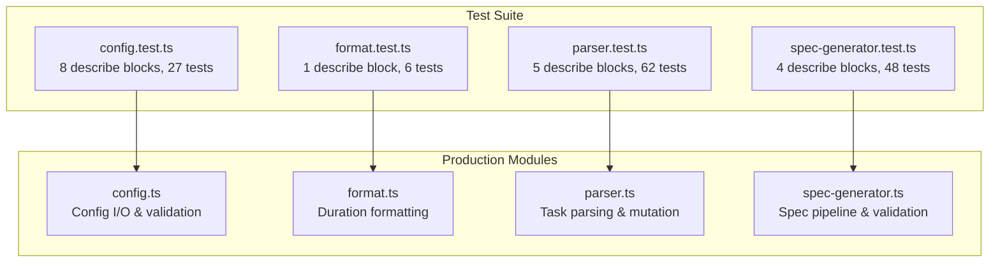

# Test Suite Overview

This document describes the testing infrastructure, strategy, and organization
for the dispatch-tasks project. It covers how tests are run, what framework is
used, and how the four test files map to the production modules they verify.

## Test framework

The project uses [Vitest](https://vitest.dev/) **v4.0.18** as its test
framework. There is no `vitest.config.ts` or `vite.config.ts` file in the
project root -- Vitest uses its default configuration, which:

- Automatically discovers all `*.test.ts` files under the project root
- Uses the project's `tsconfig.json` for TypeScript compilation
- Runs tests in Node.js (not browser) mode
- Enables file-level parallelism by default

### Running tests

| Command | Script | Behavior |
|---------|--------|----------|
| `npm test` | `vitest run` | Single run, exits with status code |
| `npm run test:watch` | `vitest` | Watch mode, re-runs on file change |
| `npx vitest run src/tests/config.test.ts` | -- | Run a single test file |

### Debugging tests

To debug tests with breakpoints:

1. **VS Code JavaScript Debug Terminal:** Open a JavaScript Debug Terminal in
   VS Code and run `npm test` or `npx vitest run <file>`.
2. **Node.js inspector:** Run `npx vitest --inspect-brk --no-file-parallelism`
   and attach a debugger to the Node.js inspector port.
3. **VS Code launch configuration:** Add a launch config that runs Vitest with
   `--no-file-parallelism` and `--inspect-brk` flags.

### CI integration

Use `vitest run` (the `npm test` script) for CI pipelines. This runs tests
once without watch mode and exits with a non-zero code on failure. For CI
reporting, Vitest supports `--reporter` flags (e.g., `junit`, `json`) for
machine-readable output.

## Test files and coverage map

All test files live in `src/tests/` and follow the naming convention
`<module>.test.ts`. Each test file targets a single production module:

| Test file | Production module | Lines (test) | Lines (source) | Category |
|-----------|-------------------|-------------|----------------|----------|
| [`config.test.ts`](config-tests.md) | [`src/config.ts`](../../src/config.ts) | 405 | 231 | File I/O, validation, CLI |
| [`format.test.ts`](format-tests.md) | [`src/format.ts`](../../src/format.ts) | 34 | 19 | Pure logic |
| [`parser.test.ts`](parser-tests.md) | [`src/parser.ts`](../../src/parser.ts) | 995 | 171 | Pure logic + file I/O |
| [`spec-generator.test.ts`](spec-generator-tests.md) | [`src/spec-generator.ts`](../../src/spec-generator.ts) | 641 | 837 | Pure logic, validation |

**Total: 2,075 lines of test code** covering 1,258 lines of production code.

## Testing patterns

### Real filesystem I/O (no mocks)

Tests that involve file operations use real temporary directories created with
`mkdtemp()` from `node:fs/promises`. The project does **not** use filesystem
mocks or virtual filesystem libraries. Each test creates a unique directory
under the OS temp directory (e.g., `/tmp/dispatch-test-abc123`) and cleans it
up in an `afterEach` hook:

```
mkdtemp() → write test fixture → run function under test → assert → rm()
```

This pattern appears in:
- `config.test.ts` — `loadConfig`, `saveConfig` tests
- `parser.test.ts` — `parseTaskFile`, `markTaskComplete` tests

Cleanup runs even when assertions fail, since `afterEach` hooks execute
regardless of test outcome. The only scenario where cleanup is skipped is
process termination via `SIGKILL`, which leaves orphaned `/tmp/dispatch-test-*`
directories for the OS to purge.

### Process exit mocking

The `handleConfigCommand` tests in `config.test.ts` need to verify that
invalid operations cause `process.exit(1)`. Since actually exiting would
terminate the test runner, the tests use a Vitest spy that throws:

```
vi.spyOn(process, "exit").mockImplementation(() => { throw new Error("process.exit called"); })
```

Tests then use `expect(...).rejects.toThrow("process.exit called")` to
assert that the exit was triggered with the correct code.

### Pure function testing

Functions that perform no I/O (`parseTaskContent`, `buildTaskContext`,
`elapsed`, `isIssueNumbers`, `validateSpecStructure`, `extractSpecContent`)
are tested with in-memory inputs only. These tests are fast, deterministic,
and have no filesystem side effects.

## Test organization



## What is NOT tested

The following production modules do not have corresponding test files:

- `src/agents/orchestrator.ts` — pipeline controller
- `src/planner.ts` — planner agent prompt construction
- `src/dispatcher.ts` — executor agent dispatch
- `src/git.ts` — conventional commit operations
- `src/tui.ts` — terminal dashboard
- `src/logger.ts` — structured logging
- `src/providers/opencode.ts` — OpenCode backend
- `src/providers/copilot.ts` — Copilot backend
- `src/issue-fetchers/github.ts` — GitHub issue fetcher
- `src/issue-fetchers/azdevops.ts` — Azure DevOps issue fetcher
- `src/cli.ts` — CLI argument parser (integration-level only)

These modules interact with external services (AI SDKs, git CLI, issue
tracker CLIs) and would require more extensive mocking or integration test
infrastructure.

## Related documentation

- [Configuration tests](config-tests.md) — `config.test.ts` detailed breakdown
- [Format utility tests](format-tests.md) — `format.test.ts` detailed breakdown
- [Parser tests](parser-tests.md) — `parser.test.ts` detailed breakdown
- [Spec generator tests](spec-generator-tests.md) — `spec-generator.test.ts` detailed breakdown
- [Parser testing guide](../task-parsing/testing-guide.md) — parser-specific testing patterns
- [Architecture overview](../architecture.md) — system-wide context
