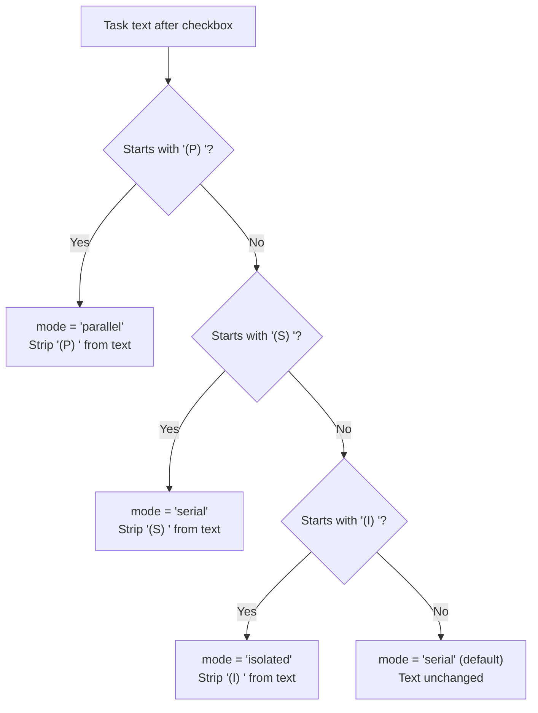
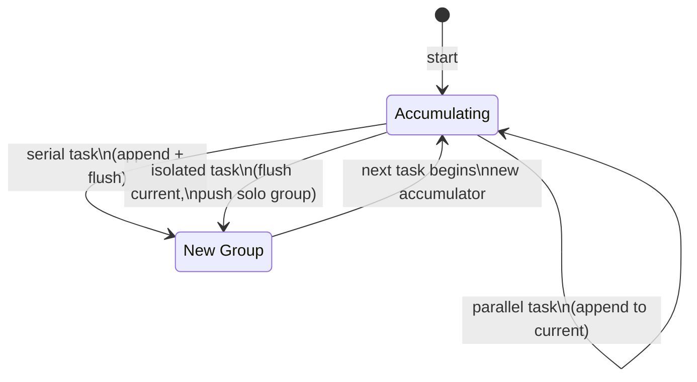

# Parser Tests

This document provides a detailed breakdown of `src/tests/parser.test.ts`,
which tests the task parsing and mutation layer defined in
[`src/parser.ts`](../../src/parser.ts).

For parser-specific testing patterns and how to extend the parser test suite,
see also the [parser testing guide](../task-parsing/testing-guide.md).

## What is tested

The parser module is the foundational data extraction and mutation layer. It
converts markdown checkbox syntax into structured [`Task`](../shared-types/parser.md) and [`TaskFile`](../shared-types/parser.md) objects,
provides context filtering for planner agents, marks tasks as complete by
mutating files, and groups tasks by execution mode. The test file covers all
five public functions.

## Describe blocks

The test file contains **6 describe blocks** with **79 tests** total — the
largest test file in the project.

### parseTaskContent — basic extraction (22 tests)

Tests the core [`parseTaskContent()`](../task-parsing/api-reference.md#parsetaskcontent) function, which is a **pure function** that
takes a markdown string and a file path, and returns a `TaskFile` object with
extracted tasks and the original content.

| Test | What it verifies |
|------|------------------|
| extracts basic dash tasks | Standard `- [ ]` syntax |
| extracts asterisk tasks | `* [ ]` syntax |
| handles indented tasks (nested lists) | 2, 4, 6 space indentation |
| handles tab-indented tasks | Tab indentation |
| skips already-checked tasks | `[x]` and `[X]` excluded |
| handles mixed task and non-task content | Headings, prose, blank lines interspersed |
| preserves full file content in the content field | `TaskFile.content === input` |
| returns correct line numbers with blank lines | 1-based line numbers account for blanks |
| returns empty tasks for a file with no checkboxes | Regular list items ignored |
| returns empty tasks for an empty file | Empty string → empty task array |
| handles tasks with inline markdown formatting | Bold, code, links, italic preserved in text |
| handles tasks with special characters | Regex chars, `$`, parentheses preserved |
| does not match lines without proper checkbox syntax | **7 negative cases** in one test |
| assigns sequential zero-based indices | `index` field: 0, 1, 2, ... |
| preserves the raw line including indentation | `raw` captures original line verbatim |
| handles a realistic multi-section task file | 7 tasks across 3 phases, 1 checked skipped |
| handles single-task file | Edge case: single task |
| handles trailing newline | No phantom tasks from trailing `\n` |
| handles Windows-style CRLF line endings | CRLF normalized, text trimmed cleanly |
| rejects malformed task markers | Additional invalid patterns rejected |
| treats unknown mode character (Q) as default serial | Unknown `(Q)` prefix is not stripped |
| parses tasks with nested markdown formatting | Deep markdown nesting preserved |

**Checkbox syntax rules (from negative tests):**

The following patterns are **not** recognized as tasks:

| Pattern | Why rejected |
|---------|-------------|
| `- [] Missing space` | No space inside brackets |
| `-[ ] Missing space after dash` | No space between dash and bracket |
| `- [  ] Extra space` | Two spaces inside brackets |
| `[ ] No list marker` | Missing `-` or `*` prefix |
| `  [ ] Indented no marker` | Indented but no list marker |
| `- [ ]No space after` | No space after closing bracket |

**Task object shape:**

Each extracted task has these fields:

| Field | Type | Description |
|-------|------|-------------|
| `index` | `number` | Zero-based sequential index among unchecked tasks |
| `text` | `string` | Task description (mode prefix stripped) |
| `line` | `number` | 1-based line number in the source file |
| `raw` | `string` | Original line including indentation and checkbox |
| `file` | `string` | Absolute file path |
| `mode` | `"parallel" \| "serial" \| "isolated" \| undefined` | Execution mode from prefix |

### parseTaskContent — mode extraction (24 tests)

Tests the `(P)`, `(S)`, and `(I)` mode prefix system that controls parallel,
serial, and isolated task execution.

| Test | What it verifies |
|------|------------------|
| extracts `(P)` prefix as parallel mode | `(P) text` → `mode: "parallel"` |
| extracts `(S)` prefix as serial mode | `(S) text` → `mode: "serial"` |
| defaults to serial mode when no prefix | No prefix → `mode: "serial"` |
| preserves raw line with prefix intact | `raw` field keeps `(P)`/`(S)` |
| handles mixed modes in same file | P, S, untagged, P → correct modes |
| does not strip non-mode parentheticals | `(parenthetical) notes` unchanged |
| does not match lowercase `(p)` or `(s)` | Case-sensitive: lowercase = serial default |
| handles `(P)`/`(S)` on indented tasks | Indentation does not affect mode detection |
| handles `(P)`/`(S)` with CRLF line endings | CRLF does not break mode parsing |
| requires a space after `(P)`/`(S)` | `(P)NoSpace` → not recognized as mode |
| handles multiple spaces after `(P)` | `(P)  text` → still recognized |
| handles special characters after prefix | Backticks, `$`, `*` after prefix OK |
| preserves parentheses in text after prefix | `(P) text (legacy)` → text has `(legacy)` |
| extracts mode from asterisk list markers | `* [ ] (P)` works same as `- [ ] (P)` |
| only strips the first mode prefix | `(P) (S) text` → parallel, text = `(S) text` |
| handles inline markdown after prefix | Bold, links, italic after prefix preserved |
| assigns serial to all untagged tasks in mixed file | Untagged surrounded by tagged = serial |
| handles tab character after mode prefix | Tab as whitespace after prefix is accepted |
| does not extract mode when (P) or (S) appears mid-text | Mid-text parentheticals unchanged |
| handles long task descriptions with special punctuation | Complex text after prefix preserved |
| extracts `(I)` prefix as isolated mode | `(I) text` → `mode: "isolated"` |
| preserves raw line with `(I)` prefix intact | `raw` field keeps `(I)` |
| handles `(I)` on indented tasks | Indentation does not affect isolated detection |
| handles `(I)` with CRLF line endings | CRLF does not break isolated mode parsing |

**Mode prefix rules:**

- Case-sensitive: only uppercase `(P)`, `(S)`, and `(I)` are recognized
- A space (or tab) is required after the closing parenthesis
- Only the first prefix is consumed when multiple appear
- `(P)` or `(S)` appearing mid-text (not at start) is not treated as a prefix
- The prefix is stripped from `text` but preserved in `raw`

### parseTaskFile (1 test)

Tests the [`parseTaskFile()`](../task-parsing/api-reference.md#parsetaskfile) function, which reads a markdown file from disk and
delegates to `parseTaskContent()`.

| Test | What it verifies |
|------|------------------|
| reads and parses a file from disk | End-to-end file read → parse pipeline |

This test creates a temporary file on disk, writes markdown content, calls
`parseTaskFile()`, and asserts that the returned `TaskFile` has the correct
`path`, `tasks`, and `content` fields.

### markTaskComplete (6 tests)

Tests the [`markTaskComplete()`](../task-parsing/api-reference.md#marktaskcomplete) function, which performs an in-place file
mutation to replace `[ ]` with `[x]` at a specific line.

| Test | What it verifies |
|------|------------------|
| replaces `[ ]` with `[x]` at the correct line | Basic mark-complete behavior |
| preserves indentation when marking complete | Indented tasks stay indented |
| throws on out-of-range line number | `task.line` exceeds file length → error |
| throws if the line no longer matches unchecked pattern | Already checked/modified → error |
| preserves CRLF line endings when marking complete | CRLF files round-trip with `\r\n` preserved |
| preserves LF line endings when marking complete | LF files round-trip without introducing CRLF |

**Mutation safety checks:** `markTaskComplete` performs two validations before
writing:

1. The line number must be within the file's line count (throws `"out of range"`)
2. The target line must still contain an unchecked checkbox pattern (throws
   `"does not match"`)

These checks prevent data corruption when the file has been modified between
parsing and completion.

**Line ending preservation:** The CRLF and LF preservation tests
(`src/tests/parser.test.ts:730-770`) verify that `markTaskComplete` detects the
original end-of-line style and uses it when writing the file back. CRLF files
remain CRLF; LF files remain LF.

### buildTaskContext (8 tests)

Tests the [`buildTaskContext()`](../task-parsing/api-reference.md#buildtaskcontext) function, which produces filtered markdown
content for [planner agents](../planning-and-dispatch/planner.md) by removing all unchecked tasks except the
current one.

| Test | What it verifies |
|------|------------------|
| keeps current task and removes other unchecked tasks | Core filtering |
| preserves all non-task content | Headings, prose, blank lines survive |
| preserves checked tasks | `[x]` tasks are context, not removed |
| works when file has only one unchecked task | Single task = no filtering needed |
| handles indented sibling tasks | Nested unchecked tasks also stripped |
| handles CRLF line endings | CRLF normalized during filtering |
| preserves asterisk tasks of other types | Non-checkbox `*` list items survive |
| produces realistic filtered context | Multi-section file integration test |

**Filtering rules:**

- Lines matching the unchecked task checkbox pattern (`- [ ]` or `* [ ]`) are
  removed, EXCEPT the line for the current task
- Lines matching the checked task pattern (`- [x]` or `* [x]`) are preserved
  (they provide completion context)
- All other content (headings, prose, blank lines, regular list items) is
  preserved verbatim

### groupTasksByMode (18 tests)

Tests the [`groupTasksByMode()`](../task-parsing/api-reference.md#grouptasksbymode) function, which partitions a flat list of tasks
into execution groups based on their `mode` field.

**Grouping algorithm:**

The accumulator collects parallel tasks. A serial task caps the current group
(is appended, then the group is flushed). An isolated task flushes any
accumulated tasks as their own group, then creates a solo group for itself.
Groups execute sequentially; tasks within a group execute concurrently
(if the group contains parallel tasks).

| Test | What it verifies |
|------|------------------|
| returns empty array for empty input | Edge case |
| groups a lone serial task as a solo group | `[S]` → `[[S]]` |
| groups a lone parallel task as a solo group | `[P]` → `[[P]]` |
| accumulates consecutive parallel tasks into one group | `[P,P,P]` → `[[P,P,P]]` |
| serial task caps the current group | `[P,S]` → `[[P,S]]` |
| correct groups for P S S P P P pattern | → `[[P,S], [S], [P,P,P]]` |
| all-serial tasks as individual solo groups | `[S,S,S]` → `[[S], [S], [S]]` |
| treats undefined mode as serial | `[U,P,U]` → `[[U], [P,U]]` |
| preserves task order within groups | Indices maintained |
| handles serial at start followed by parallel | `[S,P,P]` → `[[S], [P,P]]` |
| handles alternating P S P S pattern | → `[[P,S], [P,S]]` |
| single serial task produces exactly one group of length 1 | Length verification |
| groups a lone isolated task as a solo group | `[I]` → `[[I]]` |
| isolated task at start flushes into solo group | `[I,P,P]` → `[[I], [P,P]]` |
| isolated task in middle produces three groups | `[P,P,I,P,P]` → `[[P,P], [I], [P,P]]` |
| isolated task at end flushes preceding group | `[P,P,I]` → `[[P,P], [I]]` |
| consecutive isolated tasks each get own solo group | `[I,I]` → `[[I], [I]]` |
| handles mixed P/S/I sequences | `[P,S,I,P,P,I,S]` → 5 groups |

**Grouping examples:**

| Input pattern | Output groups | Explanation |
|---------------|---------------|-------------|
| `P P P` | `[[P,P,P]]` | All parallel → single concurrent group |
| `S S S` | `[[S],[S],[S]]` | All serial → each its own group |
| `P S` | `[[P,S]]` | Serial caps the group |
| `P S P P` | `[[P,S],[P,P]]` | Serial caps first group, parallels accumulate |
| `P S S P P P` | `[[P,S],[S],[P,P,P]]` | Three groups |
| `S P P` | `[[S],[P,P]]` | Serial alone, then parallel group |
| `P P I P P` | `[[P,P],[I],[P,P]]` | Isolated flushes preceding group, runs alone |
| `I I I` | `[[I],[I],[I]]` | Each isolated task gets its own solo group |
| `P S I P P I S` | `[[P,S],[I],[P,P],[I],[S]]` | Five groups with mixed modes |

## Temporary file cleanup

The `parseTaskFile` and `markTaskComplete` describe blocks use the standard
temporary directory pattern described in the [overview](overview.md). Each test
creates a unique `/tmp/dispatch-test-*` directory and removes it in `afterEach`.

## Related documentation

- [Test suite overview](overview.md) — framework, patterns, and coverage map
- [Parser testing guide](../task-parsing/testing-guide.md) — parser-specific patterns and extension guide
- [Task parsing overview](../task-parsing/overview.md) — what the parser does and why
- [Markdown syntax reference](../task-parsing/markdown-syntax.md) — accepted and rejected formats
- [API reference](../task-parsing/api-reference.md) — function contracts verified by tests
- [Architecture and concurrency](../task-parsing/architecture-and-concurrency.md) — concurrency concerns
- [Shared parser types](../shared-types/parser.md) — `Task`, `TaskFile`, and exported function signatures
- [Planning & Dispatch overview](../planning-and-dispatch/overview.md) — the planner and dispatcher that consume parser output
- [Task context and lifecycle](../planning-and-dispatch/task-context-and-lifecycle.md) — task lifecycle from parsing through dispatch
- [Dispatcher](../planning-and-dispatch/dispatcher.md) — prompt construction
  that uses task data validated by these tests
- [Run State Persistence](../git-and-worktree/run-state.md) — Task ID
  construction from `Task.file` and `Task.line` fields validated by parser tests
- [Configuration System](../cli-orchestration/configuration.md) — `--concurrency`
  setting that controls how `groupTasksByMode` groups are dispatched
- [Spec generator tests](spec-generator-tests.md) — `(P)`/`(S)`/`(I)` prefix instructions in prompts
- [Dispatch pipeline tests](dispatch-pipeline-tests.md) — pipeline-level tests
  that build on the parsing behavior verified here
- [Configuration tests](config-tests.md) — config I/O, validation, and merge
  precedence tests for comparison
- [Format utility tests](format-tests.md) — `elapsed()` duration formatting
  tests using similar pure-function patterns
- [Shared utilities testing](../shared-utilities/testing.md) — slugify and
  timeout test patterns for comparison
