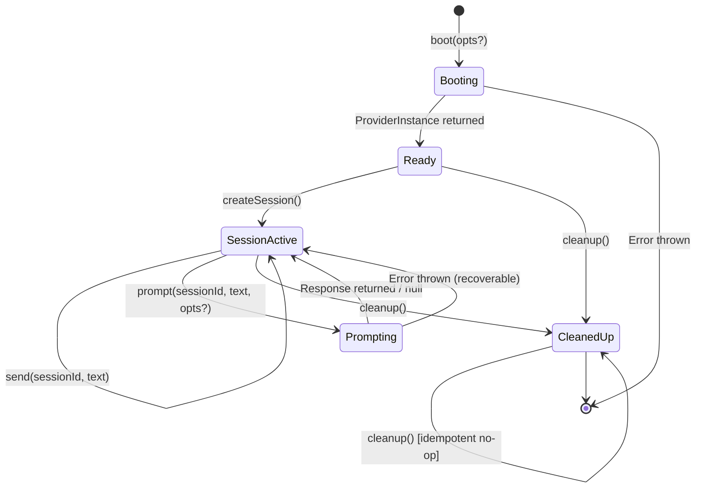
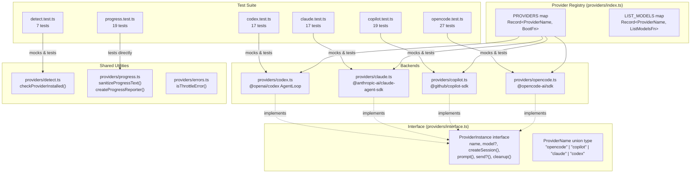
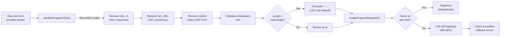
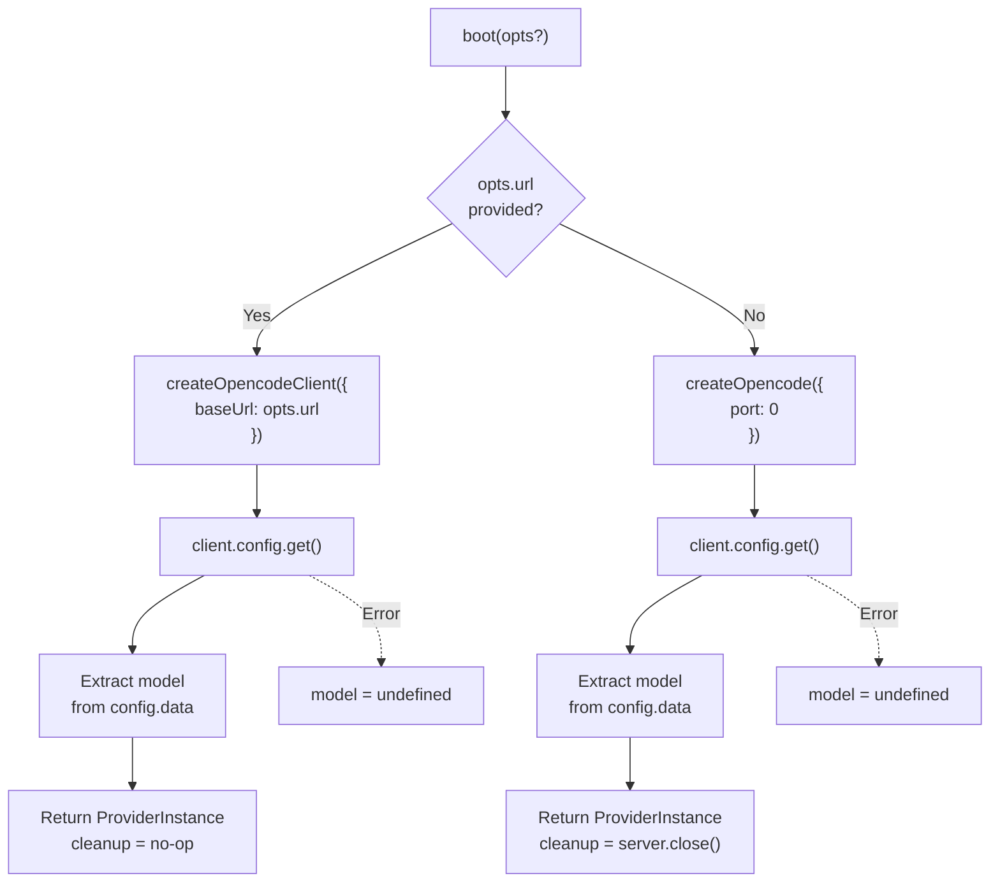

# Provider Unit Tests

This document covers the six test files that verify the provider abstraction
layer: the four individual backend tests (Claude, Codex, Copilot, OpenCode),
the binary detection tests, and the progress reporting tests. Together they
validate the `ProviderInstance` lifecycle (boot, session creation, prompt,
send, cleanup) across all four registered backends, plus the shared utilities
that support them.

## Test file inventory

| Test file | Production module | Lines (test) | Test count | Category |
|-----------|-------------------|-------------|------------|----------|
| `claude.test.ts` | `providers/claude.ts` | 321 | 17 | SDK mock, async generator |
| `codex.test.ts` | `providers/codex.ts` | 311 | 17 | SDK mock, blocking AgentLoop |
| `copilot.test.ts` | `providers/copilot.ts` | 353 | 19 | SDK mock, event callbacks |
| `detect.test.ts` | `providers/detect.ts` | 104 | 7 | Child process mock |
| `opencode.test.ts` | `providers/opencode.ts` | 758 | 27 | SDK mock, SSE streaming |
| `progress.test.ts` | `providers/progress.ts` | 177 | 19 | Pure function, no mocks |

**Total: 2,024 lines of test code** covering 106 tests across 6 files.

## What these tests verify

All four provider test files follow the same structural pattern: they mock the
external SDK, import the production module, and test the `ProviderInstance`
lifecycle methods (`boot`, `createSession`, `prompt`, `send`, `cleanup`).
Each test file verifies:

- **Boot**: Default and custom options, provider shape conformance, error
  propagation from the SDK
- **Session creation**: Successful creation, option forwarding (cwd, model),
  SDK failure propagation
- **Prompt**: Happy-path response extraction, missing session errors, null
  responses, SDK-level errors, streaming/event completion signals, progress
  emission
- **Send**: Follow-up message injection, missing session errors
- **Cleanup**: Resource teardown, error swallowing, idempotency (safe to call
  multiple times)

The `detect.test.ts` file additionally verifies cross-platform binary
detection, and `progress.test.ts` verifies the sanitization and
deduplication pipeline shared by all providers.

## Provider instance lifecycle

The following diagram shows the lifecycle that every provider backend
implements and that the test suites validate. Each state transition
corresponds to a `ProviderInstance` method call.



Key lifecycle properties validated by the test suite:

- **Boot is async**: All `boot()` functions return `Promise<ProviderInstance>`.
  Tests verify both success and rejection paths.
- **Sessions are isolated**: Each `createSession()` returns a unique opaque
  ID. Multiple sessions can coexist on a single provider instance.
- **Prompt requires a valid session**: Calling `prompt()` with an unknown
  session ID always throws `"<Provider> session <id> not found"`.
- **Cleanup is idempotent**: All providers test that calling `cleanup()` twice
  does not throw and does not call underlying teardown methods a second time.
- **Cleanup swallows errors**: SDK-level close/destroy/terminate failures are
  caught and logged at debug level, never propagated.

## Provider abstraction architecture

The following diagram shows how the four provider backends implement a common
interface. This is the architecture that the test suite validates.



## Prompt data flow comparison

Each provider backend uses a different mechanism to send prompts and receive
responses. The tests validate these distinct patterns through mocking. The
following diagram compares the four data flows.

```mermaid
flowchart TB
    subgraph Claude["Claude: Async Generator Streaming"]
        C1["session.send(text)"] --> C2["session.stream()"]
        C2 --> C3["for await...of<br/>async generator"]
        C3 --> C4["Find type: 'assistant'<br/>yield event"]
        C4 --> C5["Extract message.content<br/>text field"]
        C5 --> C6["Emit progress<br/>via reporter"]
    end

    subgraph Codex["Codex: Blocking AgentLoop.run()"]
        X1["new AgentLoop(opts)"] --> X2["loop.run([userMsg])"]
        X2 --> X3["Returns ResponseItem[]<br/>synchronously"]
        X3 --> X4["Filter type: 'message'<br/>content: 'output_text'"]
        X4 --> X5["Concatenate text<br/>from all items"]
    end

    subgraph Copilot["Copilot: Event Callbacks"]
        P1["session.send({ prompt })"] --> P2["session.on('session.idle')"]
        P2 --> P3["Promise resolves<br/>on idle callback"]
        P3 --> P4["session.getMessages()"]
        P4 --> P5["Find type: 'assistant.message'<br/>extract data.content"]
    end

    subgraph OpenCode["OpenCode: SSE + Fetch"]
        O1["session.promptAsync()"] --> O2["event.subscribe()<br/>SSE stream"]
        O2 --> O3["for await...of<br/>filter by sessionID"]
        O3 --> O4{"Event type?"}
        O4 -->|session.idle| O5["session.messages()"]
        O4 -->|session.error| O6["throw Error"]
        O4 -->|message.part.updated| O7["Emit progress<br/>continue"]
        O5 --> O8["Find role: 'assistant'<br/>join text parts"]
    end
```



## Progress reporting pipeline

The progress reporting pipeline is shared by all four providers. The
`progress.test.ts` file validates the sanitization and deduplication logic
in isolation, while each provider test validates that progress events are
emitted correctly through the provider-specific streaming mechanism.



Key behaviors validated by `progress.test.ts`:

- **Empty/whitespace input**: Returns empty string, does not call onProgress
- **ANSI stripping**: Removes SGR color codes, cursor movement, screen erase,
  OSC title-setting sequences, and BEL control characters
- **Truncation**: Default max length is 120 characters; text is truncated with
  trailing ellipsis (`...`); trailing whitespace before the ellipsis is trimmed
- **Deduplication**: Consecutive identical values (after sanitization) are
  suppressed; deduplication is based on the sanitized value, not the raw input
- **Reset**: The `reset()` method clears the last-emitted value, allowing
  re-emission of the same text
- **Error resilience**: Callback errors are caught and swallowed; the reporter
  continues to work after a callback error
- **No-op safety**: Creating a reporter with `undefined` onProgress is safe;
  all methods are no-ops

## Testing patterns

### The `vi.hoisted()` pattern

All four provider test files use `vi.hoisted()` to declare mock references
that are available to `vi.mock()` factory functions. This is a Vitest-specific
pattern required because `vi.mock()` calls are hoisted to the top of the file
at compile time (before any imports execute), but the mock factory functions
need references to mock objects.

**What it does**: `vi.hoisted()` executes its callback during module
evaluation (before hoisted `vi.mock()` calls), returning values that can be
captured in `const` bindings at module scope. These bindings are then available
inside `vi.mock()` factory functions.

**Why it is needed**: Without `vi.hoisted()`, variables declared at module
scope would not yet be initialized when the hoisted `vi.mock()` factories
execute (due to temporal dead zone rules for `const`/`let`). The hoisted
callback guarantees execution order: `vi.hoisted()` runs first, then
`vi.mock()` factories can reference the returned values.

**How it works in these tests**: Each test file follows the same three-step
pattern:

1. `vi.hoisted()` creates mock functions and objects (e.g., `mockCreateSession`,
   `mockClient`, `mockSession`)
2. `vi.mock()` calls use those references in their factory functions to wire up
   the mock module
3. The production module is imported after the mocks are registered

This pattern appears at:
- `src/tests/claude.test.ts:5-22`
- `src/tests/codex.test.ts:3-10`
- `src/tests/copilot.test.ts:5-28`
- `src/tests/opencode.test.ts:4-26`

### SDK mocking strategy

Each provider test fully mocks its external SDK dependency so that tests run
without network access, installed CLI tools, or API credentials. The mocking
is comprehensive -- every SDK function called by the production code is
replaced with a Vitest mock.

| Test file | Mocked module | Key mock objects |
|-----------|---------------|------------------|
| `claude.test.ts` | `@anthropic-ai/claude-agent-sdk` | `query`, `unstable_v2_createSession`, mock session with `send`, `stream`, `close` |
| `codex.test.ts` | `@openai/codex` | `AgentLoop` constructor, mock loop with `run`, `terminate`; captures constructor options via `agentLoopInstances` |
| `copilot.test.ts` | `@github/copilot-sdk` | `CopilotClient` constructor, `approveAll`, mock client with `start`/`stop`/`createSession`, mock session with `send`/`on`/`getMessages`/`destroy` |
| `opencode.test.ts` | `@opencode-ai/sdk` | `createOpencode`, `createOpencodeClient`, mock client with `config.get`/`session.create`/`session.promptAsync`/`session.messages`/`event.subscribe` |
| `detect.test.ts` | `node:child_process`, `node:util` | `execFile` via `promisify`, controlled resolve/reject for binary detection |

All provider test files also mock `../helpers/logger.js` to prevent log output
during tests and to allow assertions on log calls (e.g., verifying that
cleanup errors are logged at debug level).

### Module alias mocking for ESM compatibility

The `vitest.config.ts` defines two module aliases that are critical for the
test suite:

```typescript
resolve: {
  alias: {
    "@openai/codex": path.resolve(__dirname, "src/__mocks__/@openai/codex.ts"),
    "@github/copilot-sdk": path.resolve(__dirname, "src/__mocks__/@github/copilot-sdk.ts"),
  },
},
```

**Why are these needed?** Both `@openai/codex` and `@github/copilot-sdk` have
packaging issues that prevent Vitest's ESM module loader from resolving them:

- `@openai/codex` is a CLI-only bundle without a library entry-point. There is
  no `main` or `exports` field that Vitest can resolve.
- `@github/copilot-sdk` depends on `vscode-jsonrpc/node` which uses a CJS
  `require()` that cannot be resolved under Vitest's ESM module loader.

The aliases redirect all imports of these packages to manual stub files in
`src/__mocks__/` that export minimal class/function stubs. These stubs are
sufficient to satisfy Vite's import analysis during test runs -- any test file
that transitively touches the provider registry does not fail at module
resolution time.

The individual test files (`codex.test.ts`, `copilot.test.ts`) then use
`vi.mock()` to replace these stubs with their own controlled mock
implementations, ensuring each test has full control over the mock behavior.

### Mock reset with `beforeEach`

Every test file calls `vi.clearAllMocks()` in a `beforeEach` hook and
re-initializes mock return values to their defaults. This ensures test
isolation -- each test starts with a clean mock state regardless of what
previous tests did to the mocks.

### Coverage thresholds

The `vitest.config.ts` enforces coverage thresholds that apply to all provider
source files:

| Metric | Threshold |
|--------|-----------|
| Lines | 85% |
| Branches | 80% |
| Functions | 85% |

Coverage is collected via the V8 provider and includes all `src/**/*.ts` files
except tests, interface files, index files, type declarations, and mock files.
The provider test files contribute to meeting these thresholds for the
`src/providers/` directory.

## Claude provider tests

**File**: `src/tests/claude.test.ts` (321 lines, 17 tests)
**Production module**: `src/providers/claude.ts`
**SDK**: `@anthropic-ai/claude-agent-sdk`

### What is tested

| Describe block | Tests | What is verified |
|----------------|-------|------------------|
| `listModels` | 3 | Sorted model values from `supportedModels()`, fallback to hardcoded list on `supportedModels()` error, fallback on `query()` error |
| `boot` | 3 | Default model (`claude-sonnet-4`), custom model override, `ProviderInstance` shape |
| `createSession` | 4 | UUID-based session ID, `cwd` forwarding, `cwd` omission, SDK error propagation |
| `prompt` | 5 | Missing session error, async generator response extraction, sanitized progress emission, progress snapshots, null on empty stream, send failure |
| `cleanup` | 3 | Session close, graceful error handling, idempotency |
| `send` | 3 | Missing session error, follow-up text delivery, send failure |

### SDK integration: `@anthropic-ai/claude-agent-sdk`

**What is `unstable_v2_createSession`?** This is the session creation function
from the Claude Agent SDK (formerly the Claude Code SDK). The `unstable_v2_`
prefix indicates it is a pre-release API that may change in breaking ways.
The SDK is published by Anthropic at
[`@anthropic-ai/claude-agent-sdk`](https://github.com/anthropics/claude-agent-sdk-typescript)
(v0.2.97 as of April 2026). The tests mock this function to return a session
object with `send()`, `stream()`, and `close()` methods.

**Stability risk**: The `unstable_v2_` prefix is a strong signal that this API
surface is experimental. Dispatch depends on this unstable API for its Claude
backend. Breaking changes in the SDK would require updating the provider
implementation, and the test suite would catch regressions immediately since
the mock structure mirrors the SDK's current API shape.

**Why `permissionMode: "bypassPermissions"` and `allowDangerouslySkipPermissions: true`?**
The Claude Agent SDK requires a permission mode when creating sessions. The
test at `src/tests/claude.test.ts:138` verifies that sessions are created with
`permissionMode: "bypassPermissions"` and
`allowDangerouslySkipPermissions: true`. This tells the agent it is allowed
to perform all operations (file edits, shell commands) without prompting for
user confirmation. This is appropriate for Dispatch's automated task
execution, where human-in-the-loop confirmation would block the pipeline.

**Security implications**: Bypassing permissions means the Claude agent runs
with full autonomy inside its working directory. In Dispatch, this is
mitigated by:
- Each task runs in an isolated git worktree (see
  [git-and-worktree](../git-and-worktree/) documentation)
- The orchestrator controls what prompts are sent
- Timeouts bound execution duration

**How does the async generator pattern work?** The Claude provider calls
`session.send(text)` to queue a prompt, then iterates `session.stream()` which
returns an `AsyncGenerator`. Each yielded event has a `type` field; the
provider looks for `type: "assistant"` and extracts `message.content[0].text`.
The tests validate this by mocking `stream()` to return custom async generators
(`src/tests/claude.test.ts:180-188`).

**Session ID generation**: The Claude provider generates session IDs locally
using `randomUUID()` from `node:crypto`, unlike the other providers which
receive IDs from their respective servers. The tests mock `randomUUID` to
return a deterministic value (`"test-uuid-1234"`).

**Hardcoded fallback models**: When the SDK's `query().supportedModels()`
call fails (either the `query()` constructor throws or `supportedModels()`
rejects), the `listModels()` function falls back to a hardcoded list:
`["claude-haiku-3-5", "claude-opus-4-6", "claude-sonnet-4", "claude-sonnet-4-5"]`.
Tests at `src/tests/claude.test.ts:83-109` verify both fallback scenarios and
confirm the `query` handle is always closed (even on error) to prevent resource
leaks.

**Default model**: When no `opts.model` is provided, `boot()` defaults to
`"claude-sonnet-4"` (`src/tests/claude.test.ts:114-116`).

### Progress emission

The Claude provider emits progress snapshots during prompt execution. The test
at `src/tests/claude.test.ts:198-232` verifies:

- Whitespace-only stream events are suppressed (not emitted as progress)
- Multi-line text is sanitized before emission
- Duplicate consecutive values are deduplicated
- The final return value is the concatenation of all stream text, not just the
  sanitized progress

### Known issue: duplicate `vi.mock("node:crypto")`

The test file contains two `vi.mock("node:crypto", ...)` calls
(`src/tests/claude.test.ts:31-33` and `src/tests/claude.test.ts:40-42`). The
second call overwrites the first, so the hoisted `mockRandomUUID` reference
declared at lines 24-27 is not actually used by the active mock. Instead, the
second mock creates an inline `vi.fn().mockReturnValue("test-uuid-1234")`.

The tests still pass because both mocks return the same value. However, the
`beforeEach` call to `mockRandomUUID.mockReturnValue("test-uuid-1234")` at
line 58 resets a mock function that is never actually called, which is dead
code. This is likely a copy-paste artifact.

## Codex provider tests

**File**: `src/tests/codex.test.ts` (311 lines, 17 tests)
**Production module**: `src/providers/codex.ts`
**SDK**: `@openai/codex`

### What is tested

| Describe block | Tests | What is verified |
|----------------|-------|------------------|
| `listModels` | 2 | Known model identifiers (`codex-mini-latest`, `o4-mini`, `o3-mini`), opts argument accepted |
| `boot` | 4 | Default model (`o4-mini`), custom model, provider name, required methods |
| `codex provider` | 6 | Session creation with `cwd` forwarding as `rootDir`, `approvalPolicy: "full-auto"`, sparse loading progress, output text extraction, null on no `output_text`, null on non-message items, `onItem` streamed chunks, `onItem` ignores non-`output_text`, unknown session error, run failure, multi-item concatenation |
| `send` | 2 | Unknown session error, known session no-op |
| `cleanup` | 3 | Terminate all sessions, terminate error handling, idempotency |

### SDK integration: `@openai/codex`

**What is `AgentLoop`?** The `@openai/codex` package
([github.com/openai/codex](https://github.com/openai/codex)) exposes an
`AgentLoop` class that wraps OpenAI's Codex model. Unlike the other three
SDKs which use streaming or event-based patterns, the Codex `AgentLoop.run()`
method is **blocking** -- it accepts an array of messages and returns a
`Promise<ResponseItem[]>` containing the complete response.

**How is the constructor mocked?** The test at `src/tests/codex.test.ts:17-24`
uses `vi.fn().mockImplementation()` to capture constructor arguments into an
`agentLoopInstances` array. This allows tests to inspect what options were
passed (e.g., `model`, `rootDir`, `approvalPolicy`) without needing to access
the mock through the import.

**Why `approvalPolicy: "full-auto"`?** The test at
`src/tests/codex.test.ts:100-104` verifies that the `AgentLoop` is created
with `approvalPolicy: "full-auto"`. This is Codex's equivalent of Claude's
`bypassPermissions` -- it grants the agent full autonomy to execute commands
and edit files without human confirmation. The same security considerations
apply (worktree isolation, orchestrator control, timeouts).

**How does `rootDir` forwarding work?** When `boot()` is called with
`opts.cwd`, the Codex provider maps it to the `rootDir` option on the
`AgentLoop` constructor (`src/tests/codex.test.ts:94-104`). When `cwd` is
not provided, `rootDir` is omitted entirely (`src/tests/codex.test.ts:107-111`).

**Default model**: `o4-mini` (`src/tests/codex.test.ts:50-52`).

**Hardcoded model list**: The `listModels()` function returns a static list
containing `codex-mini-latest`, `o4-mini`, and `o3-mini`. There is no dynamic
model discovery -- the list is maintained manually in source code.

### Progress emission: sparse loading updates

The Codex provider uses a different progress strategy than the streaming
providers. Since `AgentLoop.run()` is blocking, progress is emitted through
two callback hooks:

- `onLoading`: Fires when the model is "thinking". The provider emits a single
  `"thinking"` update on the first call and suppresses subsequent calls.
- `onItem`: Fires when the model produces intermediate output. The provider
  extracts `output_text` content and emits it as progress.

The test at `src/tests/codex.test.ts:113-141` verifies the progress sequence:
`["Waiting for Codex response", "thinking", "Finalizing response"]`. The
"Waiting" and "Finalizing" messages are lifecycle bookends emitted by the
provider itself, not by the SDK.

### Send is a no-op

The `send()` method on the Codex provider validates the session ID but
otherwise does nothing (`src/tests/codex.test.ts:267-271`). This is because
the `AgentLoop` does not support mid-session message injection -- each
`run()` call is a complete request/response cycle.

## Copilot provider tests

**File**: `src/tests/copilot.test.ts` (353 lines, 19 tests)
**Production module**: `src/providers/copilot.ts`
**SDK**: `@github/copilot-sdk`

### What is tested

| Describe block | Tests | What is verified |
|----------------|-------|------------------|
| `boot` | 7 | Client construction (no opts, `cliUrl`, `cwd`, both), `client.start()`, start failure, `ProviderInstance` shape |
| `createSession` | 5 | Session ID return, `workingDirectory` forwarding, lazy model detection (first session only), model detection error swallowing, session creation failure |
| `prompt` | 5 | Missing session error, `session.idle` response retrieval, sparse lifecycle progress, null on empty messages, `session.error` rejection |
| `prompt > timeout` | 2 | 10-minute timeout with `TimeoutError`, unsubscribe cleanup on timeout |
| `cleanup` | 3 | Session destroy + client stop, destroy error logging, stop error logging |

### SDK integration: `@github/copilot-sdk`

**How does `CopilotClient` work?** The `@github/copilot-sdk` communicates
with GitHub Copilot through a JSON-RPC connection to the Copilot CLI server.
`new CopilotClient()` creates the client, optionally accepting `cliUrl` to
connect to an already-running server or `cwd` for working directory. The
`client.start()` call launches (or connects to) the CLI server. Tests verify
all constructor option combinations (`src/tests/copilot.test.ts:70-101`).

**What is the `approveAll` import?** The Copilot SDK exports `approveAll` as a
permission request handler. When creating a session, the provider passes
`{ onPermissionRequest: approveAll }` (or an equivalent auto-approve function)
so that the agent can perform file operations without prompting for user
approval. Tests verify the `onPermissionRequest` callback is passed
(`src/tests/copilot.test.ts:123-126`).

**How does lazy model detection work?** The Copilot SDK does not expose the
model name at boot time. Instead, the provider detects the model on the first
`createSession()` call via `session.rpc.model.getCurrent()`, which returns
`{ modelId: "provider/model" }`. This is stored once; subsequent session
creations skip detection. The tests verify:
- Model is set after first session (`src/tests/copilot.test.ts:137-141`)
- `getCurrent` is not called again (`src/tests/copilot.test.ts:143-149`)
- Detection errors are swallowed, leaving `model` as `undefined`
  (`src/tests/copilot.test.ts:151-158`)

**How does the event-based prompt model work?** Unlike Claude's async generator
or OpenCode's SSE stream, the Copilot provider uses event callbacks:
1. `session.send({ prompt: text })` queues the message
2. `session.on("session.idle", handler)` registers a callback for completion
3. `session.on("session.error", handler)` registers a callback for errors
4. When idle fires, `session.getMessages()` retrieves the conversation
5. The last `assistant.message` event's `data.content` is returned

The tests simulate this by making `session.on` trigger callbacks via
`setTimeout(() => handler(), 0)` for the relevant event
(`src/tests/copilot.test.ts:178-185`).

### Timeout configuration

The Copilot provider wraps the event-waiting Promise with a 10-minute
(600,000ms) timeout. The tests at `src/tests/copilot.test.ts:274-323` use
Vitest's fake timers (`vi.useFakeTimers()`) to advance time by 600,000ms
and verify:

- The promise rejects with a `TimeoutError` instance
  (`src/tests/copilot.test.ts:298-299`)
- The error message contains `"copilot session ready"`
- Both event unsubscribe functions (`unsubIdle`, `unsubErr`) are called to
  clean up event listeners

**Why 10 minutes?** This is a generous timeout to accommodate complex tasks
where the Copilot agent may take several minutes to produce a response. The
timeout exists primarily as a safety net against hung sessions, not as a
performance boundary.

### Cleanup behavior

The Copilot provider's cleanup is more involved than Claude's:
1. Iterate all sessions and call `session.destroy()` on each
2. Call `client.stop()` to terminate the CLI server process

The tests verify that destroy errors are caught and logged at debug level
with the message `"Failed to destroy Copilot session: mock error chain"`
(`src/tests/copilot.test.ts:335-343`), and that `client.stop()` errors are
similarly handled (`src/tests/copilot.test.ts:345-352`).

## OpenCode provider tests

**File**: `src/tests/opencode.test.ts` (758 lines, 27 tests)
**Production module**: `src/providers/opencode.ts`
**SDK**: `@opencode-ai/sdk`

### What is tested

| Describe block | Tests | What is verified |
|----------------|-------|------------------|
| `boot` | 9 | Two connection modes (URL vs spawn), model from config, config failure, empty config, `port: 0` for spawn, cwd limitation logging, cwd with URL (no warning), spawn failure, `ProviderInstance` shape |
| `createSession` | 3 | Session ID from server, null data error, network error |
| `prompt` | 12 | SSE event response extraction, sanitized/truncated progress without duplicates, progress snapshots, no progress when no usable deltas, `promptAsync` error, `session.error` event, session ID filtering, null on empty messages, null on no assistant, assistant error detection, AbortSignal verification, multi-part text joining, null on non-text parts, AbortController cleanup on subscribe failure, stream-ended-before-idle error |
| `prompt > timeout` | 3 | 10-minute timeout with `TimeoutError`, AbortController abort on timeout, timeout after partial stream activity |
| `cleanup` | 4 | Server close on spawn mode, idempotency, no close on URL mode, close error logging |

### OpenCode dual-mode boot

The OpenCode provider supports two distinct connection modes, and the tests
validate both:



**URL mode** (`opts.url` provided): Connects to an already-running OpenCode
server via `createOpencodeClient({ baseUrl })`. The provider does not own
the server lifecycle, so `cleanup()` is a no-op
(`src/tests/opencode.test.ts:741-745`).

**Spawn mode** (no `opts.url`): Launches a local OpenCode HTTP server via
`createOpencode({ port: 0 })`. The `port: 0` requests an OS-assigned
ephemeral port to avoid conflicts. On `cleanup()`, the provider calls
`server.close()` (`src/tests/opencode.test.ts:728-731`).

**Model detection**: In both modes, the provider calls `client.config.get()`
to retrieve the active model. If the config call fails or returns no model,
`instance.model` is `undefined` (`src/tests/opencode.test.ts:120-130`).

**CWD limitation**: The `createOpencode()` function does not accept a `cwd`
parameter. When `opts.cwd` is provided without `opts.url`, the provider logs
a debug warning about this limitation but proceeds normally
(`src/tests/opencode.test.ts:139-148`). When `opts.url` is also provided,
no warning is logged (`src/tests/opencode.test.ts:150-156`).

### SSE stream processing

The OpenCode provider's prompt implementation is the most complex:

1. Calls `client.session.promptAsync()` (fire-and-forget)
2. Subscribes to `client.event.subscribe()` with an `AbortSignal`
3. Iterates the SSE stream as an async generator, filtering by session ID
4. On `session.idle`, breaks and fetches messages
5. On `session.error`, throws immediately
6. On `message.part.updated`, emits progress via the reporter

The tests construct SSE event sequences as arrays and convert them to async
generators using helper functions:
- `arrayToAsyncGenerator()`: Yields all items then ends normally
- `neverAsyncGenerator()`: Never yields (hangs forever, for timeout testing)
- `stalledAsyncGenerator()`: Yields some items then hangs

**Session ID filtering**: The SSE stream delivers events for all sessions on
the server. The provider filters by checking `properties.sessionID`. Tests at
`src/tests/opencode.test.ts:410-445` verify that events for other sessions are
correctly ignored.

**AbortController lifecycle**: The provider creates an `AbortController` and
passes its `signal` to `event.subscribe()`. After processing completes (or on
error/timeout), the controller is aborted to terminate the SSE connection.
Tests verify:
- The signal is passed (`src/tests/opencode.test.ts:539-542`)
- The controller is aborted on subscribe failure
  (`src/tests/opencode.test.ts:600-614`)
- The controller is aborted on timeout
  (`src/tests/opencode.test.ts:655-674`)

**Stream-ended-before-idle**: If the SSE stream ends (generator returns)
before a `session.idle` event is received, the provider throws
`"OpenCode event stream ended before session became idle"`
(`src/tests/opencode.test.ts:712-723`).

### Progress sanitization in OpenCode

The OpenCode prompt tests include detailed progress sanitization tests that
exercise the `sanitizeProgressText()` function through the provider's
`onProgress` callback. The test at `src/tests/opencode.test.ts:239-299`
verifies:

- ANSI color codes and BEL characters are stripped from deltas
- Whitespace is collapsed
- Duplicate consecutive sanitized values are suppressed
- Long deltas are truncated to 120 characters with trailing ellipsis
- Empty/whitespace-only deltas are not emitted

### Timeout configuration

Like Copilot, the OpenCode provider uses a 10-minute (600,000ms) timeout on
the SSE stream wait. The timeout tests at
`src/tests/opencode.test.ts:617-709` verify:

- `TimeoutError` with label `"opencode session ready"` is thrown
- The `AbortController` is aborted when the timeout fires
- Timeout fires even after partial stream activity (some events received,
  then the stream stalls)
- `session.messages()` is NOT called after timeout (the provider does not
  attempt to retrieve partial results)

## Binary detection tests

**File**: `src/tests/detect.test.ts` (104 lines, 7 tests)
**Production module**: `src/providers/detect.ts`

### What is tested

| Test | What is verified |
|------|------------------|
| Returns true when binary is found | `execFile("claude", ["--version"])` resolves successfully |
| Returns false when exec rejects | ENOENT error (binary not on PATH) |
| `shell: true` on win32 | `process.platform === "win32"` passes `{ shell: true }` |
| `shell: false` on linux | Non-win32 platforms pass `{ shell: false }` |
| Timeout option passed | `execFile` receives `{ timeout: 5000 }` |
| Returns false on timeout | Killed process with SIGTERM treated as not installed |
| Returns false on generic timeout | Killed process without signal treated as not installed |

### Cross-platform detection

The `checkProviderInstalled()` function probes for provider CLI binaries by
running `<binary> --version` via `node:child_process.execFile`. The tests
mock `execFile` (via `node:util.promisify`) to control outcomes.

**Windows `shell: true` requirement**: On Windows, CLI tools installed via npm
are batch files (`.cmd`), not executables. `execFile` cannot run batch files
directly -- it requires `{ shell: true }` to invoke them through `cmd.exe`.
The tests at `src/tests/detect.test.ts:48-58` and `60-70` verify this
platform-specific behavior by overriding `process.platform` via
`Object.defineProperty`.

**Detection timeout**: The detection uses a 5,000ms timeout
(`DETECTION_TIMEOUT_MS` constant in `detect.ts:14`) to prevent hanging on
unresponsive binaries. The tests verify that the timeout option is passed to
`execFile` and that timeout-killed processes result in `false`
(`src/tests/detect.test.ts:72-103`).

**Never rejects**: The `checkProviderInstalled()` function is documented as
"never rejects" -- it catches all errors and returns `false`. This is critical
for the prerequisite checking flow where detection failures should not crash
the application.

### Provider binary mapping

The production module maps each `ProviderName` to its expected binary name:

| Provider | Binary |
|----------|--------|
| `opencode` | `opencode` |
| `copilot` | `copilot` |
| `claude` | `claude` |
| `codex` | `codex` |

The tests exercise `claude`, `copilot`, and `opencode` binaries directly.

## Progress reporting tests

**File**: `src/tests/progress.test.ts` (177 lines, 19 tests)
**Production module**: `src/providers/progress.ts`

### What is tested

The progress tests are organized into two `describe` blocks:

**`sanitizeProgressText`** (13 tests):

| Test | Input | Expected output |
|------|-------|-----------------|
| Empty string | `""` | `""` |
| Whitespace only | `"   \t\n  "` | `""` |
| Trim + collapse | `"  hello   world  "` | `"hello world"` |
| ANSI color codes | `"\x1b[31mred text\x1b[0m"` | `"red text"` |
| Cursor movement | `"\x1b[2Jhello\x1b[H"` | `"hello"` |
| OSC sequences | `"\x1b]0;title\x07actual text"` | `"actual text"` |
| Control characters | `"hello\x00\x01\x02world"` | `"helloworld"` |
| ANSI-only input | `"\x1b[31m\x1b[0m"` | `""` |
| Mixed ANSI + control | `"\x1b[1m\x07bold\x1b[0m\x00"` | `"bold"` |
| Truncation (200 chars) | `"a".repeat(200)` | 120 chars ending in `"..."` |
| Exact maxLength | `"a".repeat(120)` | No truncation |
| Shorter than maxLength | `"short"` | No truncation |
| maxLength=1 | `"hello"` | `"..."` |
| maxLength=0 | `"hello"` | `""` |
| Trim before ellipsis | `"hello world this..."` | `"hello..."` (trailing space removed) |
| Default maxLength | `"b".repeat(200)` | 120 chars |

**`createProgressReporter`** (6 tests):

| Test | What is verified |
|------|------------------|
| Calls onProgress with sanitized text | Basic emission |
| Does not call for empty text | Empty string suppression |
| Does not call for null/undefined | Null safety |
| Deduplicates consecutive identical | `"same"` x3 = 1 call |
| Emits again after value changes | `"first"` then `"second"` = 2 calls |
| Reset allows re-emission | `emit("value")`, `reset()`, `emit("value")` = 2 calls |
| No-op when onProgress is undefined | Safe construction with no callback |
| Catches callback errors | Error swallowed, no throw |
| Continues after callback error | Next emit still works |
| Sanitizes ANSI before emitting | `"\x1b[32mgreen\x1b[0m"` -> `"green text"` |
| Deduplicates on sanitized value | `"hello"` and `"\x1b[31mhello\x1b[0m"` = 1 call |

## Permission bypassing across providers

All four providers configure their SDKs for maximum autonomy, bypassing
interactive permission prompts. The test suite verifies these configurations:

| Provider | Permission mechanism | Verified at |
|----------|---------------------|-------------|
| Claude | `permissionMode: "bypassPermissions"`, `allowDangerouslySkipPermissions: true` | `claude.test.ts:138` |
| Codex | `approvalPolicy: "full-auto"` | `codex.test.ts:103` |
| Copilot | `onPermissionRequest: <auto-approve function>` | `copilot.test.ts:124` |
| OpenCode | No explicit permission config (SDK default) | N/A |

**Security context**: These permission settings are appropriate because
Dispatch runs agents in controlled, isolated environments:
- Tasks execute in disposable git worktrees
- The orchestrator controls all prompts sent to agents
- Timeouts (10 minutes for prompt, 30 minutes for planning) bound execution
- Changes are committed and pushed to branches for human review via PR

## Authentication patterns

Each provider handles authentication differently, though the test suite does
not directly test authentication (all SDK calls are mocked):

| Provider | Auth mechanism | Tested in suite? |
|----------|---------------|-----------------|
| Claude | `ANTHROPIC_API_KEY` env var (handled by SDK) | No (mocked) |
| Codex | `OPENAI_API_KEY` env var (handled by SDK) | No (mocked) |
| Copilot | GitHub token via Copilot CLI (`copilot auth`) | No (mocked) |
| OpenCode | Varies by provider config in `~/.opencode` | No (mocked) |

Authentication failures would manifest as SDK-level errors during boot or
session creation. The test suite verifies that such errors propagate correctly
but does not test specific authentication scenarios.

## How to run

```sh
# Run all provider-related tests
npx vitest run src/tests/claude.test.ts src/tests/codex.test.ts \
  src/tests/copilot.test.ts src/tests/opencode.test.ts \
  src/tests/detect.test.ts src/tests/progress.test.ts

# Run a single test file
npx vitest run src/tests/claude.test.ts

# Run in watch mode
npx vitest src/tests/codex.test.ts

# Run with verbose output
npx vitest run --reporter=verbose src/tests/progress.test.ts

# Run with coverage
npx vitest run --coverage src/tests/claude.test.ts
```

All provider tests run without network access, installed CLI tools, or API
credentials because all external SDK calls are mocked.

## Related documentation

- [Testing Overview](./overview.md) -- project-wide test strategy, framework,
  and coverage map
- [Provider Overview](../provider-system/overview.md) -- architecture
  of the provider abstraction layer
- [Claude Backend](../provider-implementations/claude-backend.md) -- Claude
  provider production implementation details
- [Codex Backend](../provider-implementations/codex-backend.md) -- Codex
  provider production implementation details
- [OpenCode Backend](../provider-system/opencode-backend.md) -- OpenCode
  provider production implementation details
- [Copilot Backend](../provider-system/copilot-backend.md) -- Copilot
  provider production implementation details
- [Binary Detection](../provider-system/binary-detection.md) -- detection
  module production implementation
- [Progress Reporting](../provider-system/progress-reporting.md) -- progress
  sanitization production implementation
- [Adding a Provider](../provider-system/adding-a-provider.md) -- step-by-step
  guide including testing guidance
- [Error Classification](../provider-system/error-classification.md) --
  `isThrottleError()` heuristic used by provider pool failover
- [Pool and Failover](../provider-implementations/pool-failover.md) --
  how providers are pooled and how failover works
- [Authentication and Security](../provider-implementations/authentication-and-security.md) --
  provider authentication and permission patterns
- [Timeout Utility](../shared-utilities/timeout.md) -- `withTimeout()` pattern
  used by Copilot and OpenCode prompt implementations
- [Git and Worktree](../git-and-worktree/) -- worktree isolation that mitigates
  permission bypass risks
- [Dispatch Pipeline Tests](./dispatch-pipeline-tests.md) -- pipeline test
  suite that exercises provider boot and cleanup through the orchestrator
