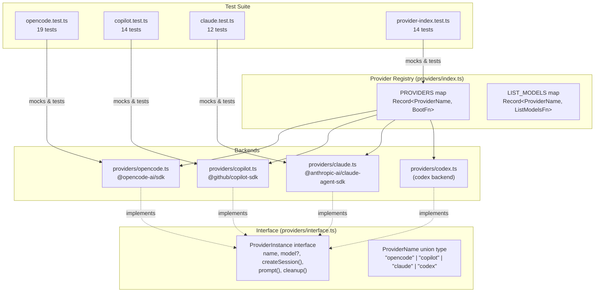

# Provider Unit Tests

This document covers the four test files that verify the provider abstraction
layer: the individual backend tests for Claude, Copilot, and OpenCode, plus
the registry tests for the provider index. Together they validate the
`ProviderInstance` lifecycle (boot, session creation, prompt, cleanup) across
all four registered backends.

## Test file inventory

| Test file | Production module | Lines (test) | Test count | Category |
|-----------|-------------------|-------------|------------|----------|
| `claude.test.ts` | `src/providers/claude.ts` | 186 | 12 | SDK mock, async generator |
| `copilot.test.ts` | `src/providers/copilot.ts` | 264 | 14 | SDK mock, event callbacks |
| `opencode.test.ts` | `src/providers/opencode.ts` | 480 | 19 | SDK mock, SSE streaming |
| `provider-index.test.ts` | `src/providers/index.ts` | 197 | 14 | Registry routing |

**Total: 1,127 lines of test code** covering 59 tests across 4 files.

## What these tests verify

All four test files follow the same structural pattern: they mock the external
SDK, import the production module, and test the four `ProviderInstance`
lifecycle methods (`boot`, `createSession`, `prompt`, `cleanup`). Each test
file verifies:

- **Boot**: Default and custom options, provider shape conformance, error
  propagation from the SDK
- **Session creation**: Successful creation, option forwarding (cwd, model),
  SDK failure propagation
- **Prompt**: Happy-path response extraction, missing session errors, null
  responses, SDK-level errors, streaming/event completion signals
- **Cleanup**: Resource teardown, error swallowing, idempotency (safe to call
  multiple times)

The `provider-index.test.ts` file additionally verifies:

- The `PROVIDER_NAMES` array contains exactly four entries (`opencode`,
  `copilot`, `claude`, `codex`)
- `bootProvider()` correctly routes to each backend's `boot()` function
- `listProviderModels()` routes to each backend's `listModels()` function
- Unknown provider names produce descriptive errors

## Provider abstraction architecture

The following diagram shows how the four provider backends implement a common
interface and how the registry routes to each one. This is the architecture
that the test suite validates.



## Prompt data flow comparison

Each provider backend uses a different mechanism to send prompts and receive
responses. The tests validate these distinct patterns through mocking. The
following diagram compares the three data flows side by side.

```mermaid
flowchart TB
    subgraph Claude["Claude: Async Generator"]
        C1["session.send(text)"] --> C2["session.stream()"]
        C2 --> C3["for await...of<br/>async generator"]
        C3 --> C4["Find type: 'assistant'<br/>yield event"]
        C4 --> C5["Extract message.content<br/>text field"]
    end

    subgraph Copilot["Copilot: Event Callbacks"]
        P1["session.send({ prompt })"] --> P2["session.on('session.idle')"]
        P2 --> P3["Promise resolves<br/>on idle callback"]
        P3 --> P4["session.getMessages()"]
        P4 --> P5["Find type: 'assistant.message'<br/>extract data.content"]
    end

    subgraph OpenCode["OpenCode: SSE + Fetch"]
        O1["session.promptAsync()"] --> O2["event.subscribe()<br/>SSE stream"]
        O2 --> O3["for await...of<br/>filter by sessionID"]
        O3 --> O4{"Event type?"}
        O4 -->|session.idle| O5["session.messages()"]
        O4 -->|session.error| O6["throw Error"]
        O4 -->|message.part.updated| O7["log delta,<br/>continue"]
        O5 --> O8["Find role: 'assistant'<br/>join text parts"]
    end
```



## Testing patterns

### The `vi.hoisted()` pattern

All four test files use `vi.hoisted()` to declare mock references that are
available to `vi.mock()` factory functions. This is a Vitest-specific pattern
required because `vi.mock()` calls are hoisted to the top of the file at
compile time (before any imports execute), but the mock factory functions need
references to mock objects.

**What it does**: `vi.hoisted()` executes its callback during module
evaluation (before hoisted `vi.mock()` calls), returning values that can be
captured in `const` bindings at module scope. These bindings are then available
inside `vi.mock()` factory functions.

**Why it is needed**: Without `vi.hoisted()`, variables declared at module
scope would not yet be initialized when the hoisted `vi.mock()` factories
execute (due to temporal dead zone rules for `const`/`let`). The hoisted
callback guarantees execution order: `vi.hoisted()` runs first, then
`vi.mock()` factories can reference the returned values.

**How it works in these tests**: Each test file follows the same three-step
pattern:

1. `vi.hoisted()` creates mock functions and objects (e.g., `mockCreateSession`,
   `mockClient`, `mockSession`)
2. `vi.mock()` calls use those references in their factory functions to wire up
   the mock module
3. The production module is imported after the mocks are registered

This pattern appears at:
- `src/tests/claude.test.ts:5-20`
- `src/tests/copilot.test.ts:5-28`
- `src/tests/opencode.test.ts:4-26`
- `src/tests/provider-index.test.ts:6-25`

### SDK mocking strategy

Each provider test fully mocks its external SDK dependency so that tests run
without network access, installed CLI tools, or API credentials. The mocking
is comprehensive -- every SDK function called by the production code is
replaced with a Vitest mock.

| Test file | Mocked module | Key mock objects |
|-----------|---------------|------------------|
| `claude.test.ts` | `@anthropic-ai/claude-agent-sdk` | `unstable_v2_createSession`, mock session with `send`, `stream`, `close` |
| `copilot.test.ts` | `@github/copilot-sdk` | `CopilotClient` constructor, `approveAll`, mock client with `start`/`stop`/`createSession`, mock session with `send`/`on`/`getMessages`/`destroy` |
| `opencode.test.ts` | `@opencode-ai/sdk` | `createOpencode`, `createOpencodeClient`, mock client with `config.get`/`session.create`/`session.promptAsync`/`session.messages`/`event.subscribe` |
| `provider-index.test.ts` | All four provider modules | `boot` and `listModels` from each provider |

All test files also mock `../helpers/logger.js` to prevent log output during
tests and to allow assertions on log calls (e.g., verifying that cleanup
errors are logged at debug level).

### Mock reset with `beforeEach`

Every test file calls `vi.clearAllMocks()` in a `beforeEach` hook and
re-initializes mock return values to their defaults. This ensures test
isolation -- each test starts with a clean mock state regardless of what
previous tests did to the mocks.

## Claude provider tests

**File**: `src/tests/claude.test.ts` (186 lines, 12 tests)
**Production module**: `src/providers/claude.ts`
**SDK**: `@anthropic-ai/claude-agent-sdk`

### What is tested

| Describe block | Tests | What is verified |
|----------------|-------|------------------|
| `boot` | 3 | Default model (`claude-sonnet-4`), custom model override, `ProviderInstance` shape |
| `createSession` | 4 | UUID-based session ID, `cwd` forwarding, `cwd` omission, SDK error propagation |
| `prompt` | 4 | Missing session error, async generator response extraction, null on empty stream, send failure |
| `cleanup` | 3 | Session close, graceful error handling, idempotency via `cleaned` flag |

### SDK integration: `@anthropic-ai/claude-agent-sdk`

**What is `unstable_v2_createSession`?** This is the session creation function
from the Claude Agent SDK (formerly the Claude Code SDK). The `unstable_v2_`
prefix indicates it is a pre-release API that may change in breaking ways. The
tests mock this function to return a session object with `send()`, `stream()`,
and `close()` methods.

**Why `permissionMode: 'acceptEdits'`?** The Claude Agent SDK requires a
permission mode when creating sessions. The `acceptEdits` mode tells the agent
it is allowed to make file edits without prompting for user confirmation. This
is appropriate for dispatch's automated task execution, where human-in-the-loop
confirmation would block the pipeline. The tests verify this option is always
passed (`src/tests/claude.test.ts:85`).

**How does the async generator pattern work?** The Claude provider calls
`session.send(text)` to queue a prompt, then iterates `session.stream()` which
returns an `AsyncGenerator`. Each yielded event has a `type` field; the
provider looks for `type: "assistant"` and extracts `message.content[0].text`.
The tests validate this by mocking `stream()` to return custom async
generators (`src/tests/claude.test.ts:125-134`).

**Session ID generation**: The Claude provider generates session IDs locally
using `randomUUID()` from `node:crypto`, unlike the other providers which
receive IDs from their respective servers. The tests mock `randomUUID` to
return a deterministic value (`"test-uuid-1234"`).

### Known issue: duplicate `vi.mock("node:crypto")`

The test file contains two `vi.mock("node:crypto", ...)` calls
(`src/tests/claude.test.ts:24-26` and `src/tests/claude.test.ts:32-34`). The
second call overwrites the first, so the hoisted `mockRandomUUID` reference
declared at line 17-20 is not actually used by the active mock. Instead, the
second mock creates an inline `vi.fn().mockReturnValue("test-uuid-1234")`.

The tests still pass because both mocks return the same value. However, the
`beforeEach` call to `mockRandomUUID.mockReturnValue("test-uuid-1234")` at
line 50 resets a mock function that is never actually called, which is dead
code. This is likely a copy-paste artifact and should be cleaned up in a future
change.

## Copilot provider tests

**File**: `src/tests/copilot.test.ts` (264 lines, 14 tests)
**Production module**: `src/providers/copilot.ts`
**SDK**: `@github/copilot-sdk`

### What is tested

| Describe block | Tests | What is verified |
|----------------|-------|------------------|
| `boot` | 7 | Client construction (with/without `cliUrl`, `cwd`, both), `client.start()`, start failure, `ProviderInstance` shape |
| `createSession` | 5 | Session ID return, `workingDirectory` forwarding, lazy model detection, model detection error swallowing, session creation failure |
| `prompt` | 4 | Missing session error, `session.idle` event response retrieval, null on empty messages, `session.error` event rejection |
| `cleanup` | 3 | Session destroy + client stop, destroy error logging, stop error logging |

### SDK integration: `@github/copilot-sdk`

**How does `CopilotClient` work?** The `@github/copilot-sdk` communicates
with GitHub Copilot through a JSON-RPC connection to the Copilot CLI server.
`new CopilotClient()` creates the client, optionally accepting `cliUrl` to
connect to an already-running server or `cwd` for working directory. The
`client.start()` call launches (or connects to) the CLI server. Tests verify
all constructor option combinations (`src/tests/copilot.test.ts:69-105`).

**What is the `approveAll` import?** The Copilot SDK exports `approveAll` as a
permission request handler. When creating a session, the provider passes
`{ onPermissionRequest: approveAll }` (or an equivalent function) so that the
agent can perform file operations without prompting for user approval -- similar
to Claude's `permissionMode: 'acceptEdits'`. Tests verify the
`onPermissionRequest` callback is passed (`src/tests/copilot.test.ts:122-124`).

**How does lazy model detection work?** The Copilot SDK does not expose the
model name at boot time. Instead, the provider detects the model on the first
`createSession()` call via `session.rpc.model.getCurrent()`, which returns
`{ modelId: "provider/model" }`. This is stored once; subsequent session
creations skip detection. The tests verify:
- Model is set after first session (`src/tests/copilot.test.ts:136-139`)
- `getCurrent` is not called again (`src/tests/copilot.test.ts:142-148`)
- Detection errors are swallowed, leaving `model` as `undefined`
  (`src/tests/copilot.test.ts:150-157`)

**How does the event-based prompt model work?** Unlike Claude's async generator
or OpenCode's SSE stream, the Copilot provider uses event callbacks:
1. `session.send({ prompt: text })` queues the message
2. `session.on("session.idle", handler)` registers a callback for completion
3. `session.on("session.error", handler)` registers a callback for errors
4. When idle fires, `session.getMessages()` retrieves the conversation
5. The last `assistant.message` event's `data.content` is returned

The tests simulate this by making `session.on` trigger callbacks via
`setTimeout(() => handler(), 0)` for the relevant event
(`src/tests/copilot.test.ts:177-183`).

### Cleanup behavior differences

The Copilot provider's cleanup is more involved than Claude's:
1. Iterate all sessions and call `session.destroy()` on each
2. Call `client.stop()` to terminate the CLI server process

The tests verify that destroy errors are caught and logged at debug level
(`src/tests/copilot.test.ts:246-254`), and that `client.stop()` errors are
similarly handled (`src/tests/copilot.test.ts:256-263`). Unlike the Claude and
OpenCode providers, the Copilot provider does not have an explicit
idempotency guard (`cleaned` flag), relying instead on error swallowing for
safety on double-cleanup.

## OpenCode provider tests

**File**: `src/tests/opencode.test.ts` (480 lines, 19 tests)
**Production module**: `src/providers/opencode.ts`
**SDK**: `@opencode-ai/sdk`

### What is tested

| Describe block | Tests | What is verified |
|----------------|-------|------------------|
| `boot` | 9 | Two connection modes (URL vs spawn), model from config, config failure, empty config, `port: 0` for spawn, cwd limitation logging, cwd with URL (no warning), spawn failure, `ProviderInstance` shape |
| `createSession` | 3 | Session ID from server, null data error, network error |
| `prompt` | 8 | SSE event response extraction, `promptAsync` error, `session.error` event, session ID filtering, null on empty messages, null on no assistant message, assistant error detection, AbortSignal on SSE stream, multi-part text joining, null on non-text parts |
| `cleanup` | 4 | Server close on spawn mode, idempotency, no close on URL mode, close error logging |

### SDK integration: `@opencode-ai/sdk`

**What are `createOpencode` and `createOpencodeClient`?** The OpenCode SDK
separates server lifecycle management into two functions:
- `createOpencode({ port })` spawns a local OpenCode HTTP server and returns
  `{ client, server }`. The tests mock this to return a mock client and mock
  `server.close` handle (`src/tests/opencode.test.ts:79-82`).
- `createOpencodeClient({ baseUrl })` connects to an already-running server
  without spawning. The tests verify these are called exclusively based on
  whether `opts.url` is provided (`src/tests/opencode.test.ts:94-101`,
  `120-125`).

**Why `port: 0`?** When spawning locally, the provider passes `port: 0` to
get an OS-assigned ephemeral port, avoiding conflicts with other dispatch runs
or existing `opencode serve` instances. The test at line 122 verifies this.

**How does the SSE prompt model work?** This is the most complex data flow
among the three providers. The provider:
1. Calls `client.session.promptAsync()` (fire-and-forget, returns immediately)
2. Subscribes to `client.event.subscribe()` with an `AbortSignal`
3. Iterates the SSE stream, filtering events by session ID
4. On `session.idle`, breaks out and fetches messages
5. Extracts text parts from the last assistant message

The tests construct SSE event sequences as arrays and convert them to async
generators using a helper function `arrayToAsyncGenerator()`
(`src/tests/opencode.test.ts:66-70`). This allows precise control over what
events the provider sees.

**Session ID filtering**: The SSE stream delivers events for all sessions on
the server. The provider's `isSessionEvent()` helper checks three possible
locations for the session ID depending on event type. The test at
`src/tests/opencode.test.ts:257-292` verifies that events for other sessions
are correctly ignored.

**AbortSignal verification**: The test at `src/tests/opencode.test.ts:361-389`
verifies that `event.subscribe` is called with an `AbortSignal`, ensuring the
SSE connection is properly cleaned up after the prompt completes.

**Multi-part text joining**: When the assistant response contains multiple text
parts, they are joined with newlines. The test at
`src/tests/opencode.test.ts:391-419` verifies this with three text parts
producing `"line one\nline two\nline three"`.

**Non-text part filtering**: Tool invocation parts and other non-text parts
are filtered out. The test at `src/tests/opencode.test.ts:421-445` verifies
that a response containing only `tool-invocation` parts returns `null`.

### CWD limitation

The OpenCode SDK's `createOpencode()` does not accept a `cwd` parameter. When
the user provides `opts.cwd` without `opts.url`, the provider logs a debug
message about this limitation but proceeds normally. The tests verify:
- The warning is logged when `cwd` is set without `url`
  (`src/tests/opencode.test.ts:127-136`)
- The warning is not logged when `url` is also provided
  (`src/tests/opencode.test.ts:138-144`)
- The spawn still works despite the warning
  (`src/tests/opencode.test.ts:146-150`)

## Provider index tests

**File**: `src/tests/provider-index.test.ts` (197 lines, 14 tests)
**Production module**: `src/providers/index.ts`

### What is tested

| Describe block | Tests | What is verified |
|----------------|-------|------------------|
| `PROVIDER_NAMES` | 3 | Contains all four names, has exactly 4 entries, is an array of strings |
| `bootProvider` | 7 | Routes to each of the 4 providers, passes options, returns the instance, unknown name error with provider list, error propagation |
| `listProviderModels` | 4 | Routes to list function, passes options, unknown name error, error propagation |

### Registry validation

The provider index tests mock all four provider modules rather than the
external SDKs. Each provider's `boot` and `listModels` exports are replaced
with mock functions. This tests the routing logic in isolation: given a
provider name, does `bootProvider()` call the correct `boot()` function?

The `createMockProvider()` helper (`src/tests/provider-index.test.ts:54-62`)
generates conformant `ProviderInstance` objects with mock methods, ensuring
tests focus on registry behavior rather than individual provider logic.

### Error message quality

The tests verify that unknown provider names produce errors that include the
available provider names (`src/tests/provider-index.test.ts:148-157`),
ensuring users get actionable feedback when they mistype a `--provider` value.

## Integration: Vitest

**Framework version**: Vitest v4.0.18 (configured in `package.json`, no
separate config file).

**Key Vitest features used in provider tests**:

| Feature | Usage | Why |
|---------|-------|-----|
| `vi.hoisted()` | All 4 files | Declare mock references available to `vi.mock()` factories |
| `vi.mock()` | All 4 files | Replace external SDK modules with test doubles |
| `vi.fn()` | All 4 files | Create mock functions with call tracking |
| `vi.clearAllMocks()` | All 4 files (in `beforeEach`) | Reset mock state between tests |
| `vi.restoreAllMocks()` | `opencode.test.ts` (in `afterEach`) | Restore original implementations after each test |
| `describe` / `it` | All 4 files | BDD-style test organization |
| `expect` matchers | All 4 files | Assertions including `toThrow`, `toBeNull`, `toHaveBeenCalledWith`, `resolves` |

**Why Vitest over Jest?** The project uses Vitest throughout (not just for
provider tests). Vitest provides native ESM support and TypeScript support
without additional configuration, which is important because the provider
modules use ESM imports (`import ... from "...js"`). See the
[testing overview](./overview.md) for the project-wide Vitest configuration.

## Integration: Node.js `crypto`

The Claude provider test mocks `node:crypto` to control `randomUUID()` output.
This is the only provider test that mocks a Node.js built-in module.

**Why mock it?** The Claude provider generates session IDs client-side using
`randomUUID()`, unlike Copilot (server-assigned `session.sessionId`) and
OpenCode (server-returned `data.id`). Mocking produces deterministic IDs
(`"test-uuid-1234"`) for assertion.

**How it is mocked**: Via `vi.mock("node:crypto", ...)` with a factory
function that returns `{ randomUUID: mockFn }`. See the
[known issue](#known-issue-duplicate-vimocknodecrypto) about the duplicate
mock registration.

## How to run

```sh
# Run all provider tests
npx vitest run src/tests/claude.test.ts src/tests/copilot.test.ts src/tests/opencode.test.ts src/tests/provider-index.test.ts

# Run a single provider test file
npx vitest run src/tests/claude.test.ts

# Run in watch mode
npx vitest src/tests/claude.test.ts

# Run with verbose output
npx vitest run --reporter=verbose src/tests/provider-index.test.ts
```

All provider tests run without network access, installed CLI tools, or API
credentials because all external SDK calls are mocked.

## Related documentation

- [Testing Overview](./overview.md) -- project-wide test strategy, framework,
  and coverage map
- [Provider Overview](../provider-system/provider-overview.md) -- architecture
  of the provider abstraction layer
- [Provider Detection](../prereqs-and-safety/provider-detection.md) -- Binary
  detection module that probes the same provider binaries tested here
- [Adding a Provider](../provider-system/adding-a-provider.md) -- step-by-step
  guide including testing guidance
- [OpenCode Backend](../provider-system/opencode-backend.md) -- production
  implementation details for the OpenCode provider
- [GitHub Copilot Backend](../provider-system/copilot-backend.md) -- production
  implementation details for the Copilot provider
- [Provider Interface](../shared-types/provider.md) -- `ProviderInstance`,
  `ProviderName`, and `ProviderBootOptions` type definitions
- [Configuration tests](./config-tests.md) -- comparison: file I/O testing
  patterns vs SDK mocking patterns
- [Shared Utilities testing](../shared-utilities/testing.md) -- comparison:
  fake timer patterns vs mock patterns
- [Timeout Utility](../shared-utilities/timeout.md) -- `withTimeout()` pattern
  referenced by the provider prompt lifecycle
