# Runner Unit Tests

This document covers the three test files that verify the orchestrator runner
(`src/orchestrator/runner.ts`): mode routing, respec discovery, datasource sync
behavior, and the `parseIssueFilename` re-export.

## Test file inventory

| Test file | Production module | Lines (test) | Test count | Category |
|-----------|-------------------|-------------|------------|----------|
| `runner.test.ts` | `src/orchestrator/runner.ts` | 377 | 18 | Boot, routing, mutual exclusion, error propagation |
| `respec-routing.test.ts` | `src/orchestrator/runner.ts` | 367 | 10 | Respec discovery, identifier formatting, large batch |
| `orchestrator.test.ts` | `src/orchestrator/runner.ts` | 305 | 8 | `parseIssueFilename` re-export, datasource sync |

**Total: 1,049 lines of test code** covering 36 tests across 3 files.

## What these tests verify

Together, the three test files provide comprehensive coverage of the runner's
routing logic, validation rules, and integration with downstream pipelines:

- **`runner.test.ts`**: Boot factory shape, `orchestrate()` delegation,
  `generateSpecs()` delegation, `run()` mode routing, `runFromCli()` pipeline
  selection, all mutual-exclusion combinations, error propagation from config
  resolution, dispatch pipeline, and spec pipeline.
- **`respec-routing.test.ts`**: The two respec code paths (discovery vs. direct
  delegation), identifier formatting (numeric join vs. array pass-through),
  empty discovery errors, `resolveSource` failure handling, and large batch
  confirmation interaction.
- **`orchestrator.test.ts`**: The `parseIssueFilename` re-export and the
  datasource sync-on-completion workflow (update calls, slug fallback, filename
  pattern matching, error handling, and full file content propagation).

## Architecture under test

The following diagram shows the components tested by each file:

```mermaid
graph TD
    subgraph "runner.ts"
        BOOT["boot() factory"]
        RUN["run() — mode routing"]
        CLI["runFromCli() — validation + routing"]
        ORCH["orchestrate() — dispatch delegation"]
        SPEC["generateSpecs() — spec delegation"]
        RE["parseIssueFilename re-export"]
    end

    subgraph "Test Files"
        RT["runner.test.ts<br/>18 tests"]
        RR["respec-routing.test.ts<br/>10 tests"]
        OT["orchestrator.test.ts<br/>8 tests"]
    end

    subgraph "Mocked Dependencies"
        RC["resolveCliConfig"]
        SP["runSpecPipeline"]
        DP["runDispatchPipeline"]
        FT["runFixTestsPipeline"]
        RS["resolveSource"]
        GD["getDatasource"]
        CB["confirmLargeBatch"]
    end

    RT -->|tests| BOOT
    RT -->|tests| RUN
    RT -->|tests| CLI
    RT -->|tests| ORCH
    RT -->|tests| SPEC

    RR -->|tests| CLI
    RR -->|mocks| RS
    RR -->|mocks| GD
    RR -->|mocks| CB

    OT -->|tests| RE
    OT -->|real I/O| OT

    RT -->|mocks| RC
    RT -->|mocks| SP
    RT -->|mocks| DP
    RT -->|mocks| FT
```



## runner.test.ts

**File**: `src/tests/runner.test.ts` (377 lines, 18 tests)

### What is tested

| Describe block | Tests | What is verified |
|----------------|-------|------------------|
| `boot()` | 1 | Returns an object with `orchestrate`, `generateSpecs`, `run`, and `runFromCli` methods |
| `orchestrate()` | 2 | Delegates to `runDispatchPipeline` with correct args and `cwd`; returns `DispatchSummary` |
| `generateSpecs()` | 2 | Delegates to `runSpecPipeline` with correct options; returns `SpecSummary` |
| `run()` | 4 | Routes to spec, fix-tests, or dispatch based on `mode` discriminator; strips `mode` before delegation |
| `runFromCli()` | 9 | Config resolution, pipeline routing for dispatch/spec/fix-tests, all mutual-exclusion combinations, `defaultConcurrency` fallback, error propagation from config/dispatch/spec |

### Mocking strategy

All external dependencies are mocked at module level via `vi.mock()`:

| Mocked module | Mock behavior |
|---------------|---------------|
| `helpers/logger.js` | Silent no-op logger |
| `orchestrator/cli-config.js` | Pass-through (returns args unchanged) |
| `spec-generator.js` | `resolveSource` returns `"md"`, `defaultConcurrency` returns `2` |
| `datasources/index.js` | `getDatasource` returns mock |
| `orchestrator/spec-pipeline.js` | `runSpecPipeline` returns empty summary |
| `orchestrator/dispatch-pipeline.js` | `runDispatchPipeline` returns empty summary |
| `orchestrator/fix-tests-pipeline.js` | `runFixTestsPipeline` returns `{ mode: "fix-tests", success: true }` |

The `process.exit` is spied on and overridden to throw an error, allowing tests
to assert that exit was triggered without actually terminating the test process.

### Mutual exclusion test matrix

The test file exhaustively validates every forbidden flag combination:

| Test | Flags | Expected error |
|------|-------|----------------|
| `--spec` + `--fix-tests` | `{ spec: "1", fixTests: true }` | `"mutually exclusive"` |
| `--respec` + `--fix-tests` | `{ respec: "1", fixTests: true }` | `"mutually exclusive"` |
| `--fix-tests` + issue IDs | `{ fixTests: true, issueIds: ["1"] }` | `"cannot be combined with issue IDs"` |
| `--feature` + `--no-branch` | `{ feature: true, noBranch: true }` | `"mutually exclusive"` |
| `--feature` + `--spec` | `{ feature: true, spec: "1" }` | `"mutually exclusive"` |
| `--feature` + `--fix-tests` | `{ feature: true, fixTests: true }` | `"mutually exclusive"` |

### Error propagation tests

Three tests verify that errors from downstream modules propagate unmodified:

- `resolveCliConfig` rejection → `"config error"` propagates
- `runDispatchPipeline` rejection → `"dispatch error"` propagates
- `runSpecPipeline` rejection → `"spec error"` propagates

This confirms the runner's design as a thin routing layer with no error
wrapping or retry logic.

## respec-routing.test.ts

**File**: `src/tests/respec-routing.test.ts` (367 lines, 10 tests)

### What is tested

| Test | Category | What is verified |
|------|----------|------------------|
| Discovery via `datasource.list()` | Discovery path | Empty respec triggers `resolveSource` → `getDatasource` → `list()` → `runSpecPipeline` with comma-joined issues |
| Direct delegation (issue numbers) | Direct path | `respec: "5,10"` bypasses discovery, passes directly to `runSpecPipeline` |
| Direct delegation (file paths) | Direct path | `respec: ["src/**/*.md"]` bypasses discovery, passes array to `runSpecPipeline` |
| `--spec` + `--respec` mutual exclusion | Validation | Both flags together → `process.exit(1)` with error |
| Empty discovery error | Discovery path | `datasource.list()` returns `[]` → `process.exit(1)` with `"No existing specs found"` |
| Numeric identifier joining | Formatting | All-numeric identifiers → `"42,99,7"` comma-separated string |
| Mixed identifier array | Formatting | Non-numeric identifiers → `["42", "feature-auth", "7"]` array |
| `resolveSource` failure | Discovery path | `resolveSource` returns `null` → `process.exit(1)` |
| Large batch confirmation | Discovery path | 150 items → `confirmLargeBatch(150)` is called |
| Declined confirmation | Discovery path | User declines → `process.exit(0)` (clean exit), no pipeline invoked |

### Identifier formatting behavior

The respec discovery flow formats identifiers based on their content:

```
All numeric ("42", "99", "7")   → "42,99,7"    (comma-joined string → tracker mode)
Mixed ("42", "feature-auth")    → ["42", "feature-auth", "7"]  (array → file/glob mode)
```

This is verified at `src/tests/respec-routing.test.ts:277-311`. The formatting
ensures the downstream `isIssueNumbers()` classifier in the spec pipeline
receives input in the expected format.

### Large batch threshold

The test mocks `LARGE_BATCH_THRESHOLD` as `100` (matching the production
default). When the discovery flow finds more than 100 items,
`confirmLargeBatch()` is called with the actual count. The user can confirm
(proceed with generation) or decline (exit with code `0`).

## orchestrator.test.ts

**File**: `src/tests/orchestrator.test.ts` (305 lines, 8 tests)

### What is tested

| Describe block | Tests | What is verified |
|----------------|-------|------------------|
| `parseIssueFilename re-export` | 2 | Re-exported function parses `42-add-user-auth` correctly; returns `null` for invalid filenames |
| `datasource sync on task completion` | 6 | Full sync lifecycle: `markTaskComplete` → `readFile` → `parseIssueFilename` → `datasource.update()` |

### Datasource sync tests

These tests verify the orchestrator's sync-after-completion workflow using
**real filesystem I/O** (not mocks). Each test creates a temp directory,
writes a markdown file, marks a task complete via `markTaskComplete()`, reads
the updated content, and then simulates the datasource sync step:

| Test | Scenario | Verified behavior |
|------|----------|-------------------|
| Correct sync call | Normal case | `datasource.update("42", "Add User Auth", updatedContent, fetchOpts)` |
| Slug fallback | No `IssueDetails` available | Title falls back to slug from filename (`"sync-task-completion"`) |
| Pattern mismatch skip | Filename lacks `<id>-` prefix | `parseIssueFilename` returns `null`; `update()` not called |
| Error handling | `datasource.update()` rejects | Error is caught (not thrown); message is extracted |
| Non-Error rejection | Rejects with string | `log.extractMessage()` handles non-Error values |
| Partial completion | Multi-task file | Full file content (checked + unchecked tasks) passed to `update()` |

### Testing pattern: real I/O + mock datasource

Unlike `runner.test.ts` and `respec-routing.test.ts` which mock all
dependencies, `orchestrator.test.ts` uses real filesystem operations for the
markdown mutation workflow and only mocks the `Datasource` interface. This
validates the actual file read/write behavior of `markTaskComplete()` alongside
the orchestrator's sync logic.

Each test creates a unique temp directory via `mkdtemp()` and cleans it up in
`afterEach`, following the project-wide [real filesystem I/O testing
pattern](./overview.md#real-filesystem-io-no-mocks).

## Integration: Vitest

All three test files use these Vitest features:

| Feature | Usage |
|---------|-------|
| `vi.mock()` | Module-level mocks for pipeline dependencies |
| `vi.fn()` | Mock functions for datasource methods |
| `vi.mocked()` | Type-safe access to mock implementations |
| `vi.spyOn(process, "exit")` | Override `process.exit` to prevent test runner termination |
| `vi.clearAllMocks()` | Reset mock state in `beforeEach` |
| `vi.restoreAllMocks()` | Restore original implementations in `afterEach` |
| `describe` / `it` | BDD-style organization |

### The `process.exit` spy pattern

Both `runner.test.ts` and `respec-routing.test.ts` use the same pattern for
testing `process.exit()` calls:

```typescript
vi.spyOn(process, "exit").mockImplementation((() => {
  throw new Error("process.exit called");
}) as never);
```

Tests then use `expect(...).rejects.toThrow("process.exit called")` to verify
that validation failures trigger the correct exit. This is a project-wide
pattern documented in the [testing overview](./overview.md#process-exit-mocking).

## How to run

```sh
# Run all runner tests
npx vitest run src/tests/runner.test.ts src/tests/respec-routing.test.ts src/tests/orchestrator.test.ts

# Run a single test file
npx vitest run src/tests/runner.test.ts

# Run in watch mode
npx vitest src/tests/runner.test.ts

# Run with verbose output
npx vitest run --reporter=verbose src/tests/respec-routing.test.ts
```

All runner tests run without network access, AI providers, or external CLI
tools because all downstream pipeline calls are mocked.

## Related documentation

- [Testing Overview](./overview.md) — project-wide test strategy, framework,
  and coverage map
- [Orchestrator Pipeline](../cli-orchestration/orchestrator.md) — the
  production code these tests verify
- [Configuration Tests](./config-tests.md) — testing patterns for the
  config resolution that the runner calls
- [Spec Generator Tests](./spec-generator-tests.md) — tests for the spec
  pipeline invoked by the runner
- [Datasource Testing](../datasource-system/testing.md) — tests for the
  datasource layer consumed during respec discovery
- [Datasource Helpers](../datasource-system/datasource-helpers.md) — the
  `parseIssueFilename` function re-exported by the runner
- [Prerequisites](../prereqs-and-safety/prereqs.md) — `checkPrereqs()` called
  by `runFromCli()` before mode routing
- [Batch Confirmation](../prereqs-and-safety/confirm-large-batch.md) — the
  safety prompt tested in respec discovery
- [Fix-Tests Tests](./fix-tests-tests.md) — tests for the fix-tests
  pipeline, another routing target of the runner
- [Dispatch Pipeline Tests](./dispatch-pipeline-tests.md) — tests for the
  dispatch pipeline, the primary routing target of the runner
