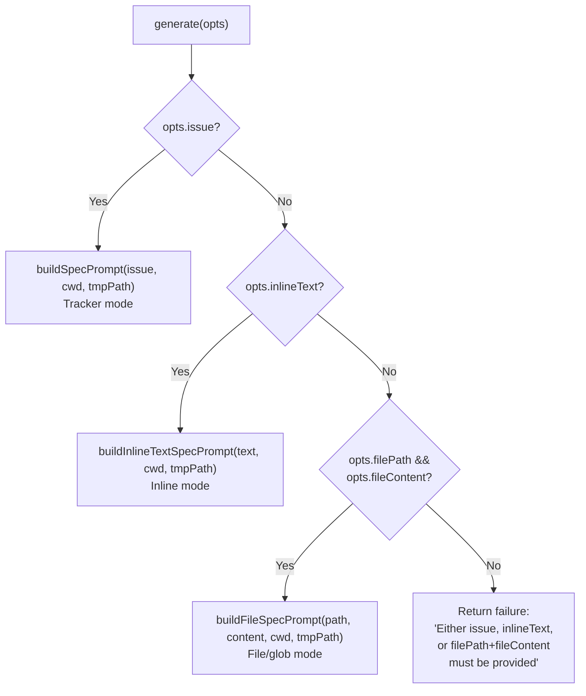
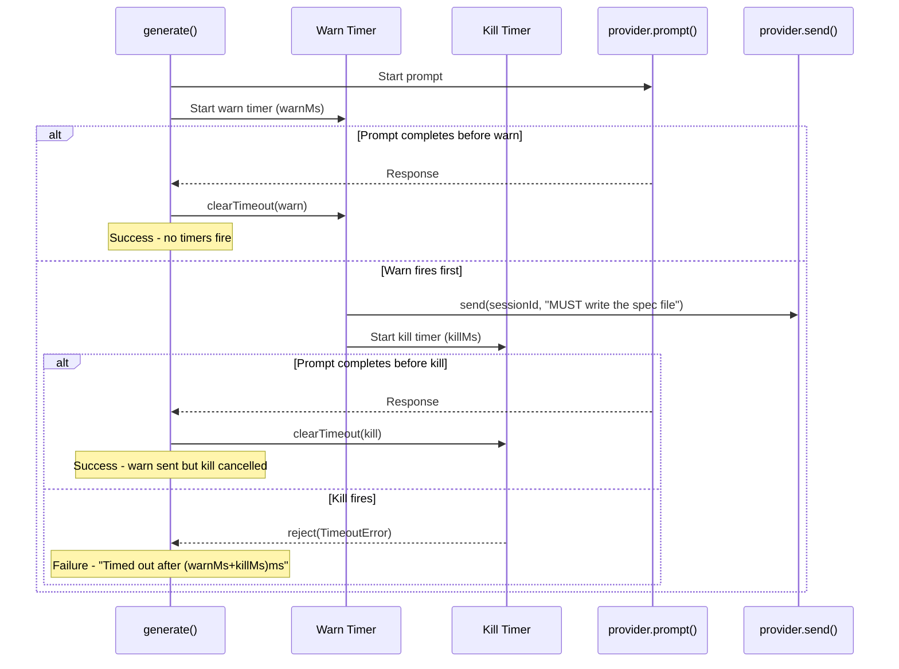
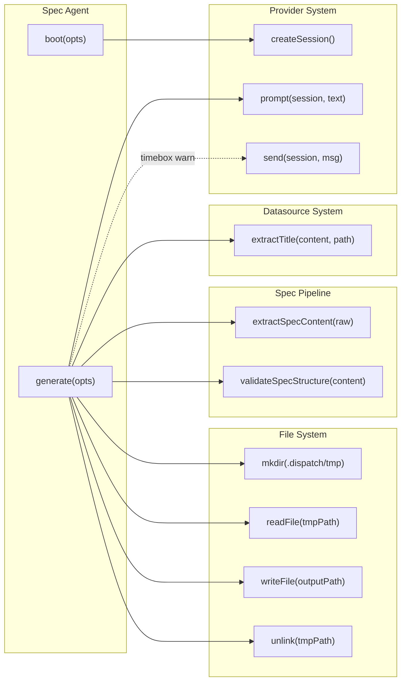

# Spec Agent Tests

This document provides a detailed breakdown of
`src/tests/spec-agent.test.ts`, which tests the spec agent defined in
[`src/agents/spec.ts`](../../src/agents/spec.ts). The spec agent generates
high-level markdown spec files from issue details, file content, or inline
text by interacting with an AI provider.

## What is tested

The test file covers the spec agent's lifecycle, three-mode input routing,
provider interaction, temp file workflow, validation integration,
progress forwarding, path security, and the two-phase timebox mechanism.

**Total: 6 describe blocks, ~55 tests, 926 lines of test code.**

## Test file structure

| Describe block | Tests | What is verified |
|----------------|-------|------------------|
| `boot` | 4 | Provider requirement, agent name, method presence, cleanup |
| `generate` | 15 | Three input modes, provider interaction, error handling, path security, temp file lifecycle, validation, progress forwarding |
| `buildSpecPrompt` | 9 | Issue-mode prompt construction, metadata, sections, environment |
| `buildFileSpecPrompt` | 8 | File-mode prompt construction, title extraction, output path fallback |
| `buildInlineTextSpecPrompt` | 8 | Inline-mode prompt construction, title truncation |
| `timebox` | 8 | Two-phase timebox: warn timer, kill timer, timer cancellation, edge cases |

## Mocking strategy

The spec agent tests use `vi.mock()` at the module level (without
`vi.hoisted()`) and import the mocked symbols for per-test configuration
via `vi.mocked()`.

### Module-level mocks

| Mocked module | Mock shape | Purpose |
|---------------|------------|---------|
| `node:fs/promises` | `{ mkdir, readFile, writeFile, unlink }` | Full temp file lifecycle |
| `node:crypto` | `{ randomUUID }` | Deterministic temp file paths |
| `../helpers/logger.js` | Full `log` object with all methods | Suppress log output |
| `../spec-generator.js` | `{ extractSpecContent, validateSpecStructure, DEFAULT_SPEC_WARN_MIN, DEFAULT_SPEC_KILL_MIN }` | Control post-processing and validation |
| `../datasources/md.js` | `{ extractTitle }` | Control title derivation for file-mode prompts |

### Local helper factory

The test file defines its own `createMockProvider(overrides?)` rather than
importing from `src/tests/fixtures.ts`. It produces the same
`ProviderInstance` shape with `createSession`, `prompt`, and `cleanup`
mocks.

### Test fixtures

- **`VALID_SPEC`** — A well-formed spec string with H1, blockquote summary,
  `## Context`, `## Tasks` with `(P)` and `(S)` prefixed checkboxes.
- **`ISSUE_FIXTURE`** — An `IssueDetails` object (`number: "42"`,
  `title: "My Feature"`, `labels: ["enhancement"]`).
- **`expectSingleSourceScopeInstructions(prompt)`** — A shared assertion
  helper that verifies the four scope-isolation instructions appear in all
  three prompt variants.

## Three-mode input routing

The spec agent supports three mutually exclusive input modes. The
`generate()` method inspects its options to determine which prompt builder
to call:



**Tests covering each mode:**

| Mode | Test name | Input |
|------|-----------|-------|
| Tracker | generates a spec from issue details (tracker mode) | `{ issue: ISSUE_FIXTURE }` |
| File/glob | generates a spec from file content (file/glob mode) | `{ filePath, fileContent }` |
| Inline | generates a spec from inline text | `{ inlineText: "Add a new authentication module" }` |
| None | returns failure when neither issue, inlineText, nor filePath+fileContent | `{}` (empty) |
| Partial | returns failure when only filePath is provided without fileContent | `{ filePath }` only |

## Two-phase timebox mechanism

The spec agent implements a two-phase timebox that bounds how long the AI
provider can spend generating a spec. This is the most complex testing
area in the file and uses Vitest fake timers.



### Timebox test cases (8 tests)

| Test | Timer state | Outcome |
|------|-------------|---------|
| cancels both timers when prompt completes before warn fires | Both cleared | Success |
| sends a wrap-up message when the warn timer fires | Warn fires, kill starts | `send()` called with `"MUST write the spec file"` |
| rejects with TimeoutError when the kill timer fires | Both fire | `"Timed out after 8000ms [spec timebox]"` |
| cancels the kill timer when prompt completes after warn but before kill | Warn fires, kill cleared | Success, `send()` was called |
| still starts the kill timer when provider has no send() method | No `send()` available | Kill still fires, `"Timed out after 8000ms"` |
| catches and logs send() errors without preventing the kill timer | `send()` rejects | Kill still fires despite send failure |
| cleans up timers when the prompt rejects before warn fires | Both cleared | Failure from prompt error, `send()` never called |
| (implicit) uses fake timers for deterministic time control | `vi.useFakeTimers()` | All timebox tests use `advanceTimersByTimeAsync()` |

**Timer configuration in tests:**
- `timeboxWarnMs: 5_000` (5 seconds)
- `timeboxKillMs: 3_000` (3 seconds)
- Total timeout: 8 seconds (warn + kill)

**Fake timer lifecycle:**
- `beforeEach`: `vi.useFakeTimers()` + mock setup
- `afterEach`: `vi.useRealTimers()` + `vi.clearAllMocks()`
- Timer advancement: `await vi.advanceTimersByTimeAsync(ms)` (async version
  required for promise resolution during timer advancement)

## Agent-provider-datasource interaction

The spec agent interacts with three systems during generation:



### Provider interaction flow

1. `boot()` validates that `opts.provider` exists
2. `generate()` calls `provider.createSession()` to get a session ID
3. `generate()` calls `provider.prompt(sessionId, prompt, { onProgress })`
4. If timebox warn fires and `provider.send` exists, `provider.send(sessionId, warnMessage)` is called
5. Provider lifecycle (cleanup) is managed externally by the pipeline

### Datasource interaction

- `extractTitle()` from `../datasources/md.js` is called only in file/glob
  mode to derive the spec title from file content
- The mock returns `"Extracted Title"` for all inputs

### Spec pipeline integration

- `extractSpecContent()` post-processes the raw AI output (strips code
  fences, preamble, postamble)
- `validateSpecStructure()` checks the cleaned content for required
  structural elements (H1, ## Tasks, checkboxes)
- Both are mocked to passthrough/succeed by default; `validateSpecStructure`
  is overridden in one test to return `{ valid: false }` to test validation
  warning paths

## Describe block details

### boot (4 tests)

| Test | Assertion |
|------|-----------|
| throws when provider is not supplied | Rejects with `"Spec agent requires a provider instance"` |
| returns an agent with name 'spec' | `agent.name === "spec"` |
| returns an agent with generate and cleanup methods | Both are functions |
| cleanup resolves without error | `agent.cleanup()` resolves to `undefined` |

### generate (15 tests)

**Success paths:**

| Test | Input mode | Key assertions |
|------|------------|----------------|
| tracker mode | `{ issue }` | `success: true`, `valid: true`, content contains H1, `mkdir`/`readFile`/`writeFile`/`unlink` all called |
| file/glob mode | `{ filePath, fileContent }` | `success: true`, `valid: true` |
| inline text mode | `{ inlineText }` | `success: true`, `prompt` called once |
| progress forwarding (single) | `{ issue, onProgress }` | `onProgress` called with snapshot, prompt called with `{ onProgress }` |
| progress forwarding (multiple, ordered) | `{ issue, onProgress }` | Snapshots received in order |
| temp file cleanup on success | `{ issue }` | `unlink` called with temp path |
| unique temp paths via randomUUID | Two sequential calls | Different UUID in each `readFile` call |

**Failure paths:**

| Test | Trigger | Error message |
|------|---------|---------------|
| no input provided | `{}` | `"Either issue, inlineText, or filePath+fileContent must be provided"` |
| only filePath without fileContent | `{ filePath }` | Same as above |
| AI returns null | `prompt → null` | `"AI agent returned no response"` |
| AI does not write temp file | `readFile → ENOENT` | `"Spec agent did not write the file"` |
| createSession throws | `createSession → Error` | `"Connection refused"` |
| prompt throws | `prompt → Error` | `"Model overloaded"` |
| non-Error exception | `createSession → "raw string error"` | `"raw string error"` |

**Security:**

| Test | Assertion |
|------|-----------|
| outputPath escapes working directory | `outputPath: "/etc/malicious/output.md"` → failure with `"escapes the working directory"`, `writeFile` and `createSession` never called |

**Resilience:**

| Test | Assertion |
|------|-----------|
| temp file cleanup failure is swallowed | `unlink → ENOENT` does not prevent `success: true` |
| validation warnings for invalid specs | `validateSpecStructure → { valid: false }` → `success: true` but `data.valid === false` with `validationReason` |

### buildSpecPrompt (9 tests)

Tests the tracker-mode prompt builder:

| Test | What it verifies |
|------|------------------|
| includes issue details | `#42`, `My Feature`, `open`, URL |
| includes labels | `"enhancement"` |
| includes body as description | Issue body text |
| includes acceptance criteria | Custom criteria text |
| includes comments | Discussion comments |
| omits labels section when empty | No `"**Labels:**"` |
| includes working directory | cwd in prompt |
| includes output path | Output path in prompt |
| includes spec agent preamble | `"You are a **spec agent**"` |
| includes (P)/(S) tagging instructions | Mode prefix documentation |
| includes all required spec sections | Context, Why, Approach, Integration Points, Tasks, References, Key Guidelines |
| includes environment context | `"## Environment"`, `"Operating System"` |
| includes scope isolation instructions | Four scope-isolation statements |

### buildFileSpecPrompt (8 tests)

Tests the file/glob-mode prompt builder:

| Test | What it verifies |
|------|------------------|
| includes file details | File path in prompt |
| calls extractTitle | `extractTitle` called with content and path |
| includes file content | Content text in prompt |
| uses outputPath when provided | Custom output path appears |
| falls back to filePath when outputPath omitted | Source path used as output |
| includes spec agent preamble | `"You are a **spec agent**"` |
| includes all required spec sections | All 7 H2 sections |
| includes environment and scope isolation | Both present |

### buildInlineTextSpecPrompt (8 tests)

Tests the inline-text-mode prompt builder:

| Test | What it verifies |
|------|------------------|
| includes inline text | Text appears in prompt |
| truncates long titles to 80 chars | 100-char text → 80 chars + `"..."` |
| does not truncate short titles | `"Short title"` appears verbatim with `"**Title:**"` prefix |
| includes working directory | cwd in prompt |
| includes output path | Output path in prompt |
| includes spec agent preamble | `"You are a **spec agent**"` |
| includes all required spec sections | All 7 H2 sections |
| includes environment and scope isolation | Both present |

## Integration: Vitest fake timers

The timebox tests use Vitest's fake timer API to control time
deterministically. This avoids flaky tests that depend on real wall-clock
timing.

**Key APIs used:**

| API | Purpose |
|-----|---------|
| `vi.useFakeTimers()` | Replace global timer functions |
| `vi.useRealTimers()` | Restore real timers (in `afterEach`) |
| `vi.advanceTimersByTimeAsync(ms)` | Advance time and flush pending microtasks |

**Why `advanceTimersByTimeAsync` instead of `advanceTimersByTime`:**
The timebox mechanism uses promises (`new Promise((resolve, reject) => {...})`).
When timers fire, they resolve/reject promises that need microtask queue
processing. The async variant ensures these microtasks are flushed during
timer advancement. Using the synchronous version would leave promises
unsettled.

**Pattern for testing never-resolving promises:**
```
const promptPromise = new Promise<string | null>(() => {});  // never resolves
```
This simulates an AI provider that hangs indefinitely, allowing the kill
timer to fire and reject the outer promise.

## Integration: TimeoutError

The spec agent imports `TimeoutError` from `src/helpers/timeout.ts` and
uses it directly in the timebox mechanism (not via `withTimeout()`). The
kill timer creates a `new TimeoutError(warnMs + killMs, "spec timebox")`
with the combined duration and a label.

Tests verify:
- The error message format: `"Timed out after 8000ms [spec timebox]"`
- The error is returned as `result.error`, not thrown

## How to run

```sh
# Run spec agent tests
npx vitest run src/tests/spec-agent.test.ts

# Run in watch mode
npx vitest src/tests/spec-agent.test.ts

# Run with verbose output
npx vitest run --reporter=verbose src/tests/spec-agent.test.ts
```

All tests run without network access, filesystem I/O, or API credentials.

## Troubleshooting

### Timebox tests hang or fail intermistently

Ensure `vi.useFakeTimers()` is called in `beforeEach` and
`vi.useRealTimers()` in `afterEach` within the `timebox` describe block.
Mixing fake and real timers in the same test will cause hangs.

Use `await vi.advanceTimersByTimeAsync(ms)` (not the sync variant) when
the code under test involves promises. The async version flushes microtasks
during advancement.

### "Spec agent did not write the file" in a new test

The `readFile` mock must be configured to return spec content before calling
`agent.generate()`. The default mock returns `""`, and after
`extractSpecContent` passthrough, the empty string gets validated. If your
test needs the happy path, add:

```typescript
vi.mocked(readFile).mockResolvedValue(VALID_SPEC);
```

### Progress callback not called

The provider's `prompt` mock must invoke `options?.onProgress?.(snapshot)`
within its implementation. The default mock (`mockResolvedValue("done")`)
does not call `onProgress`.

## Related documentation

- [Testing Overview](overview.md) — Project-wide test strategy and coverage
- [Commit Agent Tests](commit-agent-tests.md) — Similar agent test patterns
  without the timebox complexity
- [Planner & Executor Tests](planner-executor-tests.md) — Adjacent agent
  test patterns (boot, provider mock, worktree isolation)
- [Spec Generator Tests](spec-generator-tests.md) — Tests for spec pipeline
  utilities (`isIssueNumbers`, `isGlobOrFilePath`, `resolveSource`,
  `validateSpecStructure`, `extractSpecContent`) consumed by the spec agent
- [Provider Tests](provider-tests.md) — Provider backend tests exercising
  the same `ProviderInstance` interface
- [Test Fixtures](test-fixtures.md) — Shared mock factories
- [Shared Utilities Testing](../shared-utilities/testing.md) — Fake timer
  patterns used in `timeout.test.ts` (comparable to timebox tests)
- [Spec Generation Overview](../spec-generation/overview.md) — Full
  pipeline documentation
- [Architecture Overview](../architecture.md) — Where the spec agent fits
  in the pipeline
- [Timeout Utility](../shared-utilities/timeout.md) — `withTimeout()` used
  for spec generation deadline enforcement
- [Concurrency Utility](../shared-utilities/concurrency.md) — sliding-window
  model used for parallel spec generation
- [Datasource System Overview](../datasource-system/overview.md) — datasource
  abstraction used for spec syncing after generation
