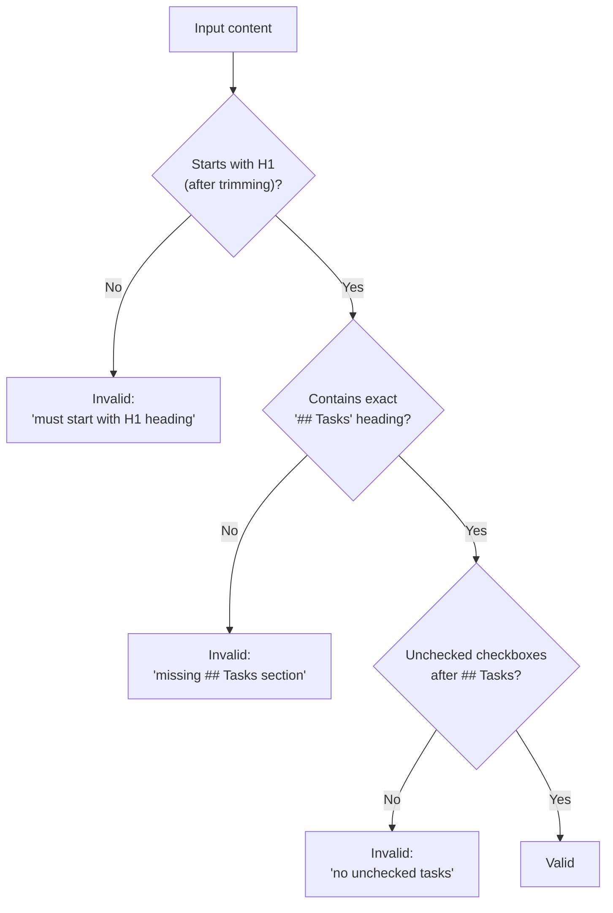
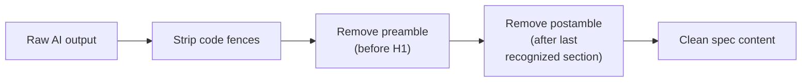

# Spec Generator Tests

This document provides a detailed breakdown of
`src/tests/spec-generator.test.ts`, which tests the spec generation pipeline
utilities defined in [`src/spec-generator.ts`](../../src/spec-generator.ts).

## What is tested

The spec generator module converts issue tracker items (or local files) into
high-level markdown spec files. The test file covers four exported functions
that handle input classification, prompt construction, output validation, and
content extraction. The tests do **not** cover the top-level `generateSpecs()`
orchestration function, which requires [AI provider](../shared-types/provider.md) integration.

## Describe blocks

The test file contains **4 describe blocks** with **48 tests** total.

### isIssueNumbers (21 tests)

Tests the `isIssueNumbers()` function, which determines whether a user-supplied
argument string represents issue numbers (e.g., `"42"` or `"1,2,3"`) versus a
file path or glob pattern.

**Valid inputs (return `true`):**

| Test | Input | Why it matches |
|------|-------|----------------|
| single issue number | `"42"` | Lone positive integer |
| comma-separated issue numbers | `"1,2,3"` | Comma-delimited integers |
| comma-separated with spaces | `"1, 2, 3"` | Spaces after commas allowed |
| two numbers with space after comma | `"10, 20"` | Minimal comma+space case |
| single digit | `"1"` | Smallest valid issue number |
| large issue number | `"12345"` | No upper bound on digits |
| many comma-separated numbers | `"1,2,3,...,10"` | Long list of issue numbers |

**Invalid inputs (return `false`):**

| Test | Input | Why it fails |
|------|-------|-------------|
| empty string | `""` | No content |
| glob pattern | `"drafts/*.md"` | Contains `*` and `/` |
| relative file path | `"./my-spec.md"` | Starts with `./` |
| bare filename | `"spec.md"` | Contains `.` extension |
| path with directories | `"docs/specs/feature.md"` | Contains `/` |
| whitespace only | `"   "` | Whitespace not valid |
| trailing comma | `"1,2,"` | Malformed list |
| leading comma | `",1,2"` | Malformed list |
| double commas | `"1,,2"` | Malformed list |
| mixed alpha and digits | `"1a,2b"` | Non-numeric characters |
| only a comma | `","` | No numbers |
| bare wildcard glob | `"*.md"` | Glob syntax |
| dot-slash relative path | `"./spec.md"` | Path syntax |
| relative subdirectory path | `"drafts/feature.md"` | Path syntax |
| mixed numeric and alphabetic | `"42,foo"` | Non-numeric token |

This function is the first decision point in the [spec pipeline](../spec-generation/overview.md) -- it determines
whether the `--spec` argument is treated as issue numbers to fetch or as a file
path/glob to read from disk.

### buildFileSpecPrompt (18 tests)

Tests the `buildFileSpecPrompt()` function, which constructs the AI prompt for
spec generation from a local file (as opposed to a fetched issue).

The function takes three parameters:
- `filePath` — absolute path to the source file
- `content` — file content as a string
- `cwd` — current working directory

| Test | What it verifies |
|------|------------------|
| returns a string | Basic return type |
| derives the title from the filename without extension | `my-feature.md` → title `my-feature` |
| includes the source file path | File path appears in metadata |
| includes the file content under a Content heading | Content injected under `### Content` |
| uses the file path as the output path | Output path references the source file |
| includes the working directory | `cwd` appears in the prompt |
| includes the spec agent preamble | Contains `"You are a **spec agent**"` |
| includes the two-stage pipeline explanation | Mentions `planner agent` and `coder agent` |
| includes all required spec sections in the template | All 7 H2 sections present |
| includes `(P)`/`(S)`/`(I)` tagging instructions | Parallel/serial/isolated mode instructions ([parser](../task-parsing/overview.md)) |
| includes the task example | Example tasks with `(P)` and `(S)` prefixes |
| includes all five instructions | Numbered instruction list 1-5 |
| does not include issue-specific metadata | No `**Number:**`, `**State:**`, `**URL:**`, etc. |
| uses `# <Title>` in output template | File-based template, not issue-based |
| omits Content section when content is empty | Empty file produces no `### Content` section |
| handles a file path without `.md` extension | `.txt` file → title includes extension |
| includes all key guidelines | All 7 key guidelines present |

**Required spec sections verified by tests:**

1. `## Context`
2. `## Why`
3. `## Approach`
4. `## Integration Points`
5. `## Tasks`
6. `## References`
7. `## Key Guidelines`

**Key guidelines verified by tests:**

1. Stay high-level
2. Respect the project's stack
3. Explain WHAT, WHY, and HOW (strategically)
4. Detail integration points
5. Keep tasks atomic and ordered
6. Tag every task with `(P)`, `(S)`, or `(I)`
7. Keep the markdown clean

### validateSpecStructure (11 tests)

Tests the `validateSpecStructure()` function, which checks whether AI-generated
spec content has the required structural elements.

The function returns `{ valid: true }` or `{ valid: false, reason: string }`.

**Three validation checks (in order):**

1. Content must start with an H1 heading (`#`) after optional leading whitespace
2. A `## Tasks` section must exist (exact match, not a substring like
   `## Tasks and Notes`)
3. The `## Tasks` section must contain at least one unchecked checkbox (`- [ ]`)



| Test | What it verifies |
|------|------------------|
| returns valid for a well-formed spec | Happy path with all elements |
| returns invalid when content does not start with H1 | Preamble before H1 fails |
| returns invalid when `## Tasks` section is missing | Missing Tasks heading |
| returns invalid when `## Tasks` has no checkboxes | Tasks section without `- [ ]` |
| returns valid when content has leading whitespace before H1 | Blank lines/spaces before H1 OK |
| returns invalid for empty content | Empty string fails H1 check |
| returns invalid for conversational AI response | AI meta-text (not a spec) fails |
| does not count checkboxes before `## Tasks` | Checkboxes in `## Context` not counted |
| returns valid with a single checkbox | Minimal valid spec |
| returns valid when checked and unchecked tasks coexist | `[x]` + `[ ]` is valid |
| returns invalid when `## Tasks` is a substring | `## Tasks and Notes` does not match |

**Additional behavior:** The `reason` property is `undefined` when `valid` is
`true`, ensuring consumers can safely check `result.reason` only on failures.

### extractSpecContent (12 tests)

Tests the `extractSpecContent()` function, which cleans up AI-generated spec
output by stripping code fences, preamble, and postamble.

**Three-stage extraction pipeline:**



| Test | What it verifies |
|------|------------------|
| passes through already-clean content unchanged | Clean input is idempotent |
| strips markdown code-fence wrapping | `` ```markdown ... ``` `` → inner content |
| strips bare code-fence wrapping without language tag | `` ``` ... ``` `` → inner content |
| removes preamble text before the first H1 heading | `"Here's the spec:"` stripped |
| removes postamble text after the last recognized section | `"Let me know..."` stripped |
| handles content with both preamble and postamble | Combined cleanup |
| returns unrecognizable content as-is when no H1 found | Passthrough for non-spec content |
| returns content as-is when no H1 after fence stripping | No headings → no extraction |
| handles empty string input | Empty → empty |
| preserves all recognized H2 sections | All 7 spec sections survive extraction |
| does not strip internal code fences within the spec | Code examples inside spec preserved |
| handles content where only preamble exists | Preamble-only removal, no postamble |

**Recognized H2 sections** (used for postamble detection):
- `## Context`
- `## Why`
- `## Approach`
- `## Integration Points`
- `## Tasks`
- `## References`
- `## Key Guidelines`

**Fallback behavior:** When `extractSpecContent` cannot identify any H1
heading in the content (even after stripping code fences), it returns the
input unchanged. This prevents data loss when the AI produces an unexpected
format.

## Relationship to the spec generation pipeline

The four tested functions map to specific stages of the spec pipeline:

| Function | Pipeline stage | Role |
|----------|---------------|------|
| `isIssueNumbers` | Input classification | Determines issue-fetch vs. file-read path |
| `buildFileSpecPrompt` | Prompt construction | Builds AI prompt for file-based specs |
| `validateSpecStructure` | Output validation | Checks AI output before writing to disk |
| `extractSpecContent` | Output cleanup | Strips AI conversational artifacts |

The untested `generateSpecs()` function orchestrates these stages together with
the [issue fetchers](../issue-fetching/overview.md) and [AI provider](../shared-types/provider.md).

## Related documentation

- [Test suite overview](overview.md) — framework, patterns, and coverage map
- [Spec generation overview](../spec-generation/overview.md) — full pipeline documentation
- [Spec generation integrations](../spec-generation/integrations.md) — external dependencies
- [Architecture overview](../architecture.md) — spec generation pipeline diagram
- [Parser tests](parser-tests.md) — `(P)`/`(S)`/`(I)` mode prefix testing (consumer of spec output)
- [Task parsing overview](../task-parsing/overview.md) — how `(P)`/`(S)`/`(I)` mode prefixes are parsed
- [Markdown syntax reference](../task-parsing/markdown-syntax.md) — Exact syntax
  rules for the `- [ ]` checkbox format and `(P)`/`(S)`/`(I)` mode prefixes
  that the spec generator must produce
- [Issue fetching overview](../issue-fetching/overview.md) — issue fetchers consumed by `generateSpecs()`
- [Provider interface](../shared-types/provider.md) — AI provider used by spec generation
- [Datasource system](../datasource-system/overview.md) — datasources that feed issue data into spec generation
- [Config tests](config-tests.md) — adjacent test documentation for the config module
- [Slugify utility](../shared-utilities/slugify.md) — used by spec pipeline for filename generation
