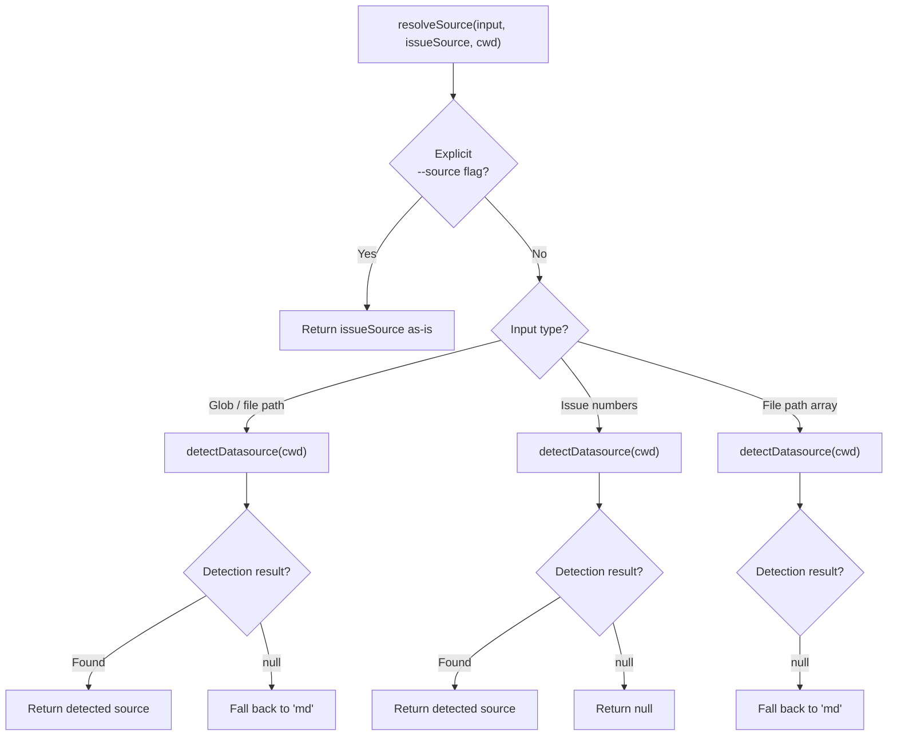
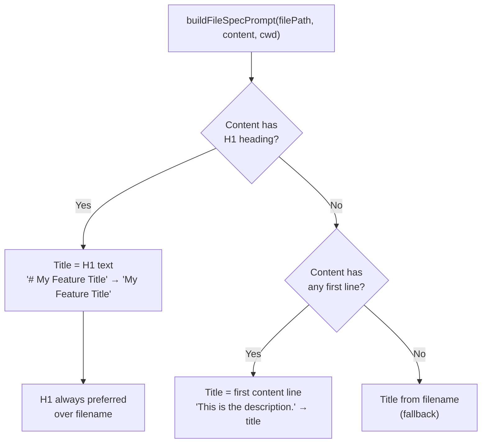
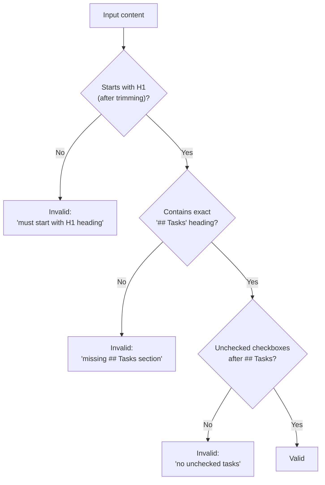
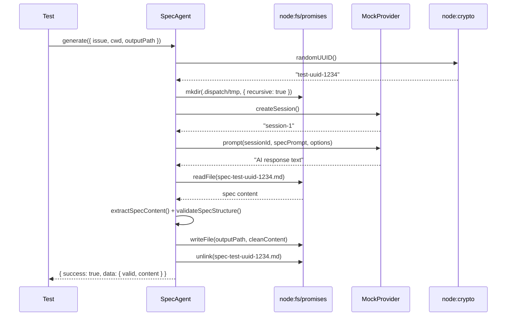

# Spec Generator Tests

This document provides a detailed breakdown of
`src/tests/spec-generator.test.ts`, which tests the spec generation pipeline
utilities defined in [`src/spec-generator.ts`](../../src/spec-generator.ts)
and the spec agent defined in [`src/agents/spec.ts`](../../src/agents/spec.ts).

## What is tested

The spec generator test file is the largest test file in the project at
**1,956 lines**. It covers three layers of the spec pipeline:

1. **Input classification** — `resolveSource`, `isIssueNumbers`,
   `isGlobOrFilePath` determine what kind of input was provided
2. **Prompt construction and validation** — `buildSpecPrompt`,
   `buildFileSpecPrompt`, `buildInlineTextSpecPrompt`, `validateSpecStructure`,
   `extractSpecContent` build AI prompts and validate/clean output
3. **Agent integration** — `boot()`, `generate()` on the spec agent, plus
   end-to-end pipeline tests via `runSpecPipeline()` covering output
   formatting, inline text handling, and H1-to-filename derivation

The test file uses `vi.mock()` (without hoisting) to mock `node:fs/promises`,
`node:crypto`, `glob`, and several internal modules. It also defines its own
local `createMockProvider()` factory and an `ISSUE_FIXTURE` constant (separate
from `fixtures.ts`).

## Describe blocks

The test file contains **11 describe blocks** with **160 tests** total.

### resolveSource (12 tests)

Tests the `resolveSource()` function, which determines which datasource
(`"github"`, `"azdevops"`, `"md"`, or `null`) to use for a given spec
pipeline invocation. This function handles the `--source` flag resolution
logic.

**Resolution priority:**



| Test | Input | issueSource | Expected | Why |
|------|-------|-------------|----------|-----|
| explicit source with glob | `"drafts/*.md"` | `"github"` | `"github"` | Explicit flag always wins |
| explicit source azdevops with glob | `"drafts/*.md"` | `"azdevops"` | `"azdevops"` | Explicit flag always wins |
| explicit source in tracker mode | `"1,2,3"` | `"github"` | `"github"` | Explicit flag always wins |
| auto-detect for glob, no source | `"drafts/*.md"` | `undefined` | `"github"` | `detectDatasource` returns `"github"` |
| auto-detect for bare filename | `"my-spec.md"` | `undefined` | `"azdevops"` | `detectDatasource` returns `"azdevops"` |
| glob falls back to `"md"` on null | `"drafts/*.md"` | `undefined` | `"md"` | Auto-detection returns `null` |
| bare filename falls back to `"md"` | `"my-spec.md"` | `undefined` | `"md"` | Auto-detection returns `null` |
| glob with fake cwd (no git remote) | `"drafts/*.md"` | `undefined` | `"md"` | Real `detectDatasource` for `/tmp/fake-repo` |
| explicit `"md"` with glob | `"drafts/*.md"` | `"md"` | `"md"` | Explicit flag honored |
| issue numbers auto-detect | `"1,2,3"` | `undefined` | `"github"` | `detectDatasource` returns `"github"` |
| issue numbers returns null on fail | `"1,2,3"` | `undefined` | `null` | Cannot infer datasource for issues |
| file path array falls back to `"md"` | `["/path/to/spec1.md", ...]` | `undefined` | `"md"` | Array input + null detection |

**Key difference:** When auto-detection fails, glob/file inputs fall back to
`"md"` (markdown-only datasource), but issue number inputs return `null`
because issue numbers require a tracker to fetch from.

### isIssueNumbers (24 tests)

Tests the `isIssueNumbers()` function, which determines whether a
user-supplied argument represents issue numbers (e.g., `"42"` or `"1,2,3"`)
versus a file path, glob pattern, or array of file paths.

**Valid inputs (return `true`):**

| Test | Input | Why it matches |
|------|-------|----------------|
| single issue number | `"42"` | Lone positive integer |
| comma-separated issue numbers | `"1,2,3"` | Comma-delimited integers |
| comma-separated with spaces | `"1, 2, 3"` | Spaces after commas allowed |
| two numbers with space after comma | `"10, 20"` | Minimal comma+space case |
| single digit | `"1"` | Smallest valid issue number |
| large issue number | `"12345"` | No upper bound on digits |
| many comma-separated numbers | `"1,2,3,...,10"` | Long list of issue numbers |

**Invalid inputs (return `false`):**

| Test | Input | Why it fails |
|------|-------|-------------|
| empty string | `""` | No content |
| glob pattern | `"drafts/*.md"` | Contains `*` and `/` |
| relative file path | `"./my-spec.md"` | Starts with `./` |
| bare filename | `"spec.md"` | Contains `.` extension |
| path with directories | `"docs/specs/feature.md"` | Contains `/` |
| whitespace only | `"   "` | Whitespace not valid |
| trailing comma | `"1,2,"` | Malformed list |
| leading comma | `",1,2"` | Malformed list |
| double commas | `"1,,2"` | Malformed list |
| mixed alpha and digits | `"1a,2b"` | Non-numeric characters |
| only a comma | `","` | No numbers |
| bare wildcard glob | `"*.md"` | Glob syntax |
| dot-slash relative path | `"./spec.md"` | Path syntax |
| relative subdirectory path | `"drafts/feature.md"` | Path syntax |
| mixed numeric and alphabetic | `"42,foo"` | Non-numeric token |
| array of file paths | `["/path/to/spec1.md", ...]` | Array input, not a string |
| empty array | `[]` | Array input, not a string |

This function is the first decision point in the
[spec pipeline](../spec-generation/overview.md#input-mode-discrimination) --
it determines whether the `--spec` argument is treated as issue numbers to
fetch or as a file path/glob to read from disk.

### isGlobOrFilePath (50 tests)

Tests the `isGlobOrFilePath()` function, which distinguishes file
paths and glob patterns from inline text descriptions. This is the second
decision point in the spec pipeline's three-mode input routing -- when input
is not issue numbers, this function determines whether to treat it as a
file/glob path or as inline text for direct spec generation.

**Glob patterns (return `true`):**

| Test | Input | Pattern type |
|------|-------|-------------|
| wildcard glob | `"*.md"` | Bare wildcard |
| directory wildcard glob | `"drafts/*.md"` | Directory + wildcard |
| double-star recursive glob | `"**/*.ts"` | Recursive pattern |
| question mark glob | `"file?.txt"` | Single-char wildcard |
| bracket glob | `"file[0-9].md"` | Character class |
| brace expansion glob | `"*.{md,txt}"` | Brace expansion |

**File paths (return `true`):**

| Test | Input | Path type |
|------|-------|----------|
| relative with directory | `"drafts/feature.md"` | Forward-slash path |
| dot-slash relative | `"./my-spec.md"` | Explicit relative |
| dot-dot relative | `"../specs/feature.md"` | Parent-directory relative |
| backslash dot-slash | `".\\my-spec.md"` | Windows-style relative |
| backslash dot-dot | `"..\\specs\\feature.md"` | Windows-style parent |
| backslash no extension | `".\\foo"` | Windows relative, no ext |
| backslash nested dirs | `"..\\bar\\baz.md"` | Windows nested path |
| absolute Unix path | `"/home/user/spec.md"` | Absolute path |
| Windows backslash path | `"docs\\specs\\feature.md"` | Windows-style separator |
| multiple directories | `"src/tests/spec-generator.test.ts"` | Deep path |

**Bare filenames with recognized extensions (return `true`):**

Tests verify recognition of `.md`, `.txt`, `.json`, `.ts`, `.yaml`, `.yml`,
`.js`, `.tsx`, `.jsx`, `.MD` (uppercase), and hyphenated filenames like
`"my-feature.md"`.

**Inline text strings (return `false`):**

Tests verify rejection of plain sentences (`"feature A should do x"`),
multi-word descriptions, single words (`"refactor"`), sentences with
punctuation (colons, parentheses, dashes, em-dashes), sentences with numbers
but no path indicators, and text with periods that are not file extensions
(`"update the U.S. address form"`).

**Edge cases:**

| Test | Input | Result | Why |
|------|-------|--------|-----|
| empty string | `""` | `false` | No content |
| whitespace only | `"   "` | `false` | No path indicators |
| special chars without path chars | `"hello @world #test"` | `false` | No glob/path syntax |
| equals sign | `"key=value"` | `false` | Not a path |
| quoted phrase | `"\"add new feature\""` | `false` | Quoted text |
| exclamation mark | `"fix the bug!"` | `false` | Not a path |
| lone forward slash | `"/"` | `true` | Root path |
| lone asterisk | `"*"` | `true` | Glob wildcard |
| dot + extension only | `".md"` | `true` | Hidden file / extension |
| long pseudo-extension | `"something.toolong"` | `false` | Extension too long |
| dot but no valid extension | `"version 2.0 is ready"` | `false` | Not a file path |
| number string | `"42"` | `false` | Issue number, not path |
| comma-separated numbers | `"1,2,3"` | `false` | Issue numbers, not path |

### spec prompt builders (23 tests)

Tests three prompt-building functions: `buildSpecPrompt()` (issue-based),
`buildFileSpecPrompt()` (file-based), and `buildInlineTextSpecPrompt()`
(inline text). All three are imported from `src/agents/spec.ts`.

A shared helper `expectSingleSourceScopeInstructions()` verifies that all
three prompt builders include the scope isolation preamble (single-source
scope, no merging of unrelated items).

**Title extraction logic verified by tests:**



| Test | What it verifies |
|------|------------------|
| scope isolation for issue prompts | `buildSpecPrompt` includes scope instructions |
| returns a string | Basic return type for `buildFileSpecPrompt` |
| extracts title from first H1 heading | `"# My Feature Title"` → title |
| prefers first H1 over filename | H1 wins even when filename differs |
| extracts title from first content line (no H1) | Falls back to first line |
| extracts title from content with only H2 headings | `"## Subheading"` → title |
| includes source file path | `- **Source file:**` present |
| includes file content under Content heading | `### Content` section present |
| uses file path as output path | Backtick-wrapped path in prompt |
| includes working directory | `cwd` in prompt |
| includes spec agent preamble | `"You are a **spec agent**"` |
| includes two-stage pipeline explanation | `planner agent` + `coder agent` |
| includes all required spec sections | All 7 H2 sections in template |
| includes `(P)`/`(S)` tagging instructions | Parallel/serial mode tags |
| includes task example | Example `(P)` and `(S)` tasks |
| includes all five instructions | Numbered 1-5 instruction list |
| does not include issue-specific metadata | No `**Number:**`, `**State:**`, etc. |
| uses `# <Title>` in output template | File-based template format |
| omits Content section when content empty | No `### Content` for empty files |
| handles file without `.md` extension | `.txt` file still gets title from content |
| includes all key guidelines | All 7 guidelines present |
| scope isolation for file prompts | `buildFileSpecPrompt` includes scope instructions |
| scope isolation for inline prompts | `buildInlineTextSpecPrompt` includes scope instructions |

**Required spec sections verified by tests:**

1. `## Context`
2. `## Why`
3. `## Approach`
4. `## Integration Points`
5. `## Tasks`
6. `## References`
7. `## Key Guidelines`

**Key guidelines verified by tests:**

1. Stay high-level
2. Respect the project's stack
3. Explain WHAT, WHY, and HOW (strategically)
4. Detail integration points
5. Keep tasks atomic and ordered
6. Tag every task with `(P)`, `(S)`, or `(I)`
7. Keep the markdown clean

### validateSpecStructure (8 tests)

Tests the `validateSpecStructure()` function, which checks whether AI-generated
spec content has the required structural elements.

The function returns `{ valid: true }` or `{ valid: false, reason: string }`.

**Three validation checks (in order):**

1. Content must start with an H1 heading (`#`) after optional leading whitespace
2. A `## Tasks` section must exist (exact match, not a substring like
   `## Tasks and Notes`)
3. The `## Tasks` section must contain at least one unchecked checkbox (`- [ ]`)



| Test | What it verifies |
|------|------------------|
| returns valid for a well-formed spec | Happy path with all elements |
| returns invalid when content does not start with H1 | Preamble before H1 fails |
| returns invalid when `## Tasks` section is missing | Missing Tasks heading |
| returns invalid when `## Tasks` has no checkboxes | Tasks section without `- [ ]` |
| returns valid with a single checkbox | Minimal valid spec |
| returns valid when checked and unchecked tasks coexist | `[x]` + `[ ]` is valid |
| returns invalid when `## Tasks` is a substring | `## Tasks and Notes` does not match |
| does not have a reason property when valid | `"reason" in result` is `false` |

**Additional behavior:** The `reason` property is `undefined` when `valid` is
`true`, ensuring consumers can safely check `result.reason` only on failures.

### extractSpecContent (12 tests)

Tests the `extractSpecContent()` function, which cleans up AI-generated spec
output by stripping code fences, preamble, and postamble.

**Three-stage extraction pipeline:**


| Test | What it verifies |
|------|------------------|
| passes through already-clean content unchanged | Clean input is idempotent |
| strips markdown code-fence wrapping | `` ```markdown ... ``` `` → inner content |
| strips bare code-fence wrapping without language tag | `` ``` ... ``` `` → inner content |
| removes preamble text before the first H1 heading | `"Here's the spec:"` stripped |
| removes postamble text after the last recognized section | `"Let me know..."` stripped |
| handles content with both preamble and postamble | Combined cleanup |
| returns unrecognizable content as-is when no H1 found | Passthrough for non-spec content |
| returns content as-is when no H1 after fence stripping | No headings → no extraction |
| handles empty string input | Empty → empty |
| preserves all recognized H2 sections | All 7 spec sections survive extraction |
| does not strip internal code fences within the spec | Code examples inside spec preserved |
| handles content where only preamble exists | Preamble-only removal, no postamble |

**Recognized H2 sections** (used for postamble detection):
- `## Context`
- `## Why`
- `## Approach`
- `## Integration Points`
- `## Tasks`
- `## References`
- `## Key Guidelines`

**Fallback behavior:** When `extractSpecContent` cannot identify any H1
heading in the content (even after stripping code fences), it returns the
input unchanged. This prevents data loss when the AI produces an unexpected
format.

### SpecAgent boot (3 tests)

Tests the `boot()` function exported from `src/agents/spec.ts`. These tests
overlap with those in [`spec-agent.test.ts`](spec-agent-tests.md) but use
the local `createMockProvider()` factory instead of the shared
`fixtures.ts` version.

| Test | What it verifies |
|------|------------------|
| throws when provider not supplied | `boot({ cwd })` without provider rejects |
| returns agent with name `'spec'` | Agent identity |
| returns agent with generate and cleanup methods | Method presence |

### SpecAgent generate (13 tests)

Tests the `generate()` method on the booted spec agent. These tests verify
the temp file workflow, provider interaction, error handling, and validation
integration. They overlap with the more focused tests in
[`spec-agent.test.ts`](spec-agent-tests.md) but exercise additional edge
cases like non-Error exceptions and sequential UUID uniqueness.

**Temp file workflow:**



| Test | What it verifies |
|------|------------------|
| generates spec successfully with temp file workflow | Full happy path: mkdir, createSession, prompt, readFile, writeFile, unlink |
| generates spec from file content (file/glob mode) | `filePath` + `fileContent` input instead of `issue` |
| forwards provider progress snapshots upward | `onProgress` callback passed through to provider |
| returns failure when AI returns null | Null response → `{ success: false, error: "AI agent returned no response" }` |
| returns failure when neither issue nor filePath provided | Missing input → descriptive error |
| returns failure when AI does not write temp file | `readFile` throws ENOENT → error includes AI response text |
| returns failure when createSession throws | `"Connection refused"` propagated |
| returns failure when prompt throws | `"Model overloaded"` propagated |
| cleans up temp file on success | `unlink` called with temp file path |
| does not throw when temp cleanup fails | ENOENT on unlink → still returns success |
| reports validation warnings for invalid specs | Missing `## Tasks` → `{ valid: false, validationReason }` |
| uses unique temp file paths per generation | Sequential UUIDs produce different temp file names |
| handles non-Error exceptions gracefully | Raw string rejection → captured as error message |

### spec output formatting (5 tests)

Tests the `runSpecPipeline()` orchestrator function (from
`src/orchestrator/spec-pipeline.ts`) to verify that the dispatch command
hint logged after generation contains the correct identifiers. These tests
mock `bootProvider`, datasource detection, and the glob module.

| Test | Mode | Source | Verifies |
|------|------|--------|----------|
| tracker mode (github) | issue numbers `"1,2,3"` | github | `log.dim` contains `"dispatch 1,2,3"` |
| tracker mode (azdevops) | issue numbers `"100,200"` | azdevops | `log.dim` contains `"dispatch 100,200"` |
| file/glob mode with tracker datasource | glob `"drafts/*.md"` | github | Shows created issue numbers (55, 56), not file paths |
| file/glob mode with md datasource | glob `"drafts/*.md"` | md | Shows numeric ID `"dispatch 99"` |
| tracker mode single issue | `"42"` | github | Shows `"dispatch 42"` |

### inline text pipeline (6 tests)

Tests `runSpecPipeline()` for the inline text input mode -- when input is
neither issue numbers nor a file/glob pattern, it is treated as free-form
text describing the desired spec.

| Test | What it verifies |
|------|------------------|
| generates spec file for inline text | Result has `generated: 1`, `failed: 0`, file path contains `"99-my-feature.md"` |
| shows numeric ID in dispatch command | `log.dim` contains `"dispatch 99"` after `datasource.create()` |
| truncates long inline text in title | Input > 80 chars → title shows `"…"` |
| slugifies inline text into output filename | `"Add validation for email & phone"` → slug-based filename |
| passes inline text as fileContent to spec agent | Provider is called, `writeFile` with slugified filename, `rename` to H1-derived filename |
| returns spec summary with identifiers | `result.identifiers` and `result.issueNumbers` contain `"99"` from `datasource.create()` |

### H1-to-filename derivation (4 tests)

Tests the post-generation rename behavior in `runSpecPipeline()`. After the
spec agent generates a spec, the pipeline reads the H1 heading from the
generated content, derives a slug, and renames the file if the H1-derived
slug differs from the pre-generation slug.

| Test | Mode | What it verifies |
|------|------|------------------|
| renames tracker spec based on H1 | tracker (github) | `"# Improved Auth Flow (#42)"` → file renamed to `"42-improved-auth-flow-42.md"` |
| does not rename when slugs match | tracker (github) | H1 `"My Feature"` matches fetched title → `rename` not called |
| renames inline text spec based on H1 | inline text | `"# Dark Mode Toggle for Settings"` → renamed via `rename()` |
| does not rename file-based specs | file/glob | File/glob mode writes in-place, `rename` not called |

## Mocking strategy

The test file sets up module-level mocks for six dependencies:

| Mocked module | Key mocked exports | Purpose |
|---------------|-------------------|---------|
| `node:fs/promises` | `mkdir`, `readFile`, `writeFile`, `unlink`, `rename` | Prevent real filesystem operations during temp file workflow |
| `node:crypto` | `randomUUID` | Deterministic temp file names (`"test-uuid-1234"`) |
| `../helpers/logger.js` | `log.*` methods | Capture log output without printing; verify dispatch hints |
| `glob` | `glob` | Control file discovery results for glob input mode |
| `../helpers/cleanup.js` | `registerCleanup` | Prevent real cleanup registration |
| `../providers/index.js` | `bootProvider`, `PROVIDER_NAMES` | Provide mock provider for pipeline tests |

The `beforeEach`/`afterEach` hooks in the agent and pipeline test blocks
reset all mocks between tests using `vi.clearAllMocks()` and
`vi.restoreAllMocks()`.

**Local mock factory:** The file defines its own `createMockProvider()`
function (lines 62-71) rather than importing from `fixtures.ts`. This local
version accepts `Partial<ProviderInstance>` overrides and returns a complete
mock with `name`, `model`, `createSession`, `prompt`, and `cleanup`.

## Relationship to the spec generation pipeline

The tested functions and agent methods map to specific stages of the spec
pipeline:

| Function | Pipeline stage | Role |
|----------|---------------|------|
| `resolveSource` | Source resolution | Determines datasource from `--source` flag or auto-detection |
| `isIssueNumbers` | Input classification | Determines issue-fetch vs. file-read vs. inline path |
| `isGlobOrFilePath` | Input classification | Distinguishes file/glob from inline text |
| `buildSpecPrompt` | Prompt construction | Builds AI prompt for issue-based specs |
| `buildFileSpecPrompt` | Prompt construction | Builds AI prompt for file-based specs |
| `buildInlineTextSpecPrompt` | Prompt construction | Builds AI prompt for inline text specs |
| `validateSpecStructure` | Output validation | Checks AI output before writing to disk |
| `extractSpecContent` | Output cleanup | Strips AI conversational artifacts |
| `boot` / `generate` | Agent lifecycle | Spec agent boot, temp file workflow, provider interaction |
| `runSpecPipeline` | Orchestration | End-to-end pipeline: source resolution → generation → rename |

## Overlap with spec-agent.test.ts

The `SpecAgent boot` and `SpecAgent generate` describe blocks in this file
overlap with the more focused [`spec-agent.test.ts`](spec-agent-tests.md).
The two files differ in scope:

| Aspect | spec-generator.test.ts | spec-agent.test.ts |
|--------|----------------------|-------------------|
| Boot tests | 3 tests | 3 tests |
| Generate tests | 13 tests | ~25 tests |
| Focus | Temp file workflow, provider errors, UUID uniqueness | Three-mode routing, timebox, path security, progress |
| Mock provider | Local `createMockProvider()` | `fixtures.ts` factory |
| Pipeline tests | Yes (5 + 6 + 4 = 15 tests via `runSpecPipeline`) | No |

Both files can be run independently. There is no shared state between them.

## Related documentation

- [Test suite overview](overview.md) — framework, patterns, and coverage map
- [Spec agent tests](spec-agent-tests.md) — focused spec agent testing
  (three-mode routing, timebox, path security)
- [Commit agent tests](commit-agent-tests.md) — commit agent testing
  (parallel agent test infrastructure)
- [Spec generation overview](../spec-generation/overview.md) — full pipeline documentation
- [Spec generation integrations](../spec-generation/integrations.md) — external dependencies
- [Architecture overview](../architecture.md) — spec generation pipeline diagram
- [Parser tests](parser-tests.md) — `(P)`/`(S)`/`(I)` mode prefix testing (consumer of spec output)
- [Task parsing overview](../task-parsing/overview.md) — how `(P)`/`(S)`/`(I)` mode prefixes are parsed
- [Markdown syntax reference](../task-parsing/markdown-syntax.md) — Exact syntax
  rules for the `- [ ]` checkbox format and `(P)`/`(S)`/`(I)` mode prefixes
  that the spec generator must produce
- [Issue fetching overview](../deprecated-compat/overview.md) — issue fetchers consumed by `generateSpecs()`
- [Azure DevOps Fetcher (Deprecated)](../issue-fetching/azdevops-fetcher.md) —
  Legacy Azure DevOps fetching shim referenced by spec generation
- [Provider interface](../shared-types/provider.md) — AI provider used by spec generation
- [Datasource system](../datasource-system/overview.md) — datasources that feed issue data into spec generation
- [Markdown Datasource](../datasource-system/markdown-datasource.md) —
  `extractTitle()` function shared between markdown datasource and spec pipeline
- [Config tests](config-tests.md) — adjacent test documentation for the config module
- [Dispatch pipeline tests](dispatch-pipeline-tests.md) — tests for the
  pipeline that consumes generated spec files
- [Planner & executor tests](planner-executor-tests.md) — planner agent testing
- [Slugify utility](../shared-utilities/slugify.md) — used by spec pipeline for filename generation
