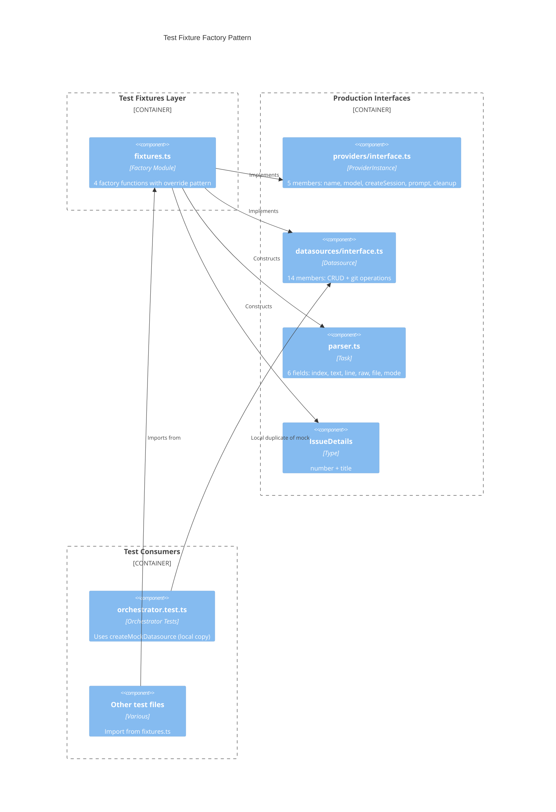

# Test Fixtures

This document describes the shared test fixture factories in
`src/tests/fixtures.ts`. These factories create pre-configured test doubles
for the core domain interfaces, reducing boilerplate across test files.

## What it provides

The module exports four factory functions:

| Factory | Returns | Stub count | Description |
|---------|---------|------------|-------------|
| `createMockProvider()` | `ProviderInstance` | 5 members | Stubbed AI provider with no-op lifecycle |
| `createMockDatasource()` | `Datasource` | 13 methods | Stubbed datasource with no-op git operations |
| `createMockTask()` | `Task` | -- | Task object with sensible defaults |
| `createMockIssueDetails()` | `IssueDetails` | -- | Issue metadata with sensible defaults |

## Why it exists

Multiple test files need mock versions of `ProviderInstance`, `Datasource`,
`Task`, and `IssueDetails`. Without shared factories, each test file would
duplicate the same stub construction. The fixtures module centralizes this,
providing:

- **Consistency**: All tests use the same default values, so test behavior is
  predictable across files.
- **Override pattern**: Every factory accepts an `overrides` parameter via
  object spread, allowing tests to customize only the fields they care about.
- **Maintenance**: When an interface gains a new member, only the fixture
  factory needs updating rather than every test file.

## How the factories work

### Override pattern

All four factories follow the same pattern: construct a complete object with
default values, then spread caller-provided overrides on top. For example:

```
createMockTask({ text: "custom text" })
```

This returns a `Task` with all default fields except `text`, which is
replaced by the caller's value. The spread happens at the top level only --
nested objects are not deep-merged.

### createMockProvider

Returns a `ProviderInstance` (`src/providers/interface.ts`) with:

| Member | Default value |
|--------|---------------|
| `name` | `"mock-provider"` |
| `model` | `undefined` |
| `createSession()` | Returns `"mock-session-id"` |
| `prompt()` | Returns `"mock response"` |
| `cleanup()` | No-op (returns `undefined`) |

The `ProviderInstance` interface has 5 members: `name`, `model` (optional),
`createSession()`, `prompt()`, and `cleanup()`. The mock stubs all five.

Note that the mock provider's `prompt()` returns a string, not `null`. Tests
that need to verify null-response handling should override this:

```
createMockProvider({ prompt: async () => null })
```

### createMockDatasource

Returns a `Datasource` (`src/datasources/interface.ts`) with stubs for all
13 methods:

| Method | Default return |
|--------|----------------|
| `getIssue()` | `undefined` |
| `getIssues()` | `[]` |
| `createIssue()` | `undefined` |
| `updateIssue()` | `undefined` |
| `deleteIssue()` | `undefined` |
| `getDefaultBranch()` | `"main"` |
| `getUsername()` | `"mock-user"` |
| `buildBranchName()` | `"mock-branch"` |
| `createAndSwitchBranch()` | `undefined` |
| `switchBranch()` | `undefined` |
| `pushBranch()` | `undefined` |
| `commitAllChanges()` | `undefined` |
| `createPullRequest()` | `undefined` |

The `Datasource` interface actually has 14 members (13 methods plus any
additional properties). The mock covers the method surface. Tests that need
specific return values override individual methods:

```
createMockDatasource({
    getIssue: async () => ({ number: 42, title: "Fix auth" }),
})
```

### createMockTask

Returns a `Task` (`src/parser.ts`) with:

| Field | Default value |
|-------|---------------|
| `index` | `0` |
| `text` | `"mock task"` |
| `line` | `1` |
| `raw` | `"- [ ] mock task"` |
| `file` | `"tasks/mock.md"` |
| `mode` | `undefined` |

### createMockIssueDetails

Returns an `IssueDetails` object with:

| Field | Default value |
|-------|---------------|
| `number` | `1` |
| `title` | `"Mock Issue"` |

## Mock factory architecture

The following diagram shows how the test fixtures relate to the production
interfaces they mock and the test files that consume them:



## Known issue: duplicate mock in orchestrator tests

`src/tests/orchestrator.test.ts` contains its own local `createMockDatasource()`
function that duplicates the one in `fixtures.ts`. This means changes to the
`Datasource` interface require updating both locations. See
[Orchestrator Tests](orchestrator-tests.md) for details.

## Relationship to the codex module mock

The fixtures in `fixtures.ts` serve a different purpose than the module mock
in `src/__mocks__/@openai/codex.ts`:

| Aspect | `fixtures.ts` factories | `__mocks__/@openai/codex.ts` |
|--------|------------------------|------------------------------|
| Purpose | Configurable test doubles for assertions | Import resolution stub |
| Customizable | Yes, via override parameter | No |
| Used by tests for assertions | Yes | No |
| Scope | Per-test (imported and called) | Global (Vite resolve alias) |

See [Type Declarations and Mocks](type-declarations-and-mocks.md) for the
codex mock details.

## Related documentation

- [Testing Overview](overview.md) -- project-wide test suite structure
- [Type Declarations and Mocks](type-declarations-and-mocks.md) -- ambient
  declarations and the codex module mock
- [Orchestrator Tests](orchestrator-tests.md) -- integration tests that
  consume datasource mocks
- [Provider Interface](../shared-types/provider.md) -- the `ProviderInstance`
  type that `createMockProvider()` implements
- [Datasource Overview](../datasource-system/overview.md) -- the `Datasource`
  interface that `createMockDatasource()` implements
- [Task Parsing](../task-parsing/overview.md) -- the `Task` type that
  `createMockTask()` constructs
