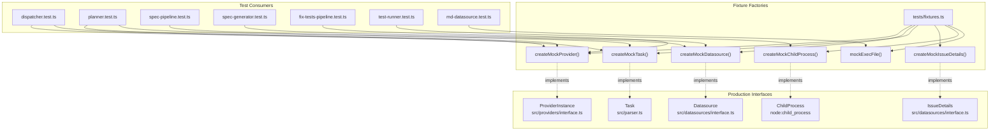
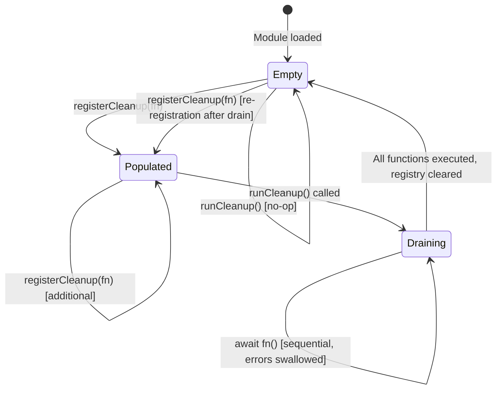

# Test Fixtures & Cleanup Tests

This document covers the shared testing infrastructure for the dispatch project:
the mock factory module (`src/tests/fixtures.ts`) that provides reusable test
doubles for domain objects, and the cleanup registry test file
(`src/tests/cleanup.test.ts`) that validates the process-level shutdown safety
mechanism.

## Test file inventory

| Test file | Production module | Lines (test) | Test count | Category |
|-----------|-------------------|-------------|------------|----------|
| `cleanup.test.ts` | `src/helpers/cleanup.ts` | 170 | 10 (9 active, 1 skipped) | Module mock, lifecycle |
| `fixtures.ts` | *(shared test utility)* | 134 | N/A (not a test file) | Mock factories |

## The fixtures module

`src/tests/fixtures.ts` exports six mock factories and a helper function that
are consumed across the test suite. These factories produce conformant test
doubles for the project's core interfaces, enabling consistent mock setup
without duplicating boilerplate in each test file.

### Mock factory reference

| Factory | Returns | Interface source | Default overrides |
|---------|---------|-----------------|-------------------|
| `createMockProvider()` | `ProviderInstance` | `src/providers/interface.ts` | `name: "mock"`, `model: "mock-model"`, session returns `"session-1"`, prompt returns `"done"` |
| `createMockDatasource()` | `Datasource` | `src/datasources/interface.ts` | `name: "github"`, all 13 methods mocked with sensible defaults |
| `createMockTask()` | `Task` | `src/parser.ts` | `index: 0`, `text: "Implement the widget"`, `line: 3`, `file: "/tmp/test/42-feature.md"` |
| `createMockIssueDetails()` | `IssueDetails` | `src/datasources/interface.ts` | `number: "1"`, `title: "Default Title"`, `state: "open"` |
| `createMockChildProcess()` | `ChildProcess` | `node:child_process` | `pid: 1234`, `PassThrough` streams for stdin/stdout/stderr, `EventEmitter` for events |
| `mockExecFile()` | `void` | *(test utility)* | Applies a typed `ExecFileMockImpl` to a mocked `execFile` function |

Every factory accepts an optional `overrides` parameter (a `Partial<T>`) that
is spread over the defaults, so tests can selectively replace only the fields
or methods they care about.

### The `ProviderInstance` mock contract

`createMockProvider()` produces a full `ProviderInstance` conforming to the
interface defined in `src/providers/interface.ts`. The real implementations
are:

| Provider | Implementation file | SDK |
|----------|-------------------|-----|
| `opencode` | `src/providers/opencode.ts` | `@opencode-ai/sdk` |
| `copilot` | `src/providers/copilot.ts` | `@github/copilot-sdk` |
| `claude` | `src/providers/claude.ts` | `@anthropic-ai/claude-agent-sdk` |
| `codex` | `src/providers/codex.ts` | `@openai/codex` |

The mock returns deterministic values (`"session-1"` for session IDs, `"done"`
for prompt responses) so tests can assert on these known values without needing
to understand the provider internals. See
[provider overview](../provider-system/overview.md) for how real
providers implement this interface.

### The `Datasource` mock contract

`createMockDatasource()` produces a full `Datasource` conforming to the
fourteen-method interface defined in `src/datasources/interface.ts`. The mock
covers all five CRUD methods (`list`, `fetch`, `update`, `close`, `create`),
the identity method (`getUsername`), the `supportsGit()` check, and all seven
git lifecycle methods (`getDefaultBranch`, `buildBranchName`,
`createAndSwitchBranch`, `switchBranch`, `pushBranch`, `commitAllChanges`,
`createPullRequest`).

The real implementations are:

| Datasource | Implementation file | Backend |
|------------|-------------------|---------|
| `github` | `src/datasources/github.ts` | `gh` CLI |
| `azdevops` | `src/datasources/azdevops.ts` | `az` CLI |
| `md` | `src/datasources/md.ts` | Local filesystem |

The first argument optionally sets the `name` field (defaulting to `"github"`),
which is useful when testing code that branches on datasource type. See
[datasource overview](../datasource-system/overview.md) for the full interface
contract.

### The `ChildProcess` mock

`createMockChildProcess()` constructs a mock `ChildProcess` by composing
`EventEmitter` (from `node:events`) with `PassThrough` streams (from
`node:stream`) for stdin, stdout, and stderr. This allows tests to:

- **Simulate child process events**: Call `child.emit("exit", 0)` or
  `child.emit("error", new Error("spawn failed"))` directly.
- **Write to stdin**: `child.stdin.write("input data")`.
- **Read from stdout/stderr**: Pipe or listen for `data` events on
  `child.stdout` and `child.stderr`.

The mock is consumed by test files that test code interacting with spawned
processes, such as the [fix-tests pipeline](./fix-tests-tests.md) and the
[test runner](./fix-tests-tests.md).

### The `ExecFileMockImpl` type and `mockExecFile` helper

The `ExecFileMockImpl` type defines a callback-style function signature for
mocking `child_process.execFile`. It uses the shape
`(cmd, args, opts, cb) => void` where the callback receives
`(error, { stdout, stderr })` — a single result object rather than separate
`stdout` and `stderr` arguments.

**Why the non-standard callback shape?** The real `child_process.execFile`
callback has the signature `(error, stdout, stderr)`. However, when wrapped
with `util.promisify` (as done throughout the production code), the promisified
version resolves to `{ stdout, stderr }` because Node.js's `promisify`
automatically wraps multi-argument callbacks into a single object when the
function has a `[util.promisify.custom]` symbol or when `execFile` is
specifically handled. The mock matches this promisified behavior directly,
so tests can set up responses that flow correctly through the `await exec(...)`
calls in production code.

The `mockExecFile()` helper applies a typed implementation to a mocked
`execFile` function, providing type safety for the mock setup.

### Fixture consumption across the test suite

The fixtures module is imported by test files spanning nearly every group in
the project:

| Test file | Fixtures used | Group |
|-----------|--------------|-------|
| `dispatcher.test.ts` | `createMockProvider`, `createMockTask` | Planning & execution |
| `planner.test.ts` | `createMockProvider`, `createMockTask` | Planning & execution |
| `spec-pipeline.test.ts` | `createMockDatasource` | Spec generation |
| `spec-generator.test.ts` | `createMockDatasource` | Spec generation |
| `fix-tests-pipeline.test.ts` | `createMockProvider` | Fix-tests pipeline |
| `test-runner.test.ts` | `createMockChildProcess` | Fix-tests pipeline |
| `md-datasource.test.ts` | `mockExecFile` | Markdown datasource |

### Convention: fixtures vs inline mocks

No formal convention document exists, but a clear pattern emerges from the
codebase:

- **Use fixtures** for domain objects that implement formal interfaces
  (`ProviderInstance`, `Datasource`, `Task`, `IssueDetails`, `ChildProcess`).
  These objects have many fields and methods; the fixture provides a complete,
  valid default that tests can selectively override.
- **Use inline `vi.fn()`** for one-off mocks of individual functions or modules
  (e.g., mocking `fs/promises.readFile`, mocking the logger, or mocking a
  single utility function). These are typically set up with `vi.mock()` at the
  module level.

This pattern keeps test files focused on the behavior under test rather than
on constructing valid mock objects.

### Keeping fixtures synchronized with interfaces

The fixture factories return objects typed as their respective interfaces
(`ProviderInstance`, `Datasource`, `Task`, `IssueDetails`). TypeScript enforces
that the mock objects satisfy the interface at compile time. If an interface
gains a new required method or field, the fixture will fail to compile until
updated — the compiler acts as a synchronization check.

For example, if `Datasource` gains a new `archive()` method, the
`createMockDatasource()` function will produce a TypeScript error because the
returned object no longer satisfies the `Datasource` interface. The fixture
must be updated with a mock for the new method before any tests can run.

## Cross-cutting mock dependency graph

The following diagram shows how the fixtures module connects test files to
production interfaces:



## Cleanup registry tests

**File**: `src/tests/cleanup.test.ts` (170 lines, 10 tests — 9 active, 1 skipped)
**Production module**: `src/helpers/cleanup.ts` (35 lines)

The cleanup test file validates the process-level cleanup registry that is the
safety net for AI provider resource teardown. See
[cleanup registry](../shared-types/cleanup.md) for the production module's
design and lifecycle.

### What is tested

| Test | What is verified |
|------|------------------|
| Registers and calls a cleanup function | `registerCleanup` + `runCleanup` basic contract |
| Registers multiple cleanup functions | Multiple registrations are all invoked |
| Executes in registration order (FIFO) | Order is `[1, 2, 3]`, not reverse |
| Clears registry after drain | Second `runCleanup()` is a no-op |
| Swallows errors from cleanup functions | `runCleanup()` resolves even when a function throws |
| Continues after one function throws | Remaining functions still execute |
| Resolves with empty registry | No-op when nothing is registered |
| Allows re-registration after drain | New functions can be added after a drain |
| Wires to `process.on("SIGINT")` | Verifies signal handler integration pattern |
| Runs cleanups from signal handler callback | Simulates the `cli.ts` signal handler flow |

### How the cleanup registry interacts with process signals in production

The tests at lines 115–143 verify the signal handler integration pattern that
`src/cli.ts` uses in production. The production wiring works as follows:

1. `src/cli.ts` installs signal handlers via `process.on("SIGINT", ...)` and
   `process.on("SIGTERM", ...)`.
2. Each handler calls `await runCleanup()` to drain the registry.
3. After cleanup completes, `process.exit(130)` or `process.exit(143)` is
   called.

The tests verify this pattern by spying on `process.on` to confirm the handler
is registered, then invoking the handler directly (without actually sending a
signal) to confirm that registered cleanup functions are called. This approach
avoids the complexity and fragility of actually sending process signals during
tests.

### Cleanup lifecycle state diagram



### Why cleanup functions execute in FIFO order

The test at lines 51–58 explicitly asserts that cleanup functions run in
registration order (`[1, 2, 3]`), which is FIFO (first-in, first-out). This
differs from the more common LIFO (last-in, first-out) teardown pattern used
by many cleanup registries (e.g., Go's `defer` or database transaction
rollbacks).

The FIFO design is intentional for dispatch's use case:

- **Single-resource registrations**: In practice, only one provider is booted
  per run, so registration order rarely matters.
- **No dependency ordering**: The cleanup functions registered are independent
  (each wraps a single provider's `cleanup()` method). There is no scenario
  where a later-registered function depends on an earlier-registered one being
  torn down first.
- **Simpler implementation**: The `splice(0)` + `for...of` pattern naturally
  produces FIFO order without needing to reverse the array.

If Dispatch ever supports concurrent multi-provider runs where providers have
interdependencies, the teardown order may need to be reconsidered.

### The skipped cleanup-failure logging test

The test at lines 145–169 is marked with `it.skip` and has a TODO comment:

> Currently cleanup.ts has a bare `catch {}` that swallows errors silently.
> Once the error-handling-improvements spec adds `log.warn()` to the catch
> block, remove the `.skip` and this test will verify the warn log is emitted
> for cleanup failures.

**Current state**: `src/helpers/cleanup.ts:30-32` has a bare `catch {}` block
that silently swallows errors. This is by design (see
[why cleanup errors are swallowed](../shared-types/cleanup.md#why-cleanup-errors-are-swallowed)),
but it means cleanup failures are completely invisible — even in verbose mode.

**Planned improvement**: The "error-handling-improvements" spec (tracked in the
project's issue tracker) would add `log.warn()` inside the catch block, making
cleanup failures visible without changing the error-swallowing behavior. When
that change lands, the skipped test should be unskipped to verify the warning
is emitted.

**How to track**: Search the project's issue tracker or `.dispatch/specs/`
directory for "error-handling-improvements" to find the relevant spec or issue.

### Test isolation pattern

The test file uses `afterEach` to drain any leftover cleanup functions between
tests, preventing cross-test pollution:

```typescript
afterEach(async () => {
    await runCleanup();
    vi.restoreAllMocks();
});
```

This is necessary because `registerCleanup` writes to a module-level array. If
a test registers a function but does not drain the registry (e.g., because it
tests registration only), that function would leak into the next test. The
`afterEach` drain ensures each test starts with an empty registry.

## Integration: Vitest

Both files use [Vitest](https://vitest.dev/) features:

| Feature | Usage in `fixtures.ts` | Usage in `cleanup.test.ts` |
|---------|----------------------|---------------------------|
| `vi.fn()` | All mock method implementations | Cleanup function mocks |
| `vi.mock()` | — | Logger module mock (lines 3–16) |
| `vi.restoreAllMocks()` | — | `afterEach` cleanup |
| `describe` / `it` | — | BDD-style test organization |
| `expect` matchers | — | `toHaveBeenCalledOnce`, `resolves.toBeUndefined`, `toEqual` |
| `it.skip` | — | Skipped test for future feature |
| `Mock` type import | `type Mock` for `mockExecFile` parameter | — |

### How to run

```sh
# Run the cleanup tests
npx vitest run src/tests/cleanup.test.ts

# Run with verbose output
npx vitest run --reporter=verbose src/tests/cleanup.test.ts

# Run all tests (fixtures.ts is loaded transitively)
npm test
```

## Integration: Vitest coverage configuration

The `vitest.config.ts` at the project root configures coverage thresholds and
exclusions:

| Setting | Value |
|---------|-------|
| Coverage provider | `v8` |
| Reporters | `text`, `json` |
| Line threshold | 85% |
| Branch threshold | 80% |
| Function threshold | 85% |
| Excluded from coverage | `src/tests/**`, `src/**/interface.ts`, `src/**/index.ts`, `src/**/*.d.ts`, `src/__mocks__/**` |
| Module alias | `@openai/codex` → `src/__mocks__/@openai/codex.ts` |

The `src/tests/**` exclusion means that `fixtures.ts` itself is not measured
for coverage (it is test infrastructure, not production code). The
`src/**/interface.ts` exclusion means the interfaces that the fixtures
implement are also excluded — coverage is measured on the concrete
implementations.

To generate a coverage report:

```sh
npx vitest run --coverage
```

## Integration: Node.js `child_process`

The `createMockChildProcess()` factory mocks the Node.js `ChildProcess` class
by composing `EventEmitter` and `PassThrough` streams.

**Which production code spawns child processes?** The mock is consumed by tests
for code that spawns external processes:

- `src/orchestrator/fix-tests-pipeline.ts` — spawns `npm test` to run the
  project's test suite.
- `src/test-runner.ts` — spawns test commands via `child_process.spawn`.
- Provider implementations — spawn CLI servers (OpenCode, Copilot).

**How tests simulate child process events:** Because the mock extends
`EventEmitter`, tests can emit events directly:

```typescript
const child = createMockChildProcess();
child.emit("exit", 0);      // simulate successful exit
child.emit("error", err);   // simulate spawn error
child.emit("close", 1);     // simulate abnormal close
```

**Memory leak considerations:** `PassThrough` streams created by the mock are
lightweight in-memory transforms. Vitest's `afterEach` teardown and Node.js
garbage collection handle cleanup automatically. For long-running test suites,
streams are garbage-collected when the mock goes out of scope.

## Integration: Node.js `node:events` and `node:stream`

| Module | Usage in `fixtures.ts` | Purpose |
|--------|----------------------|---------|
| `EventEmitter` (from `node:events`) | Base class for `createMockChildProcess` | Enables `child.emit()` and `child.on()` for event simulation |
| `PassThrough` (from `node:stream`) | stdin, stdout, stderr streams | Provides readable/writable streams that pass data through without transformation |

These are Node.js built-in modules with no external dependencies. See
[Node.js Events documentation](https://nodejs.org/api/events.html) and
[Node.js Streams documentation](https://nodejs.org/api/stream.html) for
reference.

## Related documentation

- [Testing Overview](./overview.md) — project-wide test strategy, framework,
  and coverage map
- [Cleanup Registry](../shared-types/cleanup.md) — production module design,
  lifecycle, and signal coordination
- [Provider Overview](../provider-system/overview.md) — the
  `ProviderInstance` interface that `createMockProvider` implements
- [Datasource Overview](../datasource-system/overview.md) — the `Datasource`
  interface that `createMockDatasource` implements
- [Task Parsing](../task-parsing/overview.md) — the `Task` type that
  `createMockTask` implements
- [Provider Tests](./provider-tests.md) — tests for real provider
  implementations (contrast with mock provider)
- [Planner & Executor Tests](./planner-executor-tests.md) — tests that consume
  `createMockProvider` and `createMockTask`
- [Fix-Tests Pipeline Tests](./fix-tests-tests.md) — tests that consume
  `createMockProvider` and `createMockChildProcess`
- [Spec Generator Tests](./spec-generator-tests.md) — tests that consume
  `createMockDatasource`
- [Datasource Testing](../datasource-system/testing.md) — tests that consume
  `mockExecFile`
- [Shared Integrations](../shared-types/integrations.md) — Node.js process
  signal handling referenced by cleanup tests
