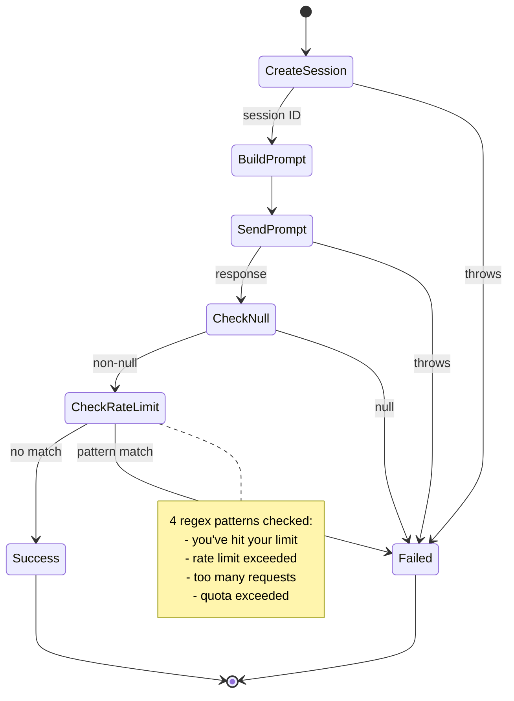
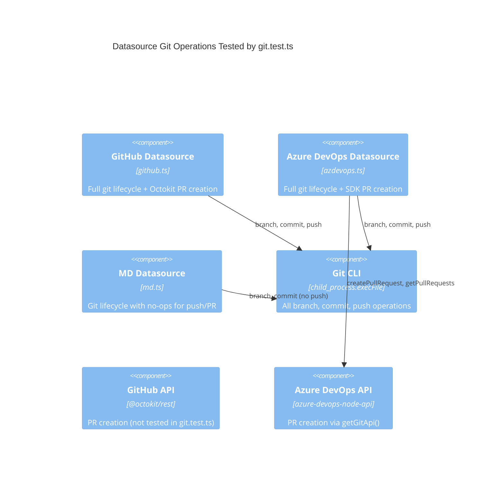
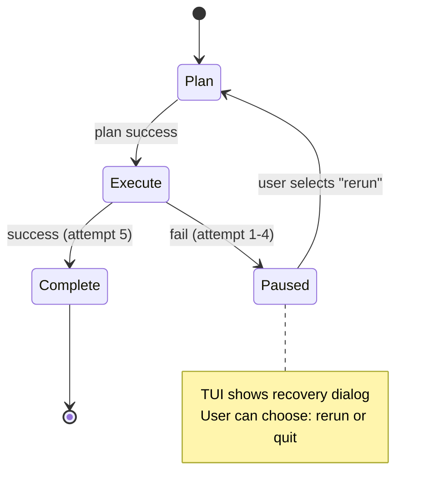

# Tests: Integration & E2E

This document covers the four test files that verify Dispatch's core
dispatch-and-datasource integration behavior: task dispatching, file-based
verbose logging, git lifecycle operations across all three datasources, and
the full end-to-end dispatch pipeline flow.

## Test file inventory

| Test file | Production module(s) | Lines | Test count | Category |
|-----------|---------------------|-------|------------|----------|
| `dispatcher.test.ts` | `src/dispatcher.ts` | 262 | 15 | Unit: prompt construction, rate-limit detection, error handling |
| `file-logger-integration.test.ts` | `src/orchestrator/dispatch-pipeline.ts`, `src/helpers/file-logger.ts` | 297 | 6 | Integration: verbose logging through a real pipeline run |
| `git.test.ts` | `src/datasources/github.ts`, `src/datasources/azdevops.ts`, `src/datasources/md.ts`, `src/orchestrator/datasource-helpers.ts` | 838 | 45 | Unit: git lifecycle, branch naming, PR creation, PR body/title |
| `integration/dispatch-flow.test.ts` | `src/orchestrator/dispatch-pipeline.ts` | 428 | 5 | E2E: real md datasource, real git repo, real parser |

**Total: ~1,825 lines of test code, ~71 tests** covering the dispatch
lifecycle from task-level prompt construction through datasource-level
git operations and full pipeline orchestration.

## Relationship to other test documentation

These tests complement the unit-level pipeline tests documented in
[Dispatch Pipeline Tests](dispatch-pipeline-tests.md). While that document
covers the mocked unit tests in `dispatch-pipeline.test.ts` (~95 tests),
this document covers the integration and cross-cutting tests that exercise
real subsystems together:

- **`dispatcher.test.ts`** tests the `dispatchTask` function in isolation
  (see [Planning & Dispatch](../planning-and-dispatch/))
- **`git.test.ts`** tests all three datasources' git operations
  (see [Datasource System](../datasource-system/))
- **`file-logger-integration.test.ts`** validates that verbose file logging
  works through a real pipeline run
  (see [Shared Utilities](../shared-utilities/))
- **`integration/dispatch-flow.test.ts`** is the only true E2E test that
  uses a real md datasource, real git repo, and real parser

---

## dispatcher.test.ts — Task dispatch unit tests

**Source:** [`src/tests/dispatcher.test.ts`](../../src/tests/dispatcher.test.ts)
**Production module:** [`src/dispatcher.ts`](../../src/dispatcher.ts)

### Purpose

Tests the `dispatchTask` function, which creates a fresh provider session
per task, constructs a prompt, sends it to the provider, and interprets
the response. This function is the bridge between the pipeline orchestrator
and the AI provider.

### Mock architecture

| Mocked module | Mock approach | Purpose |
|---------------|--------------|---------|
| `helpers/logger.js` | `vi.mock()` with stub methods | Suppress log output; `extractMessage` returns error messages |
| Provider instance | `createMockProvider()` from `fixtures.ts` | Configurable `createSession`, `prompt`, `cleanup` |

The test imports `createMockProvider` and `createMockTask` from the shared
[test fixtures](test-fixtures.md) to create provider and task instances with
predictable behavior.

### Test suites (15 tests)

#### Prompt construction (8 tests)

Verifies how `dispatchTask` builds prompts at
[`src/dispatcher.ts:78-131`](../../src/dispatcher.ts):

- **Success without plan** — provider responds successfully; prompt contains
  working directory, source file path, task line number, and task text
- **Success with plan** — when a plan string is provided, prompt includes
  an "Execution Plan" section with the plan content
- **Commit instruction included** — when task text contains the word "commit",
  prompt includes "stage all changes and create a conventional commit"
- **Commit instruction excluded** — when task text does not mention commit,
  prompt includes "Do NOT commit changes"
- **Worktree isolation included** — when `worktreeRoot` is provided, prompt
  contains "Worktree isolation" with the worktree path and filesystem
  boundary enforcement
- **Worktree isolation excluded** — when no `worktreeRoot`, prompt omits
  worktree isolation instructions
- **Worktree isolation in planned prompt** — worktree isolation is also
  injected into planned prompts alongside the execution plan
- **Environment section** — both planned and unplanned prompts include an
  "Environment" section with OS information and a "Do NOT write intermediate
  scripts" instruction

#### Error handling (4 tests)

- **Null response** — when provider returns `null`, result is
  `{ success: false, error: "No response from agent" }`
- **createSession throws** — session creation failure is caught; `prompt` is
  never called
- **prompt throws** — prompt execution failure is caught and returned
- **Non-Error exceptions** — raw string throws are handled (uses
  `log.extractMessage`)

#### Rate-limit detection (5 tests)

Verifies the rate-limit pattern matching at
[`src/dispatcher.ts:19-24`](../../src/dispatcher.ts):

| Pattern | Test input |
|---------|-----------|
| `you've hit your limit` | "You've hit your limit · resets 6pm (UTC)" |
| `rate limit exceeded` | "rate limit exceeded, please try again later" |
| `too many requests` | "Too many requests" |
| `quota exceeded` | "Your quota exceeded for today" |

- **False-positive guard** — a normal response containing the word "limit"
  (e.g., "I've implemented the rate limiting feature") is not flagged



*Figure 1: `dispatchTask` execution flow and failure modes tested by
`dispatcher.test.ts`.*

### Key assertions

```typescript
// Prompt contains task context
expect(prompt).toContain("Implement the widget");
expect(prompt).toContain("/tmp/test");
expect(prompt).toContain("line 3");

// Rate-limit detection
expect(result.success).toBe(false);
expect(result.error).toContain("Rate limit");

// False-positive guard
expect(result.success).toBe(true);  // "rate limiting feature" is not rate-limited
```

---

## file-logger-integration.test.ts — Verbose file logging integration

**Source:** [`src/tests/file-logger-integration.test.ts`](../../src/tests/file-logger-integration.test.ts)
**Production modules:**
- [`src/orchestrator/dispatch-pipeline.ts`](../../src/orchestrator/dispatch-pipeline.ts)
- [`src/helpers/file-logger.ts`](../../src/helpers/file-logger.ts)

### Purpose

Validates that when verbose mode is enabled (`log.verbose = true`), the
dispatch pipeline creates per-issue log files with structured, timestamped
entries. This is the only test that exercises the `FileLogger` class through
the full pipeline rather than in isolation.

### What makes this an integration test

Unlike unit tests that mock the pipeline, this test:

1. Calls `runDispatchPipeline()` directly with mocked agents but a **real**
   `FileLogger` and **real filesystem** operations
2. Creates actual temporary directories (`mkdtempSync`)
3. Reads the resulting log files with `readFileSync` to verify content
4. Validates that `AsyncLocalStorage` scoping works correctly (no context
   leaks after pipeline completion)

### Mock architecture

Nearly all external modules are mocked to focus on the logging behavior:

| Mocked module | Purpose |
|---------------|---------|
| `providers/index.js` | Returns mock `ProviderInstance` |
| `agents/planner.js` | Returns mock planner with configurable `plan()` |
| `agents/executor.js` | Returns mock executor with configurable `execute()` |
| `agents/commit.js` | Returns mock commit agent |
| `datasources/index.js` | Returns mock `md` datasource |
| `tui.js` | Returns mock TUI (suppressed rendering) |
| `helpers/cleanup.js` | No-op `registerCleanup` |
| `helpers/worktree.js` | Returns mock worktree paths |
| `parser.js` | Returns fixture task file |
| `orchestrator/datasource-helpers.js` | Returns fixture issue details |
| `node:fs/promises` | `readFile` returns checked task content |
| `node:child_process` | `execFile` is a no-op callback |
| `helpers/format.js` | Returns fixed elapsed time |

**Not mocked:** `helpers/logger.js`, `helpers/file-logger.js`, `node:fs`
(synchronous). This is the critical design choice — the real file logger
writes to the real filesystem.

### Test suites (6 tests)

#### Verbose file logging

- **Log file created** — `existsSync` confirms
  `.dispatch/logs/issue-1.log` exists after pipeline run
- **ISO 8601 timestamps** — each log line matches
  `[YYYY-MM-DDTHH:mm:ss.sssZ]` format
- **Phase markers** — log contains `[PHASE]` entries with `═` banner
  separators
- **Structured info entries** — log contains `[INFO]` level entries
- **Non-verbose produces no logs** — with `log.verbose = false`, no log
  file is created
- **AsyncLocalStorage cleanup** — after pipeline completes,
  `fileLoggerStorage.getStore()` returns `undefined` (no context leak)

### Log file format

The `FileLogger` class ([`src/helpers/file-logger.ts`](../../src/helpers/file-logger.ts))
writes entries in this format:

```
[2026-04-09T12:00:00.000Z] [INFO] Provider pools booted
[2026-04-09T12:00:00.100Z] [PHASE] ════════════════════════════════════════
Planning task: Implement the feature
════════════════════════════════════════
[2026-04-09T12:00:01.000Z] [PROMPT] dispatchTask
────────────────────────────────────────
<full prompt content>
────────────────────────────────────────
```

Each issue processed in parallel gets its own log file scoped via
`AsyncLocalStorage<FileLogger>`, ensuring log entries from concurrent
issues don't interleave.

### Lifecycle

```
beforeEach:
  1. clearAllMocks()
  2. mkdtempSync() → create temp directory
  3. log.verbose = true
  4. Suppress console.log / console.error
  5. Configure mock agent responses

afterEach:
  1. log.verbose = false
  2. Restore console spies
  3. rmSync(tmpDir) → clean up temp directory
  4. restoreAllMocks()
```

---

## git.test.ts — Cross-datasource git operations

**Source:** [`src/tests/git.test.ts`](../../src/tests/git.test.ts)
**Production modules:**
- [`src/datasources/github.ts`](../../src/datasources/github.ts)
- [`src/datasources/azdevops.ts`](../../src/datasources/azdevops.ts)
- [`src/datasources/md.ts`](../../src/datasources/md.ts)
- [`src/orchestrator/datasource-helpers.ts`](../../src/orchestrator/datasource-helpers.ts)

### Purpose

Tests the git lifecycle methods shared across all three datasource
implementations: branch naming, default branch detection, username
resolution, branch creation/switching, pushing, committing, and pull
request creation. Also tests the PR title and body builder helpers.

### Mock architecture

| Mocked module | Mock variable | Purpose |
|---------------|--------------|---------|
| `node:child_process` | `mockExecFile` | Intercepts all git commands |
| `node:util` | `promisify → mockExecFile` | Ensures `promisify(execFile)` returns the mock |
| `helpers/auth.js` | `mockGetAzureConnection` | Returns mock Azure DevOps connection |
| `azure-devops-node-api/interfaces/GitInterfaces.js` | `PullRequestStatus` | Provides enum constants |

All mocks are created with `vi.hoisted()` to ensure they are available
before any module imports execute. The `mockExecFile` function intercepts
every `git` command, allowing tests to simulate various git states.

### Test suites (45 tests across 12 describe blocks)

#### GitHub datasource — buildBranchName (7 tests)

Tests [`src/datasources/github.ts:64-66`](../../src/datasources/github.ts):

- Builds `<username>/dispatch/issue-<number>` format
- Title is ignored (not included in branch name)
- Handles empty, long, and special-character titles
- Falls back to `unknown` when username is omitted

#### GitHub datasource — getDefaultBranch (4 tests)

Tests [`src/datasources/github.ts:73-98`](../../src/datasources/github.ts):

- Parses branch from `git symbolic-ref refs/remotes/origin/HEAD`
- Falls back to `main` when symbolic-ref fails but `main` exists
- Falls back to `master` when both fail
- Handles non-standard ref paths (e.g., `refs/remotes/origin/develop`)

#### GitHub datasource — getUsername (6 tests)

Tests [`src/datasources/github.ts:243-246`](../../src/datasources/github.ts):

- Returns `opts.username` when provided (no git call)
- Derives short username from multi-word names (e.g., "John Doe" → "jodoe")
- Handles hyphenated last names (e.g., "Jane O'Brien-Smith" → "jaobrien")
- Falls back to email for single-word names
- Falls back to email when git username is empty
- Returns `unknown` when both git config calls fail

#### GitHub datasource — createAndSwitchBranch (3 tests)

Tests [`src/datasources/github.ts:265-288`](../../src/datasources/github.ts):

- Creates branch with `git checkout -b`
- Falls back to `git checkout` when branch already exists
- Re-throws non-"already exists" errors

#### GitHub datasource — switchBranch (2 tests)

- Runs `git checkout <branch>`
- Propagates errors

#### GitHub datasource — pushBranch (2 tests)

- Pushes with `--set-upstream origin`
- Propagates push errors

#### GitHub datasource — commitAllChanges (2 tests)

- Stages with `git add -A`, checks diff, commits when changes exist
- Skips commit when no staged changes

#### GitHub datasource — getCommitMessages (4 tests)

Tests [`src/datasources/github.ts:109-119`](../../src/datasources/github.ts):

- Returns commit messages from `git log origin/<default>..HEAD`
- Handles single commit, empty output, and git log failures

#### Azure DevOps datasource — createPullRequest (5 tests)

Tests [`src/datasources/azdevops.ts`](../../src/datasources/azdevops.ts):

- Creates PR via Azure DevOps SDK and returns web URL
- Returns existing PR URL when "already exists" error occurs
- Returns empty string when PR exists but none found
- Re-throws non-"already exists" errors
- Handles custom body vs. default description (`Resolves AB#<id>`)

The Azure DevOps PR tests use a three-step git mock setup:

```
1. getOrgAndProject() → getGitRemoteUrl() reads remote URL
2. createPullRequest() → getGitRemoteUrl() reads remote URL again
3. getDefaultBranch() reads symbolic ref
```

#### Azure DevOps datasource — buildBranchName (1 test)

- Confirms same format as GitHub: `<username>/dispatch/issue-<number>`

#### MD datasource — git lifecycle methods (14 tests)

Tests [`src/datasources/md.ts:235-348`](../../src/datasources/md.ts):

- **getDefaultBranch** — same three-tier fallback as GitHub
  (symbolic-ref → main → master)
- **getUsername** — resolves via `git config user.name`; falls back to
  `local` (not `unknown` like GitHub)
- **buildBranchName** — same format as GitHub/Azure DevOps
- **createAndSwitchBranch** — includes worktree prune recovery when branch
  is locked by a stale worktree
- **switchBranch** — delegates to `git checkout`
- **pushBranch** — **no-op** (MD datasource does not push to remote)
- **commitAllChanges** — stages and commits; skips when nothing staged
- **createPullRequest** — returns empty string (no-op); accepts custom body
  without error

#### PR title builder — buildPrTitle (4 tests)

Tests [`src/orchestrator/datasource-helpers.ts`](../../src/orchestrator/datasource-helpers.ts):

- Returns issue title when no commits found
- Returns single commit message when one commit exists
- Returns newest commit with count suffix for multiple commits
  (e.g., "fix: handle edge case (+2 more)")
- Falls back to issue title on empty git log

#### PR body builder — buildPrBody (7 tests)

Tests [`src/orchestrator/datasource-helpers.ts`](../../src/orchestrator/datasource-helpers.ts):

- Includes commit summaries in "Summary" section
- Includes completed (`[x]`) and failed (`[ ]`) tasks
- Includes labels when present
- Appends `Closes #<number>` for GitHub datasource
- Appends `Resolves AB#<number>` for Azure DevOps datasource
- No close reference for MD datasource
- Handles git log failures gracefully (omits summary section)

### Three datasource implementations



*Figure 2: The three datasource implementations and their git/API
dependencies as tested by `git.test.ts`.*

---

## integration/dispatch-flow.test.ts — E2E pipeline test

**Source:** [`src/tests/integration/dispatch-flow.test.ts`](../../src/tests/integration/dispatch-flow.test.ts)
**Production module:** [`src/orchestrator/dispatch-pipeline.ts`](../../src/orchestrator/dispatch-pipeline.ts)

### Purpose

The only true end-to-end test in the suite. It creates a real git
repository with real markdown spec files, calls `runDispatchPipeline()`
with a real MD datasource and real parser, and verifies the returned
`DispatchSummary`. Only the provider, agents, TUI, cleanup, and auth are
mocked — the datasource, parser, and git operations are real.

### What makes this an E2E test

| Component | Real or Mocked? |
|-----------|----------------|
| MD datasource (`src/datasources/md.ts`) | **Real** |
| Parser (`src/parser.ts`) | **Real** |
| Git repository | **Real** (created via `execFileSync`) |
| File system | **Real** (temp directories) |
| Provider instance | Mocked |
| Planner agent | Mocked |
| Executor agent | Mocked (but calls real `markTaskComplete`) |
| TUI | Mocked |
| Auth | Mocked |
| Worktree helpers | Mocked |
| Logger | Mocked |

### Mock architecture

Mocks are defined in a `vi.hoisted()` block with named references:

| Mock | Behavior |
|------|----------|
| `mockCreateSession` | Returns `"session-1"` |
| `mockPrompt` | Returns `"Task complete."` |
| `mockPlan` | Returns `{ data: { prompt: "Execute the task as described." }, success: true }` |
| `mockExecute` | Calls real `markTaskComplete(task)` then returns success |

The executor mock is the critical integration point — by calling the real
`markTaskComplete`, it simulates what the real executor does: checking off
the task in the markdown file. This allows the pipeline to detect task
completion and proceed normally.

### Test suites (5 tests, 15s timeout each)

#### Full pipeline flow (1 test)

1. Creates temp directory with `.dispatch/specs/test-feature.md` containing
   two tasks
2. Initializes a real git repo with `git init`, `git config`, `git add`,
   `git commit`
3. Calls `runDispatchPipeline()` with `source: "md"`, `noBranch: true`
4. Verifies `result.total >= 1`, `result.completed >= 1`, `result.failed === 0`
5. Verifies planner and executor were called once per task

#### Single-task spec file (1 test)

- Verifies the pipeline works correctly with a spec containing exactly
  one task
- Confirms `result.total === 1`, `result.completed === 1`

#### noPlan mode (1 test)

- Runs with `noPlan: true` — planner is never called
- Confirms `mockPlan` was not called, `mockExecute` was called once

#### Retry and recovery — rerun (1 test)

This test exercises the retry/recovery flow:

1. Executor fails 4 times, then succeeds on the 5th attempt
2. The pipeline enters paused state and the TUI's
   `waitForRecoveryAction` is mocked to return `"rerun"`
3. Verifies: `completed === 1`, `failed === 0`,
   `mockPlan` called 2 times, `mockExecute` called 5 times



*Figure 3: Retry and recovery state machine tested by the "reruns a
paused task" test case.*

#### Non-interactive failure (1 test)

- Sets `process.stdin.isTTY = false` and `process.stdout.isTTY = false`
- Executor always fails
- Pipeline does not wait for user input — fails immediately
- Verifies `result.completed === 0`, `result.failed === 1`
- Verifies `waitForRecoveryAction` was never called
- Verifies warning about "interactive terminal" was logged
- Verifies the spec file still contains the unchecked task

### Test lifecycle

```
beforeEach:
  1. clearAllMocks()
  2. Configure mockExecute to call markTaskComplete() then return success

afterEach:
  1. rm(tmpDir, { recursive: true, force: true })

Each test:
  1. mkdtemp() → create temp directory
  2. mkdir(.dispatch/specs) → create specs directory
  3. writeFile(spec.md) → write spec with tasks
  4. execFileSync(git init, config, add, commit) → initialize real git repo
  5. runDispatchPipeline({ source: "md", noBranch: true })
  6. Assert DispatchSummary and mock call counts
```

---

## Integration patterns

### Shared test fixtures

All four test files use fixtures from
[`src/tests/fixtures.ts`](../../src/tests/fixtures.ts)
(see [Test Fixtures](test-fixtures.md)):

| Factory | Used by |
|---------|---------|
| `createMockProvider()` | `dispatcher.test.ts` |
| `createMockTask()` | `dispatcher.test.ts` |

The integration tests (`file-logger-integration.test.ts`,
`integration/dispatch-flow.test.ts`) define their own fixtures inline
using `vi.hoisted()` because they need tighter control over mock behavior
across the full pipeline.

### Vitest patterns used

| Pattern | Where used | Purpose |
|---------|-----------|---------|
| `vi.hoisted()` | All 4 files | Declare mock references before module imports |
| `vi.mock()` | All 4 files | Replace modules with mock implementations |
| `vi.fn().mockResolvedValue()` | All 4 files | Async mock returns |
| `vi.fn().mockRejectedValue()` | `git.test.ts` | Simulate git failures |
| `vi.fn().mockImplementation()` | `dispatch-flow.test.ts` | Complex mock with side effects |
| `vi.spyOn(console, "log")` | `file-logger-integration.test.ts` | Suppress console output |
| `vi.resetAllMocks()` | `dispatcher.test.ts`, `git.test.ts` | Clean state per test |
| `vi.clearAllMocks()` | `file-logger-integration.test.ts`, `dispatch-flow.test.ts` | Clean state per test |
| `vi.restoreAllMocks()` | `file-logger-integration.test.ts` | Restore original implementations |

### Real filesystem usage

Two of the four test files create real temporary directories:

| Test file | Filesystem usage | Cleanup |
|-----------|-----------------|---------|
| `file-logger-integration.test.ts` | `mkdtempSync()` → reads log files with `readFileSync` | `rmSync(tmpDir)` in `afterEach` |
| `integration/dispatch-flow.test.ts` | `mkdtemp()` → creates git repo, writes specs | `rm(tmpDir)` in `afterEach` |

### Platform considerations

The `git.test.ts` file uses `process.platform === "win32"` to set the
`shell` option on `execFile` calls, matching the production code's
Windows compatibility behavior. The constant `SHELL` is defined once at
the top of the file and used consistently in all `expect` assertions.

---

## Integrations reference

### Vitest

- **Role:** Test framework, mock system, assertion library
- **Version:** v4.0.18 (see [`package.json`](../../package.json))
- **Key APIs used:** `describe`, `it`, `expect`, `vi.mock()`, `vi.hoisted()`,
  `vi.fn()`, `vi.spyOn()`, `beforeEach`, `afterEach`
- **Official docs:** <https://vitest.dev/guide/mocking>
- **Configuration:** No `vitest.config.ts` — uses defaults with
  file-level parallelism

### Node.js `child_process`

- **Role:** All git operations are executed via `execFile`
- **Mock approach:** `vi.mock("node:child_process")` replaces `execFile`
  with a `vi.fn()` that returns `{ stdout, stderr }` objects
- **Official docs:** <https://nodejs.org/api/child_process.html>

### Node.js `AsyncLocalStorage`

- **Role:** Scopes `FileLogger` instances to async contexts so parallel
  issue processing maintains separate log files
- **Tested behavior:** `fileLoggerStorage.getStore()` returns `undefined`
  after pipeline completes (no context leak)
- **Official docs:** <https://nodejs.org/api/async_context.html>

### azure-devops-node-api

- **Role:** Azure DevOps SDK for pull request creation
- **Mock approach:** `vi.hoisted()` creates mock `getGitApi()` that returns
  `{ getRepositories, createPullRequest, getPullRequests }`
- **Key behaviors tested:**
  - PR creation returns `pullRequestId` → URL constructed as
    `<repoWebUrl>/pullrequest/<id>`
  - "Already exists" error → falls back to `getPullRequests` with
    `PullRequestStatus.Active`
  - Non-"already exists" errors are re-thrown
- **Official docs:** <https://github.com/microsoft/azure-devops-node-api>

### Git CLI

- **Role:** Branch management, committing, pushing
- **Commands tested:** `symbolic-ref`, `rev-parse`, `checkout`, `checkout -b`,
  `add -A`, `diff --cached --stat`, `commit -m`, `push --set-upstream`,
  `config user.name`, `config user.email`, `log`, `worktree prune`,
  `init`
- **Mock approach:** `mockExecFile` in `git.test.ts`;
  `execFileSync` (real) in `dispatch-flow.test.ts`

---

## Troubleshooting

### Common test failures

| Symptom | Likely cause | Fix |
|---------|-------------|-----|
| `dispatch-flow.test.ts` times out (>15s) | Mock executor not returning `success: true` | Check `mockExecute` implementation |
| Log file assertions fail | `log.verbose` not set to `true` before pipeline call | Verify `beforeEach` sets `log.verbose = true` |
| `git.test.ts` mock assertions wrong call count | `vi.resetAllMocks()` not running | Check `beforeEach` includes reset |
| AsyncLocalStorage leak | Pipeline error causes early return before `fileLogger.close()` | Verify `finally` block in pipeline |
| Platform-specific failures | `shell: true` needed on Windows | Check `SHELL` constant matches `process.platform` |

### Running specific tests

```bash
# Run all 4 test files in this group
npx vitest run src/tests/dispatcher.test.ts src/tests/file-logger-integration.test.ts src/tests/git.test.ts src/tests/integration/dispatch-flow.test.ts

# Run just the E2E test
npx vitest run src/tests/integration/dispatch-flow.test.ts

# Run with verbose output
npx vitest run --reporter=verbose src/tests/git.test.ts
```

## Cross-references

- [Dispatch Pipeline Tests](dispatch-pipeline-tests.md) — unit tests for
  the dispatch pipeline (complements `integration/dispatch-flow.test.ts`)
- [Test Fixtures & Cleanup Tests](test-fixtures.md) — shared mock
  factories used by `dispatcher.test.ts`
- [Provider Tests](provider-tests.md) — provider implementation tests
  (the providers mocked in these integration tests)
- [Planner & Executor Tests](planner-executor-tests.md) — agent tests
  (the agents mocked in these integration tests)
- [Datasource Tests](datasource-tests.md) — datasource interface tests
- [GitHub Datasource Tests](github-datasource-tests.md) — GitHub-specific
  datasource tests
- [Azure DevOps Datasource Tests](azdevops-datasource-tests.md) — Azure
  DevOps-specific datasource tests
- [MD Datasource Tests](md-datasource-tests.md) — MD datasource tests
- [Datasource System](../datasource-system/) — production datasource
  architecture
- [Dispatch Pipeline](../dispatch-pipeline/) — production pipeline
  documentation
- [Planning & Dispatch](../planning-and-dispatch/) — prompt construction
  and task dispatch
- [Shared Utilities](../shared-utilities/) — file logger, format helpers
- [Configuration](../cli-orchestration/configuration.md) — config resolution
  exercised by integration tests
- [Troubleshooting](../dispatch-pipeline/troubleshooting.md) — common
  failure scenarios validated by integration tests
- [Concurrency Utility](../shared-utilities/concurrency.md) — sliding-window
  concurrency model tested end-to-end
