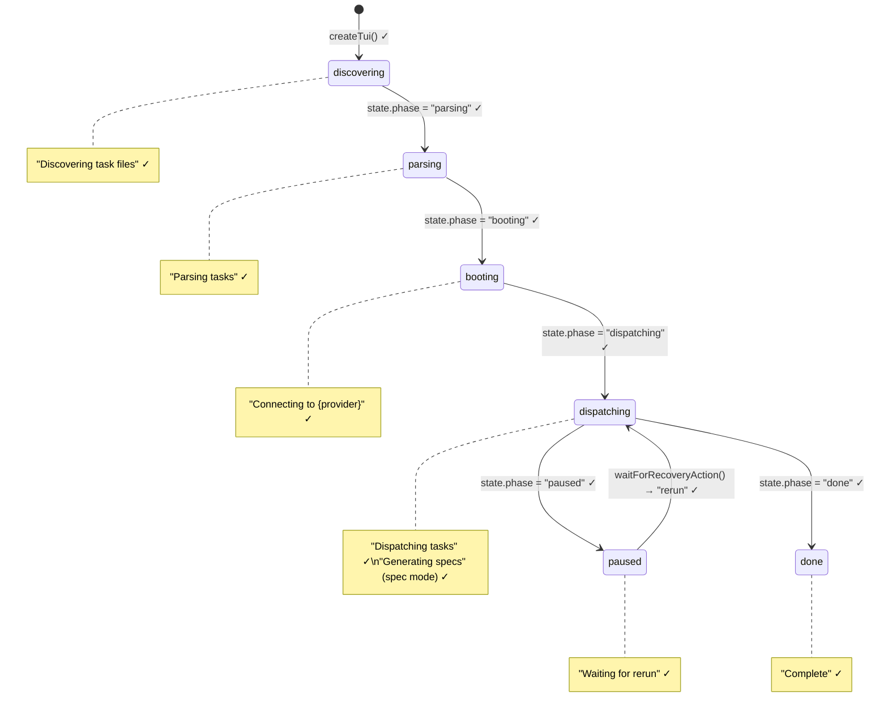
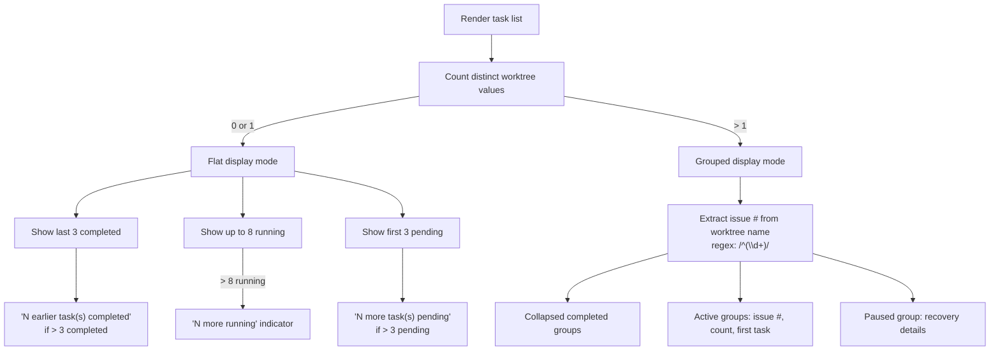

# TUI Test Suite

This document covers `src/tests/tui.test.ts` (875 lines), the comprehensive
test suite for the terminal UI module (`src/tui.ts`). The TUI provides a
real-time dashboard with spinner animations, progress bars, and per-task
status tracking during dispatch and spec generation operations. See
[TUI production module](../cli-orchestration/tui.md) for the production
code design.

## Test file inventory

| Test file | Production module | Lines (test) | Test count | Category |
|-----------|-------------------|-------------|------------|----------|
| `tui.test.ts` | `src/tui.ts` | 875 | 46 | Rendering, state machine, input handling, visual row counting |

## What is tested

| Describe block | Tests | What is verified |
|----------------|-------|------------------|
| `createTui` | 7 | Factory shape, default state, immediate render, update trigger, stop cleanup, final frame, spinner animation |
| `phase rendering` | 8 | All 6 phase labels (discovering, parsing, booting, dispatching, done, paused), provider name in booting, files-found count |
| `task status rendering` | 14 | All 7 status labels (pending, planning, running/executing, generating, syncing, done, failed), 1-based index, task text, error messages, feedback lines, sanitization, truncation |
| `progress bar and summary` | 4 | Progress bar display, done/total count, passed count, failed count, remaining count |
| `recovery rendering and input` | 7 | Play-style affordance, default rerun on Enter, Tab/arrow selection switching, shortcut keys (r, q), Ctrl+C mapping, raw mode lifecycle, listener cleanup |
| `task list truncation` | 2 | Completed task overflow ("earlier task(s) completed"), pending task overflow ("more task(s) pending") |
| `worktree indicator rendering` | 7 | Issue number extraction, single-worktree hiding, no-worktree hiding, mixed worktree display, flat-mode running cap (8), grouped mode rows, paused recovery in grouped mode, all-pending group handling |
| `module state isolation` | 1 | Cursor tracking resets between `createTui()` calls |
| `header and issue rendering` | 5 | Dispatch branding, provider name, model name, source name, current issue display |
| `visual row counting in draw` | 1 | ANSI cursor-up sequence accounts for line wrapping |
| `spec pipeline TUI integration` | 7 | Spec mode initialization, task state transitions (pending → generating → syncing → done), onProgress feedback display, feedback clearing on transition, progress bar updates, passed/failed counts, "Generating specs" phase label, concurrent generating tasks |

**Total: 46 tests** across 11 describe blocks, covering phase rendering,
task status display, progress tracking, recovery input, worktree grouping,
spec mode integration, and rendering internals.

## Test architecture

### Dynamic import pattern

The test file uses a dynamic `import()` inside the `setup()` helper function
(`tui.test.ts:55-59`) rather than a top-level `import` statement. This
ensures that `beforeEach` mocks (fake timers, stdout spy) are in place before
the TUI module is loaded, preventing the module from starting a real
`setInterval` or writing to the real stdout during import:

```
beforeEach: vi.useFakeTimers() + vi.spyOn(process.stdout, "write")
     ↓
setup() → await import("../tui.js") → createTui()
     ↓
tui.state mutations → tui.update() → assertions on writeSpy
```

### Mock output capture

All rendering assertions use a `writeSpy` that captures
`process.stdout.write()` calls. The `lastOutput()` helper extracts the most
recent write call as a string. Tests assert on the presence or absence of
specific substrings in the rendered output (e.g., `expect(lastOutput()).toContain("Discovering")`).

Tests that need custom input/output streams (recovery input tests) create
a mock `PassThrough` input with `isTTY: true` and `setRawMode` support, and
pass a mock output object with a `columns` property and `write` spy.

### Fake timers

The test file uses `vi.useFakeTimers()` with a fixed system time of
`2025-01-01T00:00:00Z`. This is necessary because:

- The TUI uses `setInterval` for the 80ms spinner animation tick.
- The TUI reads `Date.now()` for elapsed time calculations.
- `vi.advanceTimersByTime(80)` advances the spinner without real-time waits.

After each test, `vi.useRealTimers()` restores the real clock.

## Phase state machine coverage

The test suite verifies every transition in the TUI's global phase state
machine:



Each phase label is verified in the `phase rendering` describe block
(`tui.test.ts:121-177`). The tests confirm that:

- The `booting` phase displays the provider name when set (e.g.,
  "Connecting to opencode") and falls back to "Connecting to provider"
  when the provider name is undefined.
- The `dispatching` phase shows "Generating specs" instead of "Dispatching
  tasks" when `state.mode` is `"spec"`.
- The `paused` phase shows "Waiting for rerun".
- The file count is shown in non-dispatching phases ("Found N file(s)").

## Task status coverage

The test suite verifies rendering for all 7 task statuses:

| Status | Display label | Tested at |
|--------|--------------|-----------|
| `pending` | `pending` | `tui.test.ts:180-186` |
| `planning` | `planning` | `tui.test.ts:188-194` |
| `running` | `executing` | `tui.test.ts:196-202` |
| `generating` | `generating` | `tui.test.ts:204-213` |
| `syncing` | `syncing` | `tui.test.ts:204-213` |
| `done` | `done` | `tui.test.ts:215-221` |
| `failed` | `failed` | `tui.test.ts:223-229` |

Note that `running` maps to `executing` in the display — not `running`.
The `paused` status is tested in the worktree indicator section
(`tui.test.ts:231-237`).

## Worktree-grouped rendering

When tasks span multiple worktrees, the TUI switches from flat display to
grouped display. The test suite verifies this behavior extensively.

### Worktree rendering decision flow



### What is tested

| Test | Scenario | Assertion |
|------|----------|-----------|
| Multiple worktrees show issue numbers | 2 tasks in different worktrees | Output contains `#123` and `#456` |
| Single worktree hides grouping | 2 tasks in same worktree | Output does not contain `[wt:` |
| No worktrees hides grouping | Task without worktree field | Output does not contain `[wt:` |
| Mixed worktree/non-worktree | 3 tasks, 2 with worktrees | Issue numbers shown only for worktree groups |
| Running cap at 8 (flat mode) | 10 running tasks | Output contains "2 more running" |
| Grouped mode rows | 4 tasks across 2 worktrees | One row per worktree group, `[wt:` not shown |
| Paused recovery in grouped mode | Paused task + running task in different worktrees | Recovery details shown, issue numbers shown, `[wt:` not shown |
| All-pending group | 2 pending + 1 running across worktrees | No crash, both issue numbers shown |

### Truncation tests

The flat display caps visible tasks at each end:

- **Completed overflow** (`tui.test.ts:516-522`): With 5 completed + 1
  running, the output shows "2 earlier task(s) completed" (5 - 3 = 2).
- **Pending overflow** (`tui.test.ts:525-531`): With 5 pending tasks, the
  output shows "2 more task(s) pending" (5 - 3 = 2).

## Recovery input handling

The recovery tests (`tui.test.ts:377-512`) verify the interactive prompt
that appears when a task exhausts its retries and enters the `paused` phase.

### Input bindings

| Input | Behavior | Tested at |
|-------|----------|-----------|
| Enter/Return | Triggers the currently selected action (defaults to `rerun`) | `tui.test.ts:400-418` |
| Tab | Toggles selection between `rerun` and `quit` | `tui.test.ts:421-438` |
| Left arrow | Switches selection to `quit` | `tui.test.ts:441-459` |
| Right arrow | Switches selection to `rerun` | `tui.test.ts:441-459` |
| `r` / `R` | Immediately resolves as `rerun` | `tui.test.ts:462-476` |
| `q` / `Q` | Immediately resolves as `quit` | `tui.test.ts:479-493` |
| Ctrl+C | Maps to `quit` | `tui.test.ts:496-511` |

### Raw mode lifecycle

The tests verify that raw mode is properly managed:

1. `setRawMode(true)` is called when `waitForRecoveryAction()` starts.
2. `setRawMode(false)` is called when the action is resolved.
3. All keypress listeners are removed after resolution
   (`input.listenerCount("keypress")` is 0).

This ensures the terminal is not left in raw mode after the recovery prompt
completes, which would break subsequent terminal I/O.

## Spec pipeline TUI integration

The spec mode tests (`tui.test.ts:737-875`) verify that the TUI correctly
renders the spec generation pipeline, which uses different statuses
(`generating`, `syncing`) and a different phase label ("Generating specs"
instead of "Dispatching tasks").

### Spec task lifecycle

| Stage | TUI status | Display | Feedback |
|-------|-----------|---------|----------|
| Queued | `pending` | "pending" | None |
| AI generating | `generating` | "generating" | `└─ {feedback text}` shown |
| Writing to datasource | `syncing` | "syncing" | Feedback cleared |
| Complete | `done` | "done" | None |
| Error | `failed` | "failed" | Error message shown |

### Feedback rendering

The `generating` status supports subordinate feedback lines
(`tui.test.ts:263-326`):

- **Single feedback line**: Rendered as `└─ {text}` below the task row.
- **Multi-line feedback**: Lines are joined with spaces into a single line.
- **ANSI sanitization**: Escape codes and control characters (`\x1B[31m`,
  `\x07`) are stripped before display.
- **Truncation**: Feedback is truncated to fit within `process.stdout.columns`.
- **Empty-after-sanitization**: No `└─` line is rendered if the sanitized
  feedback is only whitespace.
- **Non-generating rows**: Feedback is not shown for `syncing` or other
  statuses, even if the `feedback` field is set.

### Concurrent generating tasks

The test at `tui.test.ts:863-874` verifies that multiple tasks in the
`generating` status each display their own feedback line independently.

## Visual row counting

The test at `tui.test.ts:714-734` verifies that the `draw()` function
correctly computes the ANSI cursor-up sequence for frames that contain
line-wrapping content:

1. A task with a 200-character text is added.
2. The TUI renders once to set `lastLineCount`.
3. The TUI renders again; the cursor-up count in the ANSI escape sequence
   is extracted via regex (`/\x1B\[(\d+)A/`).
4. The test asserts the cursor-up count is greater than 0 and reflects
   visual row wrapping (200 chars in an 80-column terminal wraps to
   multiple rows).

This test prevents regression of a bug where `lastLineCount` used a simple
`split("\n").length` count instead of the visual row count that accounts
for terminal line wrapping.

## Module state isolation

The test at `tui.test.ts:648-675` verifies that creating a second TUI via
`createTui()` does not inherit the `lastLineCount` from the previous TUI.
Without this reset, the second TUI's first render would attempt to
cursor-up by the previous TUI's frame height, producing garbled output.

The test creates two TUIs sequentially, renders content in the first,
stops it, then creates the second and asserts that its first write does not
contain a large cursor-up sequence.

## Integration: Vitest

| Feature | Usage |
|---------|-------|
| `vi.useFakeTimers()` | Deterministic timer control for 80ms render interval |
| `vi.setSystemTime()` | Fixed `Date.now()` for elapsed time calculations |
| `vi.spyOn(process.stdout, "write")` | Capture rendered output for assertions |
| `Object.defineProperty(process.stdout, "columns")` | Control terminal width for truncation/wrapping tests |
| Dynamic `import()` | Deferred module loading so mocks are in place |
| `vi.advanceTimersByTime()` | Advance spinner animation without real-time waits |
| `vi.restoreAllMocks()` | Restore stdout in `afterEach` |

### How to run

```sh
# Run the TUI tests
npx vitest run src/tests/tui.test.ts

# Run with verbose output
npx vitest run --reporter=verbose src/tests/tui.test.ts

# Run a specific describe block
npx vitest run src/tests/tui.test.ts -t "recovery rendering"
```

All TUI tests run without network access or AI providers. The tests operate
entirely on the TUI's rendering logic using captured stdout writes.

## Integration: Node.js streams

The recovery input tests create mock `PassThrough` streams as input devices.
These streams implement the `ReadableStream` interface with additional TTY
properties (`isTTY`, `isRaw`, `setRawMode`) that the TUI's
`waitForRecoveryAction()` method requires.

The mock input streams emit `keypress` events directly via
`input.emit("keypress", key, info)`, bypassing Node.js's built-in keypress
detection. This allows tests to simulate keyboard input without a real
terminal.

## Related documentation

- [TUI Production Module](../cli-orchestration/tui.md) — production code
  design, state machines, rendering mechanics, and recovery prompt behavior
- [Testing Overview](./overview.md) — project-wide test strategy, framework,
  and coverage map
- [Test Fixtures & Mocks](./test-fixtures.md) — shared mock factories,
  manual mock stubs, and the `ExecFileMockImpl` helper
- [Dispatch Pipeline Tests](./dispatch-pipeline-tests.md) — tests for the
  pipeline that drives TUI state mutations
- [Spec Pipeline Tests](./spec-pipeline-tests.md) — tests for the spec
  pipeline whose TUI integration is tested here
- [Provider Tests](./provider-tests.md) — provider-specific mock patterns
  that complement the manual mock stubs
- [Runner Tests](./runner-tests.md) — orchestrator routing tests that
  interact with TUI creation
- [Worktree Management](../git-and-worktree/worktree-management.md) — how
  worktree names are constructed, affecting issue number extraction in the
  grouped display
