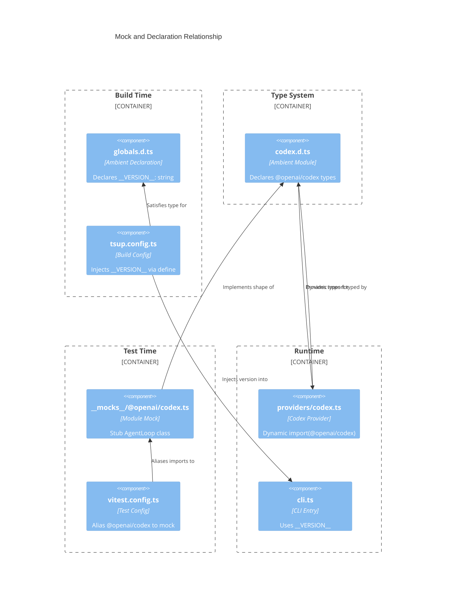

# Type Declarations and Module Mocks

This document covers the ambient type declarations and module-level mock that
support the build and test toolchains. Three files compose this layer:

| File | Purpose |
|------|---------|
| `src/globals.d.ts` | Declares the `__VERSION__` build-time constant |
| `src/codex.d.ts` | Ambient module declaration for `@openai/codex` |
| `src/__mocks__/@openai/codex.ts` | Vitest module mock for `@openai/codex` |

## Build-time version constant

### What it is

`src/globals.d.ts` contains a single ambient declaration:

```
declare const __VERSION__: string;
```

This tells TypeScript that a global `__VERSION__` identifier of type `string`
exists at runtime, even though no runtime code defines it.

### Why it exists

The `dispatch` CLI prints a version string when invoked with `--version`
(`src/cli.ts:307`). Rather than importing `package.json` at runtime (which
would expose the full manifest in the bundle), the version is injected at
**build time** by tsup.

### How it works

The tsup configuration (`tsup.config.ts:18-20`) reads the `version` field
from `package.json` and passes it to the `define` block:

```
define: {
    __VERSION__: JSON.stringify(version),
}
```

tsup's `define` feature works identically to esbuild's `define` option: it
performs a global text replacement at compile time, substituting every
occurrence of the `__VERSION__` identifier with the JSON-stringified version
value. The ambient declaration in `globals.d.ts` prevents TypeScript from
reporting an "undeclared variable" error on the identifier.

This means the version string in the built `dist/cli.js` is automatically
synchronized with `package.json`. No manual version maintenance is required.

### Operational notes

- **Adding new build-time constants**: Add the constant to `tsup.config.ts`
  `define` and a corresponding `declare const` line to `src/globals.d.ts`.
  TypeScript requires both: `define` for the runtime value and the ambient
  declaration for type-checking.
- **Verifying the injection**: After building (`npm run build`), search the
  output `dist/cli.js` for the literal version string. The `__VERSION__`
  identifier should not appear in the output; it should be replaced with
  the string value (e.g., `"1.2.3"`).

## Codex ambient module declaration

### What it is

`src/codex.d.ts` declares the `@openai/codex` module with the following
exports:

| Export | Kind | Description |
|--------|------|-------------|
| `AgentLoopOptions` | Interface | Configuration for creating an `AgentLoop` instance |
| `ResponseItem` | Interface | A single item in the agent response array |
| `AgentLoop` | Class | The agent lifecycle controller |

### Why it exists

The `@openai/codex` npm package (part of the
[openai/codex](https://github.com/openai/codex) repository) is a **CLI-only
tool**. It does not expose a library entry point -- there is no
`main`, `module`, or `exports` field in its `package.json` that resolves to a
JavaScript module. This means standard `import { AgentLoop } from
"@openai/codex"` would fail at both the TypeScript and runtime levels.

The Dispatch codex provider (`src/providers/codex.ts`) works around the
runtime limitation by using a **dynamic import**: `import("@openai/codex")`.
This defers module resolution to runtime, where Node.js can resolve the
package's internal files. However, TypeScript still needs type information
for the import expression.

The ambient declaration in `codex.d.ts` satisfies TypeScript by declaring the
module's shape. It uses `declare module "@openai/codex" { ... }` syntax, which
tells TypeScript "trust me, this module exists and has these exports" without
requiring a resolvable JavaScript file.

### AgentLoopOptions interface

| Field | Type | Required | Description |
|-------|------|----------|-------------|
| `model` | `string` | Yes | The model identifier to use |
| `config` | `object` | Yes | Agent configuration object |
| `approvalPolicy` | `"full-auto" \| "suggest" \| "ask-every-time"` | Yes | How the agent handles tool-use approvals |
| `additionalWritableRoots` | `string[]` | No | Extra directories the agent may write to |
| `onItem` | `(item: ResponseItem) => void` | No | Callback invoked for each response item |

The Dispatch codex provider (`src/providers/codex.ts`) uses `"full-auto"`
approval policy, which allows the agent to execute tool calls without user
confirmation.

### AgentLoop class

| Member | Signature | Description |
|--------|-----------|-------------|
| `constructor` | `(options: AgentLoopOptions)` | Creates a new agent loop |
| `run` | `(prompt: string) => Promise<ResponseItem[]>` | Sends a prompt and returns all response items |
| `terminate` | `() => void` | Stops the agent loop |

### Relationship to the mock

The ambient declaration and the mock (`src/__mocks__/@openai/codex.ts`) must
stay in sync. Both define an `AgentLoop` class with the same public API
surface. If the real `@openai/codex` package adds new exports or changes
signatures, both files need updating.

## Codex module mock

### What it is

`src/__mocks__/@openai/codex.ts` is a minimal stub that provides a fake
`AgentLoop` class:

- **`constructor`**: Accepts options (ignored).
- **`run()`**: Returns an empty array (`[]`).
- **`terminate()`**: No-op.

### Why it exists

During test runs, Vite's import analysis scans all imports in the module
graph, including the dynamic `import("@openai/codex")` in the codex provider.
Without a resolvable module, Vite would fail to analyze the import and the
test run would abort.

The mock provides a minimal module that satisfies Vite's import analysis. It
is **not** a test double used to verify codex behavior -- it exists solely to
prevent build-time import resolution failures.

### How it is wired up

The mock is connected via a **Vite resolve alias** in `vitest.config.ts`,
not through Vitest's `__mocks__` directory convention:

```
resolve: {
    alias: {
        "@openai/codex": resolve(__dirname, "src/__mocks__/@openai/codex.ts"),
    },
},
```

This alias redirects every import of `@openai/codex` (both static and dynamic)
to the mock file during test runs. The file lives under `src/__mocks__/` by
convention, but the aliasing is what makes it work -- Vitest does not
automatically discover it via the `__mocks__` directory.

### Why a resolve alias instead of vi.mock

Vitest's standard `vi.mock()` call works per-test-file and must be placed in
each file that imports the mocked module. The resolve alias approach is
**global**: it applies to all test files and all transitive imports without
any per-file setup. This is appropriate here because:

1. No test needs to customize the codex mock behavior.
2. The mock exists for import resolution, not for test assertions.
3. A single alias in `vitest.config.ts` is simpler than scattering `vi.mock()`
   calls across test files.

### Mock factory pattern

The mock follows a minimal-stub pattern: it implements the same public API
surface as the ambient declaration but with no-op behavior. This is distinct
from the test fixtures in `src/tests/fixtures.ts`, which create configurable
test doubles with override parameters.



## Vitest configuration details

The project **does** have a `vitest.config.ts` file (contrary to what some
earlier documentation stated). Key settings relevant to this group:

| Setting | Value | Purpose |
|---------|-------|---------|
| `resolve.alias["@openai/codex"]` | `src/__mocks__/@openai/codex.ts` | Redirect codex imports to mock |
| `test.coverage.provider` | `"v8"` | Use V8 native coverage |
| `test.coverage.thresholds.lines` | `80` | Minimum 80% line coverage |
| `test.coverage.exclude` | `src/tests/**`, `**/interface.ts`, `**/index.ts` | Excluded from coverage metrics |

The coverage exclusions mean that test files themselves, interface-only files
(like `src/providers/interface.ts` and `src/datasources/interface.ts`), and
barrel re-export files are not counted toward the 80% line threshold.

## Related documentation

- [CLI Argument Parser](../cli-orchestration/cli.md) -- uses `__VERSION__`
  for the `--version` flag
- [Test Fixtures](test-fixtures.md) -- configurable factory functions for
  test doubles
- [Orchestrator Tests](orchestrator-tests.md) -- integration tests for the
  orchestrator module
- [Testing Overview](overview.md) -- project-wide test suite and patterns
- [Provider Overview](../provider-system/provider-overview.md) -- provider
  abstraction that includes the codex backend
- [Adding a Provider](../provider-system/adding-a-provider.md) -- guide for
  implementing new provider backends
