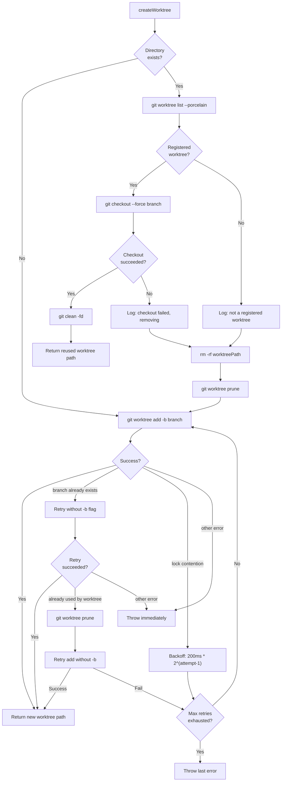

# Worktree Tests

This document provides a detailed breakdown of
[`src/tests/worktree.test.ts`](../../src/tests/worktree.test.ts), which tests
the git worktree lifecycle manager defined in
[`src/helpers/worktree.ts`](../../src/helpers/worktree.ts).

## What is tested

The [`worktree.ts`](../git-and-worktree/worktree-management.md) module manages git worktrees in `.dispatch/worktrees/`.
Each dispatched task runs in an isolated worktree so [concurrent agent sessions](../shared-utilities/overview.md)
do not collide. The test file covers five exported functions:

| Function | Purpose |
|----------|---------|
| `worktreeName(issueFilename)` | Derives a directory name from an issue filename (`123-fix-auth.md` -> `issue-123`) |
| `createWorktree(repoRoot, issueFilename, branchName, startPoint?)` | Creates a git worktree with retry and recovery logic |
| `removeWorktree(repoRoot, issueFilename)` | Removes a worktree with force fallback and prune |
| `listWorktrees(repoRoot)` | Returns raw `git worktree list` output |
| `generateFeatureBranchName()` | Generates `dispatch/feature-{8-hex}` branch names |

## Test organization

The test file contains **5 describe blocks** with **30 tests** total
(528 lines).

| Describe block | Tests | Focus |
|----------------|-------|-------|
| `worktreeName` | 9 | Filename-to-directory name derivation |
| `createWorktree` | 14 | Creation, retry strategies, stale directory handling |
| `removeWorktree` | 5 | Normal removal, force fallback, prune, error tolerance |
| `listWorktrees` | 3 | List output, error handling |
| `generateFeatureBranchName` | 2 | Format validation, uniqueness |

## Git worktree lifecycle with retry strategies

The following diagram shows the complete `createWorktree` decision tree,
including the retry paths for branch conflicts, lock contention, and stale
worktree cleanup:



## Key test scenarios

### worktreeName derivation

| Input | Output | Rule |
|-------|--------|------|
| `"123-fix-auth-bug.md"` | `"issue-123"` | Leading numeric ID extraction |
| `"/tmp/dispatch-abc/123-fix-auth-bug.md"` | `"issue-123"` | Full path handling (uses `basename`) |
| `"123-some-title"` | `"issue-123"` | No `.md` extension |
| `"123-Fix Auth Bug!.md"` | `"issue-123"` | Special characters ignored |
| `"456-test.MD"` | `"issue-456"` | Case-insensitive `.md` removal |
| `"10-Hello-WORLD.md"` | `"issue-10"` | Uppercase characters |
| `"3-foo___bar!!!baz.md"` | `"issue-3"` | Non-alphanumeric characters |
| `"/a/b/c/d/7-my-feature.md"` | `"issue-7"` | Deeply nested path |
| `"no-number-here.md"` | `"no-number-here"` | Falls back to slugified name |

### createWorktree — normal creation

The test `creates a worktree with git worktree add -b` verifies the happy
path:

```
git worktree add <repoRoot>/.dispatch/worktrees/issue-42 -b user/dispatch/42-my-feature
```

When `startPoint` is provided, it is appended:

```
git worktree add <path> -b <branch> origin/main
```

### createWorktree — branch already exists

When git reports `"fatal: a branch named 'x' already exists"`, the function
retries without the `-b` flag to attach to the existing branch:

```
Attempt 1: git worktree add <path> -b <branch>    → fails (branch exists)
Attempt 2: git worktree add <path> <branch>        → succeeds
```

### createWorktree — stale worktree handling

When the worktree directory exists on disk, the function follows a
validation-first strategy:

| Scenario | Action |
|----------|--------|
| Directory exists and is a registered worktree | Try `git checkout --force` + `git clean -fd` to reuse it |
| Checkout succeeds | Return existing path (no creation needed) |
| Checkout fails | Remove directory, prune refs, recreate worktree |
| Directory exists but not registered | Remove directory, prune refs, recreate worktree |

### createWorktree — lock contention retry

When git reports a lock file error (`"Unable to create '.git/worktrees/.../lock'"`),
the function retries with exponential backoff:

| Attempt | Delay |
|---------|-------|
| 1 | 200ms |
| 2 | 400ms |
| 3 | 800ms |
| 4 | 1,600ms |
| 5 | (throw) |

The test `retries on lock contention with exponential backoff` verifies
that the function succeeds after 2 lock errors and logs debug messages
for each failed attempt.

The test `throws last error after max retries exhausted` verifies that
after 5 consecutive lock errors, the function throws the last error.

### createWorktree — worktree conflict after branch-exists retry

A multi-step recovery path is tested:

1. `git worktree add <path> -b <branch>` fails with "branch already exists"
2. `git worktree add <path> <branch>` fails with "already used by worktree"
3. `git worktree prune` cleans stale refs
4. `git worktree add <path> <branch>` succeeds

### createWorktree — non-retryable errors

Errors that do not match the retryable patterns (branch exists, lock
contention, worktree conflict) are thrown immediately without retry. The
test `throws immediately on non-retryable errors` verifies that
`"fatal: not a git repository"` causes an immediate throw after 1 call.

### removeWorktree

| Scenario | Behavior |
|----------|----------|
| Normal removal | `git worktree remove <path>` + `git worktree prune` |
| Dirty worktree | Falls back to `git worktree remove --force <path>` + prune |
| Both fail | Logs warning, does not throw (execution continues) |
| No prune after double failure | Only 2 exec calls (remove + force remove) |
| Prune failure | Logs warning, does not throw |

The non-throwing design is deliberate: worktree cleanup runs during
shutdown, and a failure to remove a worktree should not prevent other
cleanup operations from completing.

### listWorktrees

| Scenario | Return value |
|----------|-------------|
| Success | Raw `git worktree list` output |
| Failure | Empty string (with warning logged) |
| Single worktree | Single-line output |

### generateFeatureBranchName

| Assertion | Pattern |
|-----------|---------|
| Format | `/^dispatch\/feature-[0-9a-f]{8}$/` |
| Uniqueness | Two successive calls produce different names |

Branch names use the first 8 hex characters of a `randomUUID()` as the
identifier portion.

## External integration: Git CLI

The worktree module interacts exclusively with git through `execFile`:

| Git command | Used by | Purpose |
|------------|---------|---------|
| `git worktree add <path> -b <branch> [startPoint]` | `createWorktree` | Create worktree with new branch |
| `git worktree add <path> <branch>` | `createWorktree` | Attach to existing branch |
| `git worktree list --porcelain` | `createWorktree` | Check if directory is a registered worktree |
| `git checkout --force <branch>` | `createWorktree` | Reset existing worktree to target branch |
| `git clean -fd` | `createWorktree` | Remove untracked files from reused worktree |
| `git worktree prune` | `createWorktree`, `removeWorktree` | Clean stale worktree references |
| `git worktree remove <path>` | `removeWorktree` | Normal worktree removal |
| `git worktree remove --force <path>` | `removeWorktree` | Force removal of dirty worktree |
| `git worktree list` | `listWorktrees` | List all worktrees |

All git commands receive `{ cwd: repoRoot, shell: process.platform === "win32" }`
to handle Windows `.cmd` shim execution.

## Mocking strategy

### Mocked modules

| Module | Mock targets | Strategy |
|--------|-------------|----------|
| `node:child_process` | `execFile` | Returns `{ stdout }` or rejects per test |
| `node:fs` | `existsSync` | Returns `true`/`false` per test |
| `node:fs/promises` | `rm` | Resolves to `undefined` |
| `node:util` | `promisify` | Returns `mockExecFile` directly |
| `../helpers/logger.js` | `log.*` methods | Spies with `formatErrorChain`/`extractMessage` returning the error message |

### Reset pattern

```typescript
beforeEach(() => {
    mockExecFile.mockReset();
    mockExistsSync.mockReset();
    mockRm.mockReset();
    mockExistsSync.mockReturnValue(false);  // default: no existing directory
    mockRm.mockResolvedValue(undefined);
});

afterEach(() => {
    vi.restoreAllMocks();
});
```

The default `existsSync` return value of `false` means tests that need an
existing directory must explicitly set `mockExistsSync.mockReturnValue(true)`.

## Related documentation

- [Test suite overview](overview.md) -- framework, patterns, and coverage map
- [Git & Worktree Testing](../git-and-worktree/testing.md) -- worktree tests
  in the git-and-worktree group context
- [Worktree Management](../git-and-worktree/worktree-management.md) -- full
  API documentation for the worktree lifecycle
- [Auth Tests](auth-tests.md) -- authentication tests from the same test group
- [Concurrency Tests](concurrency-tests.md) -- concurrency limiter tests from
  the same test group
- [Environment, Errors, and Prerequisites Tests](environment-errors-prereqs-tests.md)
  -- lightweight helper tests from the same test group
- [Dispatch Pipeline Tests](dispatch-pipeline-tests.md) -- pipeline tests
  that exercise worktree creation indirectly
- [Branch Validation](../git-and-worktree/branch-validation.md) -- branch
  name validation used alongside worktree operations
- [Cleanup Registry](../shared-types/cleanup.md) -- teardown system that
  calls `removeWorktree` during shutdown
- [Architecture Overview](../architecture.md) -- system-wide design context
